# 日本年轻人，开始信“中医”

出品 | 虎嗅青年文化组 作者 | 木子童 编辑、制图丨渣渣郡

大枣、枸杞、山核桃……

即将返回日本的陈茗箱子里，塞满了特殊的“中国特产”，但别误会，这不是路上吃的果干零嘴，而是她预备带给日本同学的伴手礼。

“都是药材，日本没有枣泥馅儿，他们拿大枣当药吃。”

**回国前，询问朋友想要什么礼物时，陈茗以为会听到茶叶和点心，结果几位姑娘一致点单了“中药材”。**

怎么，难道日本年轻人也开始信中医了吗？

**何止是信，而且已经走向邪路了。**

**不知从什么时候吹起的这阵风，反正等大家醒过神来，“中药”在日本已然成了流量明星。**

不过在当地，“中药”不叫“中药”，而叫“汉方”。

前几年，在经济停滞的日本，什么都不涨价，唯独汉方药越来越贵。2017年到2022年，短短5年，非处方汉方药平均单价上涨了接近15%。

但变贵一点儿没影响销量，这五年，非处方汉方药的实体店销量增加了16.6%，网络销售更不得了，直接翻了一番。

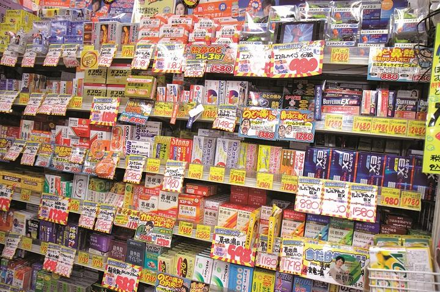

**而且，不光是爷爷奶奶在抢购，年轻人也垂直入坑。**

**那劲头，好比当年中国游客痴迷青汁和酵素。**

神道教号称1500万神，人们总会为了祈福之事费尽心思地寻找主管神明，但在治病救人这件事上，汉方药却统一了分裂的信仰。

当年的酵素如何包治百病，今天的汉方就如何百病全包。

甭管是失眠便秘，还是腰酸长痘，来一剂汉方就对了。

尤其是那些西医无法命名的疑难杂症，比方说“气象病”：一到换季，就觉得身体困乏，头疼肩痛，吃袋“五苓汤”，药到病除。

就连恋爱不顺，也可以求助汉方——吃一剂恋爱汉方，保证体质改善，桃花如潮。

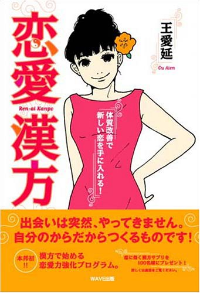

**与其说，日本年轻人在吃的是汉方，不如说，那是在通过献祭味蕾供奉神明。**

虽然人人都忍不住天上掉馅饼的诱惑，但我们也深知，世上更多的是付出才会有收获。

所以苦口的不一定是良药，但良药一定苦口。忍得了难喝的暴击，才好许下一些不太实际的愿望。

正如当年的青汁，全靠1990年棒球运动员八名信夫的一张广告海报才成了“保健神品”。在那张海报里，这位硬汉顶着一张痛苦面具说道：

“好难喝，再来一杯！”

青汁当然没有什么神奇的保健效果，顶多是补充一些膳食纤维，但它实在太难喝了，谁也不愿相信它只是平平无奇的难喝。

于是献祭痛苦后，青汁开始被赋予越来越多神性：美容养颜、轻身健体、排除肠毒、瘦身神药……

要论难喝，青汁和中药相比，还是拍马不及。所以，按照相同的逻辑，中药当然要更灵验些。

**只不过，正如中国年轻人的朋克养生，日本小年轻拜“汉方神”拜得也不甚虔诚。**

**在献祭痛苦的时候，他们千方百计地试图作弊。**

不仅不喝汤药，只喝成药颗粒，而且连颗粒的苦味儿都不想沾上舌根。

论螺狮壳里做道场，谁也比不上日本的“匠人精神”。

简单喝个中药，都能讲出几种喝法。

如何能让口腔感受不到汉方可怕的味道？日本最大汉方企业津村制药甚至专门录制了一段视频。

方法一，含一口水在嘴里别咽，把成药颗粒倒进水中，等待十秒，颗粒微微融化，然后赶紧囫囵吞下去。

方法二，拿一张糯米纸，卷成小杯，把成药颗粒倒进去叠好，放入水杯湿润软化，然后就着水一饮而尽。

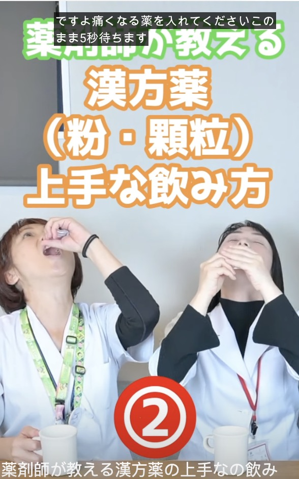

_“药剂师教你聪明地喝汉方药”丨TikTok_

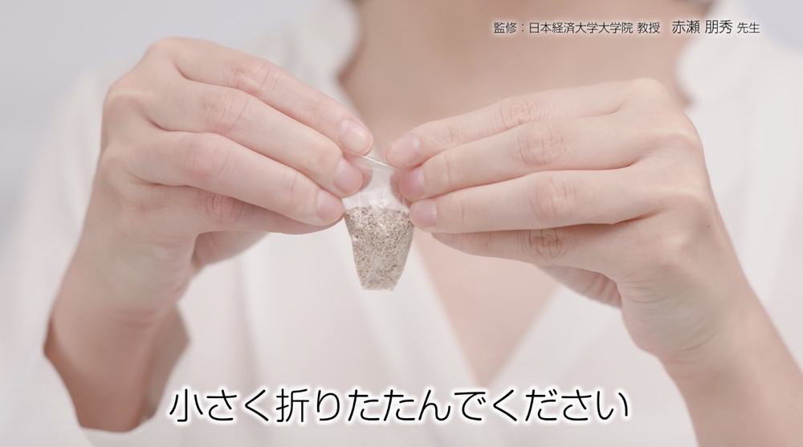

_糯米纸服药法丨津村制药_

如果以上方法觉得操作麻烦，还可以购买送药果冻，把颗粒拌进果冻里，趁舌头还没反应过来，借着甜味送下。

至于你问功夫能做到这份上，为什么不直接做成胶囊或者药丸？

那当然是因为不苦就没了汉方药的精髓。

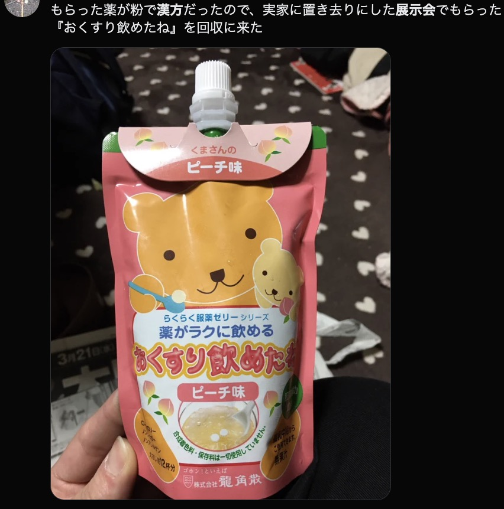

**如果说日本老一辈还是“汉方教”里恪守清规戒律的苦行僧，那么年轻人早就成了“酒肉穿肠过，佛祖心中留”的大花和尚。**

吃的还是汉方药，但弄得越来越好吃，服食中药的清规戒律，破得一个不留。

什么东西在年轻人中流行，看联名最是一目了然。

就像咸蛋黄和芋泥，这两年，日本是什么吃的都想和汉方沾上点边。

过情人节，有汉方巧克力，添加大枣、生姜、山楂，主治“精神压力过大” “肩颈酸痛疲劳”。小小五块，就能卖上3300日元（约合人民币170元）。

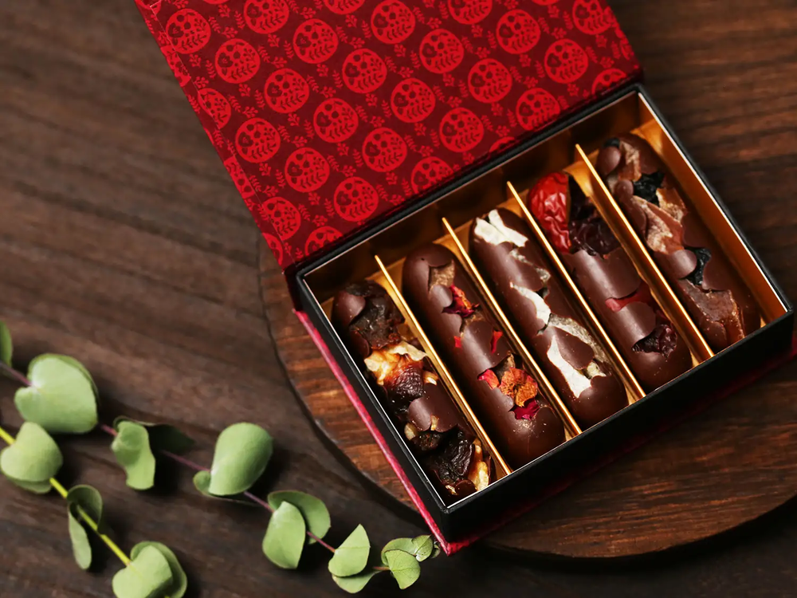

喝咖啡，有汉方咖啡，喝奶茶，也有汉方奶茶。

买一杯“高丽参奶茶”“阿胶奶茶”，队列能排出三条街。

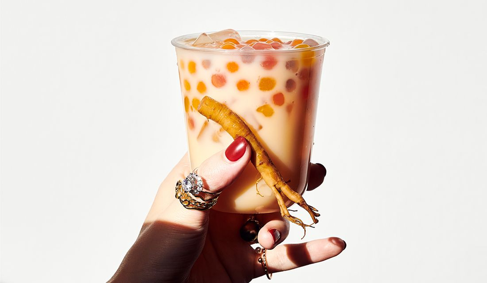

产药材的乡下，必有自己的汉方冰淇淋，当归叶做的冰淇淋，好不好吃还另说，但试问谁能不好奇？

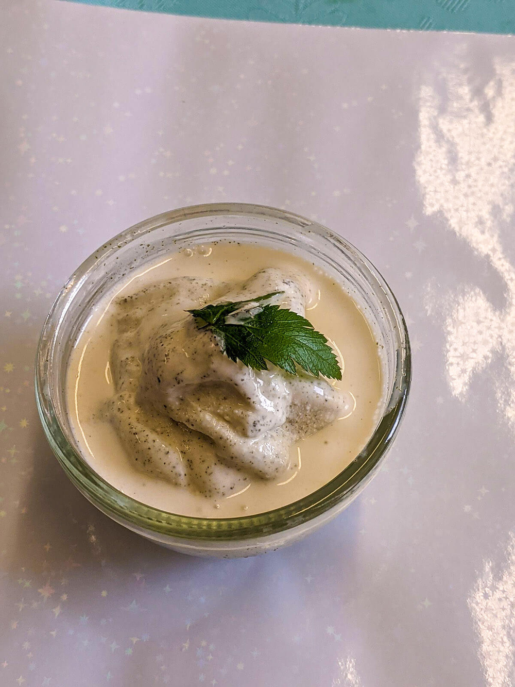

**都说吃中药要忌生冷、忌油腻、忌咖啡，到了日本，这些忌讳全都成了联名灵感。**

正所谓啤酒加枸杞，可乐放党参。

这波汉方热，热得还是个养生与乐子并存。

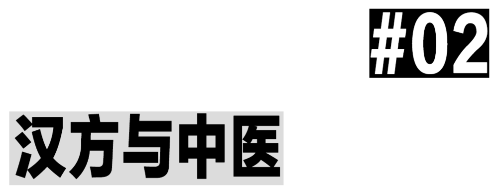

中国年轻人对中医，总是将信将疑，毕竟这门深奥玄妙的学问和学校里的知识体系实在有太多难以调和的矛盾。

**但为什么同样接受现代教育的日本年轻人，却毫无抵抗地选择了信任？**

**其实这是一个常见的误会——日本人信的，压根就不是“中医”。**

作为中国人，我们当然下意识地以为，作为中医的发祥地，中国必然是世界上中药最大的生产基地。

然而，一个很少被提及的数据是：在中国之外，全球80%的中药药剂来自日本。

尽管日本很少生产中药原料，83%原料要从中国进口，但它几乎垄断了美瑞德意等国的中药药剂市场。

这些来自日本的中药药剂，被称作“汉方药”。

汉方药名为“汉方”，却不是“中医”。

**实际上，在日本科学史家看来，“汉方”与“中医”就像中华料理店和中国饭馆一样迥然不同。**

中医是来自中国的传统医学，而汉方则是日本学习中医后，后期独自发展出的传统医学。

它们一个更像哲学，一个更像科学。

 _汉方药店里供奉的神农像_

**中医与汉方最大的区别是，中医讲究“辨证论治”，汉方讲究“方证相对”。**

什么是辨证论治，什么又是方证相对？

**举例来说，就是一个对着病找药，一个对着药找病。**

一位病人，到老中医面前，首先要望闻问切，辩证一番，然后才会对症下药，每个人病症不同，用药种类与剂量也是千变万化。

而到了汉方医生面前，汉方医生看了病症，则要从一摞已经写好药物与剂量的药方里翻翻拣拣，挑出对应病症的那一张交给病人，方子万古不变。

如果去到日本旅游，走进过汉方药房，你想必疑惑过，为什么日本的药房里，没有成排的大药柜，只有一张张写满方剂名称的纸条？

因为汉方药不讲究现场抓药，所有药都是事先配好的方子。

**古时候，就连种药材也是在一个药圃里种齐一个药方。**

比方芍药甘草汤，那么药圃里就同时种上芍药和甘草。

听起来是不是有点像药房里直接可以取的中成药？

没错，就是这样的东西。

**因为固定了不变的方子，所以日本的“汉方”可以按照西方的循证医学来加以验证。**

只要控制变量、设置对照组，就能确定药物是否有效，效果究竟由哪些成分产生。

这是江户时期日本“古方派”医家的创举，因为接触了名为“兰学”的西方医学思想，当时的日本医家既不想舍弃古老的医学经验，又折服于循证医学的逻辑，于是想出了这样一种折衷的办法。

**换句话说，打从江户中期，日本就已经开始了对中医的现代化规训，融合近代医学思想，抛弃玄而又玄的理论，让它变得更好理解、更好复现。**

这种变化的结果就是，本是同源的汉方和中医在拐点上渐行渐远，最终一个在国际市场上风生水起，一个举步维艰。

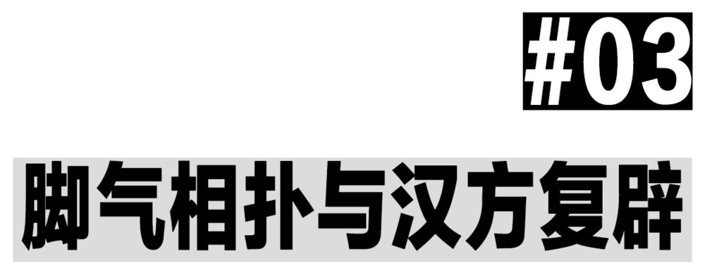

**不过早早归顺近代医学的汉方，这一路走来也不是顺风顺水。**

一度，它甚至差点遭遇灭顶之灾。

**这里面，又是一段故事，故事的起点正是140年前的明治维新。**

彼时为了全面“西化”，日本在方方面面推行西制，医学界当然也概莫能外。

几道政令下来，汉方医生很快失去行医资格，明治初年，2万8千名在册医生中，2万3千个是汉方医生，到了明治37年，就只剩下一半。

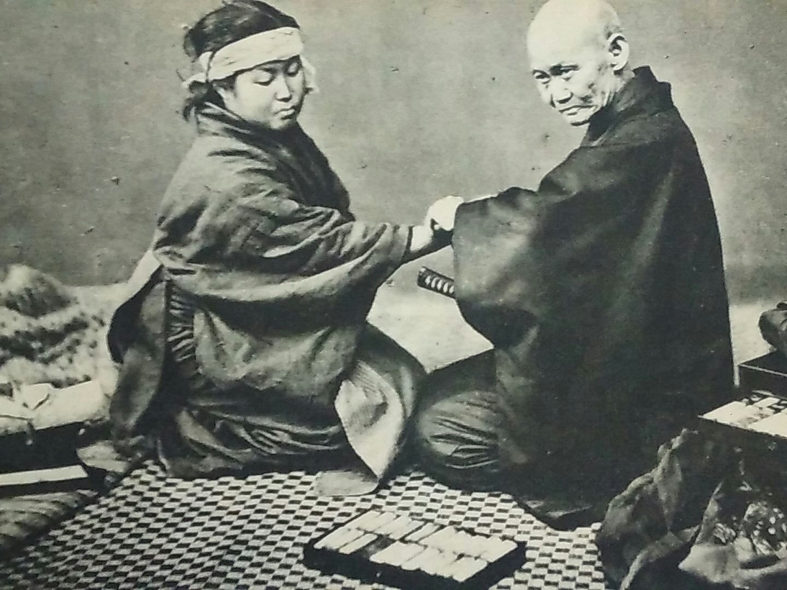

**当时汉方医生当然不会束手就擒，他们最著名的反扑就是“脚气相扑”。**

脚气相扑，听起来“颇有味道”的事件，但此脚气，非彼脚气，不是我们熟悉的脚部真菌。

**所谓脚气，指的是脚气病，堪称当年日本头号恐怖绝症。**

早期看起来不过是食欲不振、精神倦怠，后期则会危及生命，病人全身水肿、心力衰竭，因为脚部肿胀格外惊人，所以被称作“脚气病”。

而且这病不坑穷人，专坑日子过得好的。德川家的几任将军都死于此，越是富贵人家，越容易染病。

近代开化以后，全日本生活水平提高，脚气病就像瘟疫一样飞速传播。

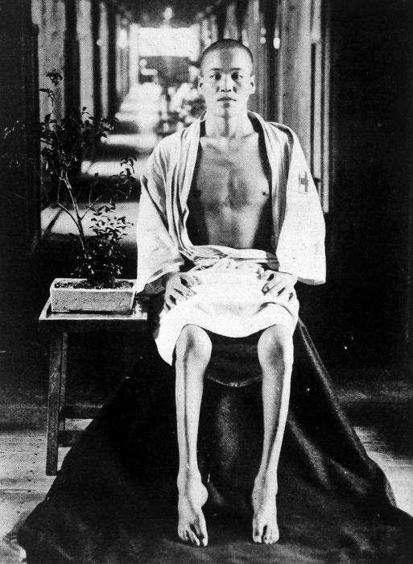

**谁也不知道致病原因是什么，只知道它比枪炮还要可怕——**

日俄战争时期，战场上一共死了4万7千人，其中死于枪林弹雨的只有1万9千，剩下的都是因脚气病而丧命。

**就连明治天皇也未能幸免，在1900年代初期，他也患上了脚气病。**

当时，汉方医生和西医共同出诊，为他治病，史称“脚气相扑”。

**这场角力，到底是汉方医生更胜一筹，还是西医治好了皇上？**

当时的记载被有意模糊，但从科学史的发展进度来看，应该是汉方医生起了作用。

因为当时，西医坚定认为脚气病是某种细菌感染，都在拼命寻找致病病菌。而汉方医生凭借几百年瞎猫碰死耗子碰出来的经验，发现让病人停止食用米饭，改服红小豆汤能缓解病情。

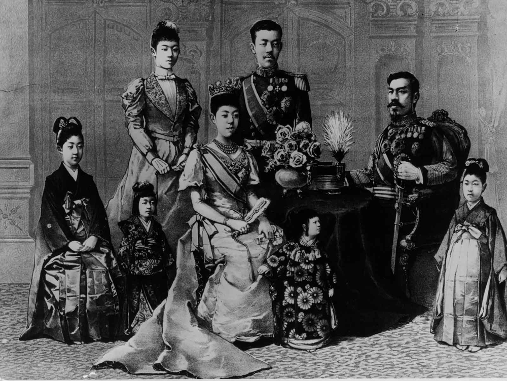

为什么非得是红小豆，不是什么其他糙米杂粮？当然是因为从前生病的都是达官贵人，杂粮中唯有红小豆配得上他们高贵的身份。

不成想歪打正着，恰好红小豆中富含维生素B1，这正是解决脚气病的关键。

多年后的今天，我们已经知道，脚气病就是维生素B1缺乏症，只要在饮食中正常摄入红肉和五谷杂粮，就不会得上这种病。

但当时，日本贵族的饮食中恰好没有红肉和五谷杂粮，越是富贵人家，越食用“银舍利”般的精米，只吃禽类和鱼肉。

日本陆军伙食也是同样，提供大白米饭和梅子干，名曰国旗饭，吃得热爱米饭的兵丁热泪盈眶，偏偏没有补充维生素B1的食材。

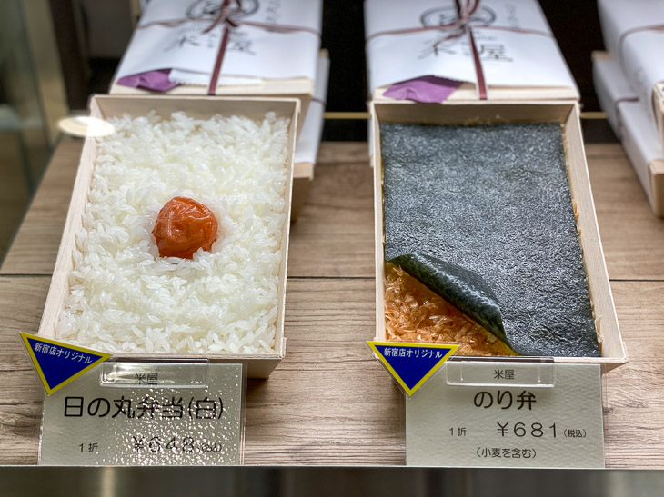

_图左，伊势丹售卖的“国旗饭”_

**然而，脚气相扑虽是汉方医取得了胜利，但为了推行西化的政治制度，明治天皇还是选择了力保西医，扑灭汉方。**

此后长达几十年的时间里，汉方进入末法时代，到昭和14年，日本汉方医生已经百不存一。

**直到1960年代，汉方医学才再次复苏。**

原因是，“西”够了的日本，准备回头看看。

经济高速增长期，一方面因为狂飙突进带来高度民族自信，一方面因为驻日美军冲突中对西方文明祛魅，日本人开始寻根问祖，汉方这种用了十几个世纪的传统疗法，顺势重获青睐。

这一次，还是政府挑头，日本政府修改健康保险法，重新梳理汉方方剂，把59种汉方列入临床应用药品。

这代表着，汉方药从此进入医保，可以在正规药店买到了。

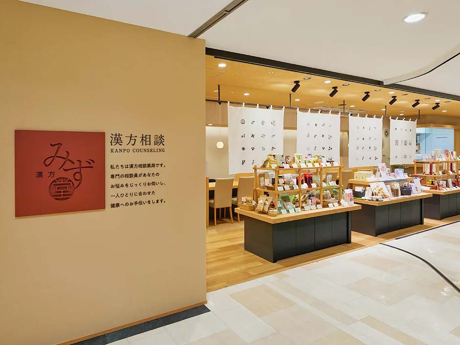

此后，日本药企开始规范化、标准化成药生产，彻底让日本人民告别了自己熬药的苦恼。

**到现在，日本医保里的汉方药已经达到217种，日本全国80%以上的药店在同时经营汉方药剂。**

作为一种慢病的替代医疗，会给病人开汉方的大夫，不是专门坐堂的老中医，而是接受过完整现代医学教育的正经大夫。他们会辅修汉方课程，掌握汉方医学。

日本患者信任汉方，就像信任普通西药，因为它们都是在同一套检验体系下获批上市。

**这些方子，并没有什么超越中医的非凡之处，实际上大多数日本“汉方”，都脱胎自中国古方。**

日本148种医疗用汉方制剂中，有72个汉代药方，24个宋代药方，23个明代药方，只有25个是日本独自研发的药方。

汉方医并未做出多少创造，只是折冲中西，为中医做了成功的“译介”。

而这次成功的译介不仅让汉方获得了市场的尊重，也再次验证：

**一种文化之所以成为被人信赖的文化，并不在于它有多么深奥和玄妙，而是在于它首先可以被认知和理解。**

