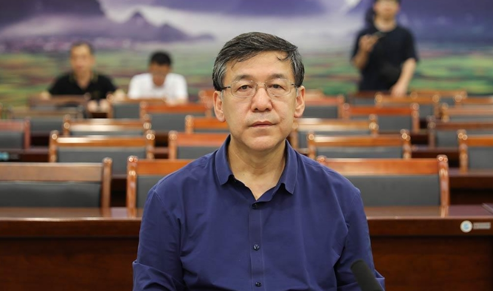

# 科技部重组后新任党组书记到任，曾“多次填补科技和军工领域空白”

**撰文 | 李岩**

科技部网站披露，今天（10月7日）下午，中央组织部有关负责同志出席科学技术部领导干部会议，宣布中央决定：阴和俊同志任科学技术部党组书记，免去王志刚同志的科学技术部党组书记职务。

**学者型官员**

阴和俊，男，汉族，1963年1月出生，山西古交人。研究生学历，工学博士，研究员，博士生导师，系第二十届中央委员会委员。

从简历上不难看出，阴和俊是一位学者型官员，他学术背景深厚，曾在高校、科研机构任职多年。

公开报道显示，上世纪80年代，阴和俊在太原工学院（现太原理工大学）毕业后在太原工学院、太原工业大学工作。

1986年9月，他到西安电子科技大学攻读硕士研究生，1992年又到中国科学院电子学所攻读博士研究生。1995年毕业后，阴和俊选择留在中国科学院电子学所工作，至2015年11月，阴和俊在中科院工作了20年，期间担任过中国科学院高技术研究与发展局局长，在2008年1月晋升为中科院副院长。

从学术角度来看，阴和俊系电磁场与微波技术专业博士出身，长期从事电磁场理论与微波技术、微波器件与技术、微波遥感技术等领域的研究工作，主持或组织过多项国家重大、重点科研任务，曾多次获得部级科技奖励。在中科院任职期间，他还曾同时担任嫦娥探月工程副总指挥、神舟七号任务总指挥部副总指挥长。

**重回科技部**

在中科院工作20年后，2015年，阴和俊履新科技部副部长。彼时，他分管高新技术和国际合作。此次履新，系阴和俊再次回到科技部工作。

政知君还注意到，从首次调任科技部工作到此次履新，中间的几年里，阴和俊在多个地方和岗位上工作过，但始终没有离开科技战线。

2017年至2020年期间，阴和俊赴地方任职，先后担任北京市委常委、副市长，天津市委副书记。

履新北京市委常委时，时任北京市市长蔡奇曾这样介绍阴和俊：

**阴和俊熟悉科研和科技管理工作，思路比较开阔，改革创新意识强，积极组织承担国家重大科技专项任务，取得一系列有重要影响的科研成果，多次填补我国科技和军工装备领域空白。**

到天津工作后，阴和俊多次提到科技创新。2019年3月，阴和俊出席天津2019年全市科技工作会议。他要求，“始终坚持创新驱动发展战略不动摇”“历史经验表明，谁牵住了科技创新这个‘牛鼻子’，谁就能占领先机、赢得优势、把握主动。”

2020年底，阴和俊再次回到中科院任职，担任中科院党组副书记、副院长。根据中科院官网披露，这一次重回中科院任党组副书记、副院长，阴和俊被明确为正部长级。

**科技部今年开启重组**

今年3月，中共中央、国务院印发了《党和国家机构改革方案》。

方案明确，重新组建科学技术部——

**加强科学技术部推动健全新型举国体制、优化科技创新全链条管理、促进科技成果转化、促进科技和经济社会发展相结合等职能，强化战略规划、体制改革、资源统筹、综合协调、政策法规、督促检查等宏观管理职责，保留国家基础研究和应用基础研究、国家实验室建设、国家科技重大专项、国家技术转移体系建设、科技成果转移转化和产学研结合、区域科技创新体系建设、科技监督评价体系建设、科研诚信建设、国际科技合作、科技人才队伍建设、国家科技评奖等相关职责，仍作为国务院组成部门。**

公开报道指出，重组后的科学技术部不再参与具体科研项目评审和管理，主要负责指导监督科研管理专业机构的运行管理，加强对科研项目实施情况的督促检查和科研成果的评估问效。此外，根据方案，科技部之前承担的关于组织拟订科技促进农业发展等多项职能被划归其他部门。

有媒体援引专家观点评论称，重组后的科技部职责更加聚焦，专注于在关键核心技术上攻坚克难，加快实现高水平科技自立自强。

同时，《方案》还指出， **组建中央科技委员会。**
加强党中央对科技工作的集中统一领导，统筹推进国家创新体系建设和科技体制改革，研究审议国家科技发展重大战略、重大规划、重大政策，统筹解决科技领域战略性、方向性、全局性重大问题，研究确定国家战略科技任务和重大科研项目，统筹布局国家实验室等战略科技力量，统筹协调军民科技融合发展等，作为党中央决策议事协调机构。中央科技委员会办事机构职责由重组后的科学技术部整体承担。

**资料 ｜ 科技部官网 中科院官网 新华网 北京青年报**

**【版权声明】本文著作权归政知新媒体独家所有，未经授权，不得转载。**

