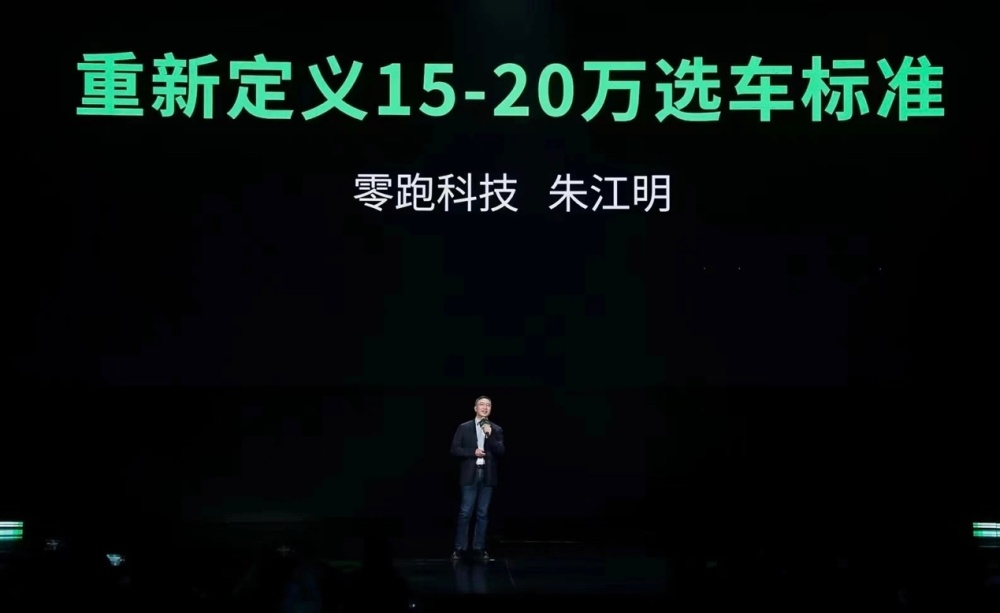
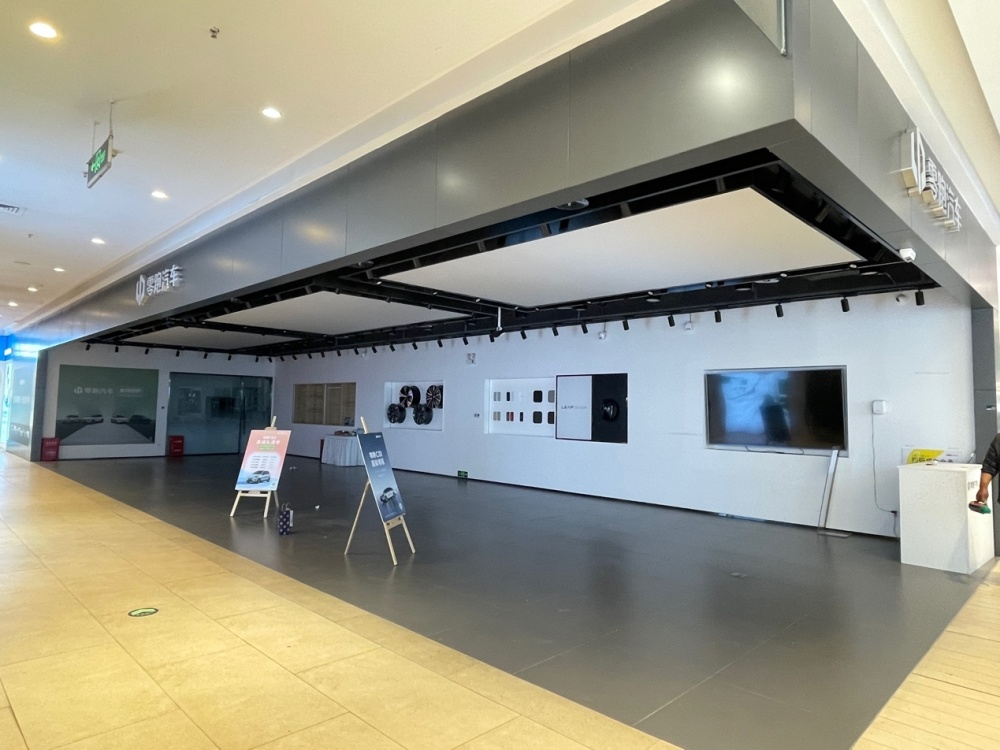

# 4年半累计亏损超122亿，卖一辆亏5万，零跑价格战被指背刺老车主

腾讯新闻《远光灯》作者 谢婉

“打价格战，中国人没输过。”2023年1月，零跑汽车创始人、董事长朱江明用这一席话拉开了零跑价格大战的序幕。

3月1日，朱江明在新品发布会上宣布，全系产品价格进行下调，其中最高降幅近6万元；8月，零跑C平台两款车再度降价，最高下调2万元；9月，零跑对微型车T03下手，最高降价1万元，售价低至4.99万元。

以价换量效果立竿见影，零跑在今年5-9月连续5个月实现销量过万，9月交付量达1.58万辆，创历史新高，今年第三季累计交付超4.43万辆。硬币的另一面是，零跑上半年经营亏损达到23.33亿元，净亏损22.76亿元，毛利率为-5.9%。

但零跑显然准备好打一场“持久战”。在上半年财报电话会上，公司高管预判下半年车市竞争还会持续，零跑还有进一步下降空间。

价格战一直是巨头间惯用的竞争手段，目前仍在持续亏损、毛利率尚未转正的新势力零跑，在这场没有边际的价格战中，还能“领跑”多久？

4年半累计亏损超122亿

8月底，零跑发布了首份“纯电+增程”双动力产品结构下的财报。2023年上半年，零跑共交付4.45万辆新车，较去年同期5.2万辆下降14.4%，但营收同比增长14.4%，达到58.13亿元。

销量下滑，营收实现增幅，是因零跑调整产品结构所致。为了改善毛利率，零跑在今年上半年“有意”控制低价车型销量占比，同时通过降价和增程版车型来提升高价车型销量。财报显示，今年前六个月，零跑小型车T03销量同比下滑72.9%，仅有8975辆；零跑C11两种动力车型销量总和达到2.75万辆，同比增加45.5%。目前，零跑C11和C01车型销量占比高达80%。

零跑汽车高级副总裁敬华在电话会中透露，因为10万以下车型毛利难转正，从去年开始公司有意做了一些控制，未来该车型会转向海外。“T03定价在6-9万元，和竞品相比定价还是蛮高的。”敬华表示，如果追求销量就必须要调整价格，而调整价格又会恶化毛利。

2022年中期、2022年年底和今年一季度，零跑毛利率分别为-26%、-15.4%和-7.8%，今年年中持续收窄至-5.9%，但依旧未能转正。敬华预计，随着中大型轿车C01增程版上市，零跑将在年底前实现单月毛利转正。

零跑方面表示，今明两年更多是抢占市场，同时也要平衡毛利率，2023年接下来的几个月里争取月销量达到1.5万-2万辆目标。按照一季度提出的规划，零跑2023年销量目标为20万辆，1-8月零跑已完成超7.3万辆销量，距离全年目标还有一定差距。不过，进入9月零跑压低T03价格，或能带来一定增量。

快速抢占市场背后，零跑的销售成本明显高于营收增幅。财报显示，零跑汽车上半年销售开支为8.2亿元，同比增长105%，该公司表示，主要是因为上半年新车发布和营销费用的增加所致。

尽管毛利率向好，但零跑汽车上半年经营亏损仍达到23.33亿元，净亏损22.76亿元，加上2019-2022年分别亏损9.011亿元、11亿元、28.457亿元、51.09亿元，截至今年年中，零跑已累计净亏损超122亿元。同时，按照今年上半年零跑的交付和亏损数据计算，目前仍是“卖一辆亏5万”的状态。

9月20日，朱江明表示，力争到2025年能够实现整体公司的盈利。而据敬华透露，零跑在上市前推行了团队期权计划，该计划要满足两个指标——零跑需要在2024年达成毛利转正，同时要在2025年达到公司盈亏平衡，“如果这两个指标没达成，我们所有团队的期权都会被作废”。

按照规划，零跑希望毛利率能够达到行业平均水平，即20-25%的水平，这也被誉为“新势力生死线”。

据零跑联席总裁武强介绍，零跑从短期、中期和长期三个维度去优化毛利，今年年底实现毛利率转正后逐步优化，中期会通过海外市场提升毛利，长期看通过技术合作带来收入，而这部分毛利将会远远高于卖车毛利。

靠“减配”上岸？押注增程带销量

作为第四家赴港上市的新势力，零跑去年9月上市的节点并不理想。一方面资本市场已经不缺新造车故事，另一方面，零跑在产品和品牌层面没有做好准备，上市后需要大量“补课”。

2022年9月29日，零跑汽车上市首日遭开盘破发（发行价48港元/股），低开14.58%，报41港元/股，跌破发行价。此后一年时间，其股价最高探至48.5元，发行价成为迄今为止难以跨越的“巅峰”。
截至10月6日港股收盘，零跑汽车报38港元/股，总市值434.23亿港元。

实际上，直到去年3月全系官降之前，在外界看来，零跑的产品定位和打法都一直摇摆不定。2019年，零跑推出首款产品S01，定位智能电动轿跑，售价为18.99万-22.99万元，因产品定位过于小众，零跑S01全年销量不足1000辆。

零跑S01失利后，朱江明逐渐调整产品策略，推出走量的小型电动车T03，与奇瑞eQ1、欧拉R1等车型竞争。2020年，零跑共计售出10266辆T03，占其总销量的90%；2021年T03销量为38463辆，占零跑全年销量89%。

高性价比车型帮助零跑打开了市场，但从长期来看，零跑并没能获得相应回报，无法支撑接下来的研发和市场高投入，零跑不得不进入中高端市场。随后，零跑在2020年12月推出售价为17.98万—22.98万元（各地补贴后价格不同）的纯电SUV车型C11，2022年9月推出售价19.38万—28.68万元的纯电轿车型C01。

但几年下来，零跑C平台两款车销量一直不温不火。2023年3月，朱江明喊出“重新界定15-20万级价值标准”，宣布全系官降的同时推出首款增程车型，至此，尴尬的局面才得到缓解。

北京某零跑体验店销售人员对腾讯新闻《远光灯》表示，“（C平台）这两款车开始定位没有想好，今年3月降价后，销量马上上来了。新势力还是活下去最重要，没销量一切都没用。”尤其在零跑C11增程款推出后，零跑整体销量明显提升，但是据敬华透露，从目前销售比例看，增程车型和纯电车型并无太大差别。

不过，大幅降价后的零跑“高性比”车型很快引来消费者质疑，有用户对比发现，零跑纯电款2023款C11与2021款C11年款相比减少了很多配置。

腾讯新闻《远光灯》通过易车网配置表对比发现，2023款502km后驱舒享版比2021款510km豪华版C11补贴后价格便宜4000元，但配置方面缺少了用户常用的内置行车记录仪、座椅加热、后排杯架、隐藏式电动门把手等多个舒适配置，同时智能驾驶方面也取消了部分传感器，也未标配自动变道辅助、自动泊车等功能。

对于上述质疑，腾讯新闻《远光灯》向零跑汽车相关负责人求证，截至发稿尚未获得回复。不过，从目前最新发布的车型来看，零跑依然采取超低入门价格策略，用户如果需要部分舒适和智能配置，需要另加选装包。

据武强介绍，今年零跑已经实现15%的技术降本，例如通过发布新一代电子电气架构四叶草，将车内近50个控制器减少到20多个，车内线束减少到1500米长度内，同时通过供应链垂直整合，缩短供应链环节。此外，随着交付量的增大，固定成本、制造、折旧、摊销也会进一步被摊薄。

武强在财报电话会里介绍，零跑在2024和2025年底推出的新车，将会根据市场需要，在不影响消费者感知体验的情况下，减少一些消费者不是很需要的冗余配置，这也能降低单车成本。

从整体来看，零跑打出组合拳推进降本，压低单车成本的同时，从产品结构上推出增程车型控制成本，同时达到抢占销量的目的。9月20日，零跑C01超级增程版上市，搭载同级别最大电池，CLTC纯电续航里程达到了316公里。

据新能源汽车行业专家朱玉龙分析，增程式混动的电池系统，如果配置成30-40kWh，物料成本大约为3.3万—4.4万元，约占插电式混合动力汽车物料成本的20%，相比纯电车型整体成本会有所下降。

北京航空航天大学教授徐向阳对腾讯新闻《远光灯》表示，增程技术路线是混合动力路线中比较入门的技术，有利也有弊，增程车在亏电情况下消费者驾驶感受会明显受到影响，但如果加大电池，又会增加成本，企业需要找到一个平衡点。

在朱江明看来，增程车平衡点是和500公里续航的纯电动车的成本比较，增程要在200—300公里之间做到成本售价平衡，如果一味地追求500公里纯电续航的增程，又要加增程器，价格就会偏高。

面对增程车型突然火爆，徐向阳表示，外界一直谈理想带火了增程技术，这其实是一种误读。理想卖得好，其实不是因为增程技术，而是它的产品定位做得好，精准抓住了一部分客户群的需求。面对竞争，无论选哪种技术路线，企业在追求销量的同时，也要做好长期打算。

“背刺”老车主，还能降多久？

还在亏损泥潭中挣扎的零跑，在频繁降价后，开始被消费者质疑“割韭菜”、“背刺老车主”。

腾讯新闻《远光灯》发现，零跑T03在今年9月宣布降价以来，大量车主到车质网进行投诉，而这部分车主多数是在今年7、8月提车或下订单的用户。

一位用户表示，“8.25号下的订单，9.1号直接降价8000元，恶意降价，不给补偿。”另有用户称，“7月下定，8月提车，当时政策优惠2000元，刚提车不到半个月就出新政策优惠10000元，把7、8月份提车的车主当冤大头吗？谁的钱都不是大风刮来的，我给销售发关于降价的信息完全不回复，希望厂家给个交代。”

腾讯新闻《远光灯》梳理发现，上述投诉车主们均表示，主要诉求是官方补差价，但找相关销售人员没有任何反馈。

值得注意的是，9月20日，作为发布会彩蛋，零跑同时宣布C11超级增程版正式上市，在原有3款车型基础上再推出 3款搭载 1.5 升增程动力车型，售价区间为
14.98 万-17.58 万元。

新车上市当晚，就有数位车主表示不满。一位2023款增程180舒享版车主在车质网投诉称，“2023年9月16号下午前往福建省福州市晋安区购车，当时毫无C11增程换代的消息，销售也告知C11增程没这么快出，而且告知就算以后出了也会涨价。该车主于2023年9月19日提车，9月20号该车就改款。”

上述C11车主认为，零跑为了清库存故意隐瞒新车改款情况，严重侵害了消费者的知情权，损害了消费者利益，要求无条件退车或者换成最新车型。

部分零跑C11车主不满的点还在于车辆增程器。腾讯新闻《远光灯》发现，此前有多位车主在车质网反馈老款零跑C11增程器噪音大、车身抖动等问题。有媒体称，零跑C11超级增程版主要变化在于取消原来颇受吐槽的1.2T三缸增程器，升级为全新的四缸1.5L增程系统，升级后驾驶体验明显提升。

一位车主表示自己五月提车，九月就改款降价，“第一批三缸车主成了大冤种”。

抛开用户投诉，对于零跑耀眼的销量增幅，业内质疑声也不断。今年4月，山东济南某零跑经销商店长在一个网络视频中爆料称，零跑汽车经常“胁迫经销商挂牌在员工名下冲销量”，并且新车质量堪忧，部分车辆到店即出现质量问题，需要先维修、换件。对此，零跑回应称，经公司内部核实，上述均为不实信息。

不过据第一财经报道，该媒体走访华东一些省份零跑汽车门店时，的确发现一些门店会将刚上市的车上好牌照再出售，售价比未上牌的车辆便宜2万元-2.5万元。对此，门店工作人员的解释是，零跑汽车管控终端价格，不允许直接降价，只能先上牌再降价销售。

上述事件后，零跑开始加速调整渠道。据零跑高层表示，按照今年年初目标，零跑门店全年将会调整到800家，不是再增门店，而是要提升门店销售能力。据悉，零跑在上半年优化减少了20多家门店，但覆盖城市增加6个。

 _（原北京回龙观华联零跑体验店已关店）_

腾讯新闻《远光灯》走访发现，零跑北京回龙观店已经于8月底关店，部分销售人员已经到距离不远的天通苑店工作。据销售人员透露，回龙观店因长期销售业绩不佳，被公司优化调整。

朱江明曾在公开场合说，“如果零跑 2023 年销量上不去，那后面也就没什么希望了。”如今，零跑已经掌握了销量密码，但它似乎正在被烧钱的价格战拉向危险边缘。

