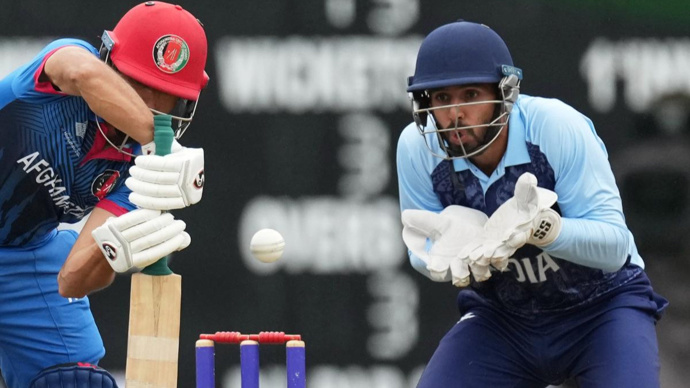
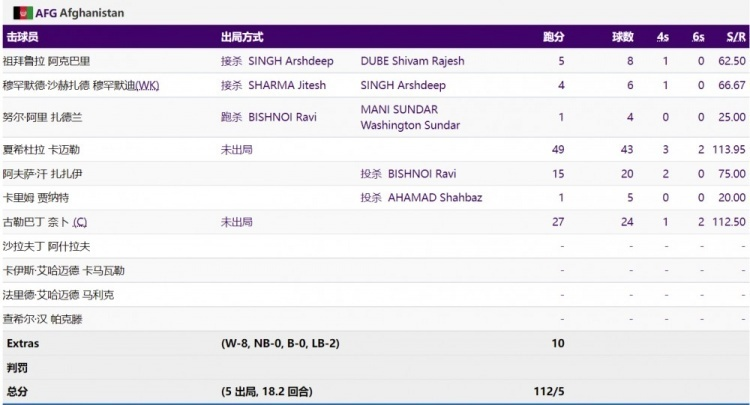
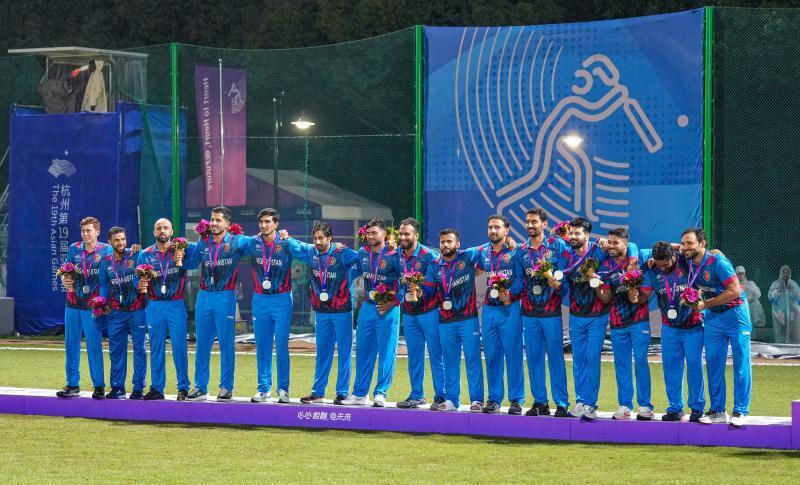
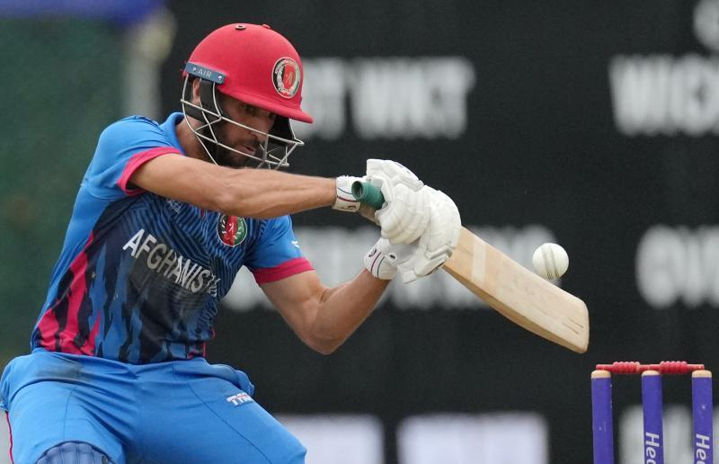
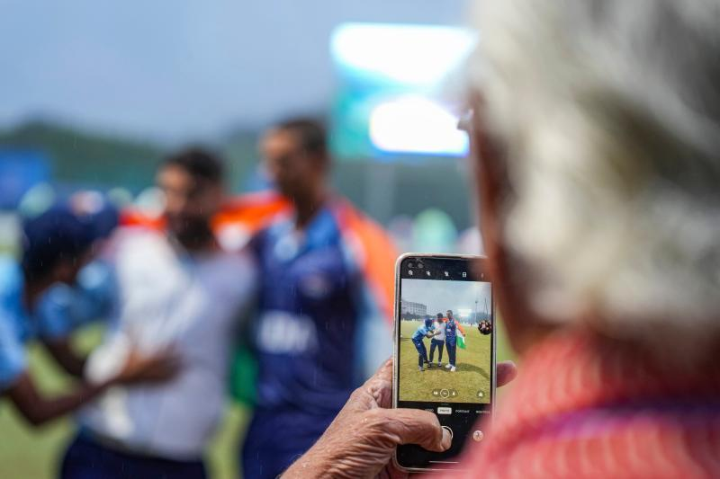

# 亚运会男子板球决赛遇大雨终止，印度因排名更高“躺赢”获得金牌

10月7日，杭州亚运会产生最诡异的一枚金牌：男子板球比赛决赛，原本阿富汗队比分领先印度队，但由于天降大雨，比赛被迫终止。这场大雨，也导致阿富汗队“失去”冠军，印度队最终躺赢夺冠。

比赛由于大雨暂停，印度队依靠排名更高，直接躺赢夺冠。

杭州亚运会板球项目男子组决赛，阿富汗已经获得112跑分、5出局后，比赛因大雨被迫取消。根据比赛规则，印度因种子排名更高而直接被判胜利获得金牌，而阿富汗只能以银牌收官。

印度队由于在国际板球理事会的世界排名高于阿富汗队，最终被判获胜，属于不折不扣的“躺赢”！阿富汗队由于天气原因痛失金牌，也成为杭州亚运板球赛场十分“诡异”的一幕。

_10月7日，获得银牌的阿富汗队选手在颁奖仪式上。
当日，杭州亚运会板球男子组决赛在浙江工业大学（屏峰校区）板球场举行，印度队对阵阿富汗队。印度队最终获得该项目金牌。 新华社记者 孙非 摄_

在阿富汗，板球是人们的最爱，阿富汗人认为，人生不一定只是赚钱，更需要的是快乐，各项运动给喜欢它的人们带来的快乐是金钱不能代替的。面对杭州亚运会板球比赛的意外结局，阿富汗队上下感到遗憾。

“我很自豪。这是阿富汗在广州亚运会的第一枚银牌，我为球队和队员们感到骄傲，他们就是我的一切。”阿富汗队员耐比表示，“我们为本届亚运会付出了艰辛的努力，我们理应赢得决赛。
**但不幸的是，因为下雨，印度队世界排名比我们靠前，所以现在他们才是金牌得主。** ”

 _10月7日，阿富汗队选手夏希杜拉·卡迈勒在比赛中击球。 新华社_

阿富汗队员阿尔扎德也认为，天气意外也是比赛的一部分，“ **下雨也没办法，这是人生的一部分。不过，我们确实打得很好。** ”

印度队依靠天气获得金牌，这样夺金的方式，确实有些诡异。队员奥马哈德认为，“赢得比赛，我们很自豪，也很开心。
**虽然比赛因为下雨而终止，如果再打一局再结束，我们可能会更高兴，但规则就是规则。下雨不是我们能控制的，只是过程的一部分，而我们只是尽力而为。** ”

 _10月7日，印度队选手在比赛后拍照留念。 新华社_

另一名印度队员贾斯马尔则认为，“我衷心祝贺所有印度人民，我们赢得了这枚金牌。这是我们的福报。”对于依靠下雨夺冠，他表示，“
**我觉得这是比赛的一部分，我们无能为力。** 这没什么，我们必须接受事实，顺其自然。”

不过，杭州亚运会板球赛场，类似情况已经发生过。在女子板球1/4决赛时，就遭遇下雨停赛，有三支球队就是根据此规则晋级。

