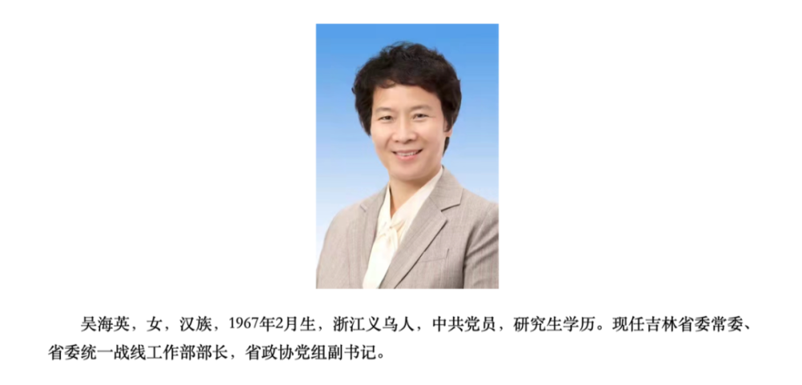
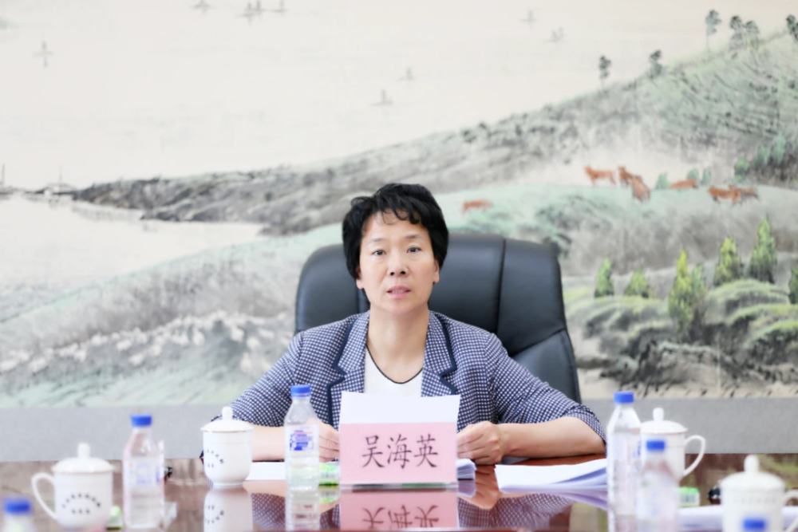
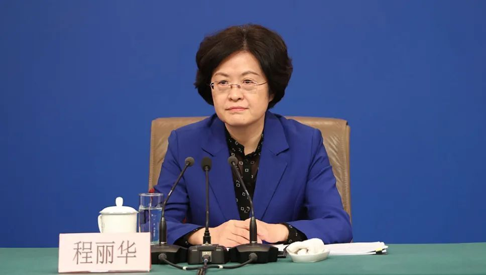
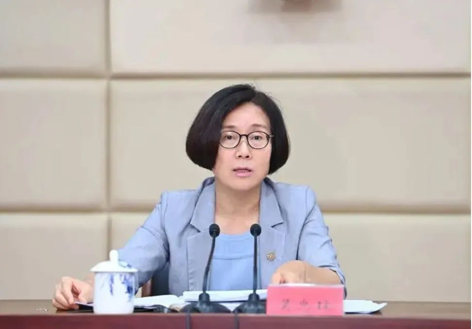
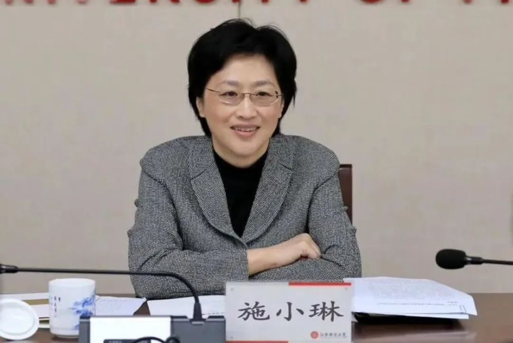
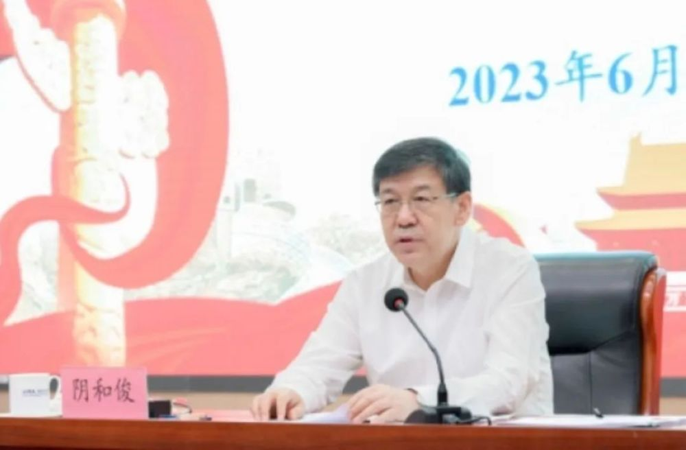
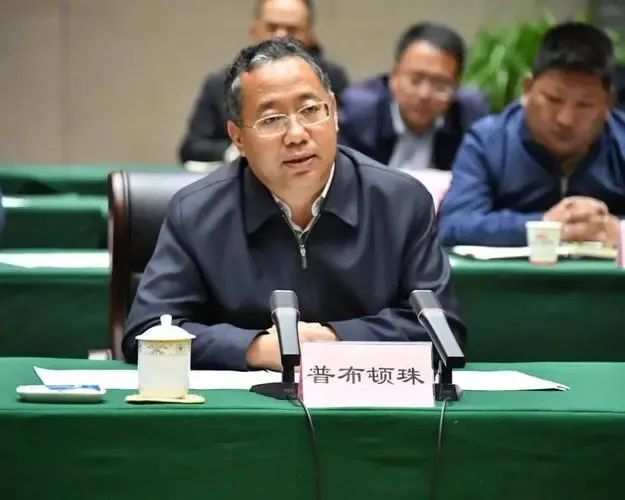

# 南北两位女性省部级官员，今年先后履新省委副书记这一重要岗位

**撰文 | 余晖 董鑫**

10月8日，据吉林发布消息，近日，中共中央批准：吴海英同志任吉林省委副书记。

吴海英是今年第二位履新的省级党委副书记。今年7月，时任四川省委常委、成都市委书记施小琳（女）任四川省委副书记。

**纪委“老将”**

吴海英，女，汉族，1967年2月生，今年56岁，浙江义乌人，1989年7月参加工作，1985年5月加入中国共产党，高级管理人员工商管理硕士。

吴海英1985年9月在中国人民大学中共党史专业学习，1989年7月毕业后到中国科学院京区党委工作，先后任组织部副部长、部长。

2000年9月，她调入中央国家机关工委工作，担任过组织部二处处长、组织部副部长，后任中央国家机关团工委书记、中央国家机关青联主席（正局级）、中央国家机关纪工委副书记。

2016年10月，吴海英任中央纪委机关党委常务副书记，2017年5月任中央纪委驻环境保护部纪检组组长。

2018年机构改革之后，吴海英任中央纪委驻生态环境部纪检组组长、驻生态环境部纪检监察组组长。

**去年赴吉林任职**

政知君注意到，她在担任纪检监察组组长期间，2017年11月，第十二届全国人大环境与资源保护委员会副主任委员、中国环境科学研究院原院长孟伟被查，这一消息，就是由驻环境保护部纪检组发布的。

2018年7月31日，生态环境部召开全国生态环保系统“以案为鉴，营造良好政治生态”专项治理工作动员部署会。

在那次会议上，吴海英连续发问：“孟伟作为曾经的党政领导干部、中国工程院院士，理想信念在哪里？政治担当在哪里？纪律规矩在哪里？孟伟发生违纪行为的时候，党组织的管党治党责任又在哪里？”

她说，“孟伟严重违纪，破坏的是单位的政治生态，受损的是党的事业，伤害的是党员干部队伍。”

2020年5月，吴海英转任驻国家税务总局纪检监察组组长。

两年后，2022年5月，她“空降”吉林，后任吉林省委常委、统战部部长。1年多后，她再度履新，担任吉林省委副书记。

**4位女性**

政知君注意到，包括吴海英在内，今年至少有7位专职省级党委副书记履新，分别是：

3月，时任上海市委副书记、政法委书记诸葛宇杰任湖北省委副书记。

6月，时任海南省委常委、副省长沈丹阳任海南省委副书记

7月，时任上海市委常委、常务副市长吴清任上海市委副书记

7月，时任四川省委常委、成都市委书记施小琳（女）任四川省委副书记

8月，时任西藏自治区党委常务副书记庄严任宁夏回族自治区党委副书记

9月，时任湖南省委常委、常务副省长李殿勋任湖南省委副书记

10月，吉林省委常委、统战部部长吴海英（女）任吉林省委副书记

目前，天津、河北、辽宁、黑龙江、江苏、浙江、河南、广西、陕西、甘肃、青海、山西的省级党委专职副书记空缺。其中，山西省委副书记此前是商黎光，9月5日商黎光被查。

吴海英是今年履新的第二位女性省级党委专职副书记。

全国现任省级党委专职副书记中，女性有4人，除了此番履新的吴海英之外，还有安徽省委副书记程丽华，江西省委副书记、赣州市委书记吴忠琼，四川省委副书记、成都市委书记施小琳，其中最年轻的是施小琳，她1969年5月生，今年54岁。

上述4人中，吴海英是唯一一位有多年纪委工作经历的省级党委专职副书记。

**两天三位省部级履新**

包括吴海英在内，中秋国庆假期之后，已有三位省部级履新，包括一名中央委员和一名中央候补委员。

10月7日，科学技术部领导干部会议宣布，中央决定，阴和俊任科学技术部党组书记。

官方简历显示，阴和俊出生于1963年1月，山西古交人，二十届中央委员。

他曾任中科院高技术研究与发展局局长，中科院副院长、党组成员，科技部副部长、党组成员，北京市委常委、副市长，天津市委副书记等职。

此次履新之前，阴和俊担任中科院副院长、党组副书记（正部长级）、中国科学院直属机关党委书记（兼）、中国科学院党校校长（兼）。

也是10月7日，四川观察发布消息，近日，中共中央批准，普布顿珠任中共四川省委委员、常委。

官方简历显示，普布顿珠，藏族，出生于1972年11月，西藏江孜人，二十届中央候补委员。他长期在西藏工作，此次职务调整是首次跨省任职。

2016年1月，国务院批复同意撤销山南地区和乃东县，设立地级山南市，普布顿珠出任首任山南市市长。2020年6月，普布顿珠升任西藏自治区政府副主席，同年12月兼任昌都市委书记。2021年11月，他当选为新一届自治区党委常委。

2022年4月，普布顿珠兼任拉萨市委书记直至此次调整。

**资料 ｜ 新华社 人民网 央视等**

**【版权声明】本文著作权归政知新媒体独家所有，未经授权，不得转载。**

