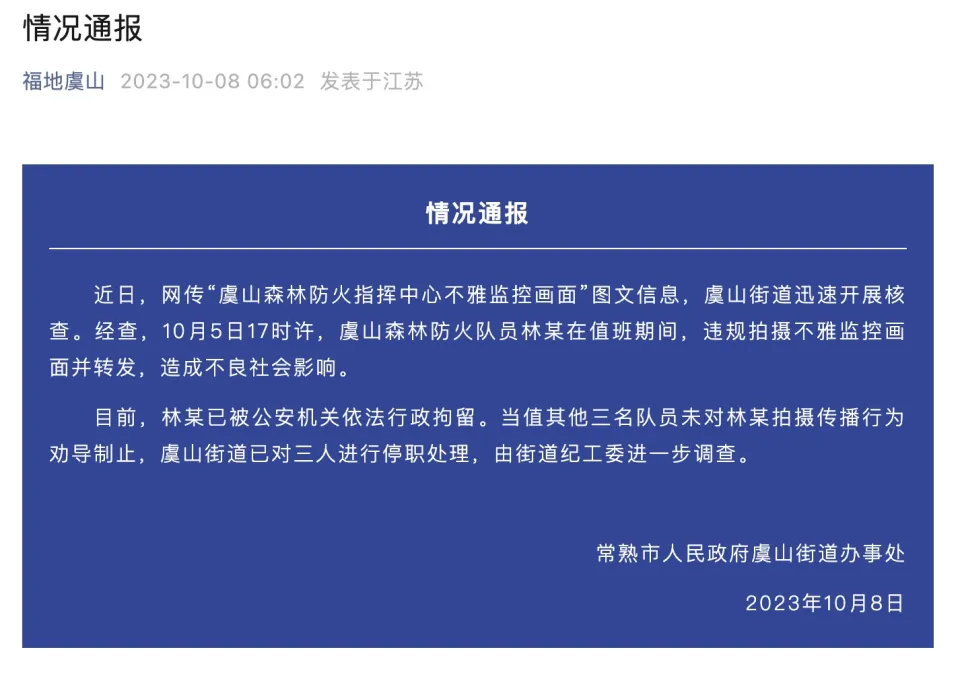

# 常熟通报“森林防火指挥中心不雅监控画面”：防火队员违规拍摄并转发 已被行拘

来源：福地虞山

**情况通报**

近日，网传“虞山森林防火指挥中心不雅监控画面”图文信息，虞山街道迅速开展核查。经查，10月5日17时许，虞山森林防火队员林某在值班期间，违规拍摄不雅监控画面并转发，造成不良社会影响。

目前，林某已被公安机关依法行政拘留。当值其他三名队员未对林某拍摄传播行为劝导制止，虞山街道已对三人进行停职处理，由街道纪工委进一步调查。

常熟市人民政府虞山街道办事处

2023年10月8日

