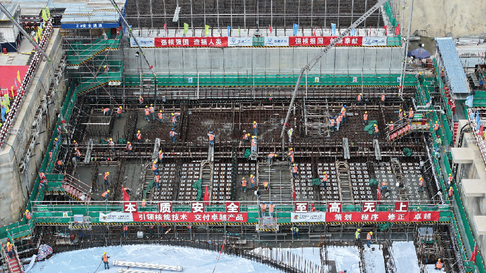

# 广东廉江核电一期工程开工，首次采用超大型冷却塔

据微信公众号“国家电力投资集团有限公司”10月7日消息，9月29日下午16时58分，国家电投广东廉江核电1号机组核岛反应堆第一罐混凝土浇筑（FCD）圆满完成，标志着一期工程进入工程建设全新阶段，正式开启了“为我国核电发展蹚出一条新路”的新征程。

项目全体参建人员解决了钢筋密集、埋件密布、大体积混凝土温度监控等一系列难题，克服高温、多雨、潮湿等诸多不利影响，在节日期间安全高质量完成FCD任务，较原计划提前7小时，整个浇筑过程未产生一罐报废混凝土。在同期核准的四台机组中，率先实现FCD，在同类型机组中，创造了FCD过程的最短纪录。

廉江核电项目是国家电投在粤开发建设的首个沿海核电项目，规划建设6台CAP系列三代核电机组，总装机容量862万千瓦。一期工程建设两台先进的百万千瓦级核电机组，单台机组额定容量为125万千瓦，采用先进的CAP1000三代非能动压水堆核电技术，设计运行寿命60年，满足国际最高安全标准，计划于2028年建成投运。6台机组全部建成后，年发电量约为702亿千瓦时，每年可减少标煤消耗约2007.6万吨，减排二氧化碳约5260.1万吨、二氧化硫约17.1万吨、氮氧化物约14.9万吨，减排效应相当于种植阔叶林约14.8万公顷。

依托该项目的高质量建设，国家电投将推动“大项目带动大基地”战略提速，全力打造核风氢储融合式大基地，建设粤西一体化综合能源基地，助力广东省、湛江市产业结构升级和能源系统绿色低碳转型。同时，作为国内首个采用海水二次循环冷却技术的核电项目，在我国核能领域首次开发使用超大型冷却塔，将进一步提升核电项目环境友好性，拓宽我国核电厂址开发的布局和空间，为我国核电厂址开发建设提供全新示范。

为确保廉江核电项目安全高质量建设，湛江核电作为营运单位，将恪守“安全是核电发展生命线”的原则，秉承“把手中的事一次做到位”工作理念，坚决扛起核安全全面责任，不断强化项目全领域、全体系、全流程安全质量管理，高标准高要求高质量推进项目建设，切实保证工程建造质量，确保安全质量可控在控。

作为勘察设计和全场总承包管理单位，上海核工院将严格履行核安全主体责任，始终将核安全摆在首位，以“开工就是决战、起步就是冲刺”的工作态度和作风，坚持发挥核电建设领域优势及大项目管理优势，依法合规推进EPCS（设计、采购、建造、调试）各领域工作，全力打造“两性、三零、两奖、一优”精品工程。

目前，三代非能动核电技术已经形成批量化建设规模，4台AP1000机组安全稳定运行，2台“国和一号”再创新机组建设顺利推进，6台CAP1000国产化机组已陆续开工建设。

另据央视网此前报道，为提升能源保障能力和促进绿色发展，2022年9月13日召开的国务院常务会议决定，核准已列入规划、条件成熟的福建漳州二期、广东廉江一期核电项目。强化全过程监管，确保安全万无一失。

