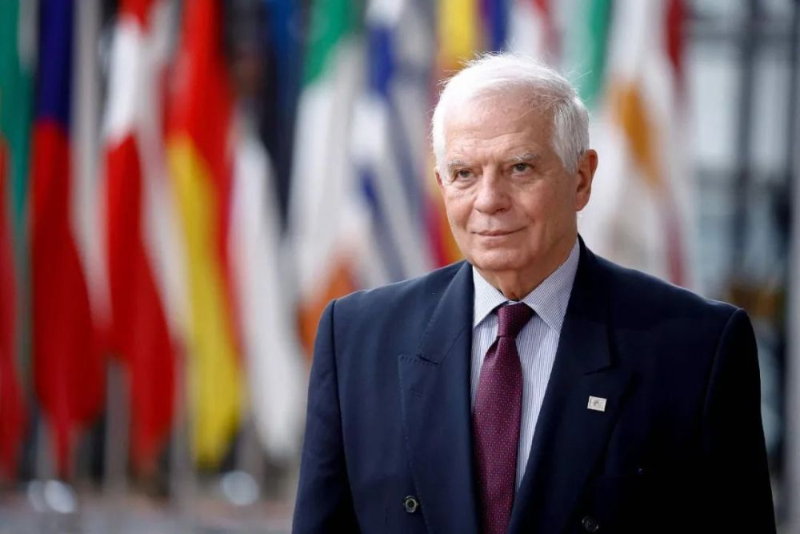
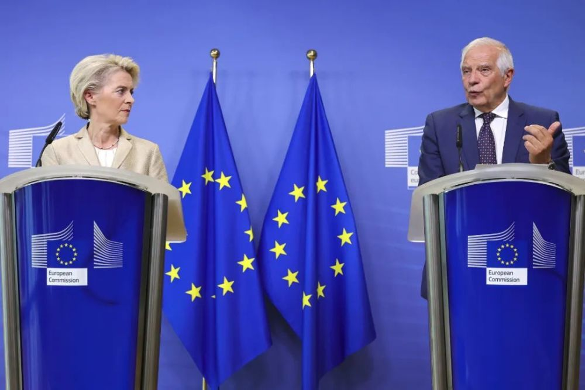

# 一波三折后，他本周访华

据环球时报报道，一名欧盟官员表示，欧盟外交与安全政策高级代表博雷利将于10月12日至14日访问中国，届时将同中方讨论双边关系及外交和安全政策问题。

博雷利的访华行程“一波三折”。今年4月，他因新冠检测阳性，访华计划被迫推迟；7月初，他的访华行程在最后一刻被取消。

博雷利此次访华消息再度传出之际，正值欧盟对中国电动汽车的反补贴调查启动之时，此访能否为中欧关系注入共识和活力，引发外界广泛关注。

 _博雷利资料图 图源：视觉中国_

长安街知事（微信ID：Capitalnews）注意到，时隔半年，与博雷利4月访华计划公布时，国际形势、中欧关系已发生新变化。博雷利此行将重点围绕哪些问题与中方展开讨论，成为外界关注焦点。

实际上，中方对博雷利访华行程始终保持开放和欢迎态度。4月访华计划推迟后，中国外交部发言人表示“欢迎他在双方方便的时候访华”。7月访华行程取消后，中方再次表态，“中方高度重视中欧关系，一直同欧方保持各层级各领域交往，我们欢迎博雷利高级代表在双方方便的时候尽早访华，愿同欧方继续保持沟通。”

此外，中欧高层也一直在为推动对话交流进行沟通。9月28日，中国驻欧盟使团团长傅聪大使会见博雷利，双方就中欧关系、中欧高级别战略对话筹备情况及其他共同关心的问题深入交流。

8月6日，中共中央政治局委员、外交部长王毅同博雷利通电话。博雷利强调欧方坚定致力于同中方发展良好关系，他表示期待尽快访华并同中方开展战略对话，共同筹备今年欧中领导人会晤，推动欧中关系进一步向前发展。

可见，尽管国际社会风云变幻，中欧高层进行对话交流的意愿始终强烈。而从此前的几次沟通内容来看，推动中欧高级别战略对话、为中欧领导人会晤做准备，将是博雷利此访的重要内容。

_欧盟委员会主席冯德莱恩（左）和欧盟外交与安全政策高级代表博雷利资料图。图源：视觉中国_

长安街知事（微信ID：Capitalnews）注意到，博雷利此次访华的一个重要背景是，欧盟对中国电动汽车发起反补贴调查引发中方强烈不满。

9月13日，欧盟委员会主席冯德莱恩宣布对进口自中国的纯电动载人汽车发起反补贴调查。10月4日，欧盟委员会发布公告，正式启动该项调查。未来欧盟可能会根据调查结果对华加征临时“反补贴税”。

欧盟宣布启动调查当天，中国商务部新闻发言人指出，欧方发起此次反补贴调查仅依据对所谓补贴项目和损害威胁的主观臆断，缺乏充足证据支持，不符合世贸组织相关规则，中方对此表示强烈不满。中方将密切关注欧方后续调查程序，坚定维护中国企业的合法权益。

此前，商务部部长王文涛已就此当面表达不满。9月24日，王文涛在京与来访的欧委会执行副主席兼贸易委员东布罗夫斯基斯举行会谈。王文涛重点就欧盟将对中国电动汽车发起反补贴调查表达严正关切和强烈不满。

王文涛表示，中国电动汽车快速发展，依靠的是研发创新、自由竞争和完备的产业体系。欧方拟进行的反补贴调查是贸易保护主义行为，将影响中欧绿色合作和全球汽车产业链供应链稳定。希望欧方与中方开展对话磋商，严格遵守世贸组织相关规则，以非政治化、非歧视性方式妥善解决贸易摩擦。

对于欧盟相关调查，中方表态已十分明确，博雷利将如何就这一问题与中方展开讨论，值得持续关注。但在与中国讨论之前，博雷利确实应该先听听欧盟内部的理智声音。

实际上，对中国电动汽车的反补贴调查，欧盟内部成员国也存在巨大的反对声，德国就是一个典型的例子。

9月15日，德国数字化和交通部部长维辛在接受德媒采访时，明确反对欧盟可能对中国电动汽车征收惩罚性关税，并警告德国经济将因此受到损害。

“原则上，我不太认为要建立市场壁垒。”维辛警告说，“我们需要关心的是，我们为德国和全球市场生产具有竞争力的电动汽车。今天汽车将被封锁，明天化学产品将被封锁，每一步都会让世界变得更加贫穷。”

此外，企业界也对此举持质疑和反对态度。宝马集团首席财务官默特尔警告欧盟，不要对中国电动汽车征收惩罚性关税，并担心会对其他行业产生影响。

有观点指出，欧盟对华发起的电动汽车反补贴调查将是接下来中欧对话的“试金石”，能否妥善处理这一问题，将展示欧中关系的稳定性和发展趋势。

有报道指出，欧盟针对“中国制造”的排挤力度还在扩大。除电动汽车外，欧盟还在考虑对中国风电机组展开反补贴调查，这一行动作为促进欧洲风能行业提案的一部分，可能会在本月实施。另外，欧盟政界人士和行业代表几周来，一直在讨论对中国太阳能组件征收惩罚性关税。

“行有不得，反求诸己”，从曾经的光伏产业，到如今的电动汽车，欧盟发展的症结，不会在对中国企业的各类调查中解开。相信此次访华，能为博雷利认清上述问题本质、扫清中欧合作障碍有所帮助。

