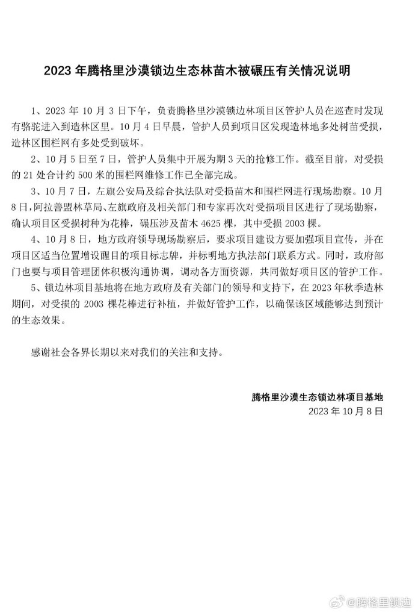

# 内蒙古腾格里沙漠苗木被车辆碾压，当地通报：2000余棵需补种

据阿拉善锁边生态协力中心官方微博消息，腾格里沙漠生态锁边林项目基地9日发布“腾格里沙漠锁边生态林苗木被碾压”的情况说明：

10月3日下午，负责腾格里沙漠锁边林项目区管护人员在巡查时发现有骆驼进入到造林区里。10月4日早晨，管护人员到项目区发现造林地多处树苗受损，造林区围栏网有多处受到破坏。

10月5日至7日，管护人员集中开展为期3天的抢修工作。截至目前，对受损的21处合计约500米的围栏网维修工作已全部完成。

10月7日，阿拉善左旗公安局及综合执法队对受损苗木和围栏网进行现场勘察。10月8日，阿拉善盟林草局、左旗政府及相关部门和专家再次对受损项目区进行了现场勘察，确认项目区受损树种为花棒，碾压涉及苗木4625棵，其中受损2003棵。

10月8日，地方政府领导现场勘察后，要求项目建设方要加强项目宣传，并在项目区适当位置增设醒目的项目标志牌，并标明地方执法部门联系方式。同时，政府部门也要与项目管理团体积极沟通协调，调动各方面资源，共同做好项目区的管护工作。

锁边林项目基地将在地方政府及有关部门的领导和支持下，在2023年秋季造林期间，对受损的2003棵花棒进行补植，并做好管护工作，以确保该区域能够达到预计的生态效果。

据央广网此前报道，日前有网友在社交平台上发帖称，位于阿拉善盟腾格里沙漠锁边生态公益基地的治沙植物遭自驾的越野车碾压。

_车辙碾压过的沙漠造林区（央广网发 受访者供图）_

网络图片显示，沙地中的车痕与轮胎印清晰可见，多处绿色植物歪倒在车辙中，埋入沙土。10月7日，有知情人士表示，治沙区域不知因何被人剪开围栏，遭受碾压的植物主要是典型的荒漠和半荒漠耐旱植物——花捧，大部分种植时间还不到三年。

报道称，阿拉善地处祖国正北方、内蒙古最西部、黄河几字弯西端，是全国生态环境最脆弱、荒漠化程度最严重、自然条件最恶劣、治理难度最大的地区之一，位于《全国重要生态系统保护和修复重大工程总体规划（2021-2035年）》确定的“三区四带”生态安全战略格局中北方防沙带的核心区域。尽管多年来阿拉善的荒漠化治理工作取得了一些成效，但生态环境依然脆弱，沙化土地面积大、分布广、程度重、治理难的基本面貌尚未根本改变，生态保护建设仍然任重道远。

据了解，此次涉及的腾格里沙漠锁边生态公益基地于2003年启动，是由中国绿化基金会全面支持的防沙治沙、植树造林和生态修复公益项目，在沙漠边缘人工种植花棒、沙拐枣、梭梭和柠条等乡土灌木树种，营造沙漠锁边灌木林，阻止腾格里沙漠的扩张和侵蚀。在产权关系上，公益基地与土地所有集体（嘎查）或直接与牧民签订合同或协议，以保证防沙造林项目的独立管理、防止放牧砍伐等人为的破坏。

