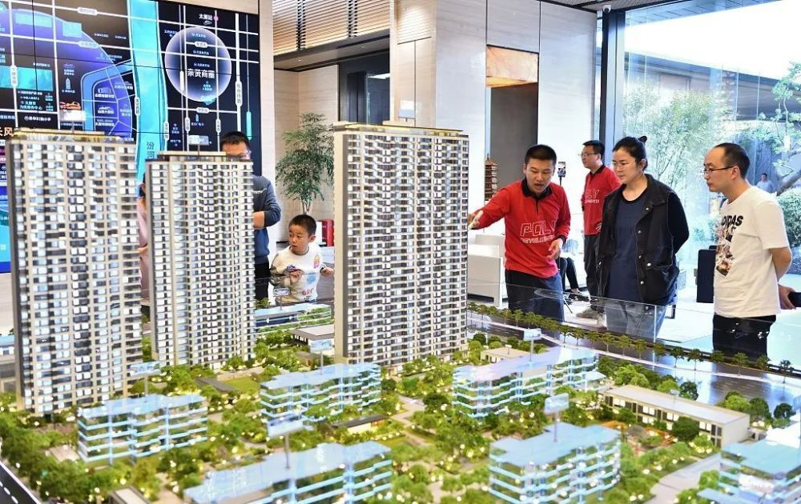

# 北京“神盘”挂牌154套房：雪藏12年，价格翻13倍

 _图源：视觉中国_

特约作者 | 丘宁

编辑 | 陈弗也

出品 | 棱镜·腾讯小满工作室

154套房子，犹如一颗定时炸弹，悬在刘洋等中国铁建国际城（以下简称“国际城”）业主的头上。

国际城位于北京市朝阳区，9月6日，北京产权交易所发布公告，该小区的154套房将以低于市场的价格进行处置，底价为87357元/㎡。而资料显示，这些房源空置已十年有余。

业主们担心对二手房销售的影响。刘洋将这些房子比作“定时炸弹”，因为它们一旦进入市场，其体量相当于该小区过去两年的二手房成交量之和。受此影响，价格更贵、首付比例更高的存量二手房将面临“有价无市”的困境。

根据链家提供的数据，2022年1月至今，国际城累计成交量为96套，今年7月以来成交量仅5套。贝壳找房数据则显示，整个9月，该小区仅成交了1套，创下历史新低。

更令人不安的是，这样一场备受关注的竞拍，进展得并不顺利。最初的挂牌截止时间为9月20日，但彼时成交量仅19套。此后，截止时间被延长至9月27日、10月10日。截至10月8日，这154套房源也仅累计成交30套，仍剩余124套。

该楼盘位于北京楼市炙手可热的新北苑板块，一站地铁即可到达写字楼如云的望京。它诞生于十年前地产界的“战国时代”，开发商跑马圈地、购房者络绎不绝、房价水涨船高。

曾几何时，新北苑是北京房价涨幅最典型的区域，而国际城又是新北苑“四大神盘”之一。如今，潮水退去，买入当年“神盘”的人，至今仍很难找到接盘者。154套房源突然被“甩卖”，更是冲击了这个楼盘的市场行情。

今年8月底以来，各地楼市政策纷纷松绑，但地产寒冬并未过去。这154套房的前世今生，可以视为过去十余年房地产大时代下的小注脚。

从“区域神盘”到“码农家园”

一整排空荡荡的阳台、数百扇布满灰尘的窗户、楼梯口没有生活垃圾的垃圾站……这一景象与小区内丰富的健身设施、成熟的绿化、紧张的车位形成鲜明对比。

这是中国铁建国际城13号楼，一把铁锁，将这栋楼的房屋与外界隔绝了12年之久。

该楼栋共有两个单元，每单元19层，每层4户，共152户。上述通过北京产权交易所处置的房源多数位于该楼。

透过阳台玻璃观察，仅有约5户可看到生活的痕迹。

赵一丹是这个小区的拆迁安置居民，据她介绍，生活在13号楼的5户居民均为拆迁安置户，安置房在该小区内占比较大。

赵一丹称，13号楼原本为拆迁安置楼，但不知何缘故，这些房子始终未能用于拆迁安置。而除了13号楼外，该小区还有4栋楼存在大量未曾交付的房源。根据她的介绍，小区内空置的房子多达400余套。

到了夜晚，这五栋楼漆黑一片，如小区中的“另类”。

《棱镜》作者就此向中国铁建国际城物业服务中心咨询，前台工作人员表示，本次竞拍的154套房源从未交付，也没有签订过物业服务协议，其性质是一批建成12年的“一手房”。目前挂牌房源的转让方是北京市朝阳区住建委，资产来源为行政事业单位实物资产。

资料显示，国际城始建于2008年，于2011年至2012年陆续建成，共15栋居民楼。

彼时，北京的房价正处于新一轮爬升的前夜。随着大量住宅和配套设施的落成，新北苑成为了北京房价涨幅最具代表性的区域之一。

过去十年间，伴随着科技新贵的涌入，望京成为了新的“码农乐园”，大量的阿里、美团等大厂“高薪码农”在此聚集。由于距离望京较近，新北苑板块承接了这些人的买房需求。当然，这里的业主也包含不少拆迁安置的“原住民”。

十年间，这一区域的房价从2万元/㎡左右，涨到如今接近10万元，涨幅近400%。

挂牌价为回购价13倍，总值超10亿

如此热门地段的房源，缘何尘封了12年之久，直到今时方才问世？

集中处置通常是为了尽快回笼资金，更快完成住宅的销售。然而，这些房子早已不归属于中国铁建，本次处置的主体也并非开发商。那么，这些常年空置的房屋，其主人是谁？用途如何？

多年来，在国际城业主群中衍生出“没收”说、“福利房”说、保障房说等诸多个“故事版本”。赵一丹笃信其中的“没收”说，据她介绍，小区建成时，400余套房屋归了当地“乡里”所有，但由于未按照最初规划用于安置，这批房屋随后被朝阳区“没收”，封存至今。

《华夏时报》的报道与赵一丹的讲述有相似之处。该媒体称，国际城部分楼栋承接了周边区域的拆迁安置任务。后来，用于安置的房源并没有被全部用完。

而《经济观察报》则称，国际城建成后，一部分房源被朝阳区住建委等多个单位回购，计划用于解决职工住房问题。2012年底中央八项规定出台后，“解决职工住房”的计划暂停，并空置至今。

国际城建设伊始，其所在地块，曾是北京2007年出让建筑面积最大的住宅地块。

2007年12月，该地块因参与投标的开发商不足3家而宣布流标。2008年1月，该地块再次公开出让，最终由北京中联亚房地产有限公司竞得，总成交价21亿元，楼面地价约3170元/㎡。

该地块分为两幅住宅用地和两幅商办用地。其中一块住宅用地被建成国际城，建筑面积23.3万平方米。彼时财报显示，中国铁建于2009年9月与中联亚签订协议，获得了该项目100%股权。

根据招标文件，该地块需要配建廉租房项目，保障房及公建部分的政府回购面积达26万平方米，回购价格为6500元/㎡。

据此计算，本次竞拍的154套房源，其挂牌均价达到当年回购价的13倍。

回购房，作为十余年前的产物，如今已鲜有人提及。2008年后，北京出让的回购房地块减少，“回购房”政策逐渐走入历史。

而彼时，不少小区由于事先未对购房者透露配建回购房的信息而遭遇业主维权。2011年6月，一份“中国铁建国际城业主维权抗议书”在网上流传，业主们就回购问题要求开发商说明未来的处理方案。

无论其间经历了怎样的故事，截至目前，通过北京产权交易所处置的这154套房屋已归属于朝阳区住建委。按照底价计算，154套房源总计10.77亿元，仍在交易的134套房源总价也达到9.35亿元。

北京产权交易所负责该项目的一位工作人员对《棱镜》作者称，房屋的产权方是朝阳区住建委，有产权证明，且无产权不清晰的问题。

巧合的是，这些房源的产权变更日期是2023年9月6日，即挂牌处置当天。

十年前的“神盘”，如今“接盘侠”难寻

北京产权交易所对上述房源的处置公告发布后，刘洋一直关注着竞拍情况。她希望通过竞拍结果来判断自己的房子未来能否找到“接盘侠”。

不同于拆迁安置的居民，刘洋于2017年通过二手房交易在这个小区购得了一套74平方米的住宅。购房前，她并不知晓小区内有多达400余套空置房源。

刘洋购此房屋时，除了因为上班便利外，还因为楼盘所在区域具有升值潜力、容易找到接盘买家。

根据贝壳找房数据，中国铁建国际城二手房均价为93674元/㎡。而此次处置的154套住宅平均转让底价为87357元/㎡，单价存在6317元的价差，相当于打了九三折。

虽然二手价格仍然坚挺，但其成交量已“断崖式”下滑，有价无市。链家数据显示，2023年7月至9月，该小区三个月的成交总量仅为5套，2022年同期则为15套。

此外，相较于竞拍房源，“刘洋”们的二手房在贷款方面亦不具备优势。由于原值较低，二手房贷款额度远低于竞拍房源。据链家经纪人计算，以刘洋购置的74平方米住宅为例，二手房价格约690万，首付款至少需要400万元。

而同户型竞拍房源价格约633万元，因作为新房销售，能够实现较高比例的贷款，首付比例可低至4成，计算下来首付款仅需253万。

这样的价格差和首付差，对“刘洋”们显然并不友好。

在总价优势和贷款优势之下，竞拍房源相较二手房源无疑更吸引人。然而，多位负责中国铁建国际城二手房的经纪人认为，在如此优势之下，竞拍参与者仍然寥寥无几，是由于市场需求不足所致。

根据北京产权交易所官网，截至10月8日，这批房源仍有124套待转让，这意味着，处置数量仅30套。《华夏时报》称，已成交的房源基本上为底价成交。

曾几何时，购房者只要买到优质地段，便可高枕无忧。而在如今的地产大环境下，即便是区域“神盘”，依旧无人问津。

没人能知道，这些海量的空置房源需要多久才能在市场上消化完。但可以想象的是，随着“雪藏”房源被竞拍，不时响起的电钻声，将会划破原本安静祥和的小区上空。

（刘洋、赵一丹为化名）

