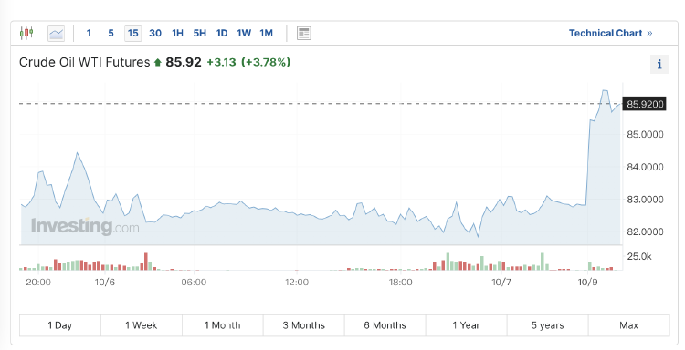
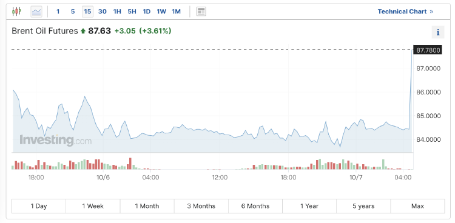

# 巴以冲突升级致原油、黄金大涨，中东股市暴跌，石油危机会重演吗

国际局势突变。

以色列和巴勒斯坦爆发近20年来最大规模冲突，目前已致数千人伤亡，战况惨烈。受巴以冲突升级影响，避险情绪下原油、黄金大涨，中东股市暴跌……

**中东股市暴跌**

巴以冲突升级在中东市场引起巨震，北京时间10月8日，以色列股市遭遇恐慌性抛售，以色列基准股指——特拉维夫TA35指数盘中一度暴跌近8%；沙特基准股指Tadawul
All Share下跌1.3%；埃及股市基准指数EGX30下跌2%；科威特、卡塔尔、阿曼和巴林的股市也走弱。

**美元携黄金周一双双跳空高开**

巴以冲突持续升级，美元周一亚洲时段开盘后兑大多数主要货币普遍走高，而同样具有避险属性的黄金价格也上演了跳空高开的一幕。

据报道，美元日内兑欧元和英镑至少上涨了0.2%，澳元和纽元等风险货币的走势尤为疲软。在新兴市场上，通常被视为套利交易策略代表的墨西哥比索兑美元汇率下跌近1%。毫无疑问，中东地区的不稳定局势，有可能给近几个月来持续上演的美元升势再添一把火。

在此之前，美元的涨势已经引发了不少亚洲经济体干预市场的讨论，并再次引发了欧洲市场上关于欧元是否可能再次兑美元跌至平价的猜测。

新西兰银行驻惠灵顿的货币策略师Jason
Wong表示，“短期内阻力最小的路径是美元在风险偏好降低的情况下走强。不过考虑到美元上涨的幅度，有合理的理由认为影响可能会相对较快地消退。”

而纽约梅隆资本市场则相对更为看好美元。该机构市场策略主管Bob
Savage在一份报告中写道：“美元买盘保持不变，经济增长和通胀的困惑仍在继续。我们更有可能看到国内外、市场和经济、货币和财政政策方面的冲突升级，而不是得到解决。”

彭博美元指数今年迄今已经累计上涨了2.1%，有望实现连续第三年上涨，这将是2016年以来的最长涨势。该指数在亚洲时段早盘交易中上涨了0.2%。

除了美元外，另一避险资产黄金价格日内也正受益于巴以冲突的升级。现货黄金周一开盘大幅跳空高开，金价最高触及1855.60美元/盎司。目前金价仍交投在1850美元/盎司附近。

有分析师表示，地缘政治风险上升可能促使投资者买入黄金和美元等避险资产，并可能提振对近期遭受大举抛售的美国国债的需求。

“这是人们需要在投资组合中配置黄金的一个很好的例子。它是抵御国际动荡的完美对冲工具。” 美国投行斯巴达资本证券的首席市场经济学家Peter
Cardillo表示。

Moneyfarm首席投资官Richard Flax表示，“冲突有可能损害广泛的市场情绪，但长期影响尚不确定。”

**国际油价迎来“血色助攻”**

据财联社报道，随着巴以冲突持续升级，国际油价周一亚洲早盘飙升，WTI原油一度涨超4%。截至9日10时许，WTI原油期货上涨3.78%，报85.92美元/桶；布伦特原油期货上涨3.61%，报87.63美元/桶。

 _WTI原油期货15分钟走势图 来源：英为财情_

_布伦特原油期货15分钟走势图 来源：英为财情_

尽管国际油价接近每桶100美元的重要心理关口，但近2周连续收跌，上周更创今年3月以来的最大单周跌幅。在中东地区局势突然升级的情况下，国际油价可能迎来一场“血色助攻”。

目前，所有的目光都集中在伊朗上，伊朗是主要的石油生产国，也是巴勒斯坦伊斯兰抵抗运动(哈马斯)的主要支持者。哈马斯发言人周六声称，该组织对以色列的打击行动得到了伊朗的直接支持。

有投资人担心，如果以色列因此而报复伊朗（打击伊朗的基础设施），原油供应将受到影响。霍尔木兹海峡是伊朗至关重要的航运要道，世界上20%的原油运输都要经过霍尔木兹海峡。

与此同时，这一事态发展也意味着美国对伊朗的制裁可能得到更强有力的执行，因此伊朗石油的出口可能会减少。在更极端的情况下，伊朗可能会通过封锁霍尔木兹海峡来回应任何直接挑衅。

分析师表示，由于伊朗石油出口可能受到连锁反应，原油价格可能在短期内上涨，但该地缘政治事件对油市总体影响应该有限。

“随着中东火药桶再次点燃，油价将因地缘政治风险加剧而上涨，”SPI Asset Management的管理合伙人Stephen
Innes周日在一份报告中写道。“我们应该预料到，随着利率驱动的衰退担忧让位给中东令人担忧的冲突升级，原油价格将继续动荡。”

“风险在于油价上涨、股市暴跌以及波动性激增，这支撑了美元和日元，并削弱了‘风险’货币。”CBA分析师在一份报告中表示。“伊朗在霍尔木兹海峡的反应是石油供应和货币反应的不确定因素。”

不过，能源咨询公司Facts Global energy的中东董事总经理Iman
Nasseri认为，除非我们看到双方之间的‘战争’迅速扩大为一场地区性战争，美国和伊朗以及双方的其他支持者直接参与，否则对油价的影响将是有限的。

**会不会影响欧洲天然气供给？**

据财联社报道，巴以冲突可能会打击到以色列和更广泛的东地中海地区成为全球天然气出口枢纽的雄心。而在这份“受害者”名单上，急于寻求能源供应多元化的欧洲，无疑将赫然在列。

以色列临近的东地中海海域蕴藏丰富的天然气资源。目前，以色列沿海的天然气田约占该国发电量的70%。近15年来，随着以色列在近海勘探发现大量天然气资源后，其已从天然气净进口国转型为出口国。

然而，上周六开始的巴以激烈冲突，可能会减缓该地区投资天然气田的步伐。

这场地缘政治纷争还可能阻碍以色列吸引更多国际能源公司开采天然气的努力。人们原本希望，雪佛龙等全球能源巨头此前进入以色列，将为其他大型国际能源公司在以色列投资打开道路。

美国能源巨头雪佛龙公司在2020年以约40亿美元的价格收购了诺贝尔能源时，获得了以色列两个大型海上天然气田的股份。虽然这些设施有着严格的安全措施，不过雪佛龙运营的一个名为Tamar的生产平台距离以色列南部城市Ashkelon仅约15英里，可能容易受到来自加沙的袭击。

在2021年的战斗中，以色列政府曾指示雪佛龙暂时关闭Tamar平台。

雪佛龙在上周末的一份声明中表示，该公司“专注于为以色列国内市场和我们的地区客户提供安全可靠的天然气供应”。该公司已将有关设施是否继续运营的问题提交给了以色列政府。

雪佛龙公司此前一直在制定计划，扩大上述在以天然气平台的产量，并试图增加管道以帮助增加从以色列到埃及的天然气流量，埃及以液化天然气(LNG)的形式从地中海沿岸的设施向欧洲间接出口以色列天然气。

**50年前石油危机会重演吗？**

巴以冲突周六出现近几十年来最激烈的一次升级，巴勒斯坦伊斯兰抵抗运动（哈马斯）发起突袭的日子正值第四次中东战争（又称赎罪日战争）爆发50周年之际，而这场战争直接造成了第一次石油危机（又称1973年石油危机）。

至于巴以冲突是否会引爆又一次石油危机，资深能源记者Javier
Blas认为，全球经济不会再受到阿拉伯国家石油禁运的影响，但不应低估高油价将维持更长时间的可能性。

对于本次危机可能对国际油价造成的影响，Blas列出了自己的一些初步看法：

1、 阿拉伯国家这次并没有一起攻击以色列，包括沙特、埃及、约旦和叙利亚等阿拉伯国家都在观望事态的发展。

2、
如今的石油市场和第一次石油危机爆发时截然不同，当时石油需求激增，世界耗尽了所有闲置产能。如今，石油消费增长已经放缓，随着能源转型的持续发展，可能还会进一步放缓。此外，沙特和阿联酋有大量的闲置产能，如果它们愿意的话，可以用来抑制油价。

3、
沙特等产油国并没有大幅提高官方价格，在1973年10月实施石油禁运前，产油国单方面将官方油价提高了约70%。尽管禁运是造成第一次石油危机的主要因素，但官方涨价同样至关重要。

4、危机可能对2023年和2024年的全球石油市场产生影响。如果以色列认为伊朗需要为冲突升级负责，油价可能会大幅上涨。如果以色列或美国对伊朗发起攻击，后者可以通过减产来实施报复。

5、
即使以色列不立即做出回应，这次危机的后果也可能会影响伊朗的石油生产。自2022年底以来，美国一直对伊朗石油出口激增持默许态度，原因是美国试图和伊朗进行非正式谈判。因此，今年伊朗石油日产量激增近70万桶，成为2023年第二大新增供应来源，仅次于美国页岩油。

然而，随着巴以冲突升级，美国作为以色列的铁杆盟友，可能会再次收紧对伊朗石油的制裁，这可能会促使油价涨至100美元/桶，甚至更高。

6、
俄罗斯将从本次危机中受益。如果美国收紧对伊朗的制裁，这可能为俄罗斯石油创造有利条件。美国此前之所以对伊朗石油出口睁一只眼闭一只眼，原因之一是这挤压了俄罗斯石油在全球市场的份额。当这一条件不再存在时，俄罗斯以及委内瑞拉的石油都将受益。

7、
沙特和以色列关系正常化进程将陷入停滞。今年8月有媒体报道称，美国与沙特就沙以关系正常化协议框架达成一致，沙特将承认以色列，作为交换，以色列向巴勒斯坦做出让步，美国向沙特提供安全保障并帮助沙特发展民用核项目。然而，该协议很可能成为巴以冲突升级的牺牲品。

8、
另一个和第一次石油危机的关键区别是，美国在1975年建立了战略石油储备（SPR），该国可通过释放SPR来抑制油价。如果油价因中东局势紧张而飙升，白宫肯定会动用SPR。

上游新闻综合财联社、每经、东方财富网、证券时报等

