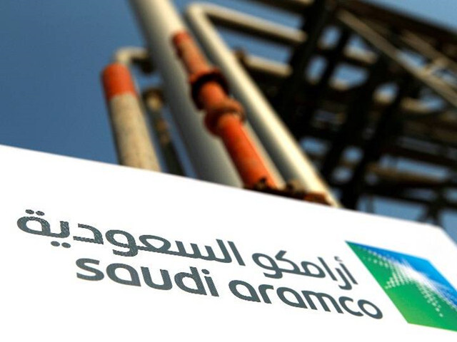

# 巴以冲突引爆全球油市，石油危机会否重演？沙特如何表态成焦点

从上周末开始升级的巴以冲突再次引发了全球风险资产波动，对中东局势恶化的担忧让原油期货价格拉升近5%。

回顾历史，中东战争多次成为全球能源危机的导火索，而这次已陷入三方协议传闻的沙特的立场成为外界关注焦点。

原油经纪商PVMOil Associates高级市场分析师瓦尔加（Tamas
Varga）在接受第一财经记者采访时表示，巴以两国对全球原油供应本身的影响几乎可以忽略不计，“但如果考虑近五十年来中东战争对油价的影响，如果形势进一步升级并持续更长时间，产油国介入后往往会引发石油危机风险。”

**中东战争与石油危机**

当前，国际能源市场正在经历转型期，首先来自于美洲和非洲的新兴国家正在进入供应版图，其次原油价格不再低位运行，波动持续加剧，地缘政治与冲突的影响力越来越大。此外，美国对全球运输航道及管线的控制力有所下降。

哈佛大学贝尔弗科学和国际事务中心的报告指出， **石油日益成为地区冲突和国内政局动荡的主因，1973年以来，接近一半的区域战争与石油有关。**
与石油相关的冲突可以分为很多种，包括对运输航道和管道的竞争、破坏石油设施和盗卖能源筹资的恐怖主义、石油侵略和资源战争等，这些都是国际冲突的潜在根源。

随着探明储量不断增加，中东地区逐渐成为了世界原油工业的中心。在以阿拉伯国家为主体的石油输出国组织（OPEC）成立后，近50年来三次能源危机与其密切相关。

1973年10月第四次中东战争爆发，阿拉伯国家第一次祭出石油武器。为打击以色列及其支持者，同时表达对国际油气巨头人为压低油价的不满，OPEC中的阿拉伯成员国宣布对西方国家实施减产提价的措施，国际市场上原油价格从1973年初2.95美元涨到11.65美元。

这一度造成了第二次世界大战之后最严重的全球经济危机，所有工业化国家的生产力增长都明显放缓，1974年美国、英国和日本甚至出现了经济负增长。而发动石油战争的阿拉伯国家却因此增强了经济实力，仅提价一项，就使阿拉伯国家的石油收入由1973年的300亿美元猛增到1974年的1100亿美元。

1978年底，当时世界第二大石油出口国伊朗的政局发生剧烈变化，国王巴列维下台，伊朗一度停止输出石油60天，引发第二次石油危机。随后两伊战争爆发，两大产油国停产令全球石油供应一下子出现高达600万桶/日的缺口，占世界总消费量的10%。油价由1979年初的每桶13美元暴涨至1980年的34美元，并持续超过半年，成为上世纪70年代末西方经济再次全面衰退的一个主要原因。美国的经济增速也在此期间下滑3%。OPEC对世界石油市场的影响力达到巅峰。

1990年8月，海湾战争爆发，点燃第三次石油危机。时任美国总统老布什表示，海湾石油是美国的“国家利益”。伊拉克原油供应中断令国际油价3个月内从每桶14美元升至42美元的高点，美国、英国经济陷入困境，全球经济增速在1991年跌破2%。国际能源署（IEA）随后启动了紧急计划，每天将250万桶的储备原油投放市场，以沙特阿拉伯为首的OPEC产油国迅速增加产量，才稳定了油价。

**这一次沙特会调整策略吗？**

作为地区大国和OPEC领导者， **沙特被认为很可能成为这次油价走势的关键决定者。**

当前，美国总统拜登面临连任挑战，美国正与沙特、以色列谋求三方协议，协议谈判的核心是沙特与以色列关系的正常化，以换取美国的武器销售、安全保障和帮助建设民用核设施的支持。沙特方面同意，如果油价继续高企，愿意在明年初提高产量平衡市场供应。

根据新华社消息，当地时间9月10日，美国国家安全委员会中东和北非事务协调员布雷特·麦格克、负责近东事务的助理国务卿芭芭拉·利夫访问沙特阿拉伯，为推动以色列与沙特达成协议展开进一步斡旋。

值得一提的是，就在冲突爆发前，沙特王储穆罕默德·本·萨勒曼（Mohammed bin
Salman）曾表示，沙特和以色列关系即将迎来突破。沙特自1948年建国以来一直不承认以色列合法地位。此外，两名白宫高级官员上月底飞往沙特，他们强调油价上涨将使协议前景蒙上阴影，因为白宫需要国会的支持才能促成协议。

在本月初的会议上，产油国组织（OPEC+）维持现有减产计划不变。沙特表示，将自愿减产100万桶/日延长至2023年底，俄罗斯也宣布将在12月底之前保持30万桶/日的额外出口限制。不过涉及美以沙的三方协议传闻让减产到期后的产能路径充满不确定性。比如，沙特谈判代表强调，市场状况将指导任何生产行动，这些讨论并不代表一项长期的降价协议。

近一周来，对需求的担忧等因素已经导致了全球油价自年内高位回落近9%，而维持油价在高位对产油国财政非常关键。本月初，沙特财政部预算报告显示，预计今年实际国内生产总值
( GDP ) 将仅增长0.03%，而此前在年初财政预算报告中的预测为今年增长3.1%， 并预计今年将出现预算赤字。

瓦尔加向第一财经表示，近期油价下跌一定程度上是市场消化了沙特俄罗斯额外减产的影响，与此同时，全球央行在货币政策上的谨慎立场也给需求端造成了冲击。他提醒道，
**沙特是具有影响全球供应和市场价格的超级能源大国，因此其立场对于未来油价走势非常关键。**

对于沙特而言，根据测算该国需要每桶近100美元的原油价格才能满足政府支出以及2030愿景计划。如今沙特正积极扩大转型投资，从被称为Neom的未来主义城市，到为申办世界杯造势。该国顶级足球联赛在夏季转会窗口一掷千金引进多位巨星，受到广泛关注。

瓦尔加认为，沙特在去年开始的OPEC+减产谈判过程中起到了决定性作用，其与俄罗斯的合作是油价回到80美元上方的保障。“在全球经济前景面临挑战的情况下，如果沙特计划增产，如何协调各产油国利益，避免竞争性增产破坏供需平衡将是不得不面对的新难题。”他说道。

