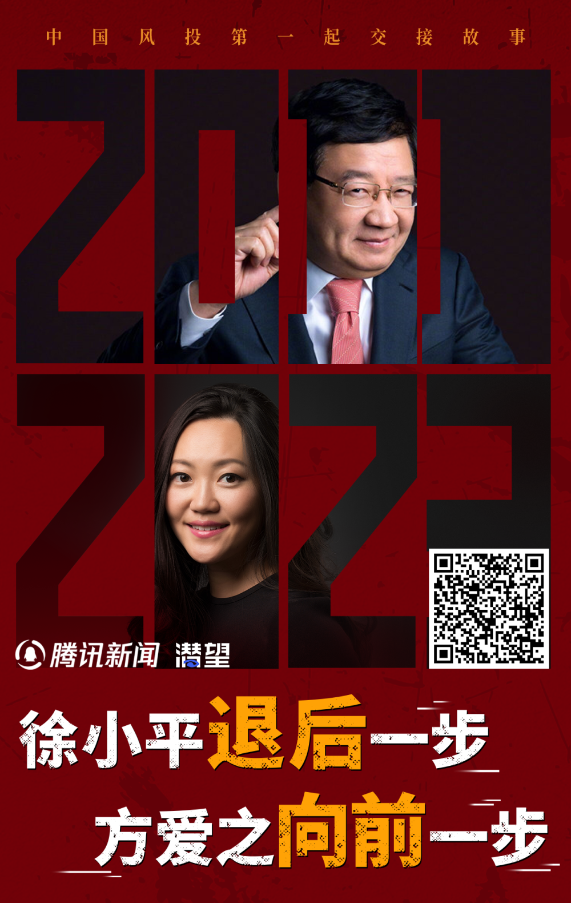

# 徐小平退后一步，方爱之向前一步：中国风投第一起交接故事

中国风投业接班的开端。

作者：张小珺

出品：腾讯新闻《潜望》

徐小平很少走进位于国贸写字楼25层的真格基金新总部。

这位67岁的中国天使投资人，亲身参与了办公室图纸设计。真格在过去12年已迁居三次，直到这次，他们决定择一地长久定居下去。徐小平特意启用了为自己家装修的设计师。

作为曾经的音乐教师，徐乐于展现与众不同的审美。总部距他在北京银泰的居所仅一条马路之隔。这是由弧形玻璃幕墙和大胆色块组成的时尚空间。在建筑大师高迪“直线属于人类，曲线属于上帝”熏染下，整间屋子几乎找不到直线。15个椭圆会议室，每个独揽一种夸张的明亮色调——红色、玫红色或紫色。他们将all-
hands meeting（全员会），设在进门左手边的大红会议室，并搭配了歌剧院的环形座椅。

2021年，基金60人搬入花大手笔装帧的办公地。只有灵魂设计师徐小平，刻意减少了到达次数。

徐小平精心策划的不只有新总部，他也筹备了进一步放权计划。这家由徐小平和王强2011年创立、迄今管理7期基金、AUM（管理规模）超120亿元人民币的天使投资机构，在运转12个年头后，悄无声息地更迭了一线决策人。

徐不仅在管理上退居幕后，也主动降低了利益分配。2021年底，真格完成第7期美元募资，为激励年轻团队，徐小平大幅减少自己在该期基金收益分成。“其实他提出想减到零，”真格创始合伙人方爱之说，“我说你不能减到零，我也需要你。在一些重要决策上，我肯定需要他给我一些指导。”她和管理合伙人戴雨森，目前是投资实际决策人；徐小平和王强将更多精力花在宏观战略、项目退出决策和团队搭建上。

这或许是中国风投史上第一起交接案。VC入华20余年，一线基金尚无接班先例，大多创始人即掌舵人，以60后-70后为主，刚刚年过半百，对投资人仍是当打之年。徐小平算年纪较长的，生于1956年，这让真格更早要面临掌门人老去、遴选二代接班人的问题。而基金接班特殊性在于，风投业尤以个人英雄主义论，继任者如何成为又一领军人、又一面旗帜是关键。

透过真格，也可以看到中国式交接有别于“business is business”（生意就是生意）的西方商业叙事，它还是有关信任、忠诚和门派传承的东方故事。

年轻团队不免承压。“这肯定是所谓的‘big shoes to fill’（有大鞋子要填）。”两位合伙人说道。

一、薛定谔的星期二

从许多层面看，真格是一家有特殊气质的基金。两位创始人是老师出身，参与创立了承载一代中国青年出国留学甚至人生梦想的新东方。他们不但是英语老师，还是人生导师，有着改写年轻人命运的无穷热情；更微妙的身份是，两人皆为新东方联合创始人。千万不要小瞧其中差异——当好联合创始人前提是，“不是一把手的性格”，“不能天天想当一把手”，也就没了“一把手的问题”。

种种迹象指向，两个有梦想感应体质、缺乏权力饥渴欲的人，塑造了一家有某种“反资本”、“反中心权力”特质的基金——这种文化，最终体现在接班上。

那还是2016年夏天，王强等人筹备了一场欧洲游历之旅，为徐小平步入60岁祝寿。同年，方爱之第一次听他提及疲惫。

此时，真格成立刚满5年，正在投第4期。在“双创”政策下，创业者数量成倍翻多、各基金迈出激进脚步，使本就是体力活的天使投资更兵荒马乱了。年逾花甲的徐小平，从早上10点开始排满会议，1小时1个，除午间小憩每天出席6到10个会。加之越到夜晚越兴奋的毛病，他日日开会到凌晨两点——就在这时，徐小平对方爱之提出，希望她独立判断一点。“如果觉得还行，不用再让他见了。”

年轻投资人们没觉察异样。逐渐地，徐在每星期二举行的投资委员会上请假，理由是“昨晚没睡好”，而且频率越来越高。投委会堪称投资机构最重要业务会，能左右基金走向。这只是他保持距离的开端。

时间来到2018年，真格投第5期，徐小平参与投委会的频次降至一半——真格合伙人刘元将此称为“薛定谔的出现”——“他有一半不来，你也不知道他是今天来，还是不来。我们会跟创始人说，你有可能今天会见到徐老师，有可能见不到。”这也是铺垫。1年后，2019年徐不仅不参与投委会，找他二次确认的项目也少之又少。

事实上，一场平静的接班在内部进行着。它的过程相当漫长，超过5年，而且暗藏在含蓄隐晦的东方表达里。

真格崇尚家文化。由于创始人的老师身份，内部人称徐小平和王强为“徐老师”和“王老师”，或统称“叔叔们”。作为接班人的方爱之，从第一天就参与基金框架搭建，她和叔叔们的默契是，从不谈论金钱或升职。

“这些我就很尴尬。”她在真格的第一个职位是General
Manager（总管）。而后，一旦有高级别人士加盟，叔叔会主动给她升职。拿2014年来说，基金新来CIO（首席投资官），叔叔立刻将她升为CEO（总经理）。“我甚至老跟他们说我不要这个CEO
title，怪怪的，哪个基金还有什么CEO title？但他们说listen to me（听我说）……”

她也从没听叔叔们严肃探讨过，何时退休、谁来接班、为什么是你这些话题。只是突然有天，两个人就漫不经心地说：“未来这个就是你的，你必须要……”。然后，它就这么发生了。

“从我加入真格起，徐老师、王老师都经常讲：再过两期，基金就是你们的，我们未来所有carry（绩效分成）都会退到最少。他们是老师心态。当然，我们都知道接班的是Anna（方爱之），”刘元见证了徐小平退后一步、方爱之向前一步的全程，他回忆道，“Anna会觉得徐老师是刻意地step
back（退后）。他可能很多话本来想在群里说，忍住了，单独私信Anna。”甚至在很早的时候，几个投资人就某个项目僵持不下，一起拿去找徐小平。徐突然来了一句：“那以后我退休了怎么办？我死了怎么办？”顿时会议室鸦雀无声。

2020年初，基金即将届满10年，徐小平和王强酝酿了一件大事。他们决定“在年轻团队拔出领军人”、“树立一面新旗帜”。两人惊喜地出现在方爱之家中，通知她，并决定两天后在颇富仪式感的场合宣布。

初冬的夜晚，真格正举行新年派对。员工被通知穿喜庆红衣装，到四季酒店一旁的酒吧餐厅。真格喜欢一种没有等级观念、其乐融融的氛围，一群人吃吃喝喝、玩狼人杀。四下欢快中，徐小平宣布，晋升方爱之为“创始合伙人”。

对基金来说，创始合伙人相比管理合伙人多了一层创始人荣耀，大部分情况只有创办人自己独自享用。在内部看，方爱之的加授仪式是真格完成交接的一幕。

方爱之眼眶含着泪水，上台发表了一场感性的演说。“我很感恩。”她后来说。

台下，60双眼睛看向她，没流露太多惊讶。一位在场投资人谈到，那年，方爱之凭借投中小红书和完美日记，一时间在消费投资领域人气达到顶峰。虽然她是徐小平第一个投资学徒、也是真格CEO，但直到这两个项目才证明了她作为天使投资人的才华。徐小平借机急流勇退，把方爱之推了上去。（那年底，完美日记母公司逸仙电商登陆纽交所，市值最高超140亿美元；不过日后这家国货美妆公司市值一蹶不振，如今仅为5.33亿美元。）

派对后，一场挑动全球神经的黑天鹅降临，却意外助推了真格交接进程。徐小平春节休假，新冠爆发，他索性进一步放权。方爱之毫无间隙地成为一号位，独立掌管基金运作。上述投资人觉得，这给权力过渡留出了空间。

徐最后唯一参加的内部会，是星期一少数人列席的策略会，2020年他每周接入。不过1年后，他又开始重复“薛定谔的老把戏”——请假越来越多。在方爱之看来，“他一直漫长地在退出这些角色”。

继方爱之独立掌权1年后，2021年戴雨森擢升管理合伙人，和方爱之搭班管理基金。同年，刘元和尹乐晋升合伙人。

戴雨森曾是聚美优品联合创始人，这加重了该机构“联合创始人”的色彩——两代创始/管理合伙人，3/4曾任联创，这类人相比一把手往往个性谦和，长于辅佐，不那么迷恋权力。和徐小平、王强一样，戴雨森也挥洒青春在创业路上，对CEO有过期待也有过失望，挥手作别公司时，不禁感伤落泪。他和两位老师有惺惺相惜之感。

这种“联创”特质，也从一定程度解释了，在面对大多数组织敏感甚至暗流涌动的接班事宜上，该机构呈现出“让”的文化。

说到“接班”，戴雨森流露一丝顾虑，“就好像是有一个权杖给了你”。但他转念一想说：“不得不说，确实，真格应该是（中国）一线基金里唯一完成这样一件事情的基金。”

他用“这样一件事情”委婉回避了“接班”，一部分是出于对门派创立者的尊敬。另一部分怀疑则来自于，虽然徐小平主动让贤、淡出经营细节；但他留下的投资哲学、影响力和文化的味道依然强大，他的人生态度和充满智慧的话语，仍然为他的门徒们所回味。

二、哈哈哈哈哈和书虫

真格的故事始于两个叔叔。随着2006年新东方赴纽交所上市，“三驾马车”一举成为中国大地上最富有的三位老师。然而，徐小平说：“人生就结束在上市那一刹那。”

他和王强退居二线，天天相约国贸一家咖啡厅，晚上再找个小酒馆，痛苦地思考人生的下一个方向。

这种状况持续到2011年10月，两人决心二次创业。此前，他们只是偶发地资助年轻人创业。这时中国风投正加速爆发，但聚焦第一笔钱的天使投资还局限于个体行为，通常是“大佬带助理”模式。他们决定告别单打独斗，联手机构化。比赚钱更有诱惑的是，延续新东方时代“支持年轻人人生和梦想的激情”。两个月后，由英语老师、人生咨询师创立的天使投资机构诞生了。

徐小平和王强代表着两种截然相反的人格。徐小平是一个热情张扬的感性派，他是江苏泰州人，周围人对他的第一印象是“他的哈哈哈哈哈爽朗大笑”，“每次见面都要亲切地握手”，以及这个电视机里的偶像人物竟然会说TMD。

他活力四射、敏锐幽默、爱玩还很drama（戏剧性）——曾和创业者启动“枕头大战”；他是音乐、美食和美酒爱好者，最爱吃大董烤鸭。不过，他也容易受周遭环境干扰，被同理心或恐惧感驱使。那时，江湖上充斥一种对他投资风格的总结：谁能拿投资，取决于谁能把徐小平讲哭。

王强恰好相反。他是原则的原教旨主义者——从新东方时期，他就能为了原则随时“引发身体的炸弹”，要是有人胆敢破坏共同达成的行为方式，他会带头和对方“决一死战”。当年主持纪委工作，听说有人给俞敏洪送螃蟹，他“半夜会在老俞家外边等着”；任总裁期间，他这个总裁是“总裁人”。他说，在电影《中国合伙人》里，从个性上，他更像邓超饰演的刚烈角色，徐小平更接近粘合剂佟大为。“烈马怎么会调和呢？”这个内蒙古汉子说。

和徐小平追求华丽色泽的人生观不同，王强更学究也更崇尚极简。他是爱书人士和古书收藏家，口头禅是康德。他喜欢在过年的悠长假日，陪父母看一晚春晚，其余时间钻进书房，靠饼干和番茄度日。作为“三无人员”（没司机、没保姆、没车），很早以前，他就把车连带着北京车牌送给一个摇不到号的创业者，自己改坐地铁出行。他说：“不是追求无碳，而是在地铁上能看书。”

徐小平更入世、活泼；王强更内敛、严肃。这点从写的书也能窥见一二——王强的书叫《書蟲牛津消夏記》，不仅是精装本，书名还用了繁体；而徐小平的书叫《黄金是怎样炼成的》。

基金取名过程，展现了两种个性的人如何共处。一开始，徐灵感乍现。他欣赏英文单词Integrity的内涵，直译是诚信、表里如一，遂翻译成“真格”。

徐将想法告诉老搭档，昔日的英语教师立即展开咬文嚼字的遐想和论证：他想到朱熹的“格物致知”，“格”是研究；接着，他又联想到汉语中有“人格”、“神格”，“格”是一种标准和普遍性，真格意味“真的普遍性”。“非常绝妙，”王强热烈地称颂，他反复咀嚼道，“把‘真’放在‘格’的状态下，很大气。”

王强说，围绕取名，他们追问了一系列基金必然性和哲学根基的问题，就此打下未来10年的文化基因。两人分工是，徐小平主导所有投资，王强参与文化、组织和方向建设。另两个此时他们便确立的方针是：

希望能做世界上最大的小基金（小指管理规模、专注天使轮）；一个能传承下去的遗产，而不是彰显个人英雄主义的机构。

“我老说，你们不要以为在为我和徐小平工作，这个基金迟早是你们的，”王强说，“恐怕没有第二个基金会这么说。”

三、中国式门徒

在弥漫着私利、强人色彩，雄性激素分泌旺盛的金融行当，徐小平流露的感性一面无数次令人费解。即便他最忠诚的学徒，也经历了从犹豫、困惑到同化的一连串心路。

方爱之是徐小平的第一个徒弟，虽然两人初次见面没有擦出火花。

2011年，29岁的方爱之在北京香格里拉见到徐小平。她刚历经两段职业洗礼——摩根大通和通用电气——是个彻头彻尾的理性派。那天，方爱之身穿干练的白色套装、手拿笔记本电脑，听完徐颇具艺术家风格的演说后，面露不解地问：“你是在做公益吗？”

“当然不是！“徐小平忿忿道。

走出酒店，方的唯一想法是：“我不能跟他一起工作。”

“我当时有点不悦，”徐小平说，“她低着头打字，不听我说话，我希望有眼神交流。”但他留意到，方爱之把他说的话整理成了文档。

那时徐小平和王强亟需一个大管家，经人介绍结识了方爱之。首次会面无果，方爱之飞了趟香港，会见作为发起方和LP（出资人）的红杉中国创始及执行合伙人沈南鹏。这次在香港的香格里拉，沈南鹏轻而易举就用两点逻辑，说服了投行做派的方爱之——为什么要做天使？“因为现在市场越来越贵，要往前走。”为什么选徐小平？“因为他有流量，创业者喜欢他。”

“我当时梦想是想当Sheryl
Sandberg（Meta前COO桑德伯格）。我想通过VC找到下一个Uber，然后去当个COO什么的。”她说，但没想到，“第一天就觉得太好玩了”，“后来爱上这份工作”。

刚入职，方爱之一边跟着徐小平学投资，一边埋进注册银行卡、找办公室、定餐厅和酒店的全能管家式的琐碎中。

理性派和感性派之间不乏冲突地带。方爱之习惯早起跑步的规律生活，徐小平相反。“我得调整一下。”方爱之说。她老公埋怨道：“不能让他（徐小平）调整吗？早上工作是正常的啊。”

方爱之还要全权负责回创业者邮件，每天几十封商业计划书（BP）进来，徐小平要求个性化回复。“我就不同意，太浪费时间了。”但徐坚持，既然对方花时间写信，真格最起码要给出一个建议。他要求将邮箱名改成“梦想中心”。

更大分歧在投资。方爱之认为优先判断市场格局理所应当，但徐小平从第一天就教导她，拿到BP要先“翻到团队介绍页看团队”。她对投人方法论将信将疑。直到两年后，她才从“逼着自己看一下团队”，到信服了这个方法。

方爱之是受到徐小平言传身教的第一位学徒：“当时跟着他，让他分析所有投资，为什么投这个？那个创始人什么样？我一般评价比较负面，但是听他为什么Yes。”徐小平很喜欢说的一句话是，“投其一点，不计其余”（发现一个人的长板投资，不计较其他缺点）。

头一两年，也许是对徒弟的成绩不满意，徐小平单独约她吃了一顿早餐。师傅的交流风格是“一般不说现在有一个目的，他是跟你聊，再聊出他想说出的事情”。谈话重心最终落脚到，方爱之找项目方向不明确。徐快速诊断并开出药方：S策略——缩小搜索范围，专门覆盖斯坦福大学的创业者。

10年前的中国，名校毕业生主流选择还是浮光掠影的投行，创业是小众选择。徐小平利用教师和演讲家的双重光芒，召唤年轻人创业。他给中国青年写信，例如《创业成功的七个途径》。他四处演讲，鼓动在美国的年轻人速速回国：“在美国是好山好水好郁闷，中国发展这么快，干嘛在美国待着？”

对内，他研制口诀：“不怕贵，只看倍。”

真格的早期团队只有三五人。除了方爱之，还有顾旻曼（现万物资本创始合伙人）和吴旦（现英雄游戏CEO），他们吸纳了创业精神，组建基金和公司。第四位学徒留了下来，是刘元。

这位娃娃脸、给人文艺青年印象的投资人，和徐小平的最大共性是，两人都酷爱写信。他从美国风投机构Greenspring
Associates开启职业生涯，不久陷入怀才不遇的困窘中。他寄希望Greenspring派他回国组建办公室，结果期望一脚踩了个空。用他的话说，他想觅一明君，报效终生。

25岁，他给沈南鹏写长篇邮件求职，以“自谓虎头须食肉，谁知猿臂不封侯”这样文邹邹的语言诉说得不到赏识的苦闷。

沈南鹏3分钟就回复了。投资界大亨没有一句废话地写道：““Sorry, we are not having one right now, but we’ll
follow up if there are any opportunities.”（抱歉，我们目前没有空缺，后续有机会再联络。）

见到徐小平是偶然。虽然Greenspring对中国市场态度冷淡，但刘元执意想从中国GP的口袋募资。他已经和拉手网的天使投资人取得密切联系。一通电话，他随口提了几句为什么母基金值得投，对方就利落地答应：“我们就投100万美金吧。”“我就震惊了，钱这么好拿？”刘元连忙追问，你身边还有这样出钱快的朋友吗？对方推荐了自己的银泰邻居徐小平。2013年，刘元到北京参加一个生日宴，徐小平是那晚主持人。

徐小平对母基金兴致勃勃，问了刘一大堆欧美、印度、以色列基金的问题，交谈甚欢。接着他话锋一转，让刘元到美国见个人。他神秘兮兮地说：“你会跟她聊得很好。”

那年圣诞节，刘元见到方爱之，后者力劝他回国加入真格。他举棋难定。

接下来，徐小平的这名爱将，对他展开连番的高密度出击。“我跟她说我还要想两周。Anna说，OK。过了两天她会说，你为什么需要两周，一周不行吗？我说行。但到了第三天她又问，你这一周要做什么呢？为什么一周后就会比今天想得更清楚？”这时，方爱之的老公给她支了一招攻心计：“你就说，你是想去Google
Ventures（谷歌风险投资部门）还是a16z（一家美国知名风险投资公司）？当然要去a16z。”

没有拜倒在威逼利诱下的刘元，却拜倒在一个微小瞬间——方爱之很节约，“节约到什么程度？她说不要打我的手机，话费很高，我们用Skype”。2014年，刘元回国面试互联网企业战投部，历经7轮角逐，本想着结束即刻返美。方爱之力邀他多呆1天，参加徐小平的活动。“我给你升舱。”她说。“我当时觉得对打电话还要用Skype的人，盛情难却。”第二天，刘元就看到怀孕挺着大肚子的方爱之，一大早赶到他落脚的酒店来接他。

前一晚，他刚谈好顶尖战投的offer。但这一刻，他动容了、妥协了。这名有士大夫情节的投资人，感觉“被三顾茅庐到”。去会场途中，他做出一个冲动决定：放弃更大的平台和更高的薪水加盟真格。（他后来是Momenta、Know
Yourself和新世相的投资人。）

因为一个钱包，合伙人尹乐（Emma）2014年作为实习生加入。她在斯坦福念研究生，真格一行人到学校演讲，尹乐是校方工作人员。会后，她发现有人落了钱包，开车送过去。正值暑假，她试探询问能不能到真格实习，徐小平喝着咖啡痛快地答应了。她在真格几乎没走弯路，继承了方爱之的S策略，覆盖斯坦福和硅谷创业者。（她后来是禾赛科技、AutoX、灵明光子、优艾智合、黑湖科技和兴盛优选的投资人。）

管理合伙人戴雨森2017年才加入。离开聚美时，他收到红杉和真格Venture Partner（投资合伙人）的邀请。Venture
Partner相当于顾问，和基金关系松散，戴雨森觉得有些隔靴搔痒。他理性分析了一番，决定全职，同时他判断，他的产业视角和在互联网老兵中积累的人脉网能与真格互补。此外，聚美给徐小平带来过丰厚回报，他们有不错的私交——徐小平是他婚礼证婚人。（戴原是产品经理，投资重心偏重产品型企业，是观夏、派对动物的投资人。）

他们都是在徐小平耳提面命下成长的初代学徒。很多人迈入投资界是白纸一张，有年轻投资人觉得，真格一定程度也是天使投资的一个教育系统。

徐小平和王强没有金融背景，他们挑选与自己有相似价值取向的年轻人同化。“天使投资在金融里是一个另类存在，我们一起做是需要情怀的，”戴雨森说，“在金融里赚钱，做PE、二级可能能赚更多。”——徐小平称，他的投资哲学是：信则灵。

刘元转换成了坚定信徒。在2015年如火如荼的创业大会上，刘元跟在徐小平身边充当保镖。创业者良莠不齐。一位看上去有些偏执的人，拿着商业计划书嚷嚷着要见徐老师。刘元拦下了他。

等徐小平走进卫生间，这名创业者尾随，把BP从格子间门底下递进去。刘元听见动静，愤怒极了，立马冲进去把这个没礼貌的家伙拽了出来。徐小平在里面一边拉肚子，一边喊：“别吼他，别吼他。”然后，他提着裤子慌忙跑了出来，接过BP连连说：“我收到了，我收到了，这个我们随后会看。”对方心满意足，仰着脖子对刘元道：“看到没有？徐老师说他会看！”

后来因为这件事，徐小平再三批评刘元：“你从海外回来，是百里挑一的人。我们每天的工作是从千里挑一的人里找万里挑一的人。但过程中你会遇到很多十里挑一的人，甚至是不好的那个一。你要想一想，他人生可能跟真格只有一次见面机会。你不能把他的梦想在他面前撕碎。对你来说，他是马上忘记的一个人；对他来说，会是一辈子的心理创伤。”

最后徐说：“你要记住一件事，对自己没坏处，对别人有好处的事情，能多做尽量多做。”

触动门徒的细节还有很多：有人发邮件自称父亲杀人进了监狱，人生已至绝境，若徐小平不见他，他就自杀——徐小平见了；有人蹲在真格门口声称融资摆地摊，前台考虑是不是该报警？——徐小平见了；听说有真格投资人见创业者只花了15分钟就让对方离开——徐小平大为光火。

徐小平说，投资人绝大部分时候要拒绝人，怎样让一个人被拒绝还开开心心地走？要给予真诚建议。他又说，倘若一个人成功了，不管天使轮估值是多少都会想：怎么这么便宜？这是天使的悖论。他提出放弃优先清算权、尽可能不激烈砍价、最大程度简化条款（一页纸核心条款TS+两页纸增资协议SPA）的现实主张。他还说，他一辈子都想做学生和年轻人的工作。

这些最终成了真格第一代门徒心中的闪光片段。“这都是他作为一个音乐家，而不是资本家的创意，”偏感性的刘元说道，“我们的基因、我们的文化，就是被这样的故事所定义的。”耳濡目染下，他见完创业者，会起身将对方送至电梯口。他也反复告诫着更年轻的同事——那些没机会跟在徐小平身边的二代甚至三代门徒们——要有同理心，对别人有好处的事要多做。

方爱之至今记得，当徐小平遇到一名快递员，还没等对方开口，他就忍不住叮咛道：“UPS（美国联合包裹运送服务公司）的创始人就是从送快递开始的，你也可以。”

“Oh my god，”站在一旁的方爱之想，“他见到每个人都会有这种爱。”

四、人的理论

不过，徐小平的感性有多极致，他的欲望和隐藏在欲望背后的恐惧之谷就有多深。

2018年7月的一天，方爱之在跑步机上锻炼，第二天她准备到意大利休假。所有行程都安排妥当。忽然，电视出现拼多多在纳斯达克上市的画面。这家仅花了3年多就IPO，而后成长为中国第二大电商平台的公司，真格没能投资其中。突如其来的消息毁了她的全部心情。“我感觉我要被
fire（解雇）了，”方爱之说，“我知道，这种错过是徐老师很难接受的。”她临时取消了出游，焦灼地不停拿起手机，确认徐小平有没有找她。

结果没有。“他越不找我我就越慌。”

最后是王强先在群里开了口，他平静地说：“这个是不是有问题？”

天使阶段，公司最重要也最难改变的资产只有一个：人。真格是众多投资机构中，最着力研究人和判断人的机构之一。拼多多的错过给他们敲了警钟。

过去真格从留学生中网罗创业人才，这是徐小平和王强从新东方的顺延，也是在科技爆发早期和copy to
China（复制到中国）时代下的选择。但随着中美模式分野、创业走向深水区，连续创业者显露本土优势。黄峥就是典型。拼多多可以说是分水岭，但到这时，这类人还没触发真格的雷达系统。对创业人群的钝感是难以原谅的。

徐小平也在独自消化情绪。不久，他们组织了紧急会议。徐把责任揽到自己身上，他自我批评道，他把太多时间花在白手起家的人，全然没意识应该多和成功过的创业者打交道。方爱之连忙抢过来说：“不，徐老师，是我的问题，是我们的问题。”与会人员心情沉重。

只有近距离环绕左右的人，才能一窥徐小平的内心有多焦灼。“他特别焦虑。Anna都不敢住在银泰，你知道吗？”一位真格投资人说，“Anna觉得住在国贸的话，半夜总被徐老师叫过去。我也半夜总被叫过去，经常十二点、一点。一起喝点酒、聊一聊。聊的主题永远是焦虑。”

反复探讨的话题总是那些。“我们是不是落后了？我们现在是不是有很大问题？创始人上真格的IC（投委会）会不会感觉不舒服？我们是不是开始做太多对事情的讨论，而丧失了看人这个原点？我们是不是应该往后走一点？估值贵的项目我们不投，会不会是我们致命的问题？——他晚上总是会焦虑。”

真格的投资哲学和其他绝大多数基金不兼容。可以将他们视作“盯人战术”、“人的投资组合”。一般而言，基金秉持从赛道出发，布局行业。真格不，它以创业人群分。举个例子，小红书若在其他基金，大概率是消费组项目；但在真格，它是萌生于斯坦福的项目，而覆盖该群体的人是方爱之。这是迥然相异的两种底层逻辑：别的基金是赛道-
负责该赛道的投资人-项目，自上而下贯彻基金意志；真格是投资人-覆盖某类人群-项目，更自下而上。

你可以把真格想象成一个平台，上面有十几位投资人，他们分别有自己的搜寻方向。这个方向不一定非得是AI或新能源赛道，而可以是从清华/北大出来的创业者、从互联网企业走出的创业者，甚至黑客群体。十几个人，他们好比徐小平的翻版和复制，每个人管理自己的数个到数百个项目，合计是真格的项目。事情和人是天平两端，他们的重心压在人上。所以，对人的直觉、审美和标准必须走出徐小平一个人的大脑，贯穿进每个投资人脑袋里。

为了将人的理论变得可延续，徐小平总结过不少方法论。这是真格1.0阶段，他提出3L理论：创始人要有三个力（学习力、工作力、影响力）。

他还进一步针对团队提出了3C：Chemistry（化学反应）、Complementary（互补）、Compromise（妥协）。这点说起来有些私人。新东方是三人创立，他青睐类似配置——一个人太孤独、两个人容易闹矛盾、三个人才是铁三角。Chemistry是说创始人间有渊源，新东方三驾马车来自北大；Complementary指性格和能力互补；最后是Compromise，一把手要明确，二、三把手股份激励要充分。但他逐渐意识到，3C不适用一些后来的强人领导，比如连续创业者黄峥、唐彬森都是Single
Founder（单一创始人）。

随着时代演进、创业人群迁移，人的理论也需要更迭。徐小平和王强在留学生群体中的优势，变得局限甚至失灵。在他们过往的眼光判断下，真格很多项目偏海外名校背景，而遗漏了在本土摸爬滚打起来的一批创业者，如TMD（字节、美团、滴滴）、蔚小理（蔚来、小鹏、理想）。戴雨森来到真格的任务之一，就是升级人的理论。

作为从斯坦福肄业、27岁就站在纽交所敲钟的互联网一代创业者，他自带一根严苛标尺。他用社会科学的方法尽可能把创业人群囊括并将其类别化，提出四象限：小天才（年轻创业者）、老司机（连续创业者）、操盘手（大企业高管）、科学家。这标记真格2.0。

过去，真格投资相对成功的是小天才，对老司机有过最痛苦的错失和遗憾，而操盘手暗藏了最多坑。

四象限理论给了项目源一个框架，但针对单个项目要做具体论证。作为人的研究机构，他们的投资人无时无刻都在观察人、评论人、总结人。他们的决策有难以捉摸的一面。拿每星期二的投委会来说，真格的上会过程仿佛是一群人反复在“摇”那个创始人，疯狂地竭力地逼问：你到底够不够强？够不够top（顶尖）？而另一方面，他们也试图将最不可量化的人量化。以下是访谈要点。

1.关于小天才：当描述一个人的才能，不用年龄作为限定值，他就是天才。以莫扎特举例，他16岁在宫廷乐队担任首席乐师，不是因为他16岁，而是因为他是同时代最好的乐手。

相对而言，小天才创业者适合技术创新阶段，当行业进入中后期，老司机和操盘手就来卷了。

2.关于操盘手：把操盘手简单理解成高管是错误。在系统性找高管类创业者的早期，他们踩过不少坑，基于错误总结了“大闸蟹理论”——要警惕“阳澄湖大闸蟹”——这类人title光鲜、年薪夸张、追随者众，但没有独当一面做过业务，就好像“一个大闸蟹在阳澄湖里涮了一下，阳澄湖本身和他没关系”。后来，他们格外注重调查功绩归功于谁，是平台、老板还是这位高管。

操盘手更能准确描述他们想找的人。判断是不是操盘手的核心指标是，做过关键决策。关键决策又可以细分成：带业务从0到1、从1到100、从差到好。典型案例有沈鹏创立水滴（曾在美团做创新业务）、汪莹创立悦刻（曾担任Uber中国区域总经理）。

3.两个对大企业高层人士的微妙观察。

1）公司真正做关键决策的人未必是title最高的。最受老板重视的人，往往是老板的最佳执行者，他所负责的也许是公司核心产品，但这是老板意志的体现。他真正擅长的是执行和协调。操盘手可能生长在大体系边缘地带，如微信之于腾讯。

2）高管也分职业经理人型和企业家型。对同一件事做解读，前者倾向描述内部资源和人力调配，常见话术是：这是谁的人、谁动了我的人、这是谁负责的事、我有什么资源、我得到了什么；后者倾向从用户、产品和竞争角度。

4.关于老司机：是四象限中真格有最多遗憾的群体，拼多多、蔚小理、叮咚买菜等全归属这类。他们愈发相信，创业是一种性格，创业者是一种different
animal（不同性质的人）。

以前偏爱履历光鲜的人，现在他们变了。相比跳槽众多的职业经理人，连续创业者更加分，因为“在高管里找创业者，有一点缘木求鱼的味道，相当于在风险规避者里去找冒险者”。所以，亮眼履历从优势变成有待澄清的事实：为什么你之前没创业？当然要综合行业特性，如企业服务领域高管的优势更大。

怎么判断是连续创业者还是连续失败者？要看是不是有一帮优秀的人一直跟着他干？是不是不断进步，犯的错误越来越高级？（比如张一鸣从创立九九房到今日头条，经历了跨越。）

5.关于科学家：适用硬科技领域，判断科学家的标准是——“我们寻找的是姚明。”

一项量化研究破除了他们的一个偏见。拉出所有教授创业成功的案例，划分为：教授自己当CEO，教授只是挂名、学生任CEO的多种情形。他们意外发现，最成功的公司是教授没全职而学生全职（如大疆）。这破除了他们此前认定，一定要教授全职才能投的观点，放松了标准。

6.两个量化研究：他们拉出640多家独角兽创始人履历，细化到籍贯、学校、专业、多少岁开始创业、创业以前是否有过创业经历、合伙人占股等。从分布看，沿海地区创业者偏多、东北籍偏少，学理科的比学文科的多，互联网创业者开始创业的黄金年龄是26-28岁左右，但若把过去20年A股上市公司囊括进来，这个数字变成35岁左右。

人才分布在时空上是不均匀的：从Google出来的创业者多，从斯坦福出来的创业者多，从一些超级中学（成都七中、北京四中、人大附中）出来的创业者多，华清嘉园是移动互联网时代的重要据点，网易三个总编辑（唐岩、李学凌、李甬）都创业成功，而他们都干了同一个职位。因此，应该尽可能预测下一个人才聚集密度高的地方。接下来，清华也许会是越来越重要的时空交织点。

7.四条感性看法：

1）思辨什么是聪明？口才好、说话快不一定是聪明，自信不一定是聪明，知识不对称不一定是聪明；成长速度快是聪明，看得深、看得远是聪明（如马斯克、王兴）。

2）要投我想为他工作的人，不投他给我工作我觉得挺好的人。

3）投天使就像开盲盒。遵循贝叶斯理论，年轻有成就，往后有成就的概率更高。尖刻一点说，“有的人40岁还不牛，盲盒都晒干了”。

4）创业者西装革履是危险信号，证明活在规则中。

8\.
在VC开始投年纪更大创业者的环境下，他们做出一个反主流选择。“我们天然偏向于更一无所有、从零到一、白手起家的人。”同时，在创业方向选择上，要和国家大方向一致。

人的理论也可反观内部。在真格，王强扮演了徐小平冷静的反面。徐小平情绪充沛，但容易因为害怕错过机会被焦虑裹挟；当风格出现漂移，王强是在务虚会上把他拉回投人、投天使纪律的人。

真格从第3期开始引入除了红杉以外的外部LP，LP劝说他们扩大基金管理规模，徐小平心动了，王强却反对——他认为扩大规模有悖追逐惊人回报；当投成长期的VC往天使延伸甚至做全产业覆盖，徐小平思考要不要反向为之，王强依然反对——他认为实现全覆盖是幻觉，财大气粗的VC向前撒钱，每一笔都是小钱，容易掉以轻心自己不断接盘，最终覆水难收，而真格也会丢掉投人根基；还有段时间，投资机构涌起上市潮和众筹潮，徐小平觉得可以试试，王强还是反对。王强说，他们的合伙关系就像一个人准备跳悬崖，另一个人在他身上绑了一根绳子，勒住。

如今，真格两个创始人在接班人身上找到了映射。方爱之更感性和直觉驱动，在意建立和人之间的亲密感。在真格，“Anna曾经知道所有人的八卦”，一度热衷给创始人、同事介绍对象。内部称她Zhen
Mom（真妈）。

一位真格的二代门徒说，他对方爱之跻身和创始人平起平坐不感到惊奇，一方面她是投资风格最接近徐小平的——在真格共投中的42个独角兽中，9个来自徐小平、9个来自方爱之；另一方面她从第一天就在，对不少同事有知遇之恩。“从我开始学习天使投资，我看到的就是Anna投20个点在完美日记。”而王强说，就努力程度，基金内没有第二个人能与方爱之比肩。

方爱之投资过一系列斯坦福项目（诸如小红书、Advance.ai、简单心理）。她的特点是会反复下注一个人——在回报倍数最多的10个项目里，超过一半是投资后创始人先失败了一两次，经过痛苦转型才重见曙光。小红书、美国短视频公司Firework和跨境电商公司Wholee，都是方爱之10年前投的。2022、2023年，方爱之在福布斯全球最佳创投人榜单（The
Midas List）分别位列12和28。

方爱之现年41岁，在徐小平的同化下比过去柔软。她说，徐小平对她而言更像是“第二个父亲”——“这可能就是我跟徐老师的关系。投资我不再需要给他看。但我这周跟他电话，我会说刚见了三个清华年轻创业者，我挺激动的，这是中国的未来，你肯定会喜欢他们。”

戴雨森希望自己像王强多一点。他自称“二把手性格的人”，人生偶像是巴菲特的黄金搭档芒格，也欣赏王兴的搭档王慧文（在王慧文决心入局大模型创业时，戴雨森第一时间决定投他）。“我喜欢扮演军师和大将的角色。”戴雨森说。他爱好数码和军事。相比方爱之，他更内向，更爱独处，也更具原则性。他会在方爱之害怕错过的时候说：“Anna，这个事情你可以相信我，是不会错过的。”但由于过于理性，他不太容易受创业者感染。

和王强一样，戴也热爱读书。在爸爸的要求下，他幼儿园就开始读大学教材，现在每年读150本书。只是他和王强的阅读品味不太一致——王慧文调侃戴雨森说：“你是行走的中信书店。”

五、Big shoes to fill

Big shoes to fill——有大鞋子要填，是句俚语。年轻团队用它来形容今日之状态，前人留下的遗产丰厚，后面的路任重道远。

在戴雨森眼里，2019年是真格从个人天使到机构化里程碑式的节点。基金运作不再依赖徐小平这个人——他甚至不必躬亲。戴雨森说：“你说接班，还不如叫我们毕业。”

他们搭建了一套有强烈真格味道的运行机制。

首先，这是平台制的机构，不是合伙人制。他们要求全员找项目。不论是合伙人还是投资人、分析师，每人每月提交案源猎表，确保合伙人和分析师一样在找项目、推项目、同台竞争。所以，年轻人不为合伙人服务，项目的credit（荣誉）也不计入合伙人名下。即使合伙人自己招揽年轻人，亲力亲为教导，日后这名年轻人的项目也归属自己。每个项目泾渭分明，只有唯一的主人。合伙人不能通过收取“年轻人的税”养尊处优，而是要走到更高级圈层建立人脉基地、覆盖高维度创业者。

其次，在投决上，GP和合伙人也没有绝对话语权。一般投资机构的IC只有合伙人参与，真格是所有投资人参加、所有人投票，但最终决策不以投票做结论。决策最终取决于“那些有强烈意见的同事，他们的观点是怎么被吸收的”。他们希望尽可能多的人在投委会表达观点——假如两个创始/管理合伙人觉得好，大概率会投；假如两人意见相左，会吸纳合伙人或在某方向具有专业性的投资人的意见；假如所有人觉得不好，也不代表讨论必须终结，变量还在推项目的那个人有多坚持——当然，他要赌上自己的职业信誉。一种观点是，坏IC取所有人认知公约数，好IC允许个体突破公约数。

他们的IC机制相对灵活。由于投资人不以赛道分，可能一个赛道出现3个投资人分别投3家公司，来源各不重合。如果这些公司存在竞争或敏感，投资人可以申请mini
IC，不让竞品投资人参会。

真格鼓励投资人使用“银弹”（silver
bullet），独立扣扳机。一般用于时间太紧要现场决策，或者投委会没表决通过的情况。根据职级，每人每年有1-3个不等的机会，单笔投资额约200万美金。

值得说明的是，前辈留下的“大鞋子”由年轻人来填。真格两个创始/管理合伙人是80后，方爱之生于1982年、戴雨森生于1986年；合伙人刘元生于1989年、尹乐生于1991年。除了三个80后，包括尹乐在内投资团队全部是90后。可以说是中国一线基金最年轻的组织之一。徐小平和王强说过，这波年轻人处于真格的黄金一代。他们很多人在真格待了5年以上，跟在徐小平身边贴身成长，“在战争中学习战争”。他们有共同的焦虑和痛苦、共同的反思和进步。但遗憾的是，真格的二代、三代门徒就没这样的机会了。

在扁平化机制下，年轻人来到真格的一项挑战是找到合适的domain（一个搜索创业者的方向）、建立人脉基地。这家机构几度探讨是否要模仿其他VC分行业组，但一来和他们的投人逻辑不匹配，二来他们想消除“井”状地盘意识，所以放弃了。这导致，组织不会直接将年轻人分配到一个具体赛道上。年轻人需要自我摸索。

尹乐的快速晋升一部分源于她的勇敢——敢于第一时间出击，发cold
email（用以破冰的邮件）或当场拍支票；另一部分则得益于她在收敛人脉基地上的成功——先收敛到斯坦福创业者，而后收敛到清华、硬科技创业者。但年轻人的自由选择权也意味着风险。

2022年，方爱之到美国拜访了Benchmark（一家以对早期科技初创企业的投资而著名的基金）和Founders Fund（PayPal联合创始人Peter
Thiel等创立的基金）。Benchmark元老合伙人Bill
Gurley于2020年退役。美国众多风投领军人都做出这个选择，离开工作，住去夏威夷。方爱之问他为什么退休，他的回答是：“This is a young
person’s
game（这是年轻人的游戏）。”这句话方爱之尤其能共情。创业者最好的年纪是20多到35岁，以前她身边遍布激情勃发创业的人，这几年同龄朋友在创业的寥寥无几。她需要培养年轻团队让其更快成长。

同时，这家小规模但创造了惊人回报的基金，在治理上给予她一些灵感。Benchmark只有5位合伙人，没有分析师。他们关系亲密，每星期一聚在一起开一整天会，晚上由米其林大厨烹饪，再邀请一名外部嘉宾共进晚餐。她准备在合伙人层面效仿该做法——好胃口令彼此“enjoy
being together”（享受在一起的时光）。我们聊完的当晚，她定了湘上湘餐厅，迈出第一步。

Founders
Fund设置的游戏规则也值得深思。他们只设计了三级台阶——投资经理、总监和合伙人。一个人可以在任意时间申请晋升总监，一旦跨越，随即进入倒计时。你只有4年时间，要么更上一步到合伙人，要么走人。她在考虑要不要将这个残酷但自驱的机制引入真格。

在文化上，方爱之沿袭了徐小平的传统——塑造一种快乐工作、快乐生活的家庭文化。

以前方爱之还不明白徐的一些做法，例如他很看重团队纯粹在一起的时光，经常要求团建。他们一起去了美国、迪拜、泰国。一次去日本，方爱之准备了旅程中待讨论的问题和PPT，结果徐小平强制不许开会。方爱之控诉道：“哪有去旅游，公司不开会的？”
徐小平说，会可以以后再开，现在就要一起玩、一起开心。不过今天她理解了：“平时讨论项目需要非常开放。如果只是工作关系，太正式了。如果咱们俩是朋友，你不会有‘我就是故意不喜欢你项目’的想法，更容易把真心的想法表达出来。”——Feedback
is a gift（反馈即馈赠）。

“我们文化的味道很强大。你看真格叫基金，很多地方叫资本。我们的大群叫Zhen Family，我们有Zhen
Mom，”一位合伙人说，“我加入真格的时候在全职员工里年龄最小，我当时觉得自己是Zhen
Baby；现在突然意识到，我居然是今天来办公室最资深、年龄最大的。”他感慨在文化上，真格不像一个刀光剑影、勾心斗角的商业组织，而是提倡友善、平等和anti-卷（反内卷）。当徐小平第二位学徒离开真格，他们把她在真格的8年旅程做成风车。“是很像家、很温暖的地方。”

而年会上，他们不要求员工表演，而是吃吃喝喝、发各种奖。有的奖和投资相关——最佳案源奖、最佳退出奖，有的仅关乎文化——疫情年，他们设置了最开心奖，颁给了每天都在微笑的财务同事。

温情的另一方面，方爱之借鉴了王强的严厉。王强说自己是飘在基金上空的一片云，每个离开真格的人都是他最先指出不合格的。“我是不会眨眼的，”他说，“我‘杀’了很多人。”由于这是一个吸纳年轻人，让年轻人从实习生、分析师一步步晋升的体系，他们每一步尽可能数字驱动，一般会联合看DPI（现金回报率）、账面回报和倍数三个互为犄角的指标。他们很在意公平性。这家温柔的组织每年会末位淘汰、开除不达标者。

从第5期基金开始，方爱之就开始告知LP，徐小平会缩减在基金投入的时间。那时，徐小平就对方爱之表达了让她独立操盘的想法。方爱之提出，希望他再陪伴基金两期。

2021年底，方爱之准备为第7期募资，徐小平接连给她打了几通电话。“我这次真的要股份少一点了。”徐小平态度坚持，他觉得王强这两年花在办公室时间更多，“我这个股份转给王老师”。然而，话传到王强那，他也坚决不要。“我说给Anna应该。”王强说。这份carry推推搡搡。最后，方爱之也拒绝了：“就放在池里面，谁赚钱就给谁。”此外，徐小平把第5期和第6期的carry也退出来了一部分，分给同事。王强常对方爱之讲：“如果你觉得这个团队不需要我们了，可以随时停发我们的工资。”

全面接管基金后，方爱之更忙，压力也更大了。她说，第7期基金格外富有挑战性，是年轻团队全面证明自己的一期。“再错过一个拼多多就完了。”

基金有了一些狼性作风的转变。由于项目越来越贵，真格单笔投资金额从100万美元上浮至500万美元，上限可至千万美金。他们着力想在天使轮占大股比，不满足于三五个点，强调十个点。她对自己的要求是，基金回报至少5倍，理想是2位数。“我就是喜欢赢。”方爱之说。据同事称，她玩德扑很凶、喜欢推。

在私人领域，方爱之有了一些微小变化。过去她喜欢事无巨细地定行程、餐厅和菜谱。最近助理给她发了两个菜单，她回答：I don’t care（你决定）。

记录风投史的书籍《The Power Law》（风险投资史）出版后，作者Sebastian
Mallaby说，风险投资是一项团队运动，这种团队特性能使基金延续50年甚至更长时间。而致使一家成熟机构失败的原因大概率只有一个：选择了错误的人作为下一任领导者。这令硅谷风投史上的两颗明珠红杉美国（Sequoia）和凯鹏华盈（KPCB），走向两种命运——Sequoia继续闪耀，KPCB不断下坠。

波士顿咨询(BCG)中国区主席、全球资深合伙人廖天舒称，西方社会根植于宗教观念与海洋文明，形成“捆柴”形态，内外界限分明，企业以“法治”为主导、责权清晰、强调契约精神；中国社会根植于儒家思想与农耕文明，形成“水波”形态，由内而外递减的“差序格局”使企业偏向“人治”，责权较模糊，依赖信任、情谊作为推动剂与润滑剂。中国企业理想的接班人是，既有突出能力，又能守护核心价值观和长期利益。

除了想投中下一个时代的字节或美团，在投资生涯上更进一步，方爱之也会考虑接班人选。“我和雨森不是权力欲很强的那种人。如果有一个人能比我做得更好，等这个人准备好，我想把这个平台交给那个人。”她说接下来目标之一是，要让至少3位真格投资人登上福布斯投资人榜单。“这样真格才能成功。我们真的是一群最优秀的天使投资人在一起，在一个平台上去分享利益。如果没有比我好的3个人，这个基金也失败了。”

在那个徐小平鲜少踏入的真格总部，独立办公室只有三间，分属几位叔叔辈的人。应叔叔们的要求，徐小平的办公室要时刻保持着热情和敞开大门，王强的办公室需要有摆不完书的书架。方爱之和戴雨森没设办公室。这似乎隐含了一种文化的寓意，正如他们一直以来师与徒关系。

一位LP做完深入访谈后说，他还是低估了徐小平对真格的影响力。他原本以为徐只是一个吉祥物或者符号，但随着访谈深入，他意识到徐小平的识人理念铭刻在这帮年轻人的心迹。

然而，年轻团队的艰巨挑战在于，当这位接近武林盟主地位的初代掌门人退去后，新团队的不对称优势是什么？以前，他们抢项目可以带上徐小平这张王牌，“几乎战无不胜”。“就像旧约里面有约柜一样。”有时出于对徐小平的敬重，创始人甚至主动降估值破格让真格进。而现在，在厮杀更激烈、中后期财投拼命杀向天使的格局下、在对真格品牌缺乏强烈认同的硬科技领域、甚至在更往后对新东方这个符号也感知稀薄的00后创业群体，这家机构的新王牌是什么？

去年，一位年轻同事在前线冲锋抢项目，各家基金都是年轻投资人带着老板和老板的老板在升级打怪。她也请求徐小平支援。徐小平给她打了一个长长的电话。当徐小平电话接通的一刹那，这名投资人立马哭了。

最后徐小平没同意出面，而是在电话那头传授了心得。

六、徐小平

关于这起基金接班案例的访谈，长达1年多，期间时而遇阻、时而停滞。对于任何一个组织，交接班都是敏感话题中的敏感话题，当事人心态隐晦、复杂且相互牵扯。

一开始，徐小平没有出面，但所有谈话总会在不自觉中滑向他——他始终是站在这家基金背后一抹硕大的背影。有关他的一步步退后，每个人详尽提供了自己视角的观察与猜想，只是唯独没有徐小平的。终于，在访谈临近尾声时，徐小平同意补齐拼图的最后一块。

“本质上，我不是一个企业家。”徐小平说道，企业家要时时刻刻核算成本、提高效益，但“从做真格第一天起，我从来没有管过一分钱、没有签过一次发票”。

他自称，在经历新东方“暴风骤雨般的创业历险”后，他意识到自己最擅长的是，做“企业的二把手”和“品牌建造者”，他知道自己尤其不善于“管人”和“管钱”。这是他为什么创立真格的第一个动作是招募总经理，替他打理人事和财务。团队所有其他成员不仅均由方爱之招来，就连他和王强的工资也由方爱之来发。

“我擅长做做宣传、搞搞客服。客服在新东方就是对学生职业规划和教育规划，学生特别热爱我，我是特别享受这个过程的。但是你要让我去雇人、开人，加工资、减工资。哎呀，God！谢谢Anna让我避免了这种磨难。”徐小平认为，这是一场令他骄傲的将拥有权与管理权分离的创业实验。“想到这我就特别开心。假如让我管，我敢向你保证，我一定管得一塌糊涂。结果我自己还没有任何好处，因为我没有这个能力。”

“我对她有绝对的信任和信心，”他反思称，“我应该更早地让团队独立。”因为从客观上来讲，2019年他的突然退后有更直接也更被动的触发因素。

徐小平谈到，步入60岁之后，2017、2018、2019这3年，他身陷了一场空前的个人危机中。“我有点真正的精疲力竭。我在新东方做咨询的时候，往往是做到崩溃为止，做到要住院。我并不为之感动，因为这是我的一种快乐，那是我激情燃烧的岁月……但后来越烧越累，可能有一段时间对他们来说印象深刻，在我最后停止参加IC会之前，我一直在struggle（挣扎）。我记得（一段时间）身体超重15公斤。2019年1月到4月，我生了两场大病、做了两次手术，手术不大，但警讯不小，它迫使我思考我应该怎么活着。”

那段时间，他饱受着抑郁症煎熬。“我上台跳跳蹦蹦、欢声笑语；但我回家睡不着觉，怎么也睡不着，一定要把自己熬得死去活来，才会昏沉入睡。”

最令他心情压抑、难以回避的是家庭问题。“我突然极其紧迫地意识到许多问题，其中一个重大问题是，我错过了孩子们成长的时期。我创业在中国，太太、两个孩子在加拿大，说起来还有点浪漫的意思，但是我奋斗一生却失去了家庭的欢乐。我脑子里回忆起我跟孩子们的过往，全是作为失职父亲的懊恼与悔恨。”

他接着说：“设想，假如我没有参与新东方，没有创建真格基金，我只是一个普通的大学老师。但只要我跟两个儿子亲切和谐，孩子自信、有出息，我会选择做一个普通大学老师，而不会选择成功而分裂的家庭。但是，家庭充满了……哎……充满了误解的冷战，充满了岁月的伤痕。有时候我在跟大家演讲，想起我儿子，真的是内心如焚。我中年因为奋斗亏欠他们的童年，发誓要在我的老年给他们补上。”

于是过去四年，他调整了事业与生活的配比，开始了一场自我修复以及与孩子间漫长的和解之旅。

“我去做了我自己生命里边最重要的事情。当然我有GP的责任要尽，我和Anna、王强、雨森开会讨论一些重大问题……事业重要，但家庭更重要，我要去平衡事业与家庭的关系。”

在他眼中，这是一部中国人精神的史诗，是一代人在追求功名路上所承受的家庭的创伤与代价。

“我也可以自豪地告诉你，我现在完成了这个使命，”徐小平说，“我觉得这是我人生最大的成功啊。”

“想起来都很伤感。”刘元说。这几年，每当遇到困难，他还是很想去请教那个站在大后方总有答案的人，但很多很多次，他都忍住了。

刘元翻出手机，滑动着和徐小平的聊天记录。这里已经没有了焦虑，而是充斥着各种新年与生日祝愿。徐小平祝福着他的33岁生日，说为他感到骄傲；徐小平还给他分享自己儿子的健身照，儿子有段时间心情低落，他陪伴着儿子、感受着父与子失而复得的喜悦。“徐老师有一天晚上给我打电话说：‘我现在意识到我如果还嫌自己赚的钱不够多，没有投到足够多的独角兽，这是一种黑暗心理。我在走到成功顶端以后，还在为不够成功而痛苦，它构成的是以成功作为价值观走火入魔的一种不幸——这样的自我折磨是没有意义的。我不是俞敏洪，也不是沈南鹏，我是我自己。’”他庆幸自己走出了魔咒，放下了成功以及同成功如影随形的恐惧，开启一段宁静的生活。

刘元发自心底为他感到高兴，特别是听到他说，他成了一个幸福的父亲。

方爱之说，这两年徐老师没有一起开IC会，只会在基金战略、人员配置和项目关键决策时出现，她老是会想起他挂在嘴边的一句话：Smell the
future（嗅觉未来）。

年纪最轻的尹乐反而一点也不感怀，她说：“我没有徐老师离开真格的感觉，he is always there（他永远都在那）。”

王强比徐小平小6岁，去年刚刚满了60。徐小平说要给他庆生祝寿，他觉得太折腾，摆摆手拒绝了。

王强说，到65岁，“我肯定要退得干干净净的”。

他还说，他们俩不是故意为之，只是觉得，“人生就应该这样吧”。

\--End--

注释：

GP（通用合伙人）：一家投资公司或者风险投资基金的一般合伙人，通常负责基金的管理和投资决策。

LP（有限合伙人）：一家投资公司或者风险投资基金的有限合伙人，通常提供资金支持但不参与基金的管理。

（如需交流，欢迎添加作者微信：Benita_ZhangJun，烦请备注公司+职务）

