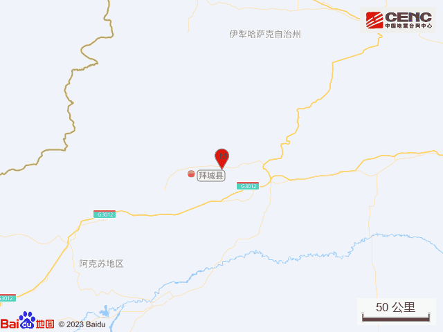
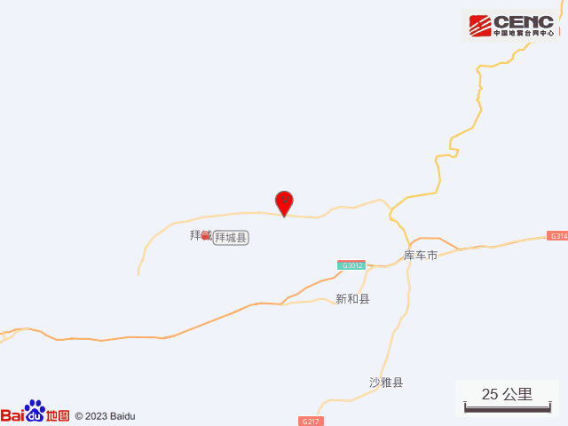
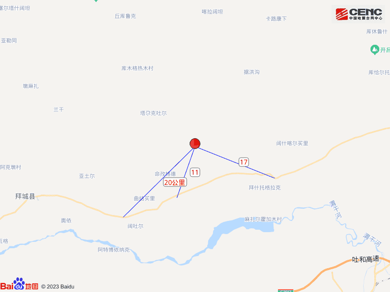
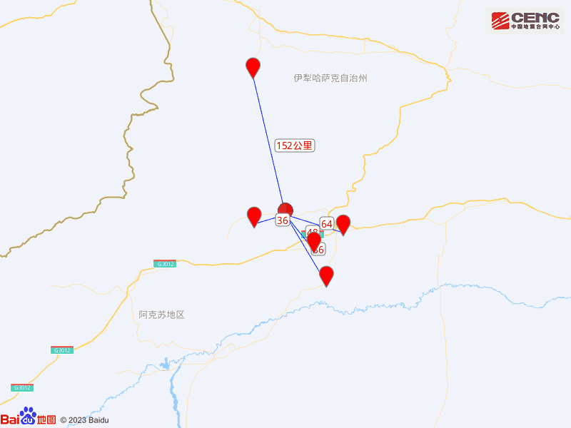
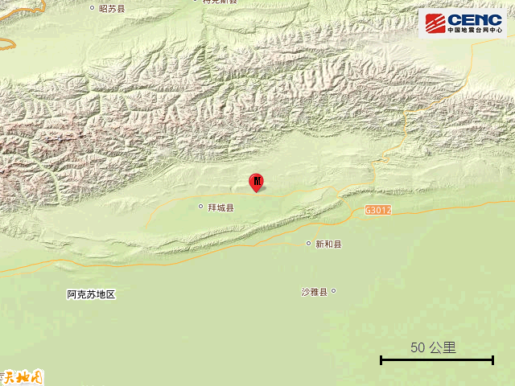
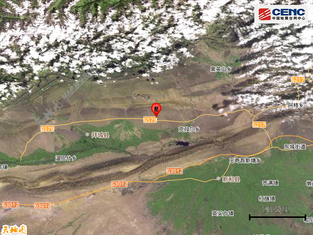
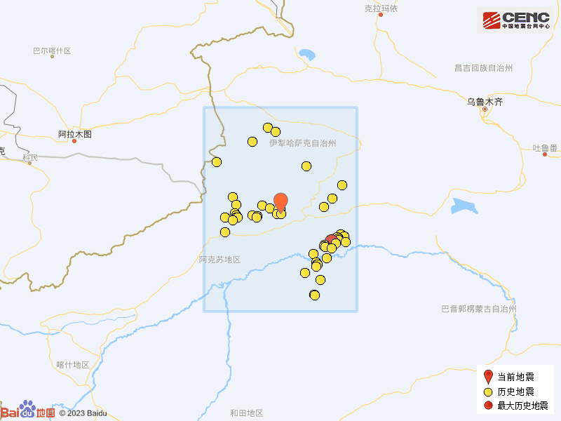

# 新疆阿克苏地区拜城县发生4.5级地震

据中国地震台网正式测定，10月9日0时17分在新疆阿克苏地区拜城县发生4.5级地震，震源深度10公里，震中位于北纬41.89度，东经82.26度。

本次地震周边10公里内的村庄有乌希买里斯村、墩买里村、格迪盖依、明吉格代村、英买里村、夏合买里斯村、命孜格德、亚买里、通买里、旁买里斯，20公里内的乡镇有赛里木镇、克孜尔乡、托克逊乡。

震中距拜城县36公里、距新和县48公里、距库车市64公里、距沙雅县86公里、距特克斯县152公里，距阿拉尔市171公里，距阿克苏地区185公里，距乌鲁木齐市487公里。

震中5公里范围内平均海拔约1459米。

根据中国地震台网速报目录，震中周边200公里内近5年来发生3级以上地震共336次，最大地震是2020年1月16日在新疆阿克苏地区库车县发生的5.6级地震（距离本次震中135公里），按震级大小前50次历史地震分布如图。

