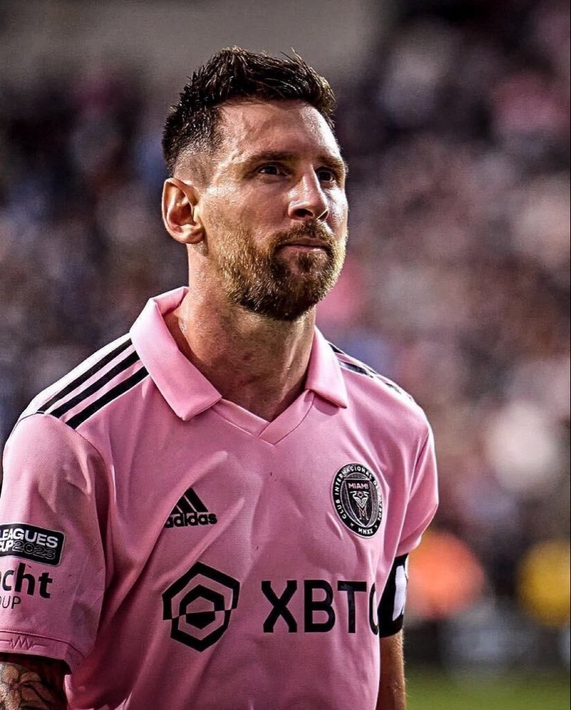
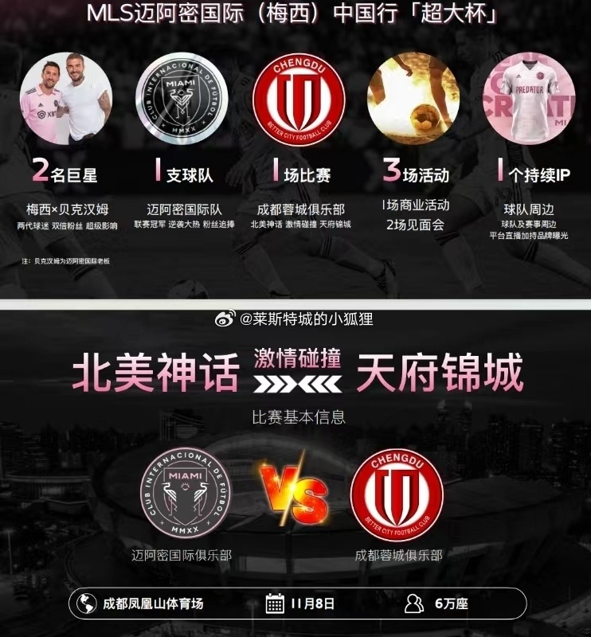
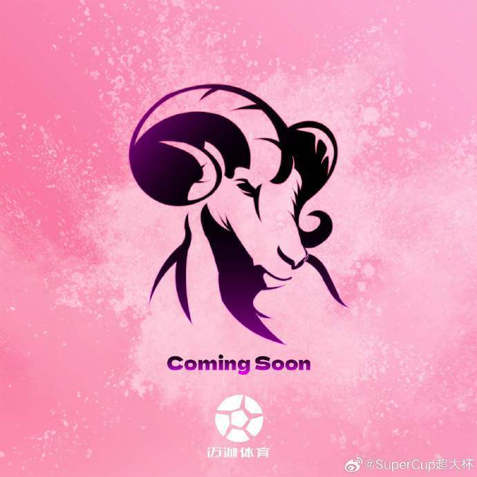

# 曝梅西11月5日再来中国！8日代表迈阿密国际对阵成都蓉城

北京时间10月9日，国内媒体报道，梅西将在11月5日抵达中国，8日对阵成都蓉城！

今年夏天，梅西曾经跟随阿根廷国家队来到北京，在友谊赛中对阵澳大利亚，引起广泛关注。当时就有传闻称，他有可能在年内再来一次中国。

随后，梅西加盟迈阿密国际，有着出色的表现，但是球队已经提前无缘美职联季后赛，10月22日赛季就将正式结束。

而据网传，迈阿密国际将在11月进行中国行活动，届时梅西和贝克汉姆都会出席！11月8日，迈阿密国际将与成都蓉城进行比赛，地点为成都凤凰山体育场。此外，还将会有一系列商业活动。

微博名为“SuperCup超大杯”的账号，则晒出一张山羊的照片和一张贝壳的照片，配文：Coming Soon.
​​​（即将到来），这个账号目前只关注了梅西和贝克汉姆

著名媒体人滨岩也表示：“穿粉色球衣，30号法国巴黎取点东西，5号中国！！！”暗示梅西10月30日领取金球奖，11月5日来中国！

