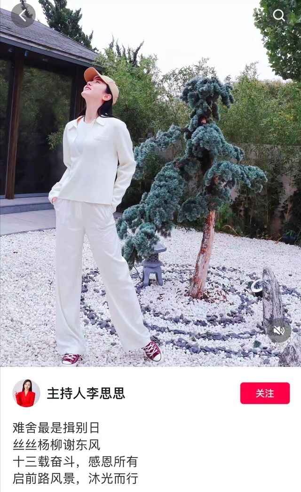
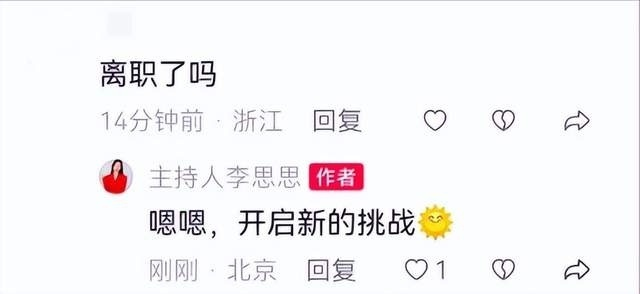

# 曾9次主持春晚，李思思回应已从央视离职：十三载奋斗，感恩所有

10月9日，主持人李思思在社交平台发文，疑似从央视离职：“难舍最是揖别日；丝丝杨柳谢东风；十三载奋斗，感恩所有；启前路风景，沐光而行。”

随后有网友在评论区问“离职了吗？”李思思对其回复道：“嗯嗯，开启新的挑战。”

目前，CCTV节目官网主持人名单中，CCTV-3综艺频道主持人仍有李思思的名字。

公开资料显示，2005年，李思思以大一学生身份参加中央电视台综艺频道《挑战主持人》节目，并成为该节目史上第一位八期女擂主。2006年，再次参加中央电视台《挑战主持人》综艺节目主持人全国选拔赛，并获得季军。

2011年，开始主持中央电视台综艺频道推出的挑战类综艺节目《欢乐英雄》。

2012年起，连续五次担任中央电视台春节联欢晚会主会场主持人。

2018年、2019年、2021年和2022年，再次担任中央电视台春节联欢晚会主会场主持人。

**【来源：九派新闻综合】**

