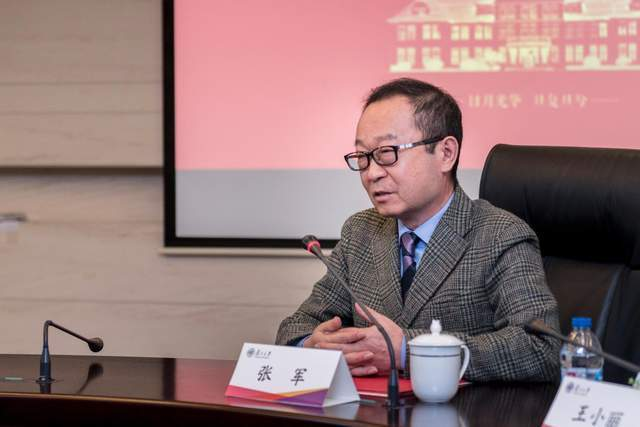

# 经济学家张军：建议压缩政府投资规模，拿出15-20万亿改善居民家庭收入

中国经济复苏是否迎来了转机？统计局公布的数据显示，8月社会消费品零售总额3.79万亿元，增速比上月加快2.1个百分点，使得8月份通胀率在7月跌入负增长后重新转正，城镇失业率实现4月份以来首降。但最新数据显示，居民消费信心仍显不足，对价格变得更加敏感，中秋国庆假期国内旅游出游8.26亿人次，实现收入7534.3亿元，比2019年只增长1.5%。这意味着尽管出游意愿集中释放，各大景点人山人海，但长达8天的假期，人均消费不到千元。

从前8个月的整体数据可见，经济增长仍然偏弱，楼市、股市低迷，是否需要采取更强力的刺激政策，如何在不助长另一场资产泡沫的情况下提振房地产行业？
**经济学家、复旦大学经济学院院长张军教授**
在《有识》栏目对当前经济政策、房地产、地方债、民营经济等热点问题做了解读。他认为，对于房地产，要放弃“出手相救，还可以回到十年前”的幻想，现在最重要的是尽量要防止一些大型开发商倒闭。对于民营经济，他建议废除企业的所有制“身份论”，政策上不要再区分国有企业还是民营企业，同样的法人主体，都应该享受同等法律保护。“即使是国有的企业，也可以由民营企业家担任CEO。投资可以交叉，管理也可以交叉。”此外，他呼吁，政府应该压缩投资性支出预算，腾出一部分预算用于增加居民福利开支，比如拿出15-20万亿用于改善居民家庭收入，在子女教育、老人赡养等民生方面加大支出力度。同时，要让工资增长跟上名义GDP增速。“政府如果能够在家庭上面有更多支出，家庭就可以在消费上有更多支出，形成一个正向互动关系。”

以下是访谈实录：

**1、从统计局已经公布的前8月经济数据看，中国经济仍然偏弱，有人建议应该毫不犹豫地采取更有力的政策，不要搞“挤牙膏式”的调控。怎么看近期集中释放的各种刺激政策，对经济复苏有效果吗？**

张军：我觉得中央政府可能面临的约束条件太多了，不容易下决心。即便与2008年相比，今天可刺激的地方也不多了。十五年前，我们经济增长的潜力相对还算比较大。现在无论从投资、房地产、贸易等各方面，增长潜力都显著变小，推出大力度政策，经济增长趋势也未必会出现方向性的改变。

其次，这么多年，特别是2015年提出去风险和结构性改革以来，做了很多工作，一旦再大规模刺激，很多老问题会卷土重来。

还有，现在整个经济对总需求造成的下行压力，不是一两天形成的，有一个长期积累过程，预期也在变化，所以，一个大规模刺激政策出来是否有能扭转局面，其实也没把握。

所以，我觉得这三个方面可能导致决策层在推出大规模刺激政策方面忧心忡忡，对于是不是要通过强刺激来解决问题，难以形成共识。但也不排除会有一些具体问题的解决方案，比如说地方债务问题，地方政府现在普遍没钱，债务压力比较大，这个问题肯定要找到一些解决办法，有没有腾挪的空间。包括我在内的很多学者都建议，地方政府的债务能不能先跟中央置换一部分，也就是进行债务置换，或者对地方债务做一些国家层面的战略性重组，专门成立一个大规模基金进行债务收购等方式来化解。

我觉得是不是可以先从这些方面入手，然后看看地方政府的负担减轻后，经济可能出现的变化，政策层再进行因势利导，因为地方支付的债务约束比较硬，就不得不缩手缩脚了。

**2、一些人认为，要确保经济复苏，中国实质上需要救市，采取更多措施来帮助开发商重组债务，完成未完工项目，同时通过给予直接补贴来增强购房者的信心。这个救市措施真能拯救低迷的房地产市场吗，如何在不助长另一场资产泡沫的情况下提振房地产行业？**

张军：我觉得这个问题要用战略的眼光来看。房地产经过这么多年的发展，到今天这样一个局面，它本身有一个内在调整的需要，不可能一直维持扩张的节奏，各个方面的条件已经不具备。现在要救房地产，最重要的是要防止一些大型开发商连锁倒闭。这也跟地方政府债务情况一样，可能也得考虑成立一个大基金，通过市场化手段逐步化解债务，同时会减轻对金融业造成的冲击。

对于房地产本身，我觉得现在要放弃一个幻想，就是现在出手相救，还可以回到十年前。未来，房地产肯定是一个越来越分化的趋势，即便局部地区还可以，但整体趋势一定处于向下，行业逐步回归常态。

另外，我特别想强调一点，虽然现在地方政府因为债务压力变成了财务约束，但如果中央政策帮地方政府减轻了债务压力后，乱花钱这件事情还是一个大问题。现在经济下行压力中，有一个很重要的原因就是过度投资，其中包含大量政府支持的投资，很多投资没有合理的回报，打水漂的案例比比皆是，这个问题一直都没有解决。

所以，放松了地方政府的财务压力，也有可能会带来新一轮浪费或者债务的风险。这就需要再处理眼下问题与长远问题之间的一个跨期的平衡，这也部分地解释了为什么现在高层在这个问题上比较谨慎，要考虑政策出台后，地方政府又回到之前那种乱花钱、乱投资的状态，这其中很多项目其实已经没什么回报。我去调研，经常听到这些抱怨。

所以，我最近多次在公开场合提出，地方政府一定要放弃用产业思维来指导地方经济发展的做法。过去地方政府考虑经济发展的时候，一直是从发展什么产业入手，但这些问题其实都不是他们可以搞清楚的，导致很多项目的大规模投入打水漂。我前不久到江苏一个地方，听说下面很多县都提出要搞汽车产业，要上马整车项目，花了很大一笔投资，占用那么多土地，最后胜算的概率能有多少？还是市场说了算。地方政府老是习惯用产业思维发展经济，现在很多地方都在搞微电子，但人才储备、科技研发和相关产业基础这些都不具备，老是觉得给优惠条件就有人会来，实际上是一种巨大的资源浪费，最后一地鸡毛。

其实，一个地方的产业发展起来，多半就是天时地利人和的结果，没有必然性，产业的发展最重要的是要拥有核心技术和人才，如果所有东西都靠引进，成功概率不高，短期可能热火朝天，但没有可持续性，最后大部分背上了沉重债务，形成资源浪费。

**3、今年以来，从地方到中央，政府部门都在以各种方式表达对民营经济的重视，比如民营经济31条、发改委设立民营经济发展局，为什么在这个时间点重新强调民营经济，如何从根子上让民营企业家恢复信心敢于投资？**

张军：经济下行，其实受害最大的就是民营经济，因为他们没有什么话语权，也得不到更多支持。另外，民营经济对经济变化最敏感，无论是内部还是外部，他们会有更长远的目标，因为一个项目要不要投，不是看两三年，而是十年二十年，他们最看重稳定性、连续性。现在经济领域出现了一些干扰，让稳定性、长远性发生了变化，所以民营经济就会更加不安，对他们来说就变成一个巨大的不确定性。尤其是一段时期，出台了大量可能会被误解、误读的政策，对民营经济造成了一些伤害，很容易理解为对他们的不信任。

经济的长期高质量发展，其实民营经济是主力，如果他们信心不足有动摇，对不确定性有更多担忧，经济恢复就会比较困难。所以，现在就是需要稳住民营经济的预期，确保民营经济有更长远发展的动力，这种强调有一定正面影响。改革开放三四十年，这些事情总是不断地反复，反复太多了以后，民营经济就会变得冷漠了，再出台这些政策，就不怎么当真了。

现在经济发展当中，还是存在着身份论歧视，所以，最重要的就是要从法律层面彻底消除出身不平等这个问题，“国企，民企、外企的
“身份论”一定要废除。同时，建议中央出台的各种政策，不要区分国有企业还是民营企业，都是法人主体，应该享受同等法律保护，包括产权保护、权益保护，不能因为是民企，想抓人就抓人，想没收财产就没收，法律一定要明确。其实，现在国有企业里有大量非国有成分，投资者也可能来自于不同所有制企业，已经没有什么特纯的国有，也没有纯粹的私有。一个私人企业，可能有外资成分，也可能国有资本，股权可能是混合交叉的，因为市场经济就是如此。

实际上，我们的金融机构也需要改变，像四大行，现在干嘛还要强调国有，他们都是上市公司、公众公司，其中有国有股权，也有其他股份，甚至外资。强调国有银行是自己人，民间银行、外资银行，他们感觉就不好，分成三六九等，这就是所有制歧视。所以，不需要再去强调这种身份，经济发展中大家都很重要。至于哪些行业，哪些企业，必须国家控股，这有战略上的考虑，无可厚非，但不能因为国家控股造成地位不平等。

这件事情一定要做，另外这样做有什么好处，比如我们的国有企业，或者国有占主导的企业，也可以由一个著名民营企业家担任CEO。投资可以交叉，管理也可以交叉。为什么国有企业必须由组织部门来任命，让官员来做董事长、总经理。既然是企业，就应该要从市场上选拔人才，甚至全球招聘，比如说找一个新加坡人或一个欧洲人来担任公司CEO，这是由公司董事会决定，政府不要干预，这样就能做到真正平等了。像中国移动是一家上市公司，CEO可以来自于全球。阿里可以聘请一个美籍华人来担任CEO，国有企业也可以请市场上著名的企业家来做CEO，理论上说这些都是可以做得到，关键问题就是需要废除所有制的不平等。

从这个意义上讲，即便它是国有企业，也应该是现代公司治理模式，有关部门不要干预，CEO、董事长都来自市场招聘。现在大家讨论怎么支持民营企业，我觉得只要坚持所有企业都走市场化道路，问题就会慢慢解决。任何一家民企，总是希望找到一个有能力的CEO，国有企业为什么不可以这样。我认为，市场化是解决身份平等问题的一个最简单、最重要的手段。

现在国有企业是“半拉子”，一部分领域市场化，大部分市场化不足，特别是高管都是政府任命，将他们当成公务员一样看待，然后进行限薪，怎么弄得好，所以高层腐败一直屡禁不止。国有企业的改革方向一定还是市场化，新加坡很多国有企业的董事长、CEO就有全球招聘的，按市场原则办，可以做得更好。

**4、有人计算，地方政府宽口径的债务为90万亿元，即使经过2015年后的债务置换和降息，现有债务的平均利息也应该为4%～5%。这就意味着地方政府每年付息至少需要3.6万亿元～4.5万亿元。众所周知，地方政府还债的主要来源是土地出让金，而地方土地出让金毛收入在2021年达到8.7万亿元的历史高点后大幅下降，2022年只有6.7万亿元，今年预期还会进一步下降。如何化解地方债务风险？**

张军：这样下去，可能将来地方政府的土地收入部分，都不能覆盖利息，这是一个很大的财务问题。我觉得有两方面，前面已经说了债务怎么处理，另一方面债务处理不能解决所有问题，真正的问题其实是地方政府要少投资，因为地方政府在软预算约束下，拍脑袋投资的情况居多，会产生新债务。也就是说，债务处置对于解决过去积累的债务很重要，但怎么防止未来新的债务形成是更重要的问题。这就涉及到一个非常重要却一直没有解决的问题：地方政府过度参与经济发展。我觉得改革开放早期，地方政府参与发展问题，进行招商引资，克服一定的负外部性，帮助企业成长，这些都是合理的，但此一时彼一时，现在经济变得高度复杂了，风险很大，地方政府要谨慎，不要陷入太深，也许应该主要干两件事。第一，将更多精力放到规划上，因为其掌握了很多重要的资源、包括土地，把规划做好很重要。第二是致力于改善营商环境，保护市场良好运转，维护公平竞争。比如企业之间出现了纠纷、打官司，因为政府致力于营商环境改善，保护竞争，输掉官司的一方很服气，赢了官司的一方会继续投资，这比从产业思维去布局地方发展、搞投资项目，可能更重要。

如果说上世纪八九十年代地方政府需要搞基础设施，进行招商引资、通过产业政策上马一些项目还说得过去，现在产能过剩情况之下，再去拍脑袋投资很多投资项目，风险太大。所以，恐怕这也是改革进入深水区需要触碰的重要问题，一定要转变这种治理方式。

其实很多地方政府官员，也意识到了这个问题，但为什么还继续这么干？因为上级的考核机制没变，就是从上到下，不管是问责制、政绩考核、官员晋升，经济发展还是首当其冲，所以就不得不这么干。考核机制需要彻底改革，应该鼓励地方政府做好规划，维护好市场公平，保护好企业家产权。至于哪些产业会形成气候，是市场上各种因素聚集产生的结果，有很多偶然性。有些地方大搞汽车产业一定能做好吗，这不见得，有些地方就是无心插柳柳成荫，它就起来了。因为营商环境好了，制度有效了，结合当地的禀赋、人力资源条件，有些事情就不经意中做起来了。我听说，江苏有一个村的培训业不经意中搞出了规模，出现了所谓的产业集聚现象，当地政府就顺势而为推了一把，最后变成国内培训第一村。所以，并不是之前想要发展什么就能发展什么，政府最多是因势利导，在制度上确保市场公平竞争，少去插手具体的投资项目。现在政府规模太大，财政负担压力很重，其实完全没必要，投资消耗很多，然后动辄还要问责，搞得大家都很累，压力很大，成功的概率也不高，又容易导致很多不良资产、隐性债务。

**5、过去，中国房地产随着经济高速增长及城镇化，逐渐成为国民经济的支柱产业，2022年房地产业增加值为7.3万亿元，占GDP的6.1%，占固定资产投资比重20%以上。但这个拉动经济增长的重要引擎似乎正在熄火，今年持续低迷楼市的给经济增长带来了巨大压力，中国人的大部分财富也都在房子里，怎么破解这一棘手的难题？**

张军：这个问题只能靠时间不断化解。从总需求角度来看，现在恐怕要中央政府顺势而为，把投资的预算压缩，然后腾出一些支出去增加居民的实际收入和福利。比如我们现在有65万亿到
70万亿投资规模，能不能压缩四分之一，腾出来的预算，比如说15-20万亿用于支持家庭的实际收入增长和福利项目。

从整个收入层面看，现在劳动收入还太低，大多数工薪阶层的收入主要来自于劳动报酬，因为中国过去长期是低工资、低物价的模式。现在，需要有一个政策调整，让劳动工资增长，大体上与名义GDP增长接近或持平，政府的收入，要有相当一部分用于改善家庭的收入。这个改善，不是建更多基础设施，而是变成家庭收入。这些收入可以是实际收入，也可以是名义收入，比如用于减少家庭支出的负担，这就是增加家庭的实际收入。比如育儿成本，是不是可以由国家负担；义务教育是不是可以从9年变成12年；老人赡养，现在只是在个税里减扣，是不是可以大幅度提高抵税额度，甚至直接以现金方式发放到老人账户，或者家庭账户。也就是说，有些隐性的补贴，是不是可以大幅度提高并且显性化？

我觉得，要出台更多能够帮助家庭提高名义和实际收入的政策，同时随着经济发展，不断调整，逐步改善民生福利水平，让中国老百姓可以不断地分享发展成果。现在6亿人的人均月收入还是3000元以下，月均可支配收入不到1000元，这跟国力不匹配。既然我们的国力可以动辄就花上几千亿甚至上万亿去搞形象工程，为什么不用这些钱去为中低收入家庭的支出负担买单呢？所以，这方面需要有一些政策的大调整，而且正好处在当下经济复苏的节骨眼上，做这件事情的效果应该会更好，有助于减轻家庭未来的支出负担，改善消费需求的能力，降低家庭预防性储蓄率。

为什么今天储蓄率越来越高？因为绝大多数家庭都觉得现在只有靠自己，上有老下有小，都要靠自己来负担生老病死。要让家庭有明确预期，很多成本其实不需要个人负担。特别是现在子女教育负担很重，国家完全可以负担大头；育儿方面，从生育到幼儿园、小学，国家买单。医疗方面，也可以减轻家庭负担，现在光靠目前的医疗保险无法覆盖。特别是大量农民养老金每月只有100
元左右，这说不过去，是不是可以涨到5000-1000元，地方每年投资浪费的钱都比这些多得多了。所以，我一直在呼吁相关政策部门，我们需要明白一个道理，国家如果能够在家庭上面有更多支出，家庭就可以在消费上有更多支出，形成一个正向互动和循环。

我们的低工资模式也要改革，看上去是劳动力成本低，有利于制造业、出口，而当出口遇到瓶颈后，我们意识到要转变发展战略，要以国内大循环为主，就会发现国内市场没有接盘侠，因为我们还没有足够大的需求能力，这不是一个可持续的良性循环。在上世纪八九十年代，劳动力大量从农村释放，那时候普遍很穷，只要比农村好，工资低点没问题。但到今天，还用这种模式来推动制造业、出口，已经行不通，而且最重要的后果是长期抑制了家庭购买力，当城市在住房、教育、医疗和养老等方面的预期成本越来越高时，家庭的预防性储蓄就居高不下。这样怎么扩大内需，现在到了需要我们反思和将改革方案的设计纳入新议程的时候了。

