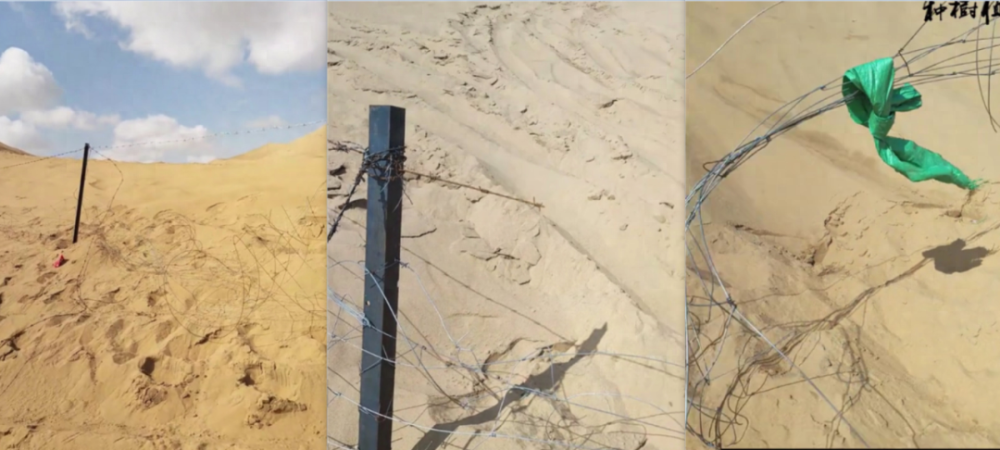
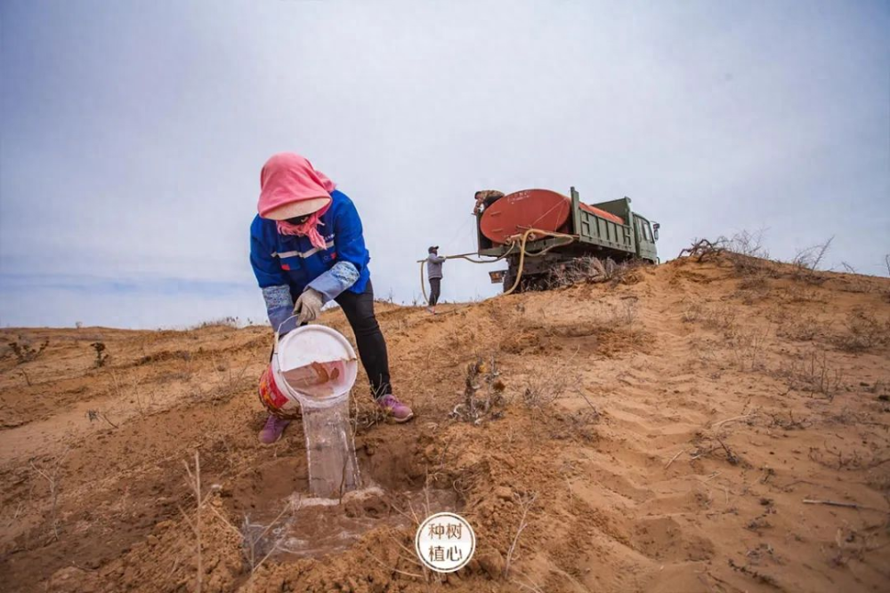

# 4000余棵腾格里“沙漠姑娘”被越野车碾压背后

近日，有网友发文称，中秋国庆长假期间，腾格里沙漠中大片用于治沙的植物被自驾游的越野车碾压。

中国新闻周刊了解到，被碾压的植被系腾格里沙漠锁边生态公益基地的花棒。阿拉善盟林草局、左旗政府及相关部门和专家再次对受损项目区进行勘察后确认，项目区碾压涉及苗木4625棵，其中受损2003棵。

该基地相关工作人员对中国新闻周刊表示，后续将在2023 年秋季造林期间，对受损的 2003
棵花棒进行补植，并做好管护工作。同时，将项目区适当位置增设醒目的项目标志牌，并标明地方执法部门联系方式。政府部门也将与项目管理团体积极沟通协调，调动各方面资源，共同做好项目区的管护工作。

**千棵治沙花棒遭破坏**

根据网友发布的视频，沙漠中出现大量车辙痕迹，被碾压的绿植倒在地上，另有当地造林工作人员提供的视频显示，林区的围栏也被剪断，被压倒的植被部分根系裸露，还有骆驼从围栏缺口处进入林区啃食树木。

此次大量被碾压的主要是腾格里沙漠锁边生态公益基地造林区的治沙花棒树。该基地工作人员表示，基地四周被铁丝护栏围住，不允许车辆进入，但涉事车辆冲断围栏闯入造林区，可能是为了抄近路。

据了解，腾格里沙漠锁边生态公益基地是2003年开始由中国绿化基金会全面支持的“防沙治沙、植树造林和生态修复”公益基地。该基地官方公众号介绍称，在近20年的时间里，负责人吴向荣带领团队在腾格里沙漠的东缘种下了约500万棵树，建成长达20公里的生态锁边林，恢复了约4万公顷的荒漠化草原，成功阻止了沙漠向东扩张的脚步，减缓了土地沙漠化的进程。

公开资料显示，该基地所在的阿拉善盟地区，沙漠、戈壁、荒漠草原各占总面积的1/3，适宜人类生产生活面积仅占总面积的6%，生态十分脆弱。该地干旱少雨，风大沙多，年平均降水量39.3～224.2毫米，年平均蒸发量2228.8～3935.3毫米。

事件引发关注后，阿拉善盟有关政府部门成立了相关工作组，工作人员前往实地核查，腾格里沙漠锁边生态公益基地也对受损情况进行统计。

10月9日上午，基地负责人吴向荣告诉中国新闻周刊，腾格里沙漠锁边生态公益基地所在位置相对偏僻，而被破坏的锁边林临近公路，是沿公路长达30公里的防护林带。

同日，腾格里沙漠锁边生态公益基地发布情况说明称，此事系项目区管护人员在巡查时发现有骆驼进入造林区，随后又发现林地多处树苗受损，林区围栏网多处被破坏。

事发后，左旗公安局及综合执法队对受损苗木和围栏网进行现场勘察，同时，阿拉善盟林草局、左旗政府及相关部门和专家再次对受损项目区进行了现场勘察，确认项目区受损树种为花棒，碾压涉及苗木4625棵，其中受损2003棵。

10月5日至7日，管护人员集中开展为期3天的抢修工作。截至目前，对受损的21处合计约500米的围栏网维修工作已全部完成。另外，锁边林项目基地将在2023年秋季造林期间，对受损的2003棵花棒进行补植，并做好管护工作，以确保该区域能够达到预计的生态效果。

**沙漠种活一棵树非常不易**

尽管基地的围栏网已经完成了抢修，吴向荣依然感到遗憾。他告诉中国新闻周刊，在降水量稀少、蒸发量达到3000多毫米的沙漠中种活一棵树非常不易，后期还需要漫长的管理和维护，例如在林地周边扎起围栏网，防止过度放牧啃食锁边林，以及防止人为破坏等。

在腾格里沙漠，花棒是非常适合防风固沙的灌木，又被称为“沙漠姑娘”。吴向荣介绍称，被碾压的这批花棒，大都是在今年春季刚刚栽培的，部分被压断或碾压倒地，还有一部分根系被直接带出，这种情况下，花棒将很难存活。

一般来说，人工种植一两年的花棒苗非常矮小，需要投入更多精力。只有等到根系扎得足够深，地上的枝干才开始长高，“一般要等到三四年后才不需要人工灌溉，护林员才会将精力转到围栏修护上。”

吴向荣说，过去团队多在居民区较远的沙漠边缘造林，后期管护主要是防止风沙对围栏网的破坏、埋没等。尽管每年也会多多少少存在人为破坏的情况，但依然是极少数，为此，他们仅仅需要赶出闯入的牲畜、捡走垃圾，修复围栏即可。他们还与周边农牧民合作，共同管理治沙植被。

近几年里，植树治沙区域逐渐延伸到了牧民生活的绿洲边缘和交通道路附近，以保护其免受风沙危害。然而，穿沙公路的通行车辆较多，尤其在旅游季节，团队的防护和管护难度有所增加，“这次也是第一次经历规模相对较大的人为损坏情况，所以看到后非常痛心，也很挫败，没想到做了自然教育这么多年，还会出现这种事情。”

由于沙漠面积辽阔，事发地周边并无监控设施，加上尚无损害过程的证据，而被毁坏的围栏、苗木分布范围较广，事发后，基地工作人员只能优先选择修复围栏网，防止更多的骆驼、牛羊进入基地啃食苗木。

目前，当地林草及公安部门已经到现场进行勘察。地方政府领导现场勘察后，要求项目建设方要加强项目宣传，并在项目区适当位置增设醒目的项目标志牌，并标明地方执法部门联系方式。同时，政府部门也要与项目管理团体积极沟通协调，调动各方面资源，共同做好项目区的管护工作。

**真正的越野人会自觉保护环境**

自驾越野车队毁坏大量治沙植被的消息引发关注后，中国探险协会会员刘杰对中国新闻周刊表示，越野车穿越沙漠时，遇到造林区一般会绕行或者选择林区中间的便道行驶，很少有人会故意破坏，因为破坏林区的植被的同时，植被也会对越野车的轮胎及其底盘造成损伤。“真正的越野人都会自觉地保护沙漠生态”，刘杰说。

当沙漠越野、徒步穿越等户外活动越来越受追捧时，如何减少对当地自然环境的影响也值得关注。吴向荣说，对于治沙护林人员来说，目前只能做到被动的保护和修复，同时加强正面宣传和引导，让游客既能感受到沙漠中的自然辽阔，也能理解如何保护沙漠景观，“但实际上，我们一直存在这种矛盾或不对等的关系。”

此次事件发生后，腾格里沙漠锁边生态公益基地也在考虑增强对自然的尊重和环保意识宣传。同时，当地政府也在考虑加强执法和监管，例如提出建立沙漠旅游的相关制度和规则，明确旅游具体线路和行为规范。“基地也与执法部门进行了交流，这些都是我们未来在保护和管理方面需要重视的。”

根据《中华人民共和国森林法》第七十四条第一款规定，违反本法规定，进行开垦、采石、采砂、采土或者其他活动，造成林木毁坏的，由县级以上人民政府林业主管部门责令停止违法行为，限期在原地或者异地补种毁坏株数一倍以上三倍以下的树木，可以处毁坏林木价值五倍以下的罚款；造成林地毁坏的，由县级以上人民政府林业主管部门责令停止违法行为，限期恢复植被和林业生产条件，可以处恢复植被和林业生产条件所需费用三倍以下的罚款。

《内蒙古自治区林业和草原行政处罚裁量标准》显示，毁坏林木蓄积2m³以上5m³以下或者幼树50株以上400株以下的，责令停止违法行为，限期在原地或异地补种毁坏株数1倍以上2倍以下的树木，可以处毁坏林木价值2倍以上3倍以下的罚款。毁坏林木蓄积5m³以上10m³以下或者幼树400株以上500株以下的，责令停止违法行为，责令限期在原地或异地补种毁坏株数2倍以上3倍以下的树木，可以处毁坏林木价值3倍以上5倍以下的罚款。

据央广网报道，内蒙古自治区林业和草原局有关人员表示已关注到相关舆情，该行为可能违反了《森林法》相关规定，目前当地林草局正在积极跟进调查，核实具体情况。

但现实情况是，由于事发现场附近没有监控设备，要想找到闯入的车辆比较困难。

作者：王春晓

