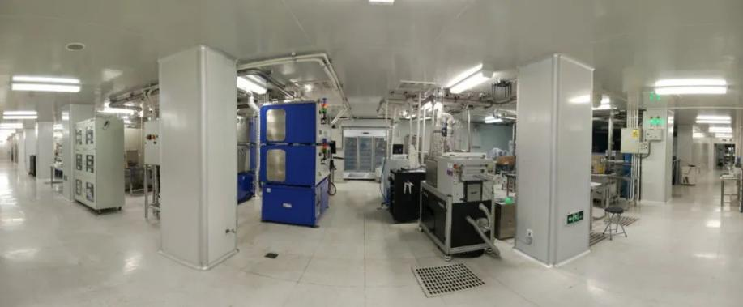
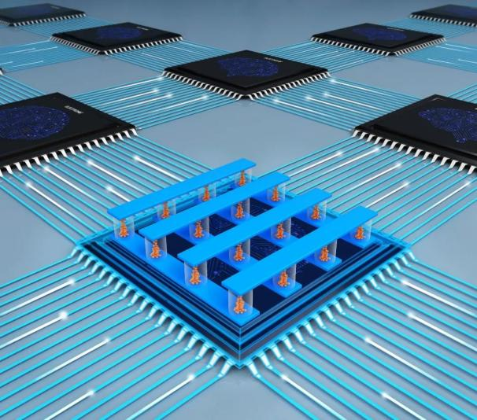
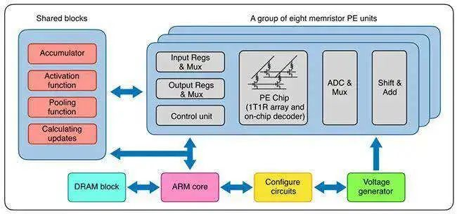
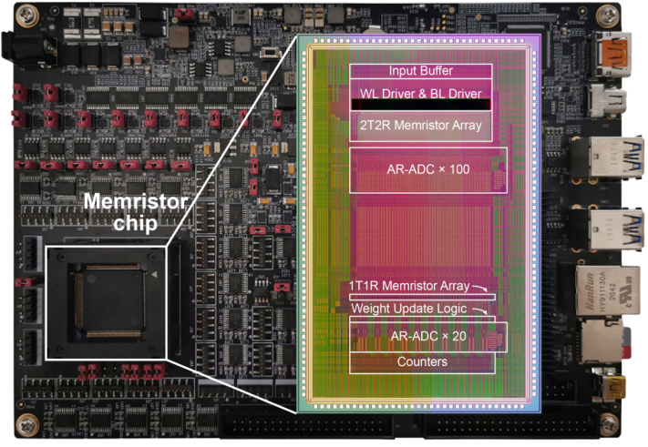
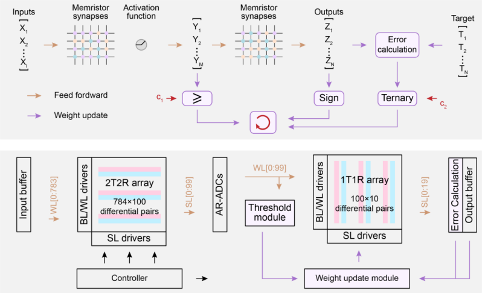
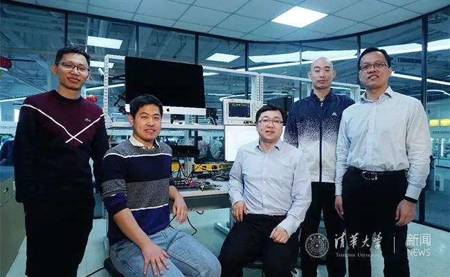

# 75倍能效提升！我国研制出首颗支持片上学习忆阻器存算一体芯片

导读：相同任务下，该芯片实现片上学习的能耗仅为先进工艺下专用集成电路（ASIC）系统的1/35，同时有望实现75倍的能效提升。

想象一下，一颗芯片上集成了记忆和计算的能力，保护用户隐私同时还具备了类似人脑的自主学习，能耗仅为先进工艺下专用集成电路系统的1/35……

微信公众号“清华大学”10月9日消息，近期，清华大学集成电路学院吴华强教授、高滨副教授基于存算一体计算范式在支持片上学习的忆阻器存算一体芯片领域取得重大突破，研究成果发表在《科学》（Science）上。

11年科研“长征”，从忆阻器件到原型芯片再到系统集成，钱鹤、吴华强团队协同攻关AI算力瓶颈难题，攻克“卡脖子”关键核心技术，成果涉及忆阻器集成芯片、存算一体系统、ADAM算法加速器......

有望促进人工智能、自动驾驶、可穿戴设备等领域的发展。

**突破从0到1 存算一体开启智算时代**

记忆电阻器（Memristor），是继电阻、电容、电感之后的第四种电路基本元件。它可以在断电之后，仍能“记忆”通过的电荷，被当做新型纳米电子突触器件。

早在1946年，“计算机之父”冯·诺依曼提出并定义了计算机架构，采用二进制的编码，由存储器和处理器分别完成数据存储和计算。

但是，随着人工智能等应用对数据存储和计算需求的不断提升，数据来回“搬运”处理，耗时长，功耗大，还可能存在“交通堵塞”的风险。

清华大学微纳加工平台

2012年，钱鹤、吴华强团队开始研究用忆阻器来做存储，但由于忆阻器的材料器件优化和集成工艺不成熟，团队只能靠自己在实验室里摸索，在一次又一次失败的实验中探索提高器件的一致性和良率。

两年后，清华大学与中科院微电子所、北京大学等单位合作，优化忆阻器的器件工艺，制备出高性能忆阻器阵列，成为我国率先实现忆阻器阵列大规模集成的重要基础。

多个忆阻器阵列芯片协同工作示意图

2020年，钱鹤、吴华强团队基于多阵列忆阻器，搭建了一个全硬件构成的完整存算一体系统，在这个系统上高效运行了卷积神经网络算法，成功验证了图像识别功能，比图形处理器芯片的能效高两个数量级，大幅提升了计算设备的算力，实现了以更小的功耗和更低的硬件成本完成复杂的计算。

存算一体系统架构

存算一体架构，就如同“在家办公”的新型工作模式，彻底消除了往返通勤的能量消耗，避免了往返通勤带来的时间延迟，还大大节约了办公场所的运营成本，在边缘计算和云计算中有广泛的应用前景。

**跨越从1到75 边缘学习加速应用探索**

十年磨一剑，钱鹤、吴华强带领团队创新设计出适用于忆阻器存算一体的高效片上学习的新型通用算法和架构（STELLAR），研制出全球首颗全系统集成的、支持高效片上学习的忆阻器存算一体芯片。

忆阻器存算一体学习芯片及测试系统

**相同任务下，该芯片实现片上学习的能耗仅为先进工艺下专用集成电路（ASIC）系统的1/35，同时有望实现75倍的能效提升。**

基于忆阻器存算一体，实现高效片上学习的通用算法和架构

利用神经启发的忆阻器芯片进行边缘学习

小车自动追踪控制的增量学习演示

“存算一体片上学习在实现更低延迟和更小能耗的同时，能够有效保护用户隐私和数据。”博士后姚鹏介绍，该芯片参照仿生类脑处理方式，可实现不同任务的快速“片上训练”与“片上识别”，能够有效完成边缘计算场景下的增量学习任务，以极低的耗电适应新场景、学习新知识，以满足用户的个性化需求。

比如，有些人习惯在数字“7”的中间加一短横。一开始，智能芯片并不认识这个符号，然而训练了两三个这样书写的“7”后，它就能准确将其识别为数字“7”。

**挑战与机遇并存 “芯青年”展科研担当**

在复杂多变的国际形势下，突破“卡脖子”技术仍是当下的重点。

面对先进研发设备短缺等现实问题，团队成员都有着些许的茫然，每一步走的是否正确，结果能否达到预期，工艺还能否更加优化……这些都是压在每个人身上的巨石。

首先，是技术挑战。忆阻器芯片的研发涉及到材料科学、物理学、电子工程等多学科的前沿知识。在诸多技术难题中，首先要解决的是如何实现忆阻器件的大规模集成。通过大量实验和理论研究，团队提出了架构-
电路-工艺协同优化方法，为存算一体系统的设计提供了指导。

其次，是工程挑战。有了大规模集成的工艺、关键的电路设计，如何克服底层多尺度非理想导致的误差，集合成一个高效的系统芯片？在团队老师和学生的共同努力下，研究提出STELLAR
架构，完成算法优化及仿真实验，制备出全系统集成的高效存算一体学习芯片，实现速度和能效的大幅提升。

团队合影

“路不好走，却意义非凡，它是当前全球高科技领域较量的重要战场。”高滨认为，芯片研究是一件久久为功的事情，前方找不到的突破口，却能在日积月累的研究学习中获得。

张文彬、姚鹏作为学术论文的第一作者，博士期间接触了大量如半导体、微电子、软件算法和类脑计算等不同方向的科研知识，积累了丰硕的研发成果和丰富的工程建设经验。

从无到有、从弱到强。在科研这条没有捷径的路上，“芯青年”们无数次制备观察后放弃，又在无数次归零后重新开始，跨越一座又一座险峰。

放眼未来，吴华强希望团队的方案、技术能够走出实验室，切切实实推动科研成果转化，致力服务国家所需、社会所需。

