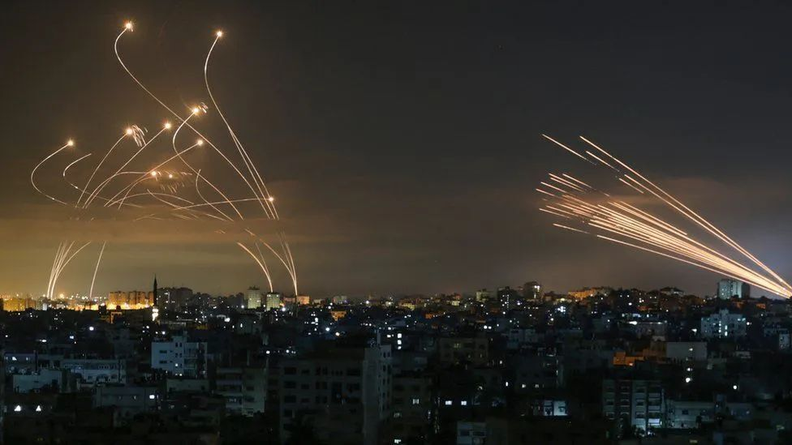
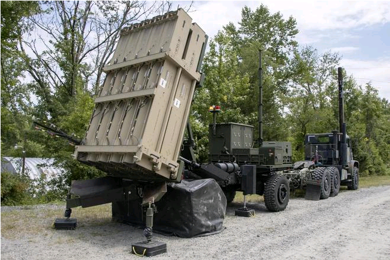

# “铁穹”神话，也破灭了？

以色列8日出动了大批兵力，并动用战斗机、武装直升机等先进武器，努力把这次巴以冲突拉回外界熟悉的“常规轨道”，但此前以军在哈马斯突袭面前的狼狈和措手不及已经是全球皆知，一连串原先的以色列战争神话也被揭穿。

今天，我们就来聊聊“铁穹”系统的事。

其实“铁穹”系统是非常定制化的一种武器。多年以来，以色列饱受哈马斯等武装的火箭弹威胁，这些简单版火箭弹制造工艺粗糙、成本低廉，使用昂贵的传统导弹进行拦截非常不划算，但如果放任不管，它们依靠数量够多，又足以对以色列这样地域狭窄、目标众多的国家构成严重威胁，因此2007年以色列决定选择专门研制一种应对近程火箭弹袭击的防御系统，这就是“铁穹”系统的起源。

其实，“铁穹”系统的基本构成与其他防空系统差别不大，也是由导弹发射装置、雷达、监测、操控装置等组成，理论上可以拦截包括火箭弹、大口径炮弹、亚音速飞机等多种目标。该系统最大特点其实是使用成本低——之前说了，用高成本导弹拦截简易火箭弹实在太不划算。此外针对简易火箭弹的特点，“铁穹”系统在侦测到目标来袭后，可在1秒钟内分析判断出火箭弹落点，并根据来袭火箭弹的不同威胁程度，选择拦截威胁更大的火箭弹。

从这些特点可以看出，“铁穹”系统在设计之初就是为拦截简易火箭弹而量身定制的。应该说，“铁穹”系统服役以来在实战中表现相当抢眼。按照以军的宣传，在2012年与哈马斯的冲突中，哈马斯发射的400枚火箭弹中，85%被“铁穹”系统成功拦截；2014年，哈马斯发射了4500多枚火箭弹，“铁穹”系统的拦截成功率却提升到了90%；2021年针对哈马斯发射的4500多枚火箭弹，“铁穹”系统仍保持了90%的拦截成功率。

也正因为这一连串显眼的实战表现，就连美国也主动要求引进“铁穹”系统，看它能不能部署到关岛以提升当地针对“中国导弹威胁”的防御能力。乌克兰方面更是接连表态，点名要求以色列援助“铁穹”系统以抵挡俄军空袭……

问题来了，既然“铁穹”系统性能如此优秀，但这次为什么在哈马斯导弹袭击面前却表现不佳呢？美国《纽约时报》称，一名前美国政府官员表示，哈马斯可能已经找到了该系统的漏洞。“铁穹”系统是为了保护人口中心等重要目标而设计的，每套系统只有20枚拦截弹，一旦发射完毕就需要相当长时间重新填装。在7日的突袭中，哈马斯宣称在20分钟内发射了数千枚火箭弹，“铁穹”系统在最初的拦截行动中就耗尽弹药。

另外，老司机前面说了，“铁穹”系统的拦截逻辑是首先判断来袭火箭弹是否构成威胁，只挑那些威胁大的。例如2014年哈马斯发射的4500枚火箭弹中，“铁穹”系统虽然号称“拦截成功率90%”，但其实这是指它对其中800多枚“有威胁”的目标实施拦截，一共击落了735枚。“铁穹”系统的这种“有选择拦截”，一旦对手的火箭弹性能升级，就会因需要拦截的目标过多而出现严重的“火力不足”。《纽约时报》称，哈马斯可能使用了新型火箭弹，它们更难被拦截。

另一个战场视频也能说明“铁穹”系统的困境。保加利亚军事网8日称，社交媒体流传的视频显示，以军发射了至少一枚昂贵的“爱国者”导弹拦截哈马斯发射的火箭弹。这种费效比非常低的罕见场面似乎也证明以军拦截系统一度不堪重负。

总之，“铁穹”系统用于拦截火箭弹，依然是非常好用，但某些人将它神话为战场神器，还试图让它承担“不应承担的任务”，其结果可能就不太好看了——反正美军经过测试之后，就放弃了用“铁穹”系统部署在关岛拦截“中国导弹”的想法……

