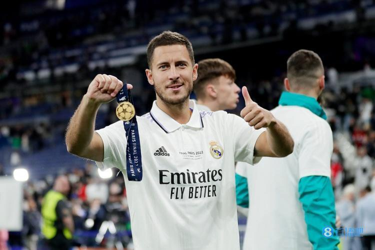
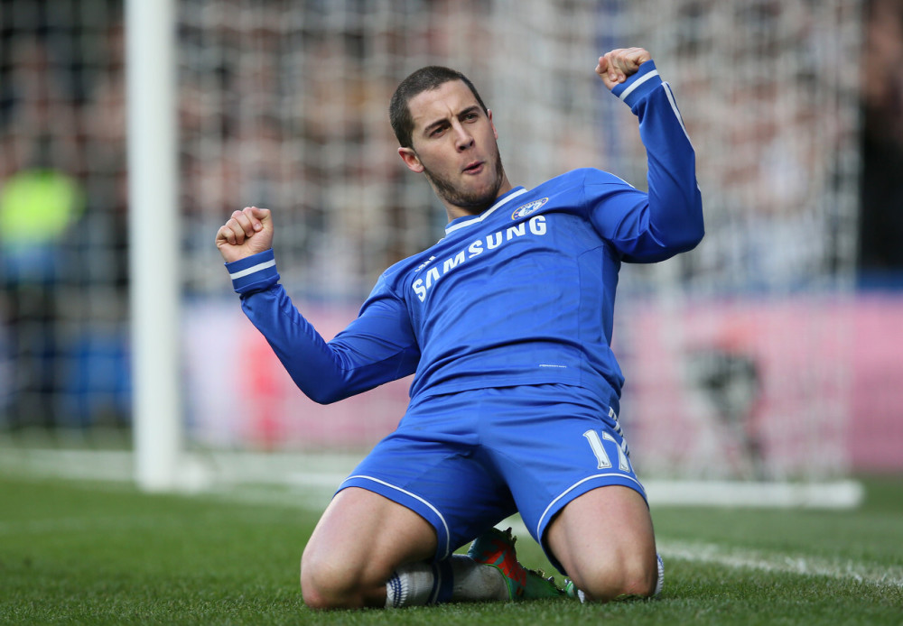
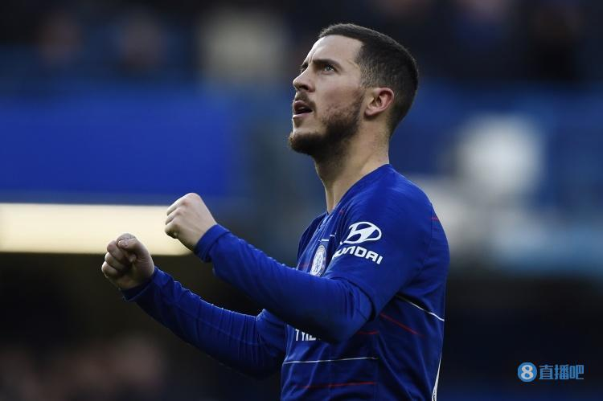
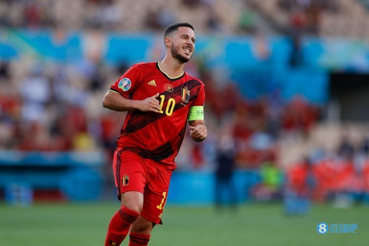
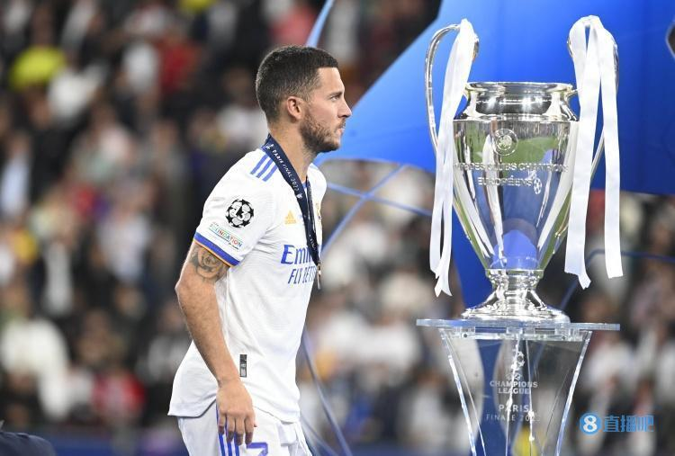

# 再见扎球王！官方：32岁阿扎尔宣布退役，结束16年职业生涯

直播吧10月10日讯 32岁的阿扎尔在个人社交媒体宣布退役，结束16年职业生涯。

**【阿扎尔退役声明】**

你必须倾听自己的心声，并在适当的时候告诉自己停下。

经过16年的职业生涯和超过700场比赛后，我决定结束我作为足球运动员的职业生涯。

我曾实现了我的梦想，并且在世界各地的许多座球场内踢球，享受了其中的乐趣。

在我的职业生涯中，我有幸遇到了伟大的主帅、教练和队友——感谢大家给我带来的这些美好时光，我会想念你们的。

我也要感谢我效力过的俱乐部：里尔、切尔西和皇马；也感谢比利时足协对我的信任将我选入国家队。

特别感谢我的家人、朋友、导师以及那些无论顺境还是逆境都支持我帮助我的人。

最后，非常感谢我的粉丝们，这些年来你们一直关注着我，也感谢你们在我踢球时给予我的鼓励，无论我在哪儿。

现在是享受我所爱的一切并开始新经历的时候了。

很快再见，我的朋友们。

阿扎尔现年32岁，来自比利时，主要司职左边锋，曾效力里尔、切尔西、皇马。阿扎尔的巅峰身价曾高达1.5亿欧元，2019年皇马花费高达1.15亿欧元转会费将他从切尔西签下。今年夏天阿扎尔与皇马解约，在今天宣布退役。

阿扎尔07-08赛季升入法甲里尔一线队，在里尔4个赛季共出场194次，打进50球并送出53次助攻，获得一次法甲冠军。

2012年，阿扎尔以3200万镑的转会费从里尔加盟切尔西。效力切尔西6年多时间里，阿扎尔代表球队出场352次，打进110球并送出92次助攻。期间获得2次英超冠军、2次欧联冠军、1次足总杯、1次联赛杯冠军。

2019年阿扎尔加盟皇马，转会费高达1.15亿欧。效力皇马4年时间，阿扎尔各项赛事出战75场，打进7球贡献12助攻。随队夺得1座欧冠冠军、1座世俱杯冠军、1座欧超杯冠军、2座西甲冠军、1座国王杯冠军、2座西超杯冠军。

国家队层面，阿扎尔在17岁即完成比利时成年国家队首秀，共代表比利时队出战126场比赛，打进33粒进球，送出36次助攻，参加了2014、2018、2022三届世界杯，2016、2021两届欧洲杯，在2018年率队获得世界杯季军。

