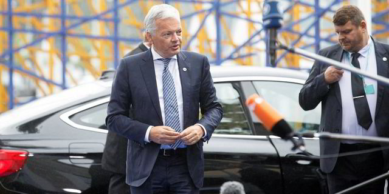
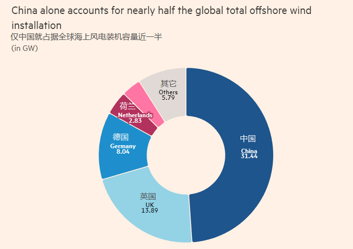

# 又盯上中国风电、钢铁产业：欧盟称考虑对中企开展反补贴调查

【文/观察者网 王世纯】在电动汽车之后，欧盟又盯上了中国具有国际竞争力的风电行业，开始炒作中国“风电威胁”。

据英国《金融时报》10月7日报道，欧盟一位主要官员日前表示，布鲁塞尔正在考虑是否调查中国利用补贴来促进本国风力涡轮机制造商发展的情况。三名欧盟官员透露，此举可能会在本月实施，作为旨在促进欧洲风能行业的更广泛提案的一部分。

报道援引欧盟竞争事务专员狄迪尔·莱恩德斯的话称，“在风能领域，一些欧洲企业的产品面临着中国的直接竞争，如果中国政府提供过多的补助，我们可以像针对电动车一样展开调查。

《金融时报》评论称，这将是继欧盟委员会主席冯德莱恩宣布调查中国电动汽车市场之后，数月来针对中国采取的第二项重大行动。欧洲风电公司一直在游说以获得更多支持，他们认为廉价的中国进口产品正在将自己的涡轮机制造商推向崩溃的边缘。

不过，也有欧盟官员担心，对风电设备的反补贴调查会引发中国愤怒，而欧盟担心中国“报复”。

_盟竞争事务专员狄迪尔·莱恩德斯 图源：社交媒体_

当下，欧盟委员会拒绝对可能的风力发电站反补贴调查置评。而欧盟外交政策高级代表约瑟夫·博雷尔（Josep
Borrell）和欧盟能源专员卡德里·西姆森计划在未来几天访问中国。

今年以来，欧盟方面一直有呼声要求调查中国风电设备。欧盟内部市场专员蒂埃里·布雷顿今年9月呼吁对中国制造的风力涡轮机展开反倾销或反补贴调查。他宣称中国风电设备制造商一直在实施进军欧洲市场的积极战略，中国制造商向欧洲项目开发商提供了大幅折扣，并可选择将付款推迟至多3年。

法新社报道称，法国风能企业于上周通过可再生能源联盟发出呼吁，希望欧洲在风能领域采取“雄心勃勃的产业政策”，以应对来自中国参与者的“不公平竞争”，确保“风力涡轮机、光伏板、电动车零件等构成电力系统的组成部分都来自欧洲和法国”。

除了炒作补贴政策以外，还有欧盟官员在炒作所谓“对华清洁能源依赖”。欧洲工业贸易组织欧洲风能协会（wineurope）今年早些时候炒作称，欧洲的清洁技术将在欧洲以外生产，而欧洲将从对俄罗斯天然气的依赖转向对中国清洁能源设备的依赖。

欧洲《能源邮报》今年早些时候曾撰文分析称，尽管由于运输成本、本地制造参与度要求等原因，欧盟尚未从中国进口大量成品风机，但相关零部件的制造严重依赖中国的稀土资源出口，如钕和镝等。

而欧洲的产业界则希望欧盟采用补贴和投资手段，欧洲风能协会首席执行官贾尔斯·迪克森表示，欧盟委员会和f该行业正在“积极讨论”旨在提振该行业的新提案。他说：“你知道中国制造商还有什么其他工具可供使用……欧盟知道我们面对的是什么。”

而一位欧盟高级官员表示，冯德莱恩已开始支持欧洲清洁能源产业的发展战略，以阻止部分中国进口产品进入欧盟。这位官员说：“没有欧洲的制造能力，我们就无法控制，如果不采取措施，欧盟到2050年实现零排放的绿色协议将不可能实现。”

近年来，随着中国产业和能源结构调整提速，我国风电发展势头强劲，在海上风电总装机容量已经超越欧盟，占据头把交椅。根据全球风能理事会（GWEC）的数据指出，2022年全球海上风电总装机容量为64.3吉瓦，欧洲约占47%，而亚太地区以近53%的水平超越欧洲。其中，仅中国一家就占全球总装机容量的近49%。

英国《金融时报》对此评论称，就在中国大力发展可再生能源，海上风电装机容量激增之际，欧洲企业却因成本上升和供应链受阻影响，失去了世界最大海上风电市场的地位，被中国引领的亚太地区取代。

除了海上风电以外，近年来，我国风电全产业链创新步伐不断加快，成为全球最大的风电装备制造基地，产量占全球市场的三分之二以上，出口到全球49个国家和地区。今年上半年，全球新增风电装机的四成多都出自我国，目前，我国风电总装机已经达到3.89亿千瓦。

而中国在产业链上也占据了部分主导权，全球风能理事会此前警告说，中国对海上风电项目一些关键零部件拥有约70%的市场控制权，这意味着“欧盟和美国提出的限制性贸易政策看起来肯定会出现瓶颈”。

尽管欧盟内部有呼声要求对风力涡轮机部件进行类似调查，但也有人表态称，欧盟担心遭到报复。一位欧盟匿名官员这说：“他们已经认为欧盟主席（冯德莱恩）演讲中宣布的一些东西已经很过分了，中国可以消化电动车市场并适应反补贴的情况。如果我们再加一个风电调查，他们可能会很生气。”

近期，欧盟方面不断炒作要对中国具有国际竞争力的产业进行反补贴调查。9月13日，不顾欧洲汽车业界反对，欧盟委员会主席冯德莱恩正式宣布将对中国电动汽车发起反补贴调查，中方对此表示高度关切和强烈不满。

除了电动汽车以外，欧盟也盯上了我国钢铁产业。英国《金融时报》10月9日报道称，欧盟计划在10月在与美国的峰会上，宣布对中国生产商展开反补贴调查。报道引述两名知情人士表示﹐欧盟已同意跟随美脚步﹐对中国钢铁生产商展开反补贴调查，保护本地产业免受所谓“廉价竞争”影响。

报道称，美国方面要求欧盟封中国钢铁生产商采取行动，以避免重演向欧盟钢铁产品征收特朗普时期的关税。

对于欧盟炒作我新能源车出口补贴一事，中方曾明确表示，欧方拟采取的调查措施是以“公平贸易”为名行保护自身产业之实，是赤裸裸的保护主义行为，将严重扰乱和扭曲包括欧盟在内的全球汽车产业链供应链，并对中欧经贸关系产生负面影响。“中方将密切关注欧方后续调查程序，坚定维护中国企业的合法权益。”

**本文系观察者网独家稿件，未经授权，不得转载。**

