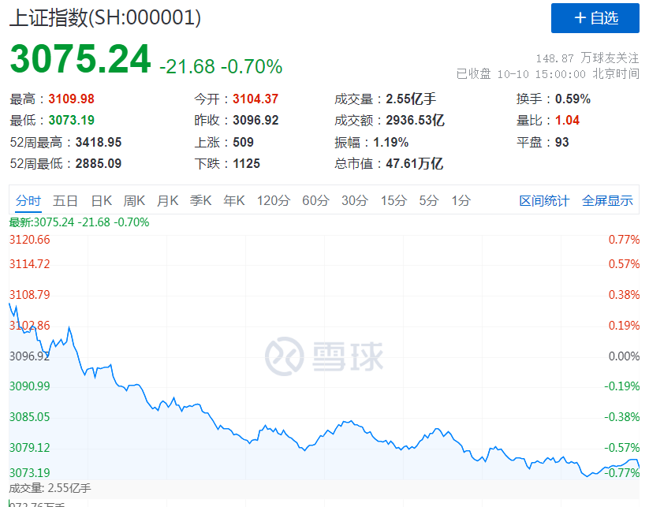
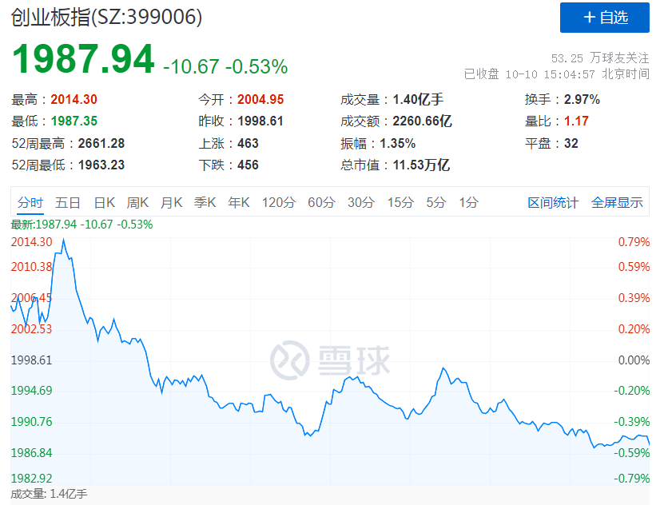
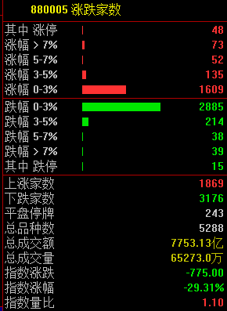
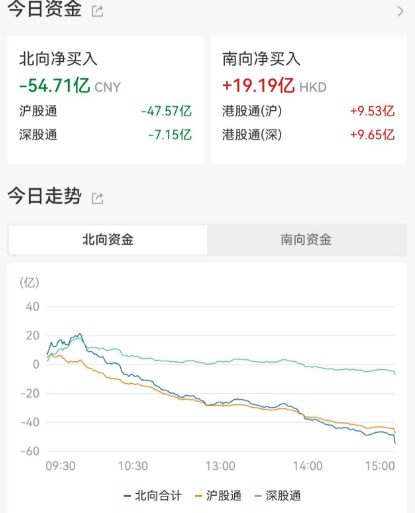
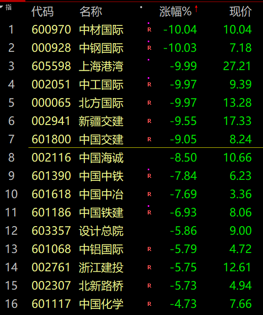
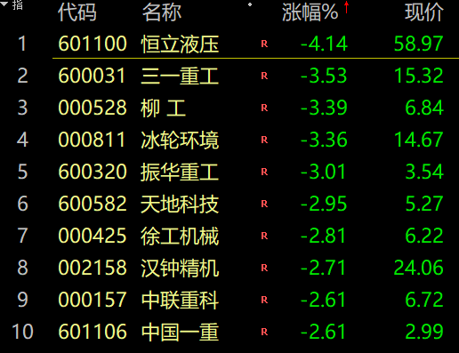
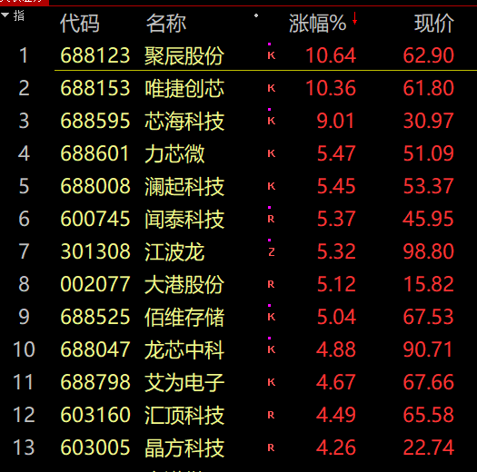
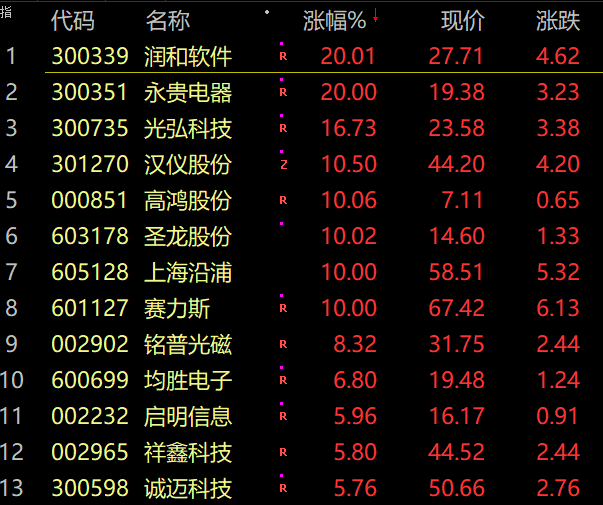
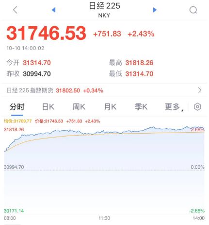
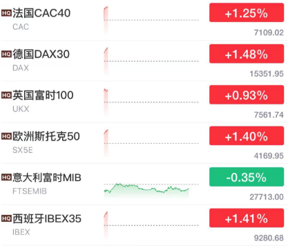

# 发生了什么？A股跳水，中字头基建板块闪崩，半导体板块逆势大涨

中国基金报 泰勒

兄弟姐妹们啊，今天的市场很分化啊，港股那边已经在反弹大涨，A股这边早盘冲高，没撑多久，就一路跳水到收盘！

沪指今日高开低走，创业板指冲高回落。今日成交7753亿元。截至收盘沪指跌0.7%，深成指跌0.56%，创业板指跌0.53%

共1869只个股上涨，3176只个股下跌。

北向资金净卖出近55亿元。

一起找找原因。

今天市场跳水，最大的原因是中字头基建板块的突然闪崩，这跟外部干扰直接关系，巴以冲突扩大化，外围地缘风险不确定性提升。

半导体板块大涨。国君分析称，中美关系阶段性企稳有望促进高风险偏好投资者交易活跃度改善及相关领域的反弹机会。

**事件及影响：**
对华态度鹰派的美国参议院多数党领袖舒默率领国会代表团访华。11月APEC会议前中美关系有望阶段性企稳，当前多数板块股票价格和估值处于低位，中美关系阶段性企稳这一边际催化有望形成主题性机会。

反弹的线索一：此前制裁密集且调整较多的科技领域。美国同意三星和海力士向其中国工厂提供设备，表明中美关系企稳将促进部分领域供应链畅通。科技领域出口管制主要针对半导体/高端装备和AI等前沿科技领域。

反弹的线索二：此前关税加征较大且调整较多的经贸领域。2018年7月美国开始对中国商品加征关税以来，提升了相关行业和公司对美出口的成本，机械设备/电子/汽车零部件/家电/轻工制造等行业受影响程度较大。

市场调整，资金抱团华为产业链，华为跟赛力斯将推出M7，并在12月份发布M9。此外，华为手机的持续发布也将带动汽车链条的情绪。

此外，今天外围市场大涨，港股反弹，日经大涨2%，欧洲开盘大涨。

