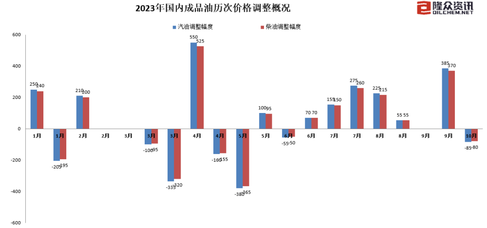

# 国内成品油价下半年首次下调，加满一箱油少花3.5元

界面新闻实习记者 | 罗容

成品油价迎来年内第七次下调。

10月10日，国家发改委发布消息称，自24时起，国内汽油价格和柴油价格分别下调85元/吨和80元/吨。折合升价，92号汽油、95号汽油和0号柴油均下调0.07元。

此次调价后，私家车和物流企业用油成本略有下降。以油箱容量为50升的小型私家车计算，车主们加满一箱油将少花3.5元左右；对满载50吨的大型物流运输成本而言，平均每行驶100公里，燃油费用减少2.8元左右。

据隆众资讯计算，调价后，全国大多数地区车柴价格8元-8.2元/升左右，92号汽油零售限价7.9元-8.1元/升左右。

本次调价是今年第二十次成品油调价，也是油价下半年首次下调。此次调价过后，今年成品油调价将呈现“十涨七跌三搁浅”的格局。

_图片来源：隆众资讯_

“调价周期内，国际原油呈现震荡下行趋势，国内成品油市场批发价格均呈下跌。”隆众资讯成品油分析师褚英斌称。

褚英斌表示，汽柴油价格在中秋国庆假期间持续下跌，而节后前期原油深跌利空仍未消化，中下游对市场仍持观望态度，入市较为谨慎，汽柴油价格跌势不减。

卓创资讯成品油分析师孟鹏指出，本计价周期内，受欧佩克+延长供应削减、美国原油库存下降等因素影响，欧美原油价格一度触及年内高点。

“但由于美元走强以及供应不确定性，加上美国库欣地区库存增长，原油价格冲高后快速回落，原油价格在国庆节假期内跌至85美元/桶中位。”孟鹏表示。

金联创成品油分析师王延婷指出，尽管计价周期末期，巴以冲突升级引发对市场供应的担忧，提振油价再次上涨，但本周计价周期内，原油价格整体走势依然下行。

截至北京时间10月10日凌晨收盘，WTI 11月原油期货报86.38美元/桶，涨4.34%；布伦特12月原油期货报88.15美元/桶，涨4.22%。

据金联创测算，截至10月10日第十个工作日，参考原油品种均价为89.17美元/桶，变化率为-1.45%。

_图片来源：隆众资讯_

机构对下一轮成品油调价方向存在分歧。

隆众资讯成品油分析师李彦向界面新闻指出，以当前的国际原油价格水平计算，下一轮成品油调价开局将呈现下调的趋势。目前来看，国际原油价格呈现高位震荡态势，空好博弈迹象有所增强，预计下一轮成品油调价搁浅的概率较大。

王延婷认为，短期内，国际原油价格仍有上行空间，变化率或转为正向发展，新一轮零售价上调概率较大。

孟鹏指出，短期地缘政治影响仍存，市场担忧石油供应中断风险，将给予市场一定支撑。但另一方面，全球经济运行仍有较大压力，将会抑制原油价格涨幅，因此下周期国际油价或呈现震荡偏强运行。

“受此影响，虽然下周期初，原油变化率或以负值开局，成品油零售限价仍存下调预期，但由于原油走势不确定性较大，因此调价方向并不明朗。”孟鹏表称。

按照当前成品油调价周期测算，下一次调价窗口将在10月24日24时开启。

