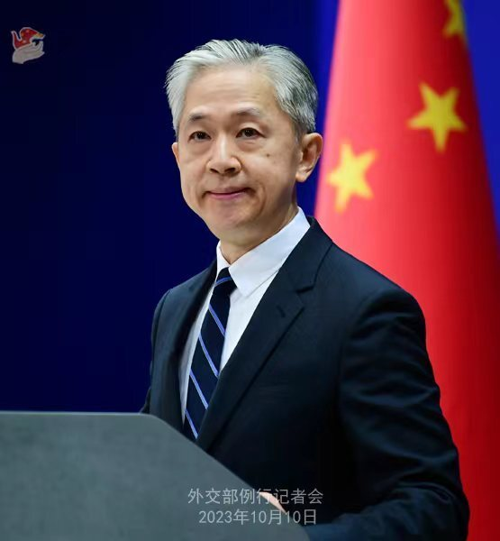

# 外交部回应蔡英文讲话：无论说什么，都改变不了中国必然统一的大势

10月10日，外交部发言人汪文斌主持例行记者会。

法新社记者：蔡英文今天发表讲话。发言人对此有何评论？

_汪文斌 图源：外交部网站_

汪文斌：世界上只有一个中国。台湾是中国领土不可分割的一部分，这是台海真正的现状。当前台海和平稳定的最大威胁，是民进党当局顽固坚持“台独”分裂立场，勾连外部势力谋“独”挑衅。要维护台海和平稳定，就必须旗帜鲜明坚持一个中国原则，反对“台独”分裂，反对外部干涉。无论民进党当局说什么、做什么，都改变不了台湾是中国一部分的事实，更改变不了中国必然走向统一的大势。

