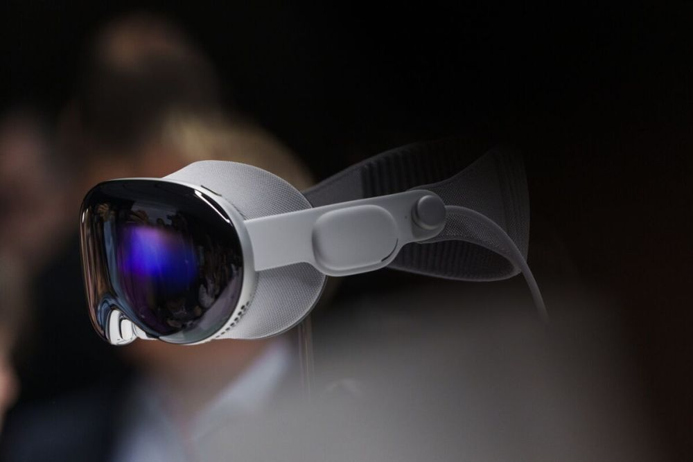
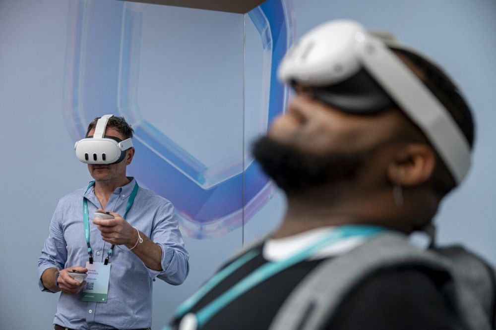
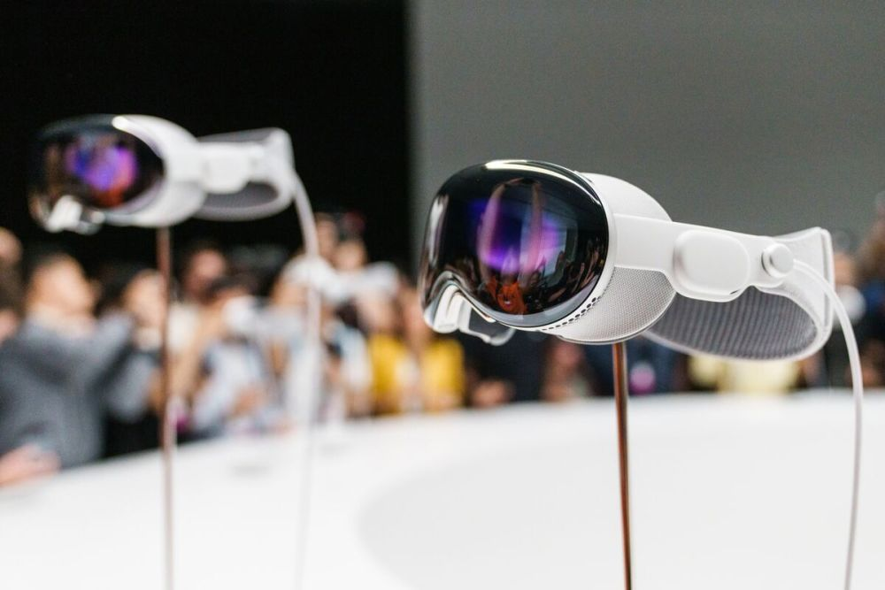

# 头显大战加剧：苹果急开发下一代Vision Pro，Meta明年推更便宜Quest

**划重点**

  * _1_ 苹果已经开始研发下一代Vision Pro，目标是让其佩戴起来更舒适，体积更小，重量更轻。
  * _2_ Meta计划明年推出更便宜的混合现实头显，看起来很像Quest 3，但使用的组件更便宜。在高端市场，Meta准备推出可替代Quest Pro的产品。
  * _3_ Meta明年不打算更新眼镜硬件，但预计将在2025年推出真正的AR眼镜，目前正在内部测试AR屏幕。

虽然苹果首款混合现实头显Vision Pro和Meta Quest 3都还没有上市，但两家公司已经开始在研发后续迭代产品方面展开较量。

苹果关注的重点是让其未来设备佩戴起来更舒适，这意味着其体积将会更小、重量也更轻。由于其尺寸和重量很大，苹果初代Vision
Pro在测试中曾导致用户颈部拉伤，这可能会让那些对混合现实头显持谨慎态度的消费者更显犹豫。

与此同时，Meta正在寻求降低未来迭代产品的价格。虽然即将推出的Quest 3售价远低于Vision
Pro，但它仍比Meta之前推出的头显贵200美元。Meta希望将头显价格降至之前的300美元水平，这将有助于将混合现实技术引入更广泛的市场。

尽管苹果和Meta都在忙着推出现有设备，但解决上述问题的工作已经在幕后展开。据悉，Quest 3将于本月上市销售，而苹果准备在明年年初开始销售Vision
Pro。

随着头显大战变得越来越激烈，苹果和Meta的心态却截然不同。在内部，苹果有信心其将拥有更好的产品。Vision
Pro将搭载更高分辨率的直通摄像头，让用户看到周围真实世界的组件，同时配备强大的M2芯片和更清晰的虚拟现实屏幕。但也有人担心，消费者是否会认为有必要购买这款设备，尤其是在售价高达3500美元的情况下。

Meta内部的情绪似乎与苹果不同。一方面，该公司相信其拥有更好的游戏生态系统，毕竟Quest
3有很多VR游戏可供选择。另一方面，500美元的价格也让这款头显对主流消费者更具吸引力。

但Meta很难忽略苹果带来的威胁，Vision
Pro可能会引领消费者以一种前所未有的方式接受混合现实技术。最终，Meta可能会采取观望的态度。虽然该公司有自己的产品路线图，但它可能会根据苹果最终为Vision
Pro添加的功能，以及该技术如何与客户产生共鸣来调整自己的产品。

正如Meta内部的一位消息人士所说，“我们正处于‘害怕苹果’的阶段”，就像2007年iPhone发布之前手机行业的感受一样。

Meta已经调整了自己的战略，使其向苹果靠拢。Quest 3并没有将自己定位为通往元宇宙的门户，而是被视为游戏和生产力应用程序的工具。苹果在Vision
Pro上也采用了同样的做法。事实上，苹果的营销主管甚至拒绝使用“元宇宙”这个字眼儿。

当然，Quest 3也有自己的优点。除了价格优势之外，它在几乎所有方面都比Quest
2有所改进。这款设备给人的感觉要快得多，也不显得那么笨重，其虚拟现实和增强现实技术实现了更完美融合。即使提价，Quest
3的成本也只有苹果同类产品的七分之一。

Meta现在的目标是进一步降低价格。据悉，Meta计划明年推出一款更便宜的混合现实头显。它看起来很像Quest
3，但使用的组件更便宜。同时，Meta将Quest 3重新定位为其中端产品。在高端市场，该公司准备推出一款替代Quest
Pro的产品。这款产品去年以1500美元的价格推出，但在消费者中反响不佳，价格已经降至1000美元。

Meta正在考虑降低入门级头显成本的一种方法是，不将其与手持控制器捆绑销售。取而代之的是，用户必须单独购买配件，或者用手势操作头显。值得注意的是，Vision
Pro的包装盒中也没有控制器，但这是因为苹果提供了复杂的眼控和手控功能，而这同样不是一个节省成本的举措。

现在，手持控制器已经成为操作设备的重要组成部分。在操作系统导航和启动应用程序时，仅仅依靠手势就足够了，但在使用虚拟键盘时，这种方法就不够用了。对Meta来说，还有一线希望，那就是苹果的虚拟键盘似乎也没有好到哪里去。换句话说，它可能需要将蓝牙键盘与头显进行匹配。

在苹果公司，软件和运营部门的员工正在为Vision Pro的首次亮相做准备。这款设备的硬件已经准备就绪几个月了，这让视觉产品团队（Vision
Products Group）可以投身研发下一代机型。该公司正在考虑多种选择，包括推出低端机型和功能更强大的机型。

下一代Vision Pro的研发工作仍处于早期阶段，但苹果希望这款设备更轻，至少体积要略小一些。目前的Vision
Pro重约1磅（约合450克），测试表明，对于一些用户来说，即使在短时间内使用，它也会让人觉得太重。苹果正在考虑在第一款机型上使用头带来解决这个问题，但从长远来看，让硬件变得更轻是一个更好的解决方案。

另一个挑战是让戴眼镜的人戴起来更简单。在第一代Vision
Pro的开发过程中，苹果决定将这款设备瘦身，不再为处方眼镜留出空间。相反，该公司与蔡司合作，销售可以利用磁性吸附在头显屏幕上的处方镜片。

但正如之前报道的那样，提供数千种不同镜头组合的过程已被证明是令苹果运营团队万分头疼的问题。幸运的是，该公司可能找到了一个解决方案，即从工厂发货带有预装处方镜片的定制头显。

这可能会简化客户的体验，但也会带来新的问题。首先，内置处方镜片可能会让苹果成为某种医疗服务提供商，而该公司可能不想处理这一问题。此外，这种程度的定制将使消费者更难共享头显或转售它。当然，对于佩戴眼镜的用户来说，体验可能会随着时间的推移而改变。

从长远来看，这些问题中的许多都可以通过从混合现实转向独立的增强现实来解决。从表面上看，这有点违反直觉，但与AR和VR混合使用相比，轻型AR眼镜将带来更好的体验。数据将被覆盖在透明镜头上，而不是依赖笨重的直通摄像头和VR屏幕。而且，在理想情况下，你可以整天戴着眼镜。

但开发真正的AR眼镜说起来容易做起来难。一年前，苹果几乎停止了独立AR眼镜的研发，因为这项技术有太多挑战难以攻克。对于苹果首席执行官蒂姆·库克（Tim
Cook）来说，这是一个特别大的挫折，因为他将AR眼镜视为一个关键目标。

另一方面，Meta仍然将AR眼镜视为重点项目。为了为这一愿景，该公司本月将与雷朋合作发布第二代智能眼镜。这款眼镜缺乏增强现实功能，尽管其“智能”功能包括拍照、视频、打电话和听音乐。

据悉，Meta不打算明年更新眼镜硬件(只会提供新的颜色选项)，而更大的改进预计将出现在2025年。届时，该公司希望发布带有AR屏幕的智能眼镜。Meta现在正在对AR屏幕进行内部测试，屏幕上显示的内容包括文本消息、地图方向和当前正在播放的音乐的相关信息。但Meta还没有最终确定它将发布什么产品。

就像针对Quest头显采取的策略一样，Meta希望最终将其眼镜划分为低端和高端型号，这可以根据它们是否具有AR功能进行区分。

至于苹果，资深分析师马克·古尔曼（Mark Gurman）预计，该公司将来可能会再次加快AR眼镜的开发，并最终会实现库克拖延已久的梦想。（文/金鹿）

