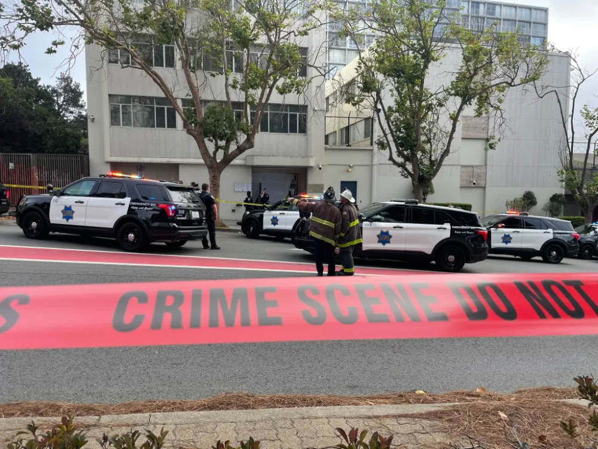

# 旧金山警方：已击毙驾车冲闯袭击中国驻旧金山总领馆的司机

【环球网快讯】据福克斯新闻旗下地方电视台“fox4kc”等媒体最新消息，旧金山警方表示，他们于当地时间9日开枪击毙了驾车冲闯袭击中国驻旧金山总领馆的男子。

_当地时间9日下午，中国驻旧金山总领馆外的当地警方和其他应急车辆 图源：“旧金山标准”新闻网_

报道称，旧金山警方称，尽管进行了抢救，但中枪的嫌疑人在被送到医院后宣布死亡。此外，旧金山警方还表示，该部门和美国国务院官员正在与中国领事馆就此事沟通合作。

北京时间10月10日上午，中国驻旧金山总领馆发言人表示，当地时间2023年10月9日下午，有不明身份人员驾车暴力冲撞闯入我馆证件大厅，对工作人员及现场民众生命安全构成严重威胁，对我馆设施与财产造成严重破坏，性质极其恶劣。目前犯罪嫌疑人已被警方控制。我馆严厉谴责这起暴力袭击事件，保留追究事件相关责任的权利。我馆已向美方提出严正交涉，要求迅速查明真相，依法严肃处置，并敦促美方按照《维也纳外交关系公约》《维也纳领事关系公约》和《中美领事条约》规定，采取一切必要措施确保总领馆人员及馆舍安全。

