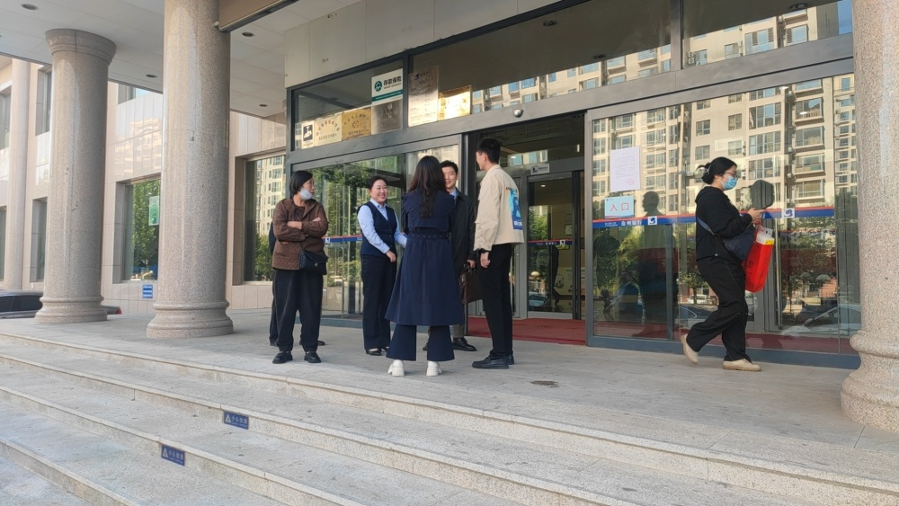
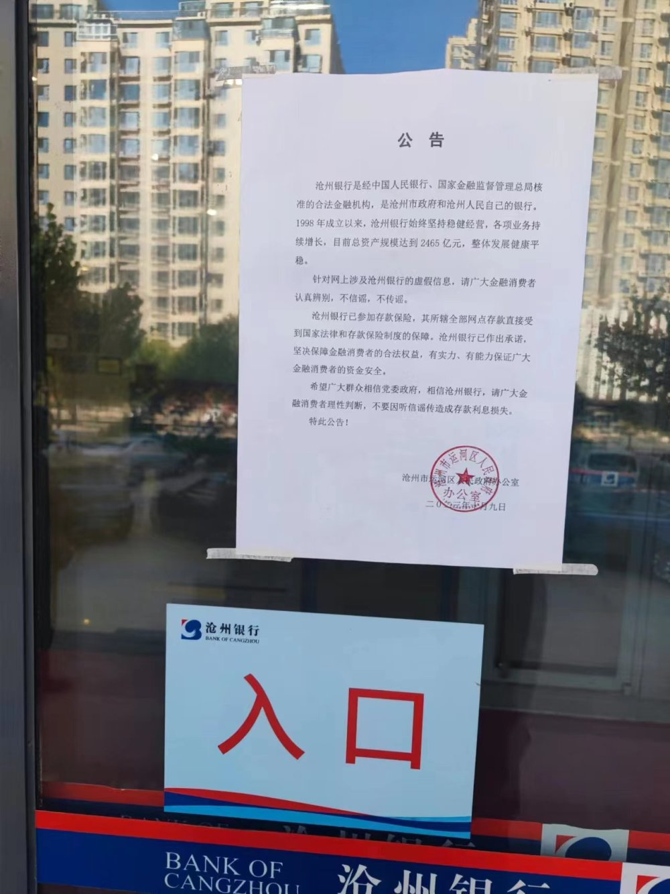

# 沧州银行存取业务一切正常，警方：昨夜至凌晨3点一直在抓谣言散布者

随着近日中国恒大董事会主席许家印因涉嫌违法犯罪被依法采取强制措施，市场上传言四起，一份“恒大所欠银行贷款明细列表”在某平台传播。

10月7日，“入列”的沧州银行率先在官网辟谣，发布了一份《关于网传我行恒大贷款情况的澄清公告》，称上述列表所涉沧州银行贷款数据严重失实，该行向恒大及其关联企业贷款金额为3.46亿元。这一数据，明显低于此前网上流传的列表数值。

10日早间，第一财经记者来到位于河北省沧州市的沧州银行总行，有部分储户在银行门口打探消息。

其中一位闻讯赶来的储户告诉第一财经记者：“目前银行存取业务一切正常。”

在银行正门上，记者看到，沧州市运河区人民政府办公室张贴了公告，“针对网上涉及沧州银行的虚假信息，请广大金融消费者认真辨别，不信谣，不传谣。”

另外，公告显示，“沧州银行已参加存款保险，其所辖全部网点存款直接受到国家法律和存款保险制度的保障。沧州银行已作出承诺，坚决保障金融消费者的合法权益，有实力、有能力保证广大金融消费者的资金安全。”

该行一位客户经理反复向第一财经记者强调：“用户的担心很正常，但（针对恒大的欠款）就是网络谣言，我们的经营没有任何问题。”

她告诉记者，如果在网络上看到任何（关于恒大的）谣言，欢迎举报。

一位公安部门的人士在出示警官证后，向记者表示，“已开始陆续拘留谣言散布者，一直到今日凌晨3点，拘留了不少人。”

当记者问及究竟是谁在散布谣言时，对方表示“目前还不便透露”。

