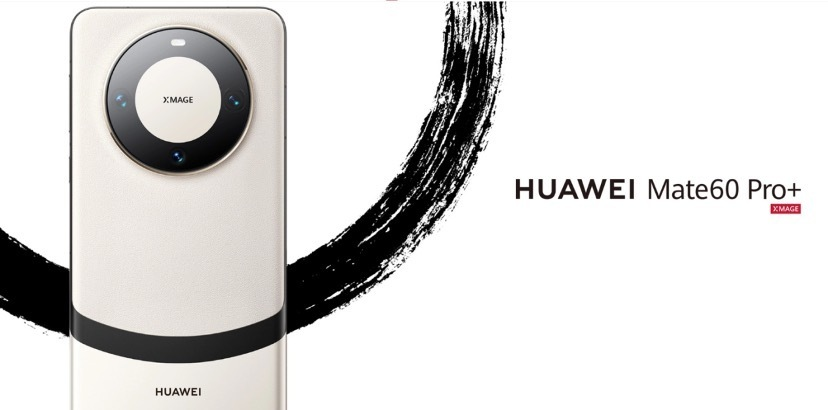

# 消息人士：华为预计2024年手机出货量7000万台

记者：张勇毅

10 月 10 日，电厂记者通过华为相关消息人士了解到，华为目标在 2024 年出货 6000 万- 7000
万部智能手机。该人士还表示华为已经向供应链追加了足够数量的订单，确保 2024 年全年能够达到这一出货数字。

虽然相比 2022 年的出货量已经翻了一倍，但这一数字也仅相当于 2014 年华为的全年出货量：过去十年华为智能手机全年出货量巅峰定格在 2019
年，彼时全年出货量为 2.4 亿台，同年苹果 iPhone 全年出货量为 1.98 亿台。

此前据供应链消息，华为 Mate60 Pro 与 Mate60 Pro+ 的出货量已经上调至 2000 万台，相比首批备货量追加了近1700
万台。Mate60 系列帮助华为拿下了九月中国智能手机市场销量第一，Mate60 系列的产能逐渐摆脱爬坡阶段。华为近期也同步上调了 2023
年下半年的预计出货量。

受芯片以及供应链整体影响，华为在 2022 年的全年出货量仅为 3000 万台，2023 预计全年出货量将达到 4000 万台，相比小米、OPPO/vivo
等品牌的全年出货量仍有明显差距，但 600 美元以上的高端手机市场在华为退出之后，实际上主要由苹果接手，2023 上半年苹果占据其中 74%
的市场份额，国产手机厂商冲击高端的努力在市场份额的体现上仍显乏力。

“在高端手机产品上，可能和苹果硬杠的只有华为，所以在高端市场上我们应该还是最强的那一家。”华为消费者业务CEO 在今年的华为发布会中如此表示。

除了华为回归带来的逆势上涨之外，整体智能手机市场仍然维持明显的收缩趋势：据 IDC 八月发布的分析数据，2023 年全球智能手机出货量预计比 2022年
减少 4.7%，降至 11.5 亿部，创10年来的新低。与此同时截止七月上市新机型累计 219 款，同比增长 4.3%，占同期手机上市新机型数量的
92.0%。

虽然预计到2024年手机出货量将会恢复，但未来5年的年均增长率仅为 1.7%，此外华为计划中仍有数款 5G
中端智能手机产品的发布会计划，届时将对其他国产智能手机厂商带来更大的压力。

