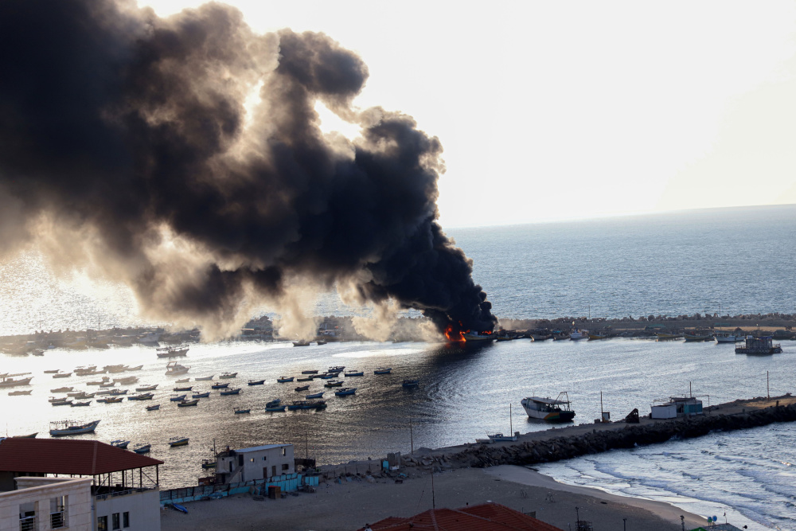
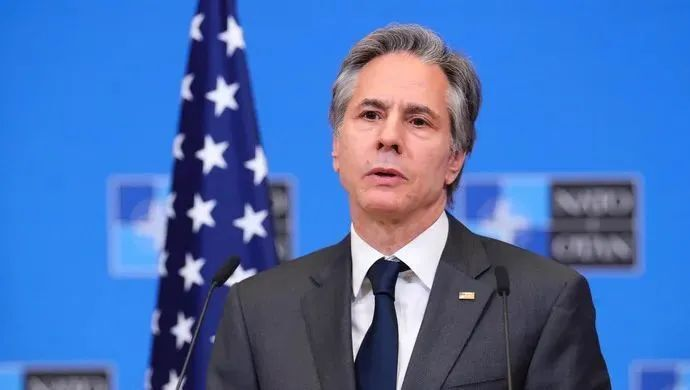

# 两次收回声明，面对巴以冲突美国务院为何吞吞吐吐

_▲10月10日，加沙城港口遭以色列袭击后升起浓烟。图/新华社_

巴以冲突再起，以色列“铁后台”美国的动向受到高度关注。当此之时，美国国务卿布林肯的一番操作，则引来纷纷议论。

据环球时报援引福克斯新闻网9日报道，美国国务卿布林肯当天删除了其前一天在社交平台上的一条推文。在这条被删除的推文中，布林肯称“支持土耳其的停火倡议并要求哈马斯立即释放所有人质”。取而代之的，则是一份“以色列有权自卫，解救人质，并保护其公民”的声明。

**公关危机下的应对技巧**

布林肯的180度大转弯已是美国国务院近日第二次收回呼吁以色列克制的声明。

此前，美国国务院下属机构——巴勒斯坦事务办公室曾发布推文，“敦促各方不要采取暴力和报复性袭击措施，恐怖和暴力解决不了任何问题”，但这则推文随后“消失”。

有分析家认为，在以色列当局已下定决心进行“暴力和报复性袭击措施”时，上述声明显然不合时宜。但党派色彩较淡的分析家则指出，美国国务院最初的两则推文并非“绥靖调和”，其后的修正也不过是公关危机下的应对技巧，实际立场并无重大转变。

事实恐怕也的确如此：土耳其停火倡议的基石是人质交换，而布林肯被删除推文中支持停火却仅要求哈马斯“立即释放所有人质”，是典型的西方外交“Yes，But”（即委婉的“NO”）话术。而其对“暴力和报复性袭击”态度的变化也一如美国在类似问题上的一贯“画风”——当以色列希望、需要“暴力和报复性袭击”时闭嘴，而当以色列的对手也“暴力和报复性袭击”时则叫停并谴责。

而布林肯删后重发的“支持以色列声明”同样皮里阳秋，留有后手：支持的仅是“自卫、解救人质并保护其公民”范畴内的军事行动，言外之意则是超出这一范围是否支持待定。

 _▲美国国务卿布林肯资料图。图/新华社_

**美国政坛的纠结**

外交官们玩弄话术的背后，折射出美国政坛围绕此事的纠结。

美国是以色列外拥有最大犹太人社区的国家。美国犹太人在金融、财经、传媒、教育等领域拥有较大影响力。第三次中东战争以来，以色列成为美国在中东乃至全球最忠实的代理人，而美国则为以色列提供了充分的军事、政治、外交扶持。

但美国对以色列的支持，首先也是从其本国最高战略利益出发的。因此美国政府也会对以色列某些违背美方战略利益的“出格诉求”持保留甚至反对态度。

自1993年《奥斯陆协议》签署以来，美国始终支持将“两国方案”作为巴以和平“方向之一”，以及长期在外交层面不支持以色列承诺放弃对被占领土上新建、扩建定居点的冻结，不主动将使馆迁离特拉维夫，都是这种“有所保留”的表现。

值得一提的是，美国犹太社区的面貌和以色列有很大差异，突出表现为更世俗、更自由化，大多数美籍犹太人抱持同情以色列，但讨厌利库德集团，尤其反感内塔尼亚胡的态度。这就迫使美国民主党政客不得不在话术上对支持以色列有所保留和“润饰”。正因如此，此次事发后，民主党控制的国务院才会“吞吞吐吐”。

民主党内影响力蒸蒸日上的“进步派”国会议员更直接站出来说一些“政治不正确”的话。如“进步派”干将奥马尔在例行公事般谴责哈马斯“恐袭”后随即表示，“如果中东没有和平与正义，这种暴力将无限循环”。

相对而言，支持共和党的犹太人家族和群体在美国犹太人社区中较少、较孤立，但也因此更执拗，而共和党人尤其保守派共和党人也热衷于扶持他们，以牵制美国犹太社区对民主党一边倒的偏爱。正因如此，内塔尼亚胡才会对共和党心悦诚服。也正因如此，拜登才会在上台前和上台初对内塔尼亚胡百般嫌弃。

共和党人尤其是特朗普，当然不会放过如此有利于己的机会。10月7日，特朗普在艾奥瓦州锡达拉皮兹市演讲时还表示，拜登背叛了以色列，如果他成为总统，将再次与以色列站在一起。

 _▲被冷落265天后，9月20日，美国总统拜登与以色列总理内塔尼亚胡会面。图/ICphoto_

**戏里戏外**

在这种戏中有戏的背景下，计划参加2024年美国总统大选的共和党候选人一个个显得比以色列总理府、外交部和国防军总部更“鹰派”。

反观以色列，时至今日的地面军事行动不过局限在边界本方一侧，对加沙则以空袭、炮轰和封锁为主，甚至最急迫、也最容易赢得国际间支持的越境人质解救，截至目前也并未实质性展开。道理是明摆着的：不论如何激愤，直接“作战”的以色列决策层都不得不权衡得失。毕竟冒险进入情报搜集匮乏、宛如瓦砾堆的加沙，必须慎重。

另外一边，美国的欧洲盟友在事发之初一边倒公开支持以色列，并第一时间宣布冻结对巴勒斯坦的人道援助，但随着哈马斯“鸣金收兵”，多数欧洲国家的态度发生微妙变化。

种种迹象表明，如果哈马斯“收手”而以色列持续“加码”，欧美的“共情”也会发生变化，这也是美国政府使用“两头堵”外交话术的用心所在。

在美国，尽管支持以色列的声浪占据主流，其他声音同样不绝于耳。事发之初，白宫办公室曾发表声明，指责哈马斯“无端发动袭击”，这种说法就遭到不少团体和个人的质疑。

连日来，在美国各地更爆发了40场以上以色列和哈马斯支持者间的冲突：在“进步派”大本营纽约，民主党政客内部就表态口径发生公开分歧；而在学术重镇哈佛，同情以色列和同情巴勒斯坦的两派师生正彼此“上纲上线”，从线上一路吵到线下。

种种迹象表明，巴以冲突主战场之外，大西洋另一侧的美国可能也变成了“战场”，“交战各方”将是美国民主党和共和党的参选者，甚至美国民主党内的建制派和“进步派”。

撰稿 / 陶短房（专栏作家）

编辑 / 刘天红

校对 / 陈荻雁

