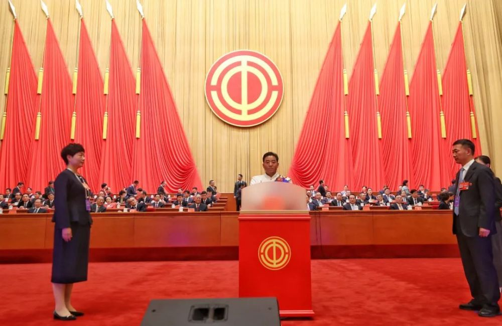
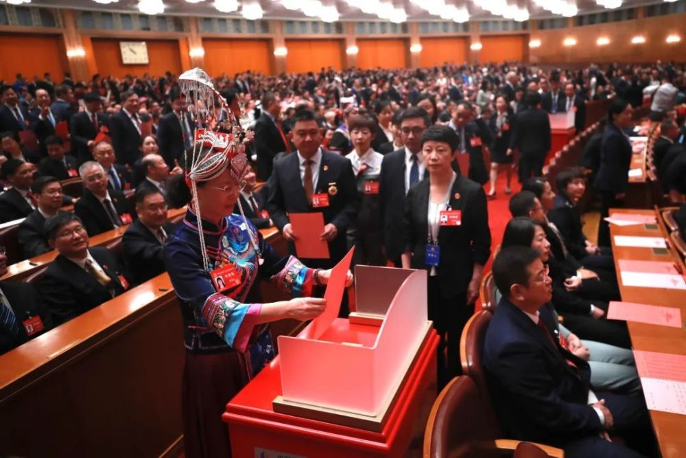
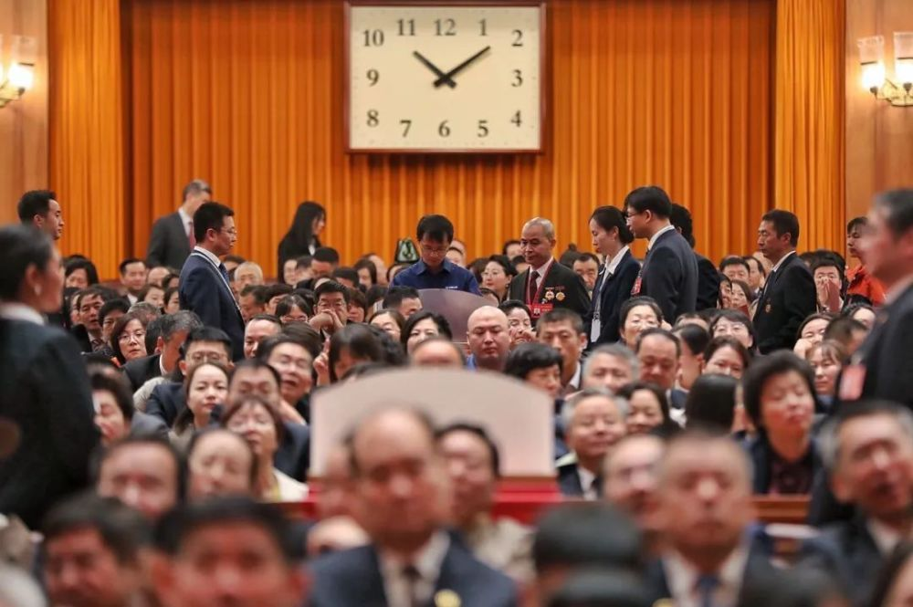
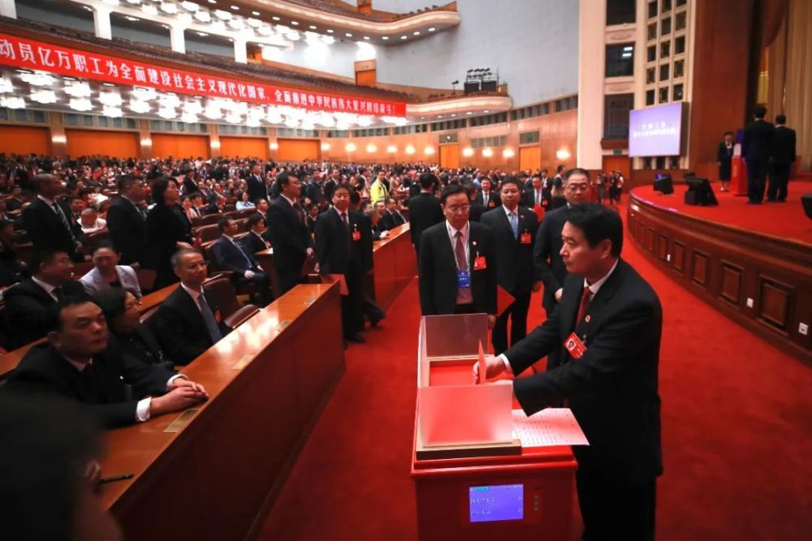
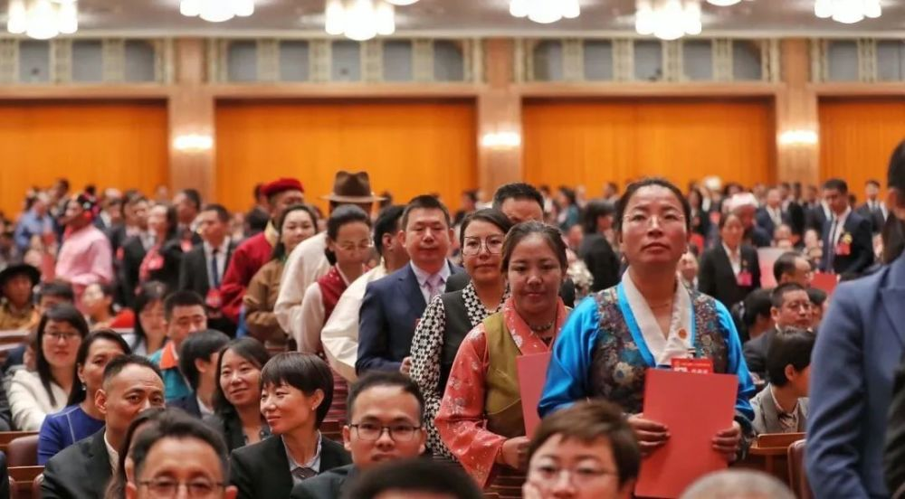
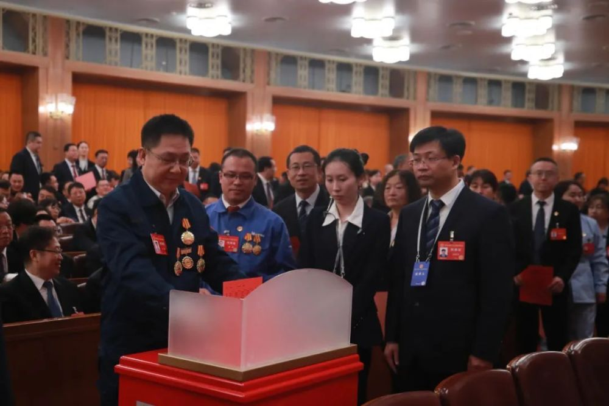

# 中国工会新一届领导机构诞生

**中国工会十八大选举产生中华全国总工会第十八届执行委员会和经费审查委员会**

**中国工会新一届领导机构诞生**

中国工会第十八次全国代表大会第二次全体会议10月11日上午在人民大会堂举行。大会选举产生了中华全国总工会第十八届执行委员会、中华全国总工会第十八届经费审查委员会。全国人大常委会副委员长、大会主席团常务主席王东明出席会议。

会议由大会主席团常务主席、大会秘书长徐留平主持。徐留平宣布，大会应到代表2002名，实到代表1945名，符合规定人数。

大会以举手表决的方式通过了大会选举总监票人、监票人名单（草案），随后以无记名投票方式选举产生了中华全国总工会第十八届执行委员会委员和中华全国总工会第十八届经费审查委员会委员。

中华全国总工会第十八届执行委员会由于金伟等278名委员组成，中华全国总工会第十八届经费审查委员会由马晖等40名委员组成。当大会宣布选举结果时，全体与会代表热烈鼓掌，祝贺中国工会新一届领导机构诞生。

根据《中国工会章程》，中国工会的最高领导机关，是工会的全国代表大会和它所产生的中华全国总工会执行委员会。中华全国总工会执行委员会，在全国代表大会闭会期间，负责贯彻执行全国代表大会的决议，领导全国工会工作。

来源 全国总工会 | 作者 郑莉 郝赫 摄影 杨登峰 王伟伟

编辑 胡德成

流程编辑 刘伟利

