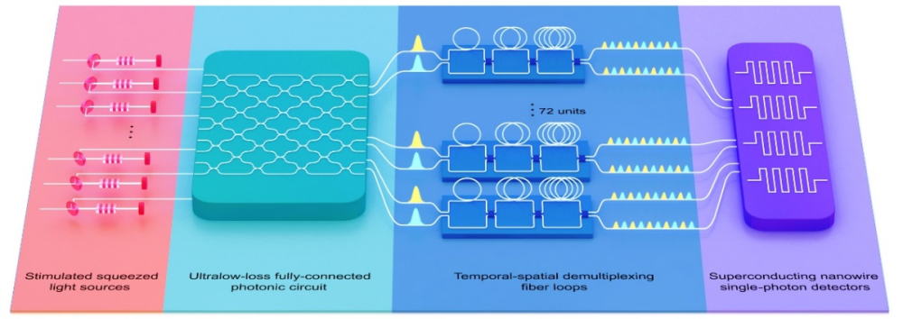
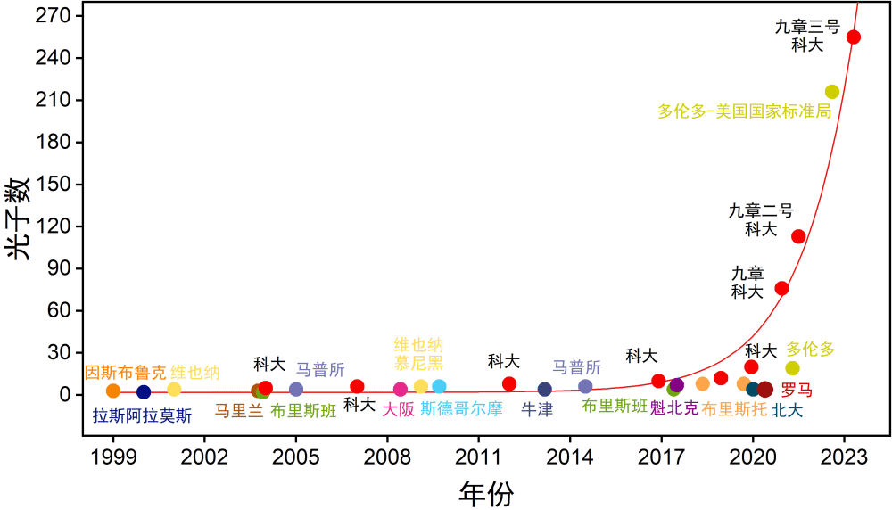

# 中国成功研制“九章三号”量子计算原型机：求解特定问题快一亿亿倍

据新华社，10月11日，中国科学技术大学潘建伟、陆朝阳等组成的研究团队与中国科学院上海微系统与信息技术研究所、国家并行计算机工程技术研究中心合作，宣布成功构建255个光子的量子计算原型机“
**九章三号** ”。 **这项成果再度刷新光量子信息技术世界纪录** ， **求解高斯玻色取样数学问题比目前全球最快的超级计算机快一亿亿倍**
，在研制量子计算机之路上迈出重要一步。

国际知名学术期刊《物理评论快报》发表该成果。根据公开发表的最优算法， **“九章三号”处理高斯玻色取样的速度比上一代“九章二号”提升一百万倍**
，“九章三号”1微秒可算出的最复杂样本，当前全球最快的超级计算机“前沿”（Frontier）约需200亿年。

_实验装置示意图 图片来源：央视新闻_

量子计算是后摩尔时代的一种新的计算范式，它在原理上具有超快的并行计算能力，可望通过特定量子算法在一些具有重大社会和经济价值的问题方面相比经典计算机实现指数级别的加速。因而，研制量子计算机是当前世界科技前沿的最大挑战之一。

为此，国际学术界制定了三步走的发展路线。其中，第一步是实现“量子计算优越性”，即通过对近百个量子比特的高精度量子调控，对特定问题的求解展现超级计算机无法比拟的算力。同时，在此过程中，发展出可扩展的量子调控技术，为具备容错能力的通用量子计算机的研制提供技术基础。

据央视新闻，2020年，中国科学技术大学团队成功构建76光子的“九章”光量子计算原型机，首次在国际上实现光学体系的“量子计算优越性”，并克服了谷歌实验中量子优越性依赖于样本数量的漏洞。2021年，中国科大团队进一步成功研制了113光子的可相位编程的“九章二号”和56比特的“祖冲之二号”量子计算原型机，使我国成为唯一在光学和超导两种技术路线都达到了“量子计算优越性”的国家。

 _光量子计算的国际竞争态势 图片来源：央视新闻_

通过一系列创新，中国科学技术大学团队首次实现了对255个光子的操纵能力，极大地提升了光量子计算的复杂度，处理高斯玻色取样的速度比“九章二号”提升了一百万倍。在构建“九章”系列光量子计算原型机的基础上，研究团队还揭示了高斯玻色取样和图论之间的数学联系，完成对稠密子图等两类具有实用价值的图论问题的求解，
**相比经典计算机精确模拟的速度快1.8亿倍。** 此外，又在国际上首次演示了无条件的多光子量子精密测量优势。

每日经济新闻综合新华社、央视新闻

封面图片来源：央视新闻视频截图

