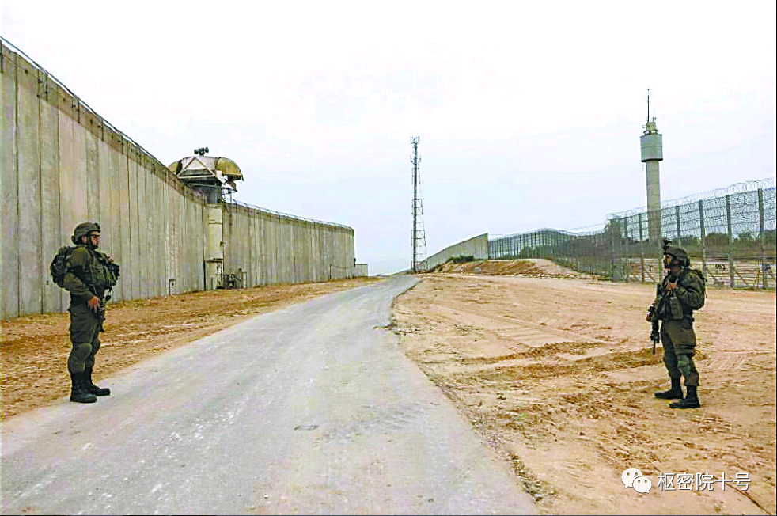

# 以色列“智能化边境墙”的神话，也破灭了

昨天说了[以色列“铁穹”系统神话被揭穿](https://new.qq.com/rain/a/20231010A005DJ00)的事，但还有表现更糟的……今天就来聊聊另一个破灭的神话——智能化边境墙。

大概两年之前，以色列曾高调炫耀在加沙附近修建的智能化边境墙全部竣工。当时以军总参谋长阿维夫·科哈维得意地说：“这道屏障是我们地面、空中、海上防御铁壁的一部分。”

然而这道“铁壁”，在哈马斯的这一轮攻击面前几乎没有发挥作用。这是为什么呢？

多年以来，面对以色列的全面封锁，哈马斯在加沙修建了复杂的地下隧道网，用来走私食品、药品和武器。2014年7月，哈马斯武装人员通过其中一条隧道冲入以色列，对以军前哨基地成功发起袭击，引发双方大规模军事冲突。在那以后，以色列军方宣布加速在加沙周围修建智能化边境墙，旨在切断加沙对外的秘密通道。

这座耗资约11亿美元的隔离墙全长64公里，地表是6米高的铁丝网围栏，顶部安装有带摄像头的雷达系统，每隔一段还有远程控制的自动武器站；地下部分则是延伸数米深的混凝土墙，并配备有可以探测地下震动的传感器，能监测可能的隧道挖掘行动。沿着围栏建造的这些传感器可以将所有监测信息转发到附近军事基地。同时以军还定期派出巡逻队沿边境墙展开巡视。据称，仅在边境墙的施工期间，以军就发现并摧毁了18条隧道。

这道边境墙还从陆地一直延伸到海里。2018年年初，一名以色列高级海军军官强调了来自海上的威胁。海上边境墙同样由水上和地下两部分组成，配备有侦测海上越境人员的系统和可远程控制的武器系统。

2022年，以色列进一步设想沿着边境墙部署多座激光拦截武器，用于保护以色列免受导弹、火箭弹及无人机的威胁。

然而在哈马斯7日发动的突袭中，重金打造的智能化边境墙发挥的作用非常有限。哈马斯经过精心组织，实施了复杂的海陆空联合行动。其中空中突击分队利用动力滑翔伞从空中越过边境墙，尽管实际兵力不多，但他们成功吸引了以军大部分注意力。哈马斯发布的视频显示，无人机在突破以军边境防御时发挥了重要作用。视频显示，这些无人机定点投掷的爆炸物成功摧毁了边境墙附近的自动武器站，并炸伤了以军巡逻队的坦克和人员。另一段视频显示，哈马斯利用狙击手远程破坏了自动武器站的摄像头和传感器，使其失效。

最终结果就是，哈马斯在没有受到干扰的情况下，大摇大摆地直接利用推土机推倒铁丝网围栏，数百名武装人员得以轻松地从多处破口穿过边境墙进入以色列境内。

从实战表现看，智能化边境墙本身防护能力有限，只能拦截哈马斯的小规模渗透，而无法应对正面攻击。这不免让人想起50年前第四次中东战争时被埃及轻松突破的以军“巴列夫防线”。它由连续的碉堡、铁丝网、地雷和沙堤等组成，实际上在以军原本的规划里“巴列夫防线”只是一条警戒防线，需要依靠二线的快速反应部队和后方增援部队才有望固守。但以色列对“巴列夫防线”的吹嘘过了头，最后自己都相信了，时任以军参谋长巴列夫就大肆吹嘘这条防线的神奇功效，鼓吹它没有半点纰漏，可谓固若金汤。结果在第四次中东战争中，面对埃及军队的正面强攻，“巴列夫防线”仅几个小时就全面被突破。

如今智能化边境墙也是同样的情况。按照以军设想，凭借以色列强大的情报收集能力，如果哈马斯想要发动大规模进攻，在集结阶段就会被发现端倪，以军可出动增援部队实施“预防式打击”，因此边境墙的防御能力不足并不是问题。但这次以军过于松懈、根本没能做好战斗准备，而且哈马斯精心策划的联合行动成功起到了牵制效果，就连西方媒体也惊叹“哈马斯的地面进攻毫无阻力”。

这也再次证明了那个道理——从来没有攻不破的防线。实战也一次次证明，以色列耗费重金打造的这些防线，并不能换来自身的安全。

