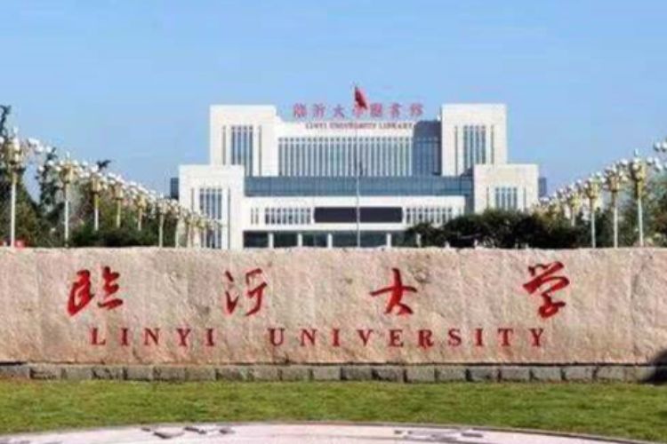

# 副教授因丈夫跳槽遭“捆绑离职”，媒体：临沂大学不怕将来没人敢来吗

媒体报道，傅雯本系临沂大学副教授，因同在临沂大学工作的丈夫申请调离，学校人事处要求夫妻教职工一方调走的话，配偶必须辞职。与校方协商无果后，傅雯最终选择“自愿离职”。

据傅雯称，其与丈夫均系2005年硕士研究生毕业时作为人才引进入职临沂师范学院（临沂大学前身），当时校方承诺“对引进人才实行能进能出、来去自由的政策”。傅雯提供的短信和录音文件显示，临沂大学人事处处长在双方沟通中表示，学校不提倡职工夫妻长期两地分居，要求教师职工夫妻一方调走另一方离职，并不是因为个人工作和责任心的问题，而是为了家庭的和谐稳定。“学校正常的人才流动也有规章制度，我们要按规定的程序办理。”

对高校有一定了解的人都知道，很多地方以协助解决配偶工作作为引进急需人才的优惠条件。如果是这种情况，人才离职，要求配偶一同离职多少还算有点道理，当然也需要事先约定。问题是，傅雯夫妇并非此类情况，两人是分别作为人才引进入职，在学校工作一段时间后才结婚的。

傅雯将自己遭遇“捆绑离职”的经历发布到网上，引发广泛讨论。毫无疑问，学校的做法非常不厚道、不仁义。需要你的时候，就千方百计承诺各种优惠政策与条件，把你哄骗到手再说；不需要你的时候，就拿一个莫须有的理由将你扫地出门。功利心与自私心昭然若揭。

学校人事处长将“捆绑离职”解释为“是为了家庭的和谐稳定”，这是多么的滑稽可笑。不言而喻，像傅雯这样的老师在学校领导眼里，在学校发展大计面前，就是被利用的工具，需要你时，就用你，不需要你时，就弃之一边，毫无情面可言。

谈及为何选择“自愿离职”，傅雯解释，一方面担心如果自己不签署离职合同，校方不放她的丈夫走；另一方面是她不愿意在个人价值被全盘否定的环境下继续工作。很显然，“捆绑离职”的假设性前提是，“我们需要你老公，因为你老公科研能力突出，对于提振学校业绩贡献巨大”，为了不让你老公“人往高处走”，学校便出台“捆绑离职”去要挟欲离开的人，“你们也老大不小了，有家有口了，学校也很重视你们，去其他地方干吗呢？在哪里工作不是工作呢？”相信类似动之以情晓之以理的表达应该是例牌说辞。面临各种游说与挽留，部分人会放弃“远走高飞”的想法，综合考虑一番后选择留下来。但恰恰傅雯及其爱人不是这样的人，越是如此，越是不计代价要走。

事件背后体现了明显的权力不对等，校方占主导地位，老师占从属地位。在哪怕是高学历人才也开始面临就业难的现实情况下，校方的主导地位更加稳固，对老师的各种显性与隐性欺压更加明显和有恃无恐。如实说，校方上述表态非常不理智，大概率会对学校的招生与宣传产生负面影响。学校要留住人才，想法可以理解，但市场经济条件下，人才流动是基本规律，不可背道而驰。夫妻“捆绑离职”的规定，于法无据，也违背情理。何况当初有“能进能出、来去自由”的承诺在先。如此格局，如何能令在职教职工安心工作？未来又如何引进新的人才？
□ 姚华松

