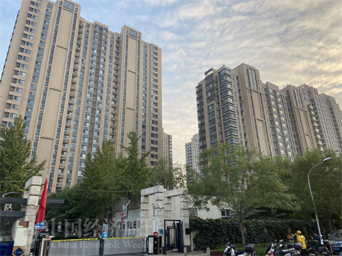

# 北京二手房市场极限拉扯：卖家已降价300万，买家仍货比三家等捡漏

《中国经济周刊》记者 张宇轩 | 北京报道

“认房不认贷”一定程度上激活了北京二手房市场的供需两端，这在有着“消费晴雨表”之称的国庆长假期间表现尤甚。

“北京二手房挂牌量再创新高”“二手房源出现明显降价趋势”，国庆假期尚未结束，这些消息便成为地产圈的热点话题。

与此同时，9月二手房网签数据出炉，当月二手房签约情况创造了今年以来仅次于上半年“楼市小阳春”的又一佳绩，不负市场对于“金九”的预期。

进入10月，丰富的挂牌房源在降价促销的加持下，能否再度延续9月的良好形势、缔造“银十”？

_（二手房市场上颇具关注度的中铁国际城 《中国经济周刊》记者张宇轩|摄）_

**挂牌量大幅增长，挂牌价大幅下调，购房者依然吐槽“太贵了”**

国庆假期中，关于楼市的各类消息再度出现在社交媒体的话题榜上。二手房“挂牌量创新高”“学区房价格直降”等消息屡见不鲜，“黄金周”好像是为楼市交易吹来了“天时”的东风。

“二手房挂牌量自9月初以来持续大幅增长。”《中国经济周刊》记者以购房者身份对北京二手房市场进行探访时，一名二手房中介对上述消息作了佐证，“不少房主是想卖掉旧房买新房，有人想把多余的房子卖掉减轻还贷压力，也有人想套现做点别的，各有各的想法。”

自9月初北京推行“认房不认贷”政策以来，二手房挂牌量激增，这一现象一度被业内形容为“井喷”，国庆黄金周延续了这一势头。据链家网收录的数据显示，仅自10月1日至7日，北京全城新增的“7日新上”二手房数量达到3104套，至国庆假期结束，在售的二手房数量已达到141795套。

大量房源涌入市场，对二手房交易走势产生一定影响，特别是在政策组合拳的驱动之下，市场给出了正向反馈。

据北京住建委公布的网签数据显示，在刚刚过去的9月，北京市存量房住宅签约套数达到14262套，签约面积126.84万平方米。这一数据为下半年以来的最高水平，远高于7月的9718套和8月的10960套，仅次于今年2、3月份的
“楼市小阳春”时期，与2022年9月的14329套几乎持平。

不少观点认为，挂牌量激增一定程度上反映出卖房者急于出手的心态，尤其是其中还伴随着不少二手房源的大幅降价。

记者查询各类二手房中介网络平台发现，近期挂牌价下调并不是个别现象，不少房源的挂牌价甚至出现数十万元的下调。例如位于大望路某小区的一套三居室，2022年10月挂牌价超过1200万元，其后经历了4次降价调整，最近一次调价出现在国庆前夕，挂牌价已下调至850多万元，较之前下调了40万元，较历史最高价下调了300多万元。

“这些天已经有人开始调低挂牌价，还有不少房主也在犹豫要不要降价。”前述中介甚至劝告记者，“您要是不着急买，还可以再等等。”

就基本的商业逻辑而言，降价自然利于促成交易。但现实是，不少房源即便是降价也未必能达到预期的促销目的。

9月21日，位于朝阳区北苑商圈的中国铁建国际城154套房产开始竞价拍卖，底价总价值约10.77亿元，起拍平均单价为87357元/平方米。由于起拍价低于该小区市场价近7000元/平方米，且标的房源均为从未居住过的毛坯房，此次拍卖一度引发大量购房者关注。

《中国经济周刊》记者对该项目现场走访时发现，国庆假期前后，到访该小区看房的意向购买者众多，不少人正是冲着“低于市场价”而来。一名负责分销的中介告诉记者，由于形式上是竞价拍卖，最终成交价格能否低于市场价还不太好说，但如果是通过中介渠道参与竞拍，选房时基本上可以排除有人竞拍的房源，能够做到以低于市场价的底价购入。

从北京产权交易所公布的数据来看，中铁国际城在国庆前后通过竞价拍卖的方式售出至少20套房源。前述中介告诉记者，已售出的房源几乎都是“一个萝卜一个坑”“我知道的只有两个客户（存在竞价的情况）”。

配套成熟、地段繁华、学区优势，且在价格上做出如此“让步”，成为中介推销这类二手房的一系列卖点，但这也不能让大部分购房者下定决心。现场看房的一对母子对于拍卖底价依然给出了“太贵了”的评价。这位母亲看过一套待售房屋后认为，小区户型布局不太理想，装修存在一定难度，楼间距过密，以及价格依然偏高。儿子则认为，价格可能还会继续降，要等等再看。

10月7日，前述中介告诉记者，近期中铁国际城的竞价拍卖效果远不及预期，未来价格可能会进行下调，“如果不着急这一时半会儿，的确可以‘等等再看’”。

**卖家频频调价吸引买方，谈判桌上考验心理素质**

并非所有二手房都在降价抛售，除核心区域房价依然坚挺外，现实交易中也不乏利用价格上调刺激购房者的卖家。

据朝阳区一家二手房中介销售人员向记者讲述，其代理的房源中有业主在一年多的时间里多次对挂牌价进行涨跌不一的调整，“他挂出的价格是高于小区均价的，可能担心自己的房子卖便宜了，一直觉得本区的房子应该处在‘待涨’阶段；也或许是想用涨价吸引看上这套房子的人下定决心去买，毕竟买方还可以砍价嘛。”或许是这种方式未能奏效，“最近他又下调了价格。”该销售人员说。

这种试图制造焦虑的手段不是全无效果，二手房买家秋珊向记者描述其购房经历时用“做局”来形容这一过程。

据她讲述，2022年春节后，她花了两个多月的时间看房，之后将目光锁定在地铁10号线北段的一套40年房龄的老式住宅。“当时手里有50多万元积蓄，加上公积金、家里凑钱等七七八八，这套小房子正好在预算范围内，趁午休的时间去看了一次，挺喜欢的，就有了买房的冲动。”

整个谈判买房的过程可谓“高效”。“因为没经历过大事，约定了谈判时间后，带了一个亲戚陪我一起去，我全程基本处于懵懂状态，由亲戚帮我谈判。”秋珊讲述，“对方要价335万元，我们还价328万元，对方嫌低。这时候中介也说同一天还有一家在看这个房子，我内心更急切，有种抢房的心态，最终以330万元成交，整个谈判过程15分钟左右搞定。”

至今年9月，该小区不少房子纷纷挂牌出售，秋珊注意到，与她的房子差不多的二手房源挂牌价仅有300万元出头，就觉得自己当初买贵了，再次复盘谈判过程时，觉得自己当初是被对方与中介配合“做了局”。

业主许菲则抱着“能卖多少算多少”的态度，正在考虑将自住的一套房子挂牌出售。她认为眼下是一个出手卖房的好时机，“北京的房价已经稳定在高水平很久了，而且二手房本身也在不断贬值，现在卖掉应该能有个好价钱，未来不太可能出现大涨。”

目前许菲一家三口正住在这套“待售”的房子里，每月的房贷支出成为其最大的经济压力。“‘认房不认贷’施行后，买方群体扩大了，说不定有人就看上这套房买走了。”许菲表示，“房贷月供比租一套房子的租金高得多，现在先把房子卖了可以缓口气，以后房价降下来的时候再考虑买一套。”

**买家心态：“货比三家”“等等再看”“择机捡漏”**

性价比、保值情况、地段位置、学区优势、配套水准、邻里人脉、未来规划，甚至风水讲究、眼缘这类带有玄学色彩的因素都能被卖方拿来作为二手房的卖点。在记者对二手房市场进行全面探访的过程中，中介销售竭尽所能说服买方接受“现在买房正是物有所值”这一说法。

但与之形成对比的是，很多购房者认为二手房市场并不缺乏房源，整体而言属于买方市场，未来价格还有下降空间，“货比三家”“等等再看”“择机捡漏”成为不少人的真实心态。

“二手房市场水太深，挂牌价变动这么频繁，想必还有不少水分。”持观望态度的购房者詹森看房一年多，仍在等待价格下跌，“核心地段的房子可能是真的降不动，但动辄十几万每平方米的房价水平配上高房龄，作为首套房买家，我在心理上是无法接受的。”

詹森认为，一些非核心区域的二手房面临同区域商品房的竞争性冲击，且购买人群以中低收入者为主，这些人的购买力有限，如果实在买不起也就没有了购买欲望，二手房未来在非核心区域市场上的地位会逐渐边缘化。供过于求，价格自然也会再降一截。

“如果在现阶段买房，我可能会等一个‘捡漏’的机会。我的一个朋友就曾经以低于市场价三成的价格买到了一套二手房，原房主急着出国大幅降价抛售。要是我能有幸得到这样的机会，做梦都会笑醒。”詹森说。

秋珊对买房时遭遇的疑似“做局”耿耿于怀，高额的房贷月供致使其消费降级，“现在只敢在拼多多上购物了”。当初买房时的冲动和憧憬在更为现实的还贷压力下早已消失殆尽，秋珊甚至一度怀疑自己是否真的有买房需求，“如果时间能倒回去，我一定会选择不买房，租房过一辈子其实也没什么不好”。

（文中受访者皆为化名）

责编：杨琳

（版权属《中国经济周刊》杂志社所有，任何媒体、 网站或个人未经授权不得转载、摘编、链接、转贴或以其他方式使用。）

