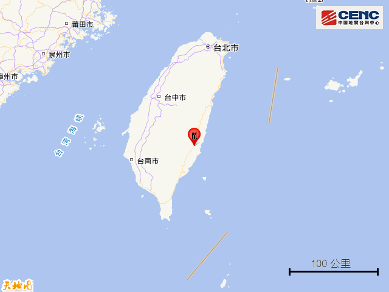
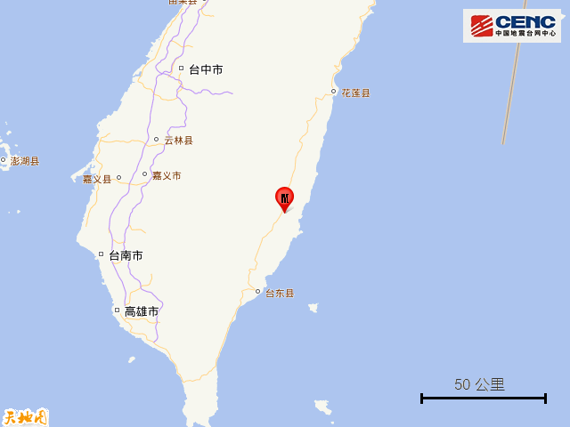
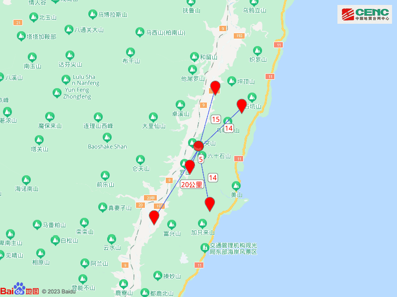
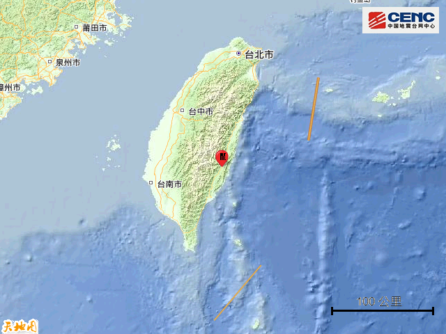
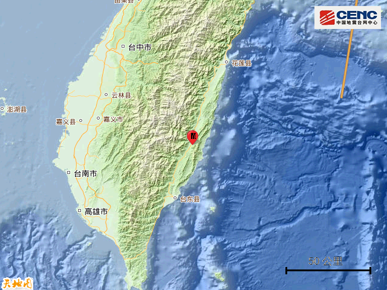
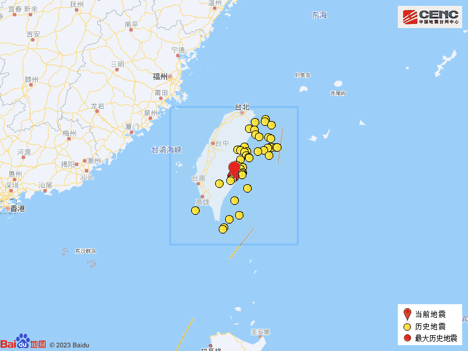

# 台湾花莲县发生5.4级地震，震源深度14公里

据中国地震台网正式测定，10月11日18时36分在台湾花莲县发生5.4级地震，震源深度14公里，震中位于北纬23.24度，东经121.32度。

震中距富里乡5公里、距成功镇14公里、距长滨乡14公里、距玉里镇15公里、距池上乡20公里，距台东县57公里，距台北市200公里。

震中5公里范围内平均海拔约472米。

根据中国地震台网速报目录，震中周边200公里内近5年来发生4级以上地震共268次，最大地震是2022年9月18日在台湾花莲县发生的6.9级地震（距离本次震中10公里），按震级大小前50次历史地震分布如图。

