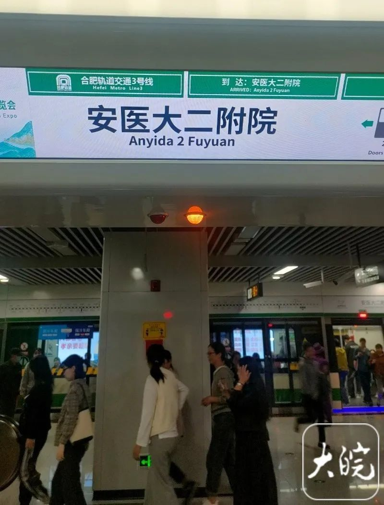

# 安徽合肥地铁把“火车站”翻译成“Huochezhan”？多方回应

10月9日晚，合肥市民胡先生乘坐合肥轨道交通3号线，路过合肥火车站时，他意外地发现原本的站点英文翻译被改成了拼音，语音播报也同步进行了更改。

**“‘合肥火车站’被翻译成Hefei Huochezhan，这样翻，不如不要英文播报。”**
这样的更改是否合适？10月10日，大皖新闻记者针对此事进行了多方采访。

**“合肥火车站”**

**为何翻译成“Hefei Huochezhan”？**

9日晚上，市民胡先生乘坐合肥轨道交通3号线出门，在地铁上时，他注意到一个问题，
**地铁站点命名全部被改成了“汉字+拼音”的形式，就连语音播报也同步进行了替换。**

 _3号线车厢内，合肥火车站Hefei Huochezhan_

比如， **合肥火车站下注释为Hefei Huochezhan，国防科技大学注释为Guofang Keji Daxue，安医大二附院为Anyida 2
Fuyuan。**

“地名可以理解，但是类似于某大学、某机构、某公共场所为站名的站点，这样翻译，不如不要英文播报。”胡先生告诉记者，自己注意到，此前，以公共机构为合肥地铁站点命名时，是英语翻译，但现在全部被改成了拼音，改来改去，不知道是为什么？

胡先生的吐槽，也引发了一些网友关注，“好多人对这样的改名，感到奇怪。”

**车内站点播报均更改为拼音，**

**站外仍是英文翻译**

带着胡先生的疑问，10月10日中午，大皖新闻记者进行了实地探访。合肥轨道交通3号线，沿线站点共有33个，线路起于幸福坝站，止于相城站。记者在地铁站内看到，站点名中的大多数都为地名，但也有不少以附近地标为站点名的，比如幼儿师范、合肥火车站、合肥西站、国防科技大学、图书馆、安医大二附院等。

_图书馆站Tushuguan_

大皖新闻记者来到“合肥火车站”地铁站，在即将到达站点时，不仅会有显示屏提示站点信息，还会有中英文双语播报。记者注意到，
**车内地铁站名的确被改成了拼音形式，语音播报中的英文播报也为“Hefeihuochezhan”。**

不过，当记者从“合肥火车站”站下车，来到地铁站内时，看到“合肥火车站”站名仍为英文翻译“HEFEI RAIL
WAY”，同时，地铁3号线站名指引图及3号线车厢外部的站名“合肥火车站”又为英文翻译“Hefei Railway Station”。

_3号线车厢外侧“合肥火车站”翻译又为 Hefei Railway Station_

**回应：**

**合肥轨道车站站名属于标准地名，**

**按标准采用拼音拼写**

针对网友疑惑，10月10日下午，大皖新闻记者采访了合肥市轨道交通集团有限公司。对方回应，合肥轨道站名依据的是2022年5月1日施行的《地名管理条例》（国务院令第753号）。《地名管理条例》第三条规定，地名包括具有重要地理方位意义的交通运输设施名称。《地名管理条例》第十五条规定，地名的罗马字母拼写以《汉语拼音方案》作为统一规范，按照国务院地名行政主管部门会同国务院有关部门制定的规则拼写。

**“合肥轨道车站站名属于标准地名，依据条例相关规定，合肥轨道联合上级主管部门，邀请行业专家组织实施后确定。”**
合肥轨道交通公司相关工作人员回应称，针对轨道交通车站导向标识的拼写和译写原则，合肥轨道也曾于2022年10月通过官方微信公众号向市民乘客解释说明。

大皖新闻记者从合肥轨道交通公号上看到， **火车站作为轨道交通车站站名时，采用汉语拼音进行拼写。如：合肥火车站 Hefei
Huochezhan，合肥南站Hefei Nanzhan，合肥西站 Hefei Xizhan。**

至于“合肥火车站”站车内外标识不一的问题，合肥轨道交通回应，
**合肥火车站作为车站站名时，依据地名管理条例应为罗马字母拼写；作为指引功能时，与实体单位保持一致。**
“我们目前也正在按照上述标准逐步优化。”相关工作人员说。

**延伸：**

**作为地铁站点命名时**

**同等于“地名”，应拼音拼写**

10月10日下午，大皖新闻记者联系上安徽省资深翻译家王冀皖进行咨询。“合肥火车站、国防科技大学、安农大……这些‘机构’在地铁站点命名时，其实，就是一种‘地名’，指代那一处地方，不是指代某一单位。所以，用拼音拼写地名是合理合规的，也是有文件依据的。”王冀皖说，联合国和我国政府都有相关要求并出台过相关文件。

_安医大二附院站Anyida 2 Fuyuan_

王冀皖举例说，合肥轨道交通2号线的“安农大”站，作为站名时，它也不再指“安徽农业大学”，而是包括安农大在内的地方，相当于“四牌楼”之类，虽然现在没有“牌楼”，但地名却保留了下来。“因此，
**‘安农大’站名也得按拼音来，如果今后安农大搬家或更名，对这个地名都没有影响。”**

同时，王冀皖表示，世界各国均依照“各国地名按各自地名发音进行拼写，用英文标注地名并不是国际化，英语只是联合国官方语言之一。”一般来说，地铁站内未加箭头指向的依旧为“地名”，也应该用拼音拼写。

针对此情况，大皖新闻记者也致电合肥市民政局地名办，该办工作人员杨东也与王冀皖持相同观点，其表示，
**按照中文罗马字母拼写法（国际标准）来说，“合肥火车站用拼音标注Hefei
Huochezhan是正确的，而同类机构在用作地名时，确实应该用拼音标注。”**

_3号线“合肥火车站”地铁站内标识仍为HEFEI RAIL WAY_

杨东说，地名的罗马字母拼写以《汉语拼音方案》作为统一规范，按照国务院地名行政主管部门会同国务院有关部门制定的规则拼写。《汉语拼音方案》是中国人名、地名和中文文献罗马字母拼写法的统一规范，并用于汉字不便或不能使用的领域。

对于合肥轨道交通站内部分线路站名音译不一致，有些仍为英文翻译的问题，杨东表示，如未按要求设置，会尽快督促对方进行整改。

大皖新闻首席记者 朱庆玲 摄影报道

