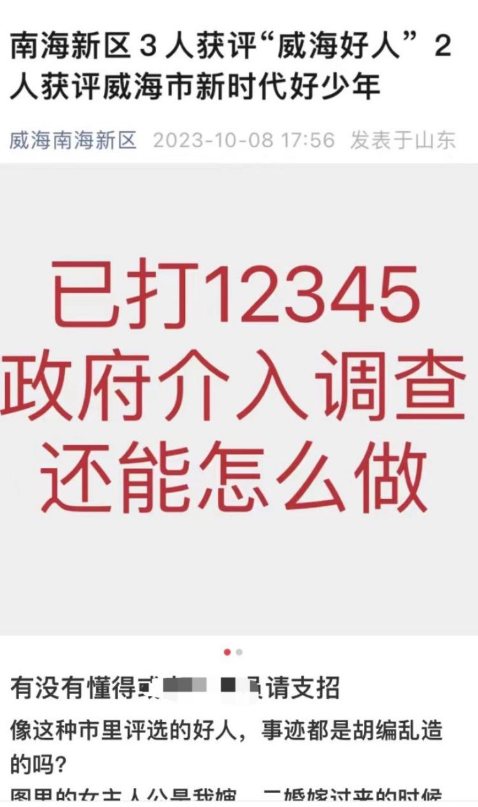
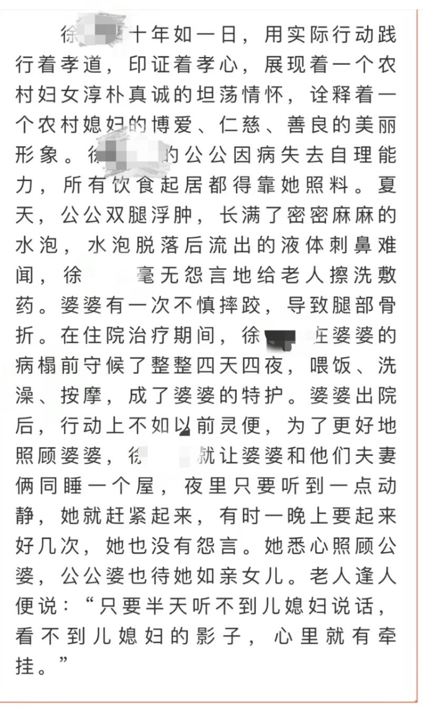

# 整篇文章没一句真的？山东“威海好人”入选者被曝事迹造假，官方回应

日前，山东威海市第三季度“威海好人”评选中，一入选者被曝事迹造假引发公众关注。

_网友爆料评选造假。网络图_

发帖者张女士（化名）称，获评2023年第三季度孝老爱亲“威海好人”荣誉称号的南海新区小观镇徐家庄村村民徐某某，官方通报的“多年照顾公婆”事迹系造假，徐某某系二婚，公公已经去世多年。10月11日，威海市文明办工作人员回应上游新闻（报料邮箱baoliaosy@163.com）记者称：“已留意到此事，已介入调查。”

上游新闻记者在威海南海新区官微看到，10月7日，2023年第三季度“威海好人”、威海市新时代好少年发布仪式举行。南海新区小观镇徐家庄村村民徐某某获评孝老爱亲类别的“威海好人”荣誉称号，其事迹介绍中写道，徐某某的公公因病失去自理能力，所有饮食起居都得靠她照料。婆婆摔伤腿部骨折住院，她在病榻前特护四天四夜，出院后就让婆婆和他们夫妻俩同睡一个屋，夜里只要听到一点动静，她就赶紧起来，有时一晚上要起来好几次，她也没有怨言，“老人逢人便说：“只要半天听不到儿媳妇说话，看不到儿媳妇的影子，心里就有牵挂。”

 _入选者事迹介绍。威海南海新区官微_

对此，张女士在网上发文称：“女主人公是我婶，二婚嫁过来的时候我爷爷已经因为癌症去世了……我爷爷最后确实失去自理能力一直卧床躺着，但是根本不存在文里说的她照顾的内容，至于是不是头婚的公公，村里都知道她和头婚的情况，就算是以讹传讹，我听岔劈了是不是该加个‘前公公’。说我奶奶腿部骨折住院这也是子虚乌有的事。我已经向有关部门举报反映了这件事，相关部门已经派人到村里调查了，确实没有发生过……整篇文章没一句真的！”

10月11日，活动主办单位威海市文明办相关工作人员回应上游新闻记者称：“已留意到这个事，我们已介入调查，到时候会根据事实情况去处理，如果真是像她（张女士
）反映的问题那样，（将）坚决撤回荣誉。”

上游新闻记者 费墨

