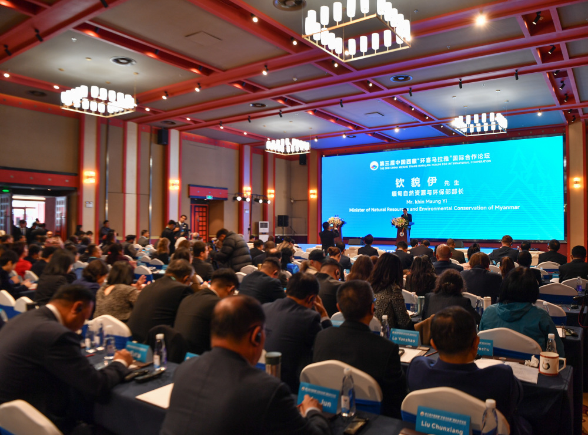

# 西藏的英译不再延用“Tibet”？用拼音“Xizang”是依法办事

_第三届中国西藏“环喜马拉雅”国际合作论坛现场（10月5日摄）。 新华社 图_

2023年10月4日至6日，第三届中国西藏“环喜马拉雅”国际合作论坛在中国西藏林芝举行。值得注意的是，在论坛的翻译过程中，“西藏”的英文翻译不再延用“Tibet”，而是采用汉语拼音“Xizang”进行翻译。

“西藏”，过去很长一段时间里被英译为“Tibet”。但，在境外使用“Tibet”一词代表“西藏”的大量语境里，其引申意不仅包括西藏，还涵盖了青海、四川、甘肃、云南四省涉藏州县。

近年，在中国对外报道西藏时，“Xizang”的用法也正被大量采纳。其实，“西藏”英文翻译采用汉语拼音“Xizang”是依法办事的体现。

国家法律法规数据库公布的《地名管理条例》在第十五条就规定：地名的罗马字母拼写以《汉语拼音方案》作为统一规范，按照国务院地名行政主管部门会同国务院有关部门制定的规则拼写。按照本条例规定批准的地名为标准地名。标准地名应当符合地名的用字读音审定规范和少数民族语地名、外国语地名汉字译写等规范。

《地名管理条例实施细则》第十九条第一款规定：《汉语拼音方案》是使用罗马字母拼写中国地名的统一规范。它不仅适用于汉语和国内其他少数民族语，同时也适用于英语、法语、德语、西班牙语、世界语等罗马字母书写的各种语文。

第十九条第四款规定：蒙、维、藏语地名以及惯用蒙、维、藏语文书写的少数民族地名，按《少数民族语地名汉语拼音字母音译转写法》拼写。

中央统战部旗下微信公众号“统战新语”今年8月16日就曾刊文《【观点】“西藏”的英译是“Tibet”吗？》详细分析了这一翻译话题。

文章提到：在第七届北京国际藏学研讨会上，许多人将过去7年里具代表性的研究成果投书研讨会，其中不乏涉及“西藏”英译的成果。“统战新语”找到多位学者来聊聊这个话题。

**“统战新语”公众号文章分析：**

**“由来已久”的错误**

“这种错误的概念由来已久。”哈尔滨工程大学马克思主义学院教授王林平开门见山地表示，“Tibet”这样的译法给国际社会正确认识西藏地理范围产生了严重误导。

他介绍，英国殖民主义者贝尔（Charles Alfred Bell）在《土伯特之过去与现在》(Tibet：Past and
Present)一书中关于“Tibet”所辖范围的错误介绍与此关系密切。20世纪30年代以来，任乃强等藏学研究先驱对学界将“西藏”一词翻译为“Tibet”提出了批评。王林平认为，直至今日这种翻译仍被延续，这对于纠正西方流传甚广的“西藏”地理概念极为不利。

他说，摆脱西方和分裂势力在涉藏话语上的概念陷阱，建立中国在国际涉藏话语体系中的主导地位，急需探索使用能够准确表达中国立场的“西藏”一词英文译法。近来，达赖集团对使用汉语拼音“Xizang”作为“西藏”的英译提出批评，恰恰说明这种译法击中了分裂势力的话语要害。

**“用拼音是依法办事”**

1977年，中国派代表团参加联合国第三届地名标准化会议，会议通过了中方提出的“关于采用汉语拼音方案作为中国地名罗马字母拼写法的国际标准”的提案。

1978年9月，国务院批转了原中国文字改革委员会、中国地名委员会等部门的一份报告，正式确定改用汉语拼音方案作为中国人名、地名罗马字母拼写法的统一规范。这意味着用拼音拼写人名、地名，适用于包括英语、法语、德语、西班牙语在内的所有罗马字母语文书写。

中国藏学研究中心副总干事廉湘民对“统战新语”说，这些为采用拼音作为“西藏”一词的英文译法奠定了很好的基础。“用拼音，是依法办事，将我们有关法律法规落到实处。”

他还说，“西藏”一词在汉语、藏语中毫无争议，它的翻译变化主要影响的是对外传播，也就是涉藏国际话语权的问题。西方一些人会有一些不同意见，但中国依法处理涉藏事务，“能不能接受，是他们自己的问题”。

中国西藏信息中心夏炎博士补充道，“西藏”一词英文译名的变更，是新的历史条件和国际舆论环境下中国对外话语体系建构的尝试，有助西藏媒介形象的重构和中国涉藏国际话语权的提升。

