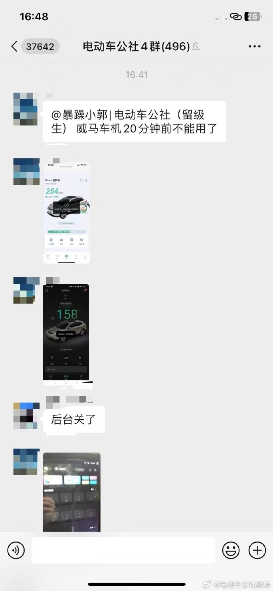
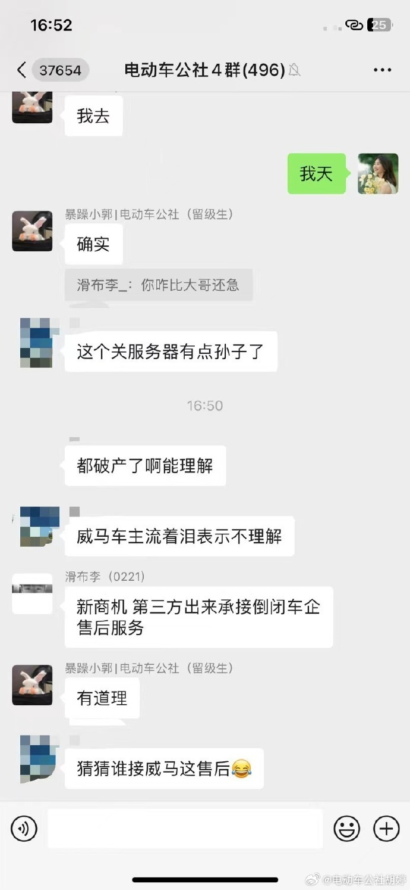
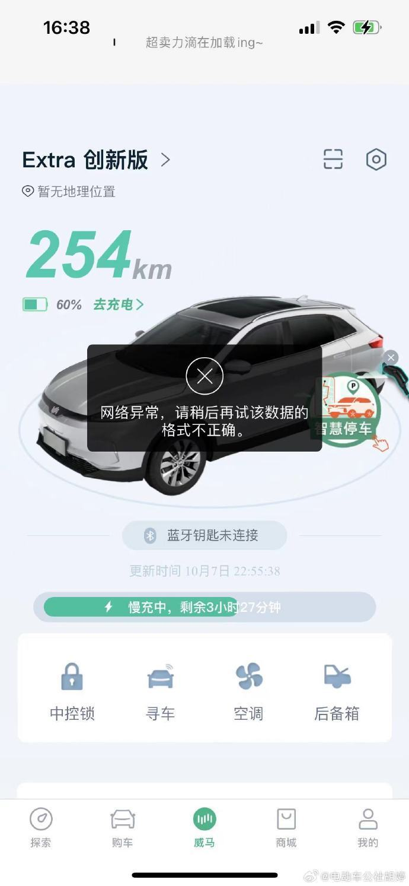
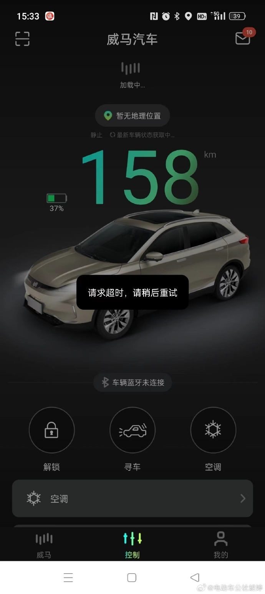
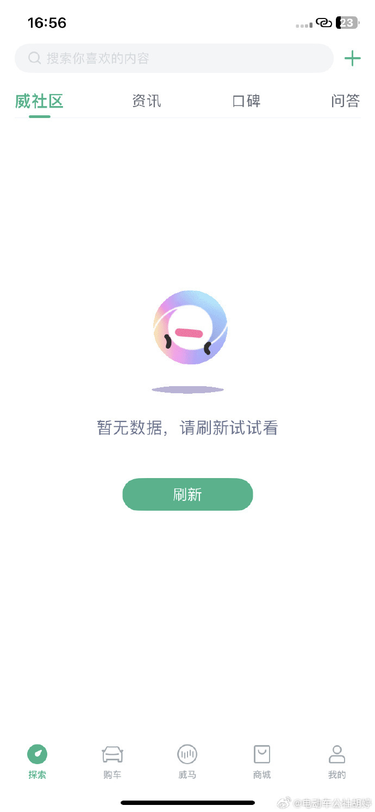
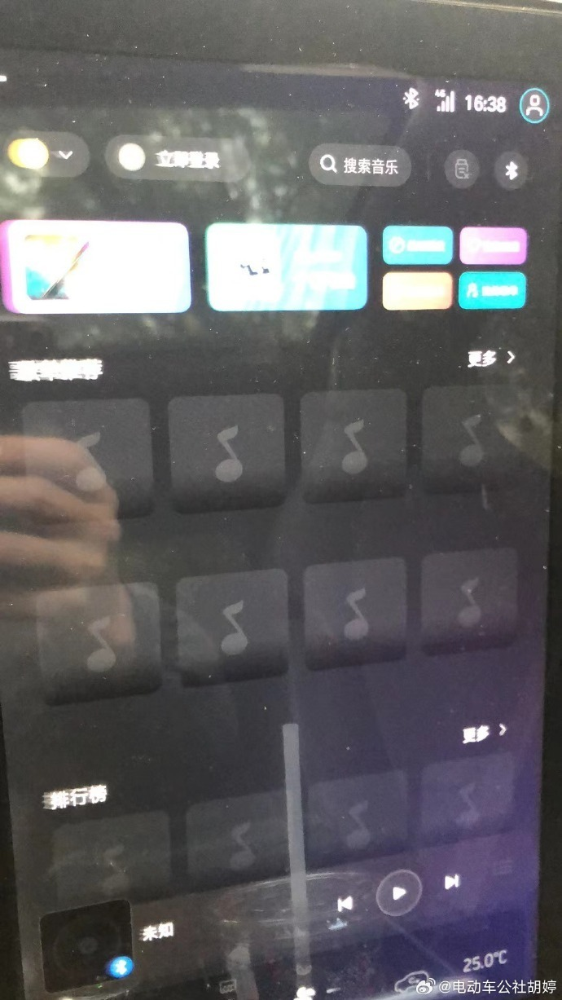
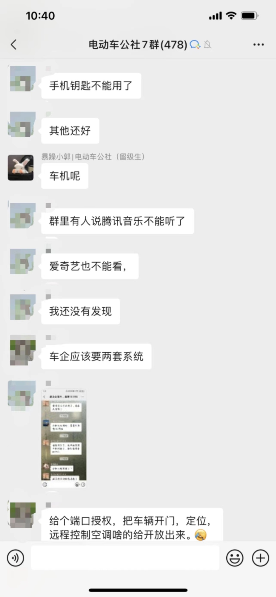
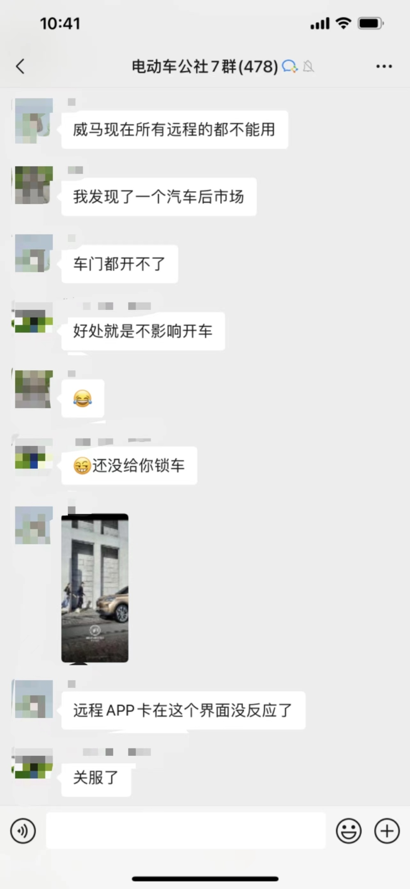
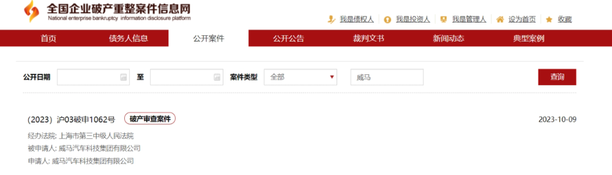
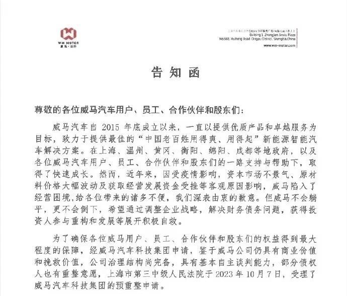

# 威马疑似已停服：车主爆料车机和钥匙已无法使用 车机内容大面积空白

10月11日下午，电动车公社社群里突然有车主朋友反馈，称威马车机20分钟前不能用了，手机钥匙不能用了，所有远程功能都不能用了，看样子应该是停服了。

如此看来，威马算是第一个规模交付后，真正挂掉的新势力了…

社群内有车主朋友猜测，威马这回的“骚操作”，是受破产清算影响，是“法院清点查封资产”。

事实上，这个猜测也是有事实依据的。据全国企业破产重整案件信息网显示，威马汽车科技集团有限公司已经申请破产重整。

而10月10日，威马也发布了一条《告知函》，称“上海市第三中级人民法院于2023年10月7日，受理了威马汽车科技集团的预重整申请。”算是对网传消息“威马破产”的正式回应。

其实，无论是车主还是广大新能源爱好者，对“威马要倒”这件事早有预期。在申请破产重整之前，威马就已频频传出“发不出工资”、“60亿资金已冻结”、“停产”、“经销商退网”等消息，看起来经营状况非常不妙。最后一记官方实锤，只不过是“另一只靴”终于落下而已。

但无论如何，威马汽车的一系列操作已经严重影响了威马车主对汽车的正常使用。难道新势力破产之后，智能电动汽车就只剩个电动汽车，一切智能化配置都不能用了？企业破产属于正常的商业现象，但车主的权益又该由谁来负责？以上，或许是此次威马事件带给我们更深层次的思考。

