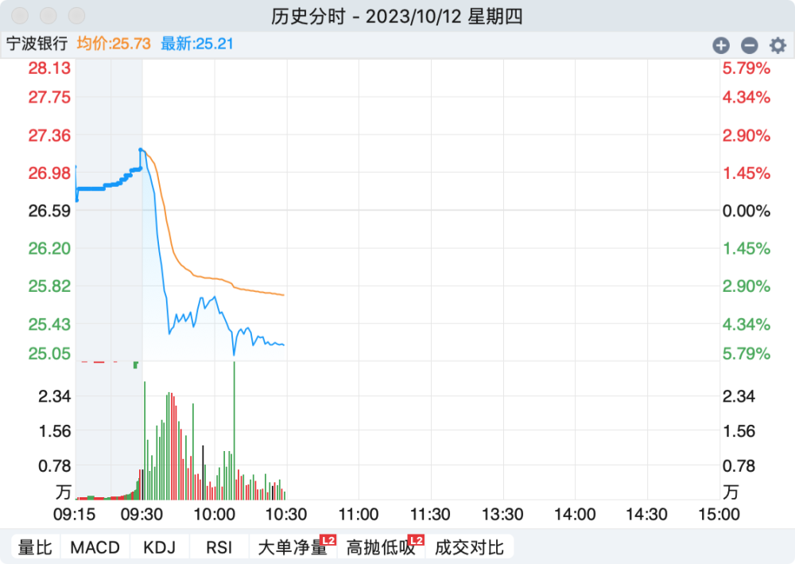

# 宁波银行回应股价跳水：正在排查原因

10月12日早间，宁波银行股价高开后跳水，跌幅超过5%。第一财经记者拨打投资者热线咨询，宁波银行工作人员表示，该行正在排查股价跳水原因，目前没有需要披露的其他信息。后续如有需要披露的消息会发布公告，投资者可关注该行公告。

受中央汇金时隔8年再次增持四大行股份消息影响，12日早盘，A股三大指数集体高开，保险、证券、银行等大金融板块涨幅居前，银行股全线飘红，其中，宁波银行一度涨超2%。截至记者发稿，中证银行指数涨1.10%，较开盘时略有回落。

_（宁波银行股价走势 图源：同花顺）_

