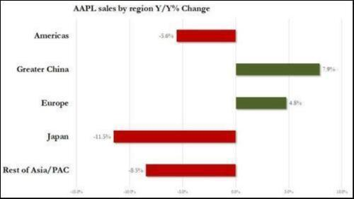
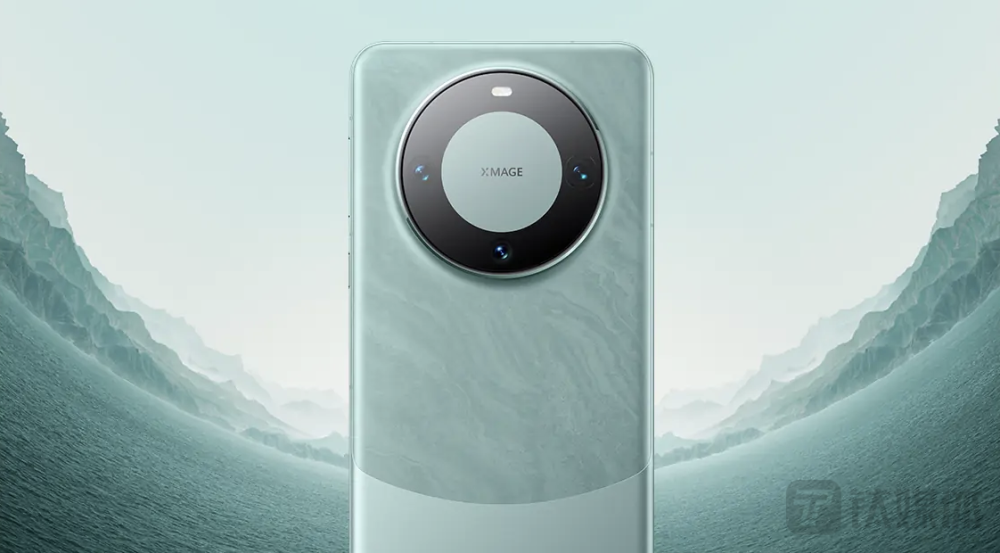

# 惹不起的欧洲市场，苹果因辐射问题又一次“低头”

面对法国国家频率管理局 (ANFR)关于iPhone12辐射超标的报告，苹果公司一开始的态度较为强硬，并提出了质疑，称iPhone
12已获得多个国际机构的认证，符合全球辐射标准。不过，法国国家频率管理局的这一举动引发了更多欧洲国家的关注，包括德国等都在跟进，并有可能启动相应的措施。

最新消息显示，苹果又一次“低头”，将针对法国地区的iPhone 12用户发布iOS
17.1系统更新，降低设备已离身并放在静态表面上时的能量传输功率，从而符合法国国家频率管理局（ANFR）的相关测试要求。

辐射超标？ANFR“盯上”了iPhone12

当下，智能手机已经成为人手必备的终端设备，通讯、娱乐、社交等多功能集一身的特性，也加长了智能手机的使用时长。与此同时，关于智能手机辐射导致的健康风险，也一直是社会关注的焦点，只是目前仍未有准确的定论。

上个月，法国国家频率管理局发布公告称，近期检测了包括iPhone
12在内的一批手机，以检查手机的比吸收率（SAR）是否符合标准。据了解，比吸收率反映的是人体暴露于电磁辐射下身体吸收辐射量的水平。检查后发现，iPhone12的电磁波辐射值超出欧盟标准，肢体比吸收率为5.74W/kg，超出了欧盟规定的4W/kg上限。

公开信息显示，iPhone12是苹果公司在2020年发布的年度旗舰手机，虽然早已不在官方直营渠道销售，但在第三方渠道商那里仍可以买到。

值得注意的是，即便是苹果这样的巨头，在欧洲市场也没有特权。法国国家频率管理局表示，自9月12日起，法国所有分销渠道不得继续销售iPhone
12手机。对于那些已售出的iPhone 12手机，苹果公司也必须采取必要的纠正措施，尽快使其符合要求。

同时，法国负责数字化事务的部长级代表让-
诺埃尔·巴罗称，软件更新可以解决这个问题，苹果公司有15天时间来更新相关手机的软件以使其符合标准。如果这家美国公司不采取行动纠正这一缺陷，可能要求召回法国市场上所有型号的苹果手机。

针对辐射超标一事，苹果在当时曾发布声明称，iPhone
12已获得多个国际机构的认证，符合全球辐射标准。苹果已提供该公司和第三方实验室的多项结果，证明iPhone12符合法国国家频率管理局的要求。

据悉，之所以法国国家频率管理局和苹果公司检测的结果存在差异，在于二者评估辐射的方法可能存在不同。而在事件尚未平息时，有报道称，苹果告知员工在用户咨询相关问题时保持沉默，并拒绝用户退换货要求，除非符合苹果公司的正常退货政策。

从质疑到服软，苹果将推送新系统版本修复辐射问题

“在iPhone15系列发布之际，法国国家频率管理局曝出iPhone12辐射超标的消息，自然会对新品的发售和品牌形象造成一定影响”，业内分析师对钛媒体App表示。

据了解，在法国国家频率管理局指出iPhone12辐射超标后，引来众多国家监管机构的关注。其中，德国联邦网络局表示可能会启动类似措施，西班牙、比利时等多国相关组织也都要求苹果进一步解决辐射的问题。

对于苹果公司来说，时间拖得越长对自己越不利，辐射带来的负面影响将会像雪球一样越滚越大。消息称，iPhone12的辐射争议已经影响了法国超40家销售网点。

面对市场的压力，苹果公司的态度也从质疑转向了“妥协”，表示将为法国的iPhone
12用户发布软件更新，以适应法国监管机构使用的协议。不过，苹果公司在声明中仍指出，这与法国监管机构使用的特定测试协议有关，而不是安全问题。

最新消息显示，苹果公司将向法国地区的iPhone12用户推送iOS
17.1版本更新，以解决辐射相关问题。苹果公司指出，iPhone12更新后将符合法国国家频率管理局的测试要求。当检测到手机处在离身状态时，将不再调高所允许的传输功率，而这一改变可能会导致蜂窝网络性能在手机离身的某些使用场景下略微下降，预计大多数用户不会感受到任何影响。

放不下的欧洲市场，不得不低头

分析师告诉钛媒体App，这次更新仅针对法国地区的iPhone12用户，国内用户并不会推送相关内容，二者此次的争议也主要是由于测试方法不一致导致的。更新后，可能iPhone12的信号会进一步变弱，但也是苹果为了合规的无奈之举。

在声明中，苹果强调这次的争议不是安全问题，开始也是据理力争，但面对市场的压力最终也不得不妥协。至于为何频频低头，原因也很简单。一方面欧洲市场的高端用户群体较多，也是iPhone的主要受众集中区，对品牌的建设以及影响力都有着至关重要的作用。

目前，伴随着华为的回归，将对iPhone在国内的市场造成较大的冲击，报道称华为目标在2024年出货6000万～7000万部智能手机。Counterpoint高级分析师Ivan
lam对钛媒体App表示，从硬件创新的角度来说，华为在某些方面比苹果做得要好，华为Mate60系列的热卖也将对iPhone在中国高端市场的份额造成较大的影响，估计Q4在排名上会有一个波动。

上一次是弃用Lightning接口，这一次是辐射超标，不知道苹果接下来在欧洲市场还会遇到哪些挑战。
**（本文首发钛媒体App，作者/杜志强，编辑/钟毅）**

