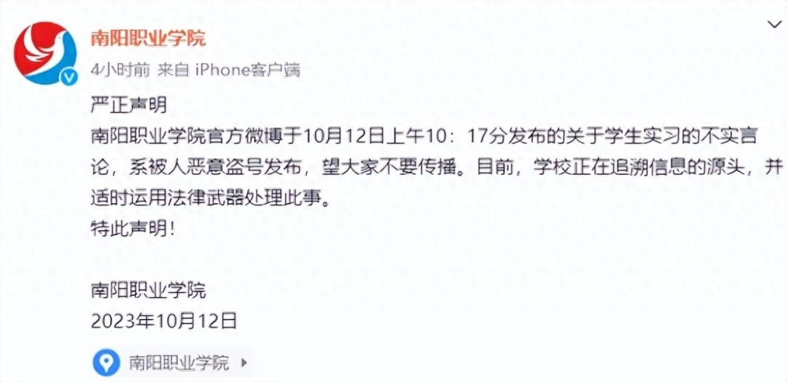

# 河南南阳一学院官博评价学生“就是让你们给我打螺丝赚钱”，学校回应

10月12日，南阳职业学院发布声明，称此前官博发布的关于学生实习的不实言论，系被人恶意盗号发布，学校正在追溯信息源头。

南阳职业学院称：“南阳职业学院官方微博于10月12日上午10：17分发布的关于学生实习的不实言论，系被人恶意盗号发布，望大家不要传播。目前，学校正在追溯信息的源头，并适时运用法律武器处理此事。”

网传截图显示，该账号此前在学校超话中发布不当言论，称“一群学生就只会天天带节奏，叫叫叫的，就是让你们给我打螺丝赚钱。”

据南阳职业学院官网介绍，学校坐落于河南省南阳市西峡县。2011年4月创办，曾获得“河南省办学先进单位”“人民满意的民办大学”“2020年度河南高等教育榜样示范高校”“市级文明校园”等荣誉称号。

_图片源自学校官网_

【来源：九派新闻综合相关方社交账号、南阳职业学院官网】

