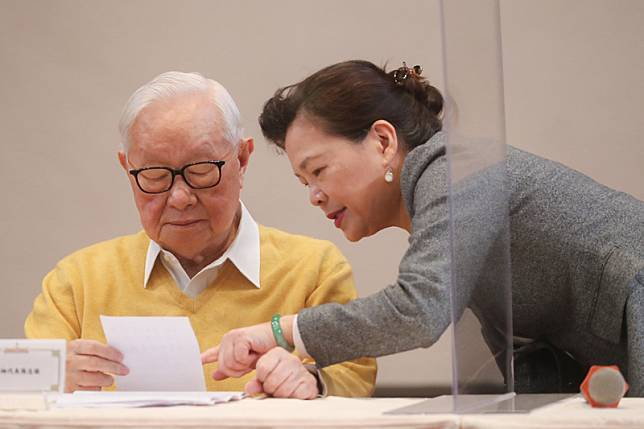
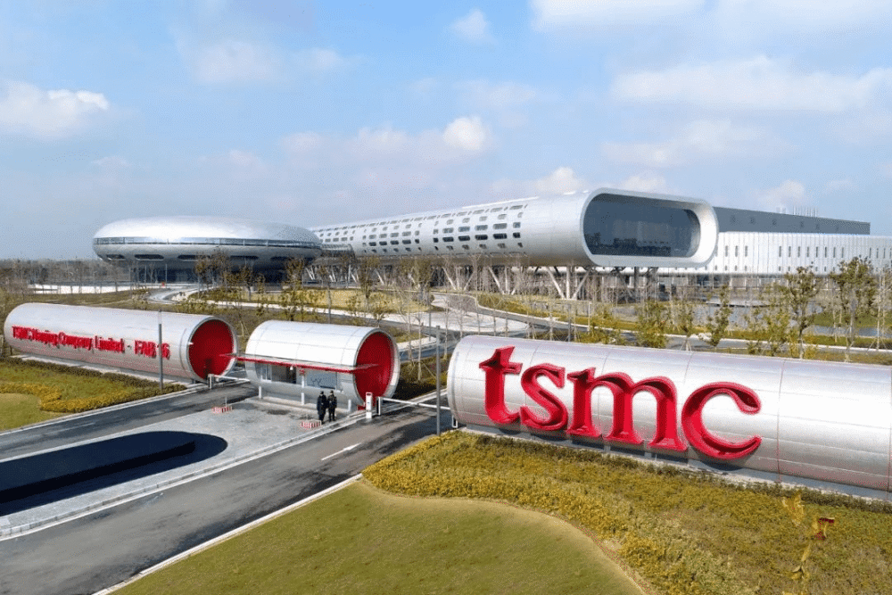
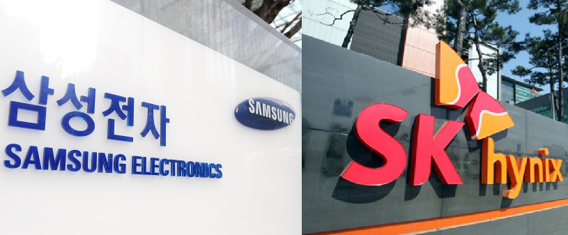

# 韩国芯片厂三星、SK海力士已获美无限期豁免，而台积电还在等

【文/观察者网
熊超然】《华尔街日报》当地时间10月12日报道称，在美国日前已同意三星和SK海力士在华工厂进口美国半导体设备，等同于“无限期延长豁免”之后，台湾芯片制造商也可能再获美方一年的豁免期。报道称，美国已通知亚洲三大芯片制造商，“可以在可预见的未来维持目前在中国大陆的业务”。

综合路透社和多家台媒报道，台积电去年取得的为期一年的豁免期已在今年10月11日到期，美方会否对台积电延长豁免期？台经济主管部门负责人王美花10月12日对此回应表示，台湾方面正在等待美国政府的决定，即是否允许台湾芯片制造商向其在中国大陆的工厂提供美国半导体设备的豁免延期。

“是否会像三星和SK海力士一样受到同样的待遇（无限期豁免），这取决于美国政府的宣布。”王美花当天在台北面对记者时这样说，并补充称：“台积电已经获得了一年的豁免，现在我们必须看看美国政府是否会进一步放宽这些措施。”

据报道，对于相关消息和报道，台积电方面没有回应路透社记者的置评请求。《华尔街日报》则介绍称，台积电目前在南京设有工厂，该公司今年4月表示，其南京工厂的产能扩建正在依计划进行。

_资料图：王美花和台积电创始人张忠谋 图自台媒_

去年10月7日，美国商务部升级了对中国芯片业的打压政策，全面限制对华出口高端芯片及制造设备的同时，在华建有生产基地的外企也要逐件接受审查。不过，和台积电一样，在三星和SK海力士的强烈反对下，两家韩企的在华工厂获得了进口相关设备的一年豁免权，原定也是于今年10月11日到期。

《华尔街日报》10月12日报道指出，拜登政府于一年前对中国半导体行业实施打压行动，旨在遏制中国在先进技术领域的进步。然而，此举尤其令在存储芯片领域占据全球主导地位的韩国三星和SK海力士，以及全球最大的合约芯片制造商台积电“感到不安”。

报道称，三星、SK海力士和台积电，是少数几家在中国大陆拥有相当规模生产基地的芯片制造商。这些公司担心，这对其当地的业务设置了重大障碍，将损害其净利润，并扰乱技术供应链。尽管拜登政府去年10月批准了对这三家公司为期一年的豁免，但“担忧”依然存在。

如今，《华尔街日报》在报道中援引了解美国政府动向的人士“放风”称，与去年10月一样，台积电将再次获得为期一年的豁免。报道还声称，华盛顿方面告诉台积电，只要不进行“重大技术升级”，该公司在可预见的未来可以保持在中国大陆的运营。

 _台积电南京工厂园区外景图_

此前的10月9日，韩国总统办公室通报称，美国政府已经同意三星和SK海力士在华工厂进口美国半导体设备，而无需其它许可，这相当于无限延长这两家企业此前获得的豁免。

韩总统室经济首席秘书崔相穆当天记者会上表示，美国政府近期通过出口管制部门和国家安全委员会的经济安全对话渠道向韩方通报，美方最终决定将三星电子和SK海力士在华半导体工厂指定为“经验证最终用户”（VEU）。

所谓的“VEU清单”是一种白名单机制，只允许事先获得美国政府批准的企业出口指定项目。若被列为VEU后，企业不需另外获得批准即可适用美国出口禁令豁免。韩媒分析指出，这事实上是获得美芯片设备出口的无限期豁免。

对于美国政府的这一决定，三星和SK海力士表示欢迎。SK海力士10月9日回应观察者网称，美国政府指定公司的中国工厂为VEU将对全球半导体供应链的稳定化做出巨大贡献，公司今后也将诚实遵守各国的法规，为全球半导体产业的发展竭尽全力。

_韩国芯片大厂三星和SK海力士_

目前，三星和SK在华工厂正在进行改造升级，需要进口多款设备。为保障其正常生产活动，韩美两国就为在华韩企制定单独的设备出口标准持续进行磋商。韩联社此前引述分析指出，对美国而言，将新规落实落地离不开韩国的协助，若韩企受到不利影响，韩政府将难以积极配合美方。《韩民族日报》则提到，这某种程度上也是考虑到美国国内半导体供应可能不顺畅而采取的措施。

一些分析人士此前认为，美国商务部延长豁免将削弱美国在芯片领域对中国实施出口管制的效果。而有业内高管则认为，美国商务部将延长豁免期，而不是逐步减少甚至取消豁免以强化对华芯片出口管制，这一做法意味着美国政府意识到，在一个高度一体化的全球产业中，将高科技产品同中国进行“脱钩”远比预想中的要困难得多。

《华尔街日报》称，其他一些半导体公司和外国政府也一直在密切关注这些豁免期的状况，以了解美国的出口限制在今年秋季之后会对在华投资产生怎样的严格影响。

此前，中国外交部发言人汪文斌曾就美国出台“芯片法案”指出，美方所谓“护栏”是彻头彻尾的科技封锁和保护主义行径，美国为了维护自身的霸权，不断泛化国家安全概念，滥用出口管制措施，甚至不惜牺牲盟友利益，胁迫一些国家围堵遏制中国，人为推动产业链“脱钩断链”，严重违反市场经济规律和公平竞争原则，严重阻碍世界经济复苏和发展。我们对此坚决反对，已多次向美方提出严正交涉。中方将继续坚定维护中国企业的正当合法权益。

汪文斌强调，遏制打压阻挡不了中国发展的步伐，只会增强中国实现高水平科技自立自强的决心和能力。为维护一己霸权之私，绑架国际正常经贸合作，终将作茧自缚。我们希望各方从自身长远利益和公平公正市场原则出发，恪守国际经贸规则，同中方共同维护全球产业链供应链稳定，维护各方共同利益。

**本文系观察者网独家稿件，未经授权，不得转载。**

