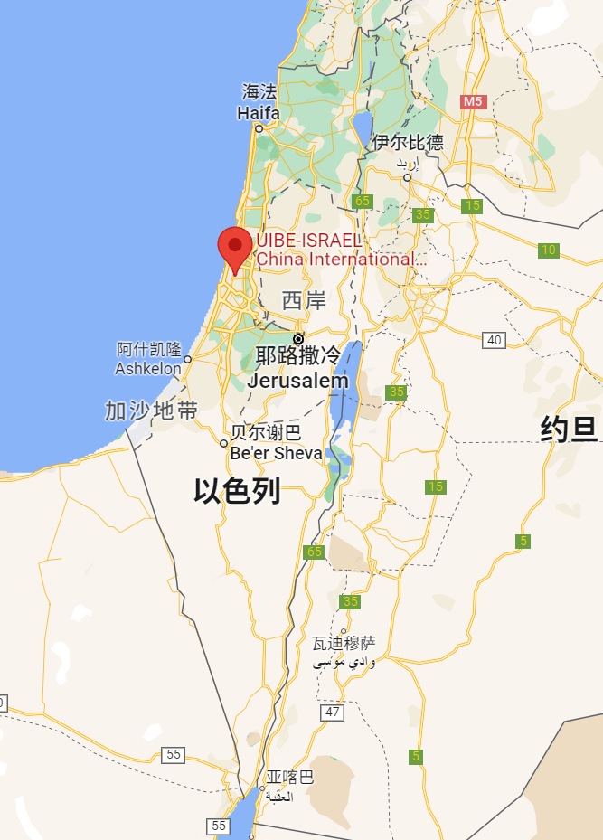
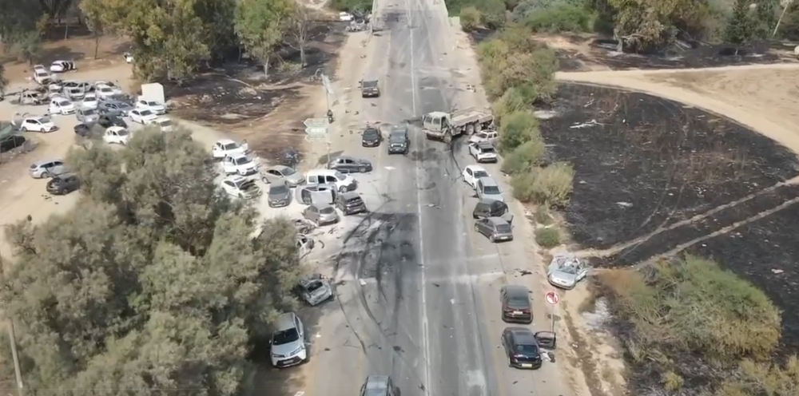
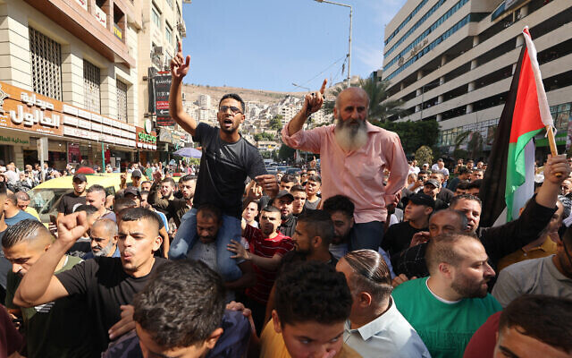
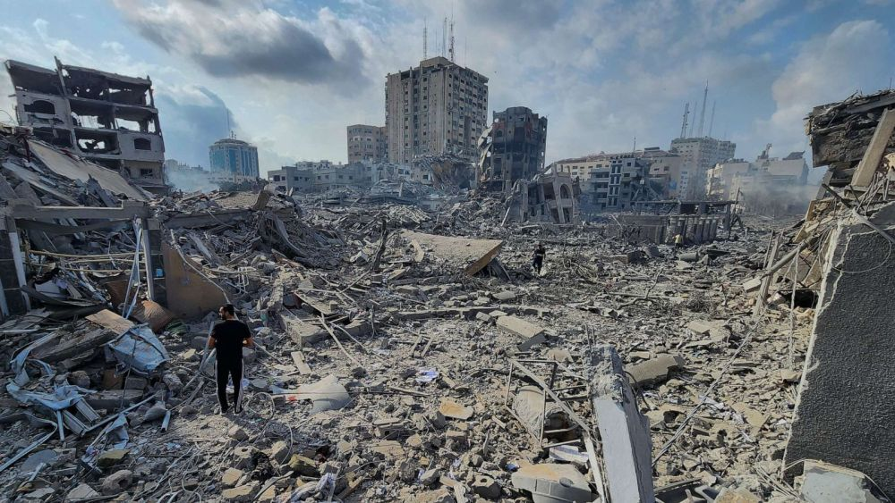
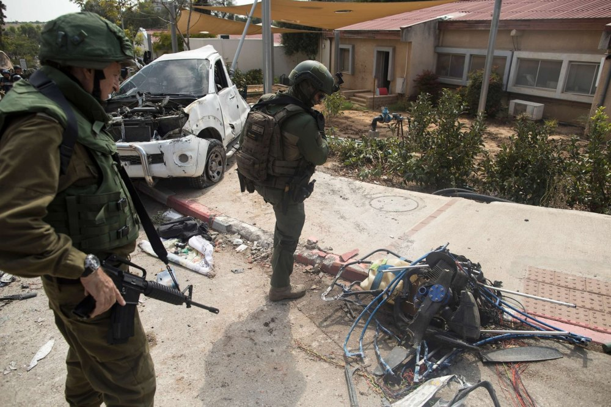
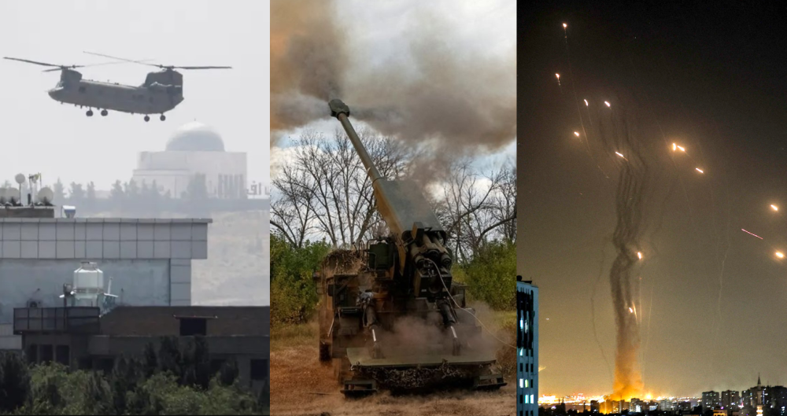
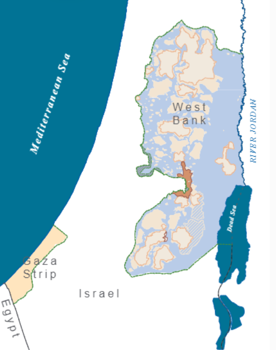

# 中国学者以色列亲历：有学生去了“死亡音乐节”，装死5小时才活下来

当地时间10月7日，哈马斯等武装组织对以色列占领区发动突然袭击，紧接着，以色列对加沙地带展开报复行动。双方伤亡人数持续增加，目前已造成超2800人死亡。

冲突爆发后，“北京对话”专家龚炯9日从以色列飞回中国。他近日接受观察者网专访，分享了自己在以色列的亲身经历与感受，对巴以冲突未来走势的看法，以及对中东地缘政治风云变幻的分析。

【采访/观察者网 李泽西】

**“我们有学生装死了5小时”**

**观察者网：您刚从以色列回国，可否介绍一下这几天在以色列的经历？**

**龚炯：** 我是8号离开以色列的，当时感觉以色列还是很安定、很稳定的。商店里也没有抢购东西的现象，大家还是按部就班，只是街上车子少一点。

同时，我也注意到，整个社会在动员资源，比如在我去学校的路上有一个兵站，路过的时候就看见成百上千辆车停靠在边上，车上下来的都是送亲人去应征预备役。看到这类告别场面，我当时挺受触动：一场大战一点即燃。

**观察者网：当时您在哪个城市？**

**龚炯：** 我在特拉维夫东边的佩塔提克瓦市，这是以色列第三大城市，人口已经超过海法了。

_以色列佩塔提克瓦市_

**观察者网：哈马斯的火箭弹有没有落在那里？**

**龚炯：**
我看到报道说火箭弹落到了特拉维夫，虽然我住的地方离特拉维夫有点距离，但也听得到爆炸，只是分不清是火箭弹的爆炸声还是铁穹系统拦截的爆炸声，反正偶尔会听到好像远处打雷的声音。

**观察者网：所以，这些爆炸在您住的地方没有影响普通人的生活？**

**龚炯：**
我觉得以色列当地人对这种事情已经习以为常了。过去三年，已经经历过三次了，每年都有，我期间也都在以色列。当时发火箭弹的是“巴勒斯坦伊斯兰圣战组织”，铁穹系统将绝大部分火箭弹拦截下来了。我觉得以色列国民对军队信心很足，当然这次受到了蛮大打击，不过社会秩序还是正常的。

**观察者网：佩塔提克瓦市离西岸地区挺近的。您有没有看到西岸方向有何动作？**

**龚炯：** 我前几天还去过西岸，安全性因地而异，至少我去的地方还算比较安全。报道说西岸的纳布卢斯、杰宁等地有零星的巴勒斯坦人抗议，但还没有大规模行动。

**观察者网：您本人是如何得知冲突爆发的？**

**龚炯：** 我们学校有学生的WhatsApp群，事情一发生，我们马上就有消息了。

我一开始感觉可能是一次恐怖袭击，因为这种事情也挺多的，每年都有几次零星的巴勒斯坦人行动，搞个爆炸然后刺杀之类的。不过，在接下来的一两个小时之内，后续消息就不断来了，我没想到是这么大规模的袭击。等到以色列当地时间7号中午，形势显然非常严重了。

**观察者网：事发当天，周围的人情绪和心态有何变化？**

**龚炯：** 我当时实际上是在家里，在网上跟同事交流，他们都很愤怒。不过周边社区都挺安静的，我看到的情况都是从网上传过来的。

_遭袭后的音乐节现场_

其实我们最关心的是学生的安危。我们有一个学生在那个上千人的音乐节，失联了3个多小时，一两个小时后得到确切消息，这个学生被救出来了，在里面待了5个多小时，装死，结果活下来了。【观察者网注：[10月7日，以色列南部一音乐节遭哈马斯袭击，现场发现至少260具尸体。](https://new.qq.com/rain/a/20231009A02OSN00)】

**观察者网：您回国以后，有听到学生或同事的最新消息吗？**

**龚炯：**
到目前为止，我们所有的学生和老师都平安，但是有不少学生被征招入伍了，去预备役。前几天，国内网上流行一个视频，里面有一对姐妹跟父母道别，要去预备役，其实那个妹妹就是我们学校的学生。

龚炯提及的视频

**观察者网：您是如何回国的？目前国泰和海南航班都已经取消了前往以色列的航班，好像很难离开以色列。**

**龚炯：**
其实我离开的行程是事先就安排好的，10号在国内参加一个会议，我买了8号的机票。袭击发生之后，7号当天有很多航班就取消了，8号就好很多了，很多航班都恢复了，所以就按原计划离开了，原来买的也是在迪拜转机而非直飞的航班。现在确实有不少航班已经取消了，但是本·古里安机场没有关闭。

**“以色列胜利太多，傲慢了”**

**观察者网：您认为哈马斯为什么要发起这次行动？**

**龚炯：**
我觉得有两方面的原因，一方面的原因是就是巴勒斯坦长期受到打压，尤其是最近发生的两件事情，一个是以色列西岸地区抓捕了不少人，另外一个就是阿克萨清真寺周围的情况，以色列第二国防部长都进了大院，这对巴勒斯坦人乃至穆斯林来说是非常严重的事情，伤害了他们的民族感情。

另一大因素，真主党的声明里面也提到了，要向那些寻求与以色列实现关系正常化的国家发出信号。这话一听就在指美国主导的沙特跟以色列建交谈判。从巴勒斯坦人的立场上来看，阿拉伯国家只要跟以色列建交，就是对巴勒斯坦人事业的背叛，要阻止这个事情。

我觉得如果沙特跟以色列建交，这将是一个里程碑事件，乃至一个多米诺骨牌，因为沙特在阿拉伯世界有带头大哥的作用，沙特一建交，后面一堆阿拉伯国家都要建交，巴勒斯坦等于要被整个阿拉伯世界抛弃了，这对他们来说是非常绝望的，所以要放手一搏。

**观察者网：这其中好像都看不到巴勒斯坦正规政府的影子。**

**龚炯：**
巴勒斯坦其实是两个政府，加沙地带是哈马斯在统治，而各国所说的巴勒斯坦政府其实是约旦河西岸的巴勒斯坦解放组织（巴解）。巴解组织在加沙地带是完全没有影响力的，都被赶出来了。

对巴解组织来说，他们考虑到当地的声誉，必须站出来表示支持，要是不支持的话，当地的老百姓会造反，因为加沙也是巴勒斯坦人。不过，两个政府之间没什么关系，甚至是相当敌对的关系。

_7日，约旦河西岸城市纳布卢斯巴勒斯坦人示威（图源：AFP）_

**观察者网：沙以建交是否会就此搁置，还是仍然能够推进下去？**

**龚炯：** 沙以建交肯定是搁置下来的，因为冲突一爆发，整个阿拉伯社会主流民意普遍是支持巴勒斯坦，这种情况下还谈沙以建交，沙特政府会面临很大国内政治压力。

其实我觉得沙特就此事的正式声明也挺有意思的，意思就是说我事先讲过好几次了，建交其实是有风险的。所以沙特政府现在不会去做违背社会民意的事情的。

**观察者网：您认为以色列为什么对这次袭击毫无防备？**

**龚炯：** 我个人看法是，以色列胜利太多次了，有些傲慢了，同时也过分相信他们的技术和情报力量，但是这些其实都没有提供及时的预警，以色列就松懈了。

其实从战略层面来看，哈马斯这个行动等同于政治、军事自杀行为，以色列没想到哈马斯有自杀性的想法。各种因素结合在一起，导致他们预备不足。

**观察者网：所以，您认为以色列和哈马斯谁的胜算大一些？**

**龚炯：** 从军事力量来看，以色列国防军对哈马斯武装的优势是碾压性的，如果面对面打起来，谁输谁赢毫无悬念，显然是以色列获胜。

因此，实际上要看的是以色列的国防军到底下什么样的决心。从以色列总理内塔尼亚胡发表的一些言论来看，目的已经非常明确了，不只是像以前那样打击一下哈马斯行动的能力，而是彻底铲除哈马斯在加沙的势力。这意味着以色列仅靠空军不够，肯定是要动用部队进入加沙，这样的话，哈马斯是毫无胜算的。

_10日，以色列空袭后的加沙市（图源：AP）_

**观察者网：外界认为，以军还要面对哈马斯周围的加沙平民，加剧了军事行动的难度。**

**龚炯：** 这对以色列来说确实是一个非常棘手的问题，我觉得以色列其实也准备好面对巨大的国际压力，因为加沙地带平民死亡人数的增加将引发国际社会的关切。

以色列正在做权衡，一边是国际压力，另一边是国防军地面部队士兵的安危。如果不进行轰炸的话，部队进去清扫肯定会有很大的困难，比如哈马斯人员采取躲在平民中间的作战方式，这是弱势的军队通常采取的方式。

其实在俄乌战争早期，乌军也是这样打的，为了防止被消灭，躲在城市里跟平民混在一起，当然乌克兰现在的情况有所变化。

以色列在权衡国际压力和降低国防军伤亡之间，毫无悬念，肯定选择后者。

**观察者网：以色列怎么面对国际舆论？**

**龚炯：**
以色列大概率会顺着“哈马斯为恐怖组织”的思路，强调以色列自卫的权利，渲染哈马斯的非人道和残忍，因此必须把它铲除掉，对过程中陪葬的巴勒斯坦平民觉表达遗憾。

以色列还有一种声音，认为哈马斯某种程度上是加沙人民自己选择的政府，如果因此付出代价，属于情理之中。

**观察者网：以色列宣布要彻底封锁加沙，还威胁埃及不要输送援助物资——当然根据巴以之前的协定，埃及和加沙的口岸只允许人员而非物资通行，以色列理论上是要求维持现状——但以色列的表态显然可能被国际社会理解为以色列想要把加沙民众赶尽杀绝，而不只是针对哈马斯。**

**龚炯：**
加沙的水电供应其实都控制在以色列手里面，现在把这两个都断掉了，可能会造成人道危机。从以色列政府的角度看，国内的舆论氛围目前认为加沙是个邪恶的地方，所以会用一切手段铲除哈马斯势力。

**观察者网：以色列国内可能这么想，但国际上看法就不一样。**

**龚炯：**
我觉得以色列在舆论战方面的工作还是比较出色的，尤其是西方媒体对他们的立场也比较同情。就像我刚才提到的以色列渲染哈马斯残忍，这两天以色列政府就带着记者去看袭击后的村庄。

 _10日，以军带领记者来到遇袭的卡法阿扎村（图源：ABC新闻）_

**“拜登的倡议全都是灾难性的”**

**观察者网：《纽约时报》9日报道指出，无论如何，这次袭击都突显出中东国家仍然普遍支持巴勒斯坦事业，美国在前总统特朗普最后一年任内强推的“亚伯拉罕协议”并没有改变这一基本局面。您如何看待美国近年的所谓“新思路”？**

**龚炯：**
阿拉伯社会从民族情节的角度普遍都同情巴勒斯坦，而领导层的一些政治家则是从地缘政治和国际关系的角度来考虑问题。特朗普开始推“亚伯拉罕协议”，当然整体的目标是要缓解以色列跟阿拉伯世界，尤其是跟逊尼派的阿拉伯世界的关系。

拜登政府上台之后，美国当然想在中东地区有所作为，其中包括促进沙以建交。尤其是最近沙特和伊朗建交之后，美国受到很大压力。以色列希望自己能在沙特和伊朗建交之前，先与沙特建交，现在已经落后了，所以以色列有很大的动力去推这个事情。拜登政府当然也希望在中东能够体现出主导能力，所以想主导沙以建交。

我觉得沙特对于这件事情比较慎重，推动的进程没那么快，恐怕也是看到了这个问题的复杂性，因为这牵涉对巴勒斯坦支持的问题，因为这是整个阿拉伯世界的态度。所以沙特没那么着急，不是第一批跟以色列建交的阿拉伯国家，还是很有道理的。

美国似乎低估了问题的复杂性，有点心急了，现在回过头来看，拜登的外交和国家安全团队有很多问题，上台之后的大动作全都是灾难性的，从阿富汗撤军，到没有防止俄乌战争爆发，后来的制裁措施和军事援助都不是很成功，俄罗斯经济还是挺不错的，对乌克兰的援助现在也面临很大的国会部分共和党人的抵制，现在又冒出来以色列跟哈马斯的战争。

这些事件，估计会对美国大选产生非常大的影响。

 _美军撤出阿富汗（左）、俄乌冲突（中）、以色列拦截哈马斯导弹（右）_

**观察者网：《华尔街日报》曾报道称，这次袭击背后有伊朗的影子。您是否认同这种说法？**

**龚炯：**
最开始，以色列也有人说哈马斯行动跟伊朗有关，要报复哈马斯背后那些国家。不过，美国政府却没有说伊朗直接涉及。美国国务卿布林肯的表态是，到目前为止没有证据显示伊朗直接参与。

从比较宏观的角度来说，伊朗每年给哈马斯一亿多美元的援助，肯定有关联的，但是要说直接参与，这其实是一个扯不清的概念。在这种情况下，布林肯的话实际上是体现出了美国政府的一个立场，就是不希望伊朗参与，也不希望让外界得出伊朗已经参与的结论。这意味着美国不希望战争扩大，因此正式公开的观点就是说伊朗没有直接参与。

接下来，美国应该也会给以色列政府施压，让以色列认同这个观点，将战争限制在加沙、限制在以色列。

**观察者网：许多分析人士认为，这次冲突将使“两国方案”的可能性变得更加渺茫。您认为巴以冲突未来将如何发展？**

**龚炯：**
我完全认同这个观点。从技术角度上说，“两国方案”的可能性本就非常小，先不论加沙，光是西岸地区，实施“两国方案”就非常难。巴勒斯坦政府控制的“A区”其实都不连在一起的，就是六七个城市加上周围的一些村庄，而西岸也是非常大的一片地方。

从政治上来看，这场冲突之后，我认为以色列整个社会将更加往右转。以色列左翼和世俗势力支持“土地换和平”理念，他们在政治上将更加被边缘化。以色列国内已经缺乏支持“两国方案”的政治环境了。

 _淡黄为巴勒斯坦控制领土，淡橙框内为分散的“A区”（图源：联合国）_

**观察者网：从更长远的角度看，等以色列社会情绪消化完了这次袭击以后，会不会有变化？**

**龚炯：**
我觉得恐怕也不太容易，因为这跟以色列人口变化也有关，以色列宗教人士的人口占比越来越大，都比较偏向右翼。他们对约旦河西岸的理解是从圣经的角度出发的，称其为“犹地亚-
撒马利”，这是他们圣书《妥拉》里面的名称，认为这是神赋予犹太人的土地。随着宗教人士占比越来越多，以色列社会整体将越来越强硬，越来越右翼，给“两国方案”造成更大的困难。

**观察者网：巴勒斯坦方面也不可能放任以色列右翼势力。**

**龚炯：**
这里也没有所谓的放任，因为巴勒斯坦人其实没什么办法阻止以色列，最多就是一些独狼行动，比如袭击定居点的居民，在以色列看来全都是恐怖行动，也只有这些办法能够减缓西岸建定居点的步伐，但是我觉得本质上改变不了局面。

**观察者网：巴勒斯坦不断发动袭击，或者在国际上试图寻求同情，会不会慢慢消磨以色列的意志，迫使其妥协？**

**龚炯：**
我觉得对以色列来说，这种压力不是很大，长期在联合国都是两票支持以色列对100多票反对以色列，以色列都习以为常了，根本改变不了他们的想法，而袭击也改变不了以色列的步伐。以色列在西岸的步伐走得多快，更取决于以色列的国内政治，我觉得巴勒斯坦无论做什么，影响力都是非常小的。

**观察者网：如果美国实力持续衰退，没能力保护以色列，会不会发生变化？**

**龚炯：**
我觉得即便没有美国，以色列也不会灭亡。其实以色列一年拿到美国实质性的援助只是20多亿美元，就是用来买军火，虽然有一定依赖性，但是没有的话，以色列也不会垮掉。

**本文系观察者网独家稿件，文章内容纯属作者个人观点，不代表平台观点，未经授权，不得转载，否则将追究法律责任。**

