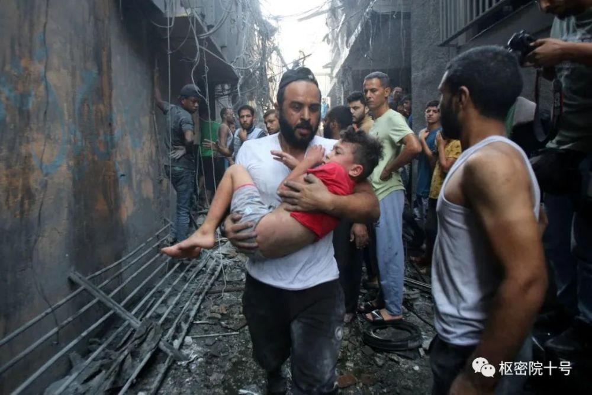
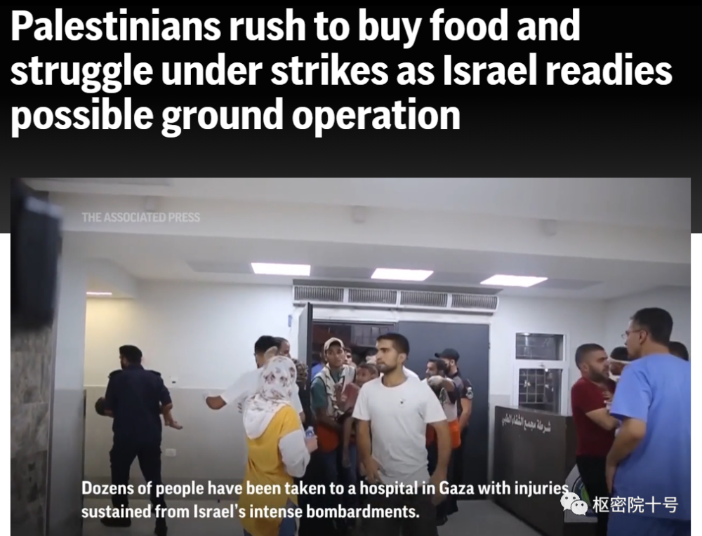
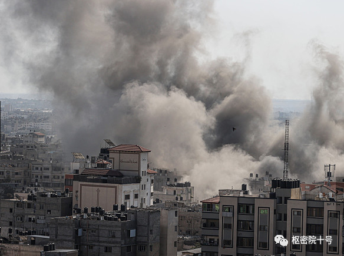
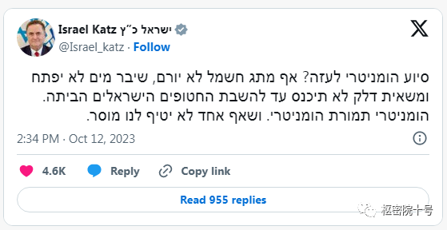
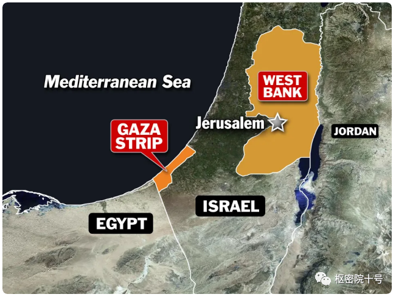

# 以色列空袭加沙进入第六天，加沙230万巴勒斯坦民众成了“人质”

哈马斯扣押了大约150名以色列人质后，现在，加沙的230万巴勒斯坦民众，从某种意义上说，也成了“人质”。

加沙唯一的发电站已经关闭。

 _周四，一名巴勒斯坦男子抱着一个男孩穿过加沙城的一条小巷。_

美联社记者报道说，周四（12日），在加沙的面包店和杂货店斗胆开门营业的几小时前，人们就在外面排起了长队，试图在货架被清空之前囤积食物。

周三，加沙唯一的发电站因耗尽燃料，已经关闭了，只剩下零散的私人发电机供电。

也就是说，在今早排长队抢购食品之前，加沙人已经在几乎完全停电的废墟中度过了一夜。

红十字国际委员会周四中午表示，被封锁的加沙地带仍有一些燃料用于运行发电机，包括医院的发电机，但可能“在数小时内耗尽”。

加沙最大医院的外科医生西塔说，至少有50名被炸伤的病人排队等着他去做手术。

美联社描述称，许多不知下一轮空袭何时降临的巴勒斯坦人，带着他们的物品在街上奔跑，寻找一个栖身之处。成千上万人挤进了联合国开办的学校，有人住在亲戚家里，有人住在让他们进来的陌生人家里。

此前，为了报复哈马斯上周六的突袭，以色列全面围困了加沙地带，切断所有电力和水供应，封锁食品和燃料供应，并发动了巴以冲突75年历史上迄今为止最猛烈的轰炸行动，并表示正在为可能的地面进攻做准备。

周四，以色列空袭加沙城进入第六天。

以色列政府表示，在被哈马斯扣押的所有人质释放之前，被围困的加沙将没有电力、燃料和水供应。

“向加沙提供人道主义援助？”以色列能源部长伊斯雷尔·卡茨周四在社交平台X上表示:“在以色列人质返回家园之前，电源开关不会打开，水龙头不会打开，也不会有燃料卡车进入（加沙）。”

截至周四早上，巴勒斯坦卫生部说，加沙地带死于以军报复性空空袭的人数上升到1200人。

自2007年以来，加沙这片长达25英里的飞地一直受到封锁，其230万居民中超过65%的人生活在贫困线以下，儿童的生活条件此前被描述为“人间地狱”。

现在，最后一座发电厂关闭，医院“满负荷运转”，本来，以色列允许埃及通过拉法过境点向加沙运送一些援助和燃料，但拉法过境点在本周早些时候遭到空袭后被关闭。

绝望的加沙居民没有逃生路线。

英国《独立报》记者周四也从加沙发回报道，标题是：25英里长的加沙地带关押着230万“囚犯”。

哈马斯此前威胁说，如果以色列在没有警告的情况下袭击巴勒斯坦平民，他们将杀死人质。

以色列则辩解说，并没有“进行地毯式轰炸，尽管有些人希望看到那样”。以色列声称，袭击目标的决定是基于情报和“对平民的警告”。

联合国一个独立专家小组周四同时谴责了哈马斯和以色列。

这个专家小组在谴责“哈马斯犯下的可怕罪行”
，强调“被哈马斯抓走的平民必须立即释放”的同时，谴责以色列“对已经筋疲力尽的加沙巴勒斯坦人民进行不分青红皂白的军事攻击”。

联合国专家们在一份声明中说:“他们（加沙巴勒斯坦人）在非法封锁下生活了16年，已经经历了5次残酷的战争，这些战争至今仍未得到解释。”

