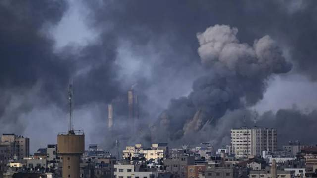
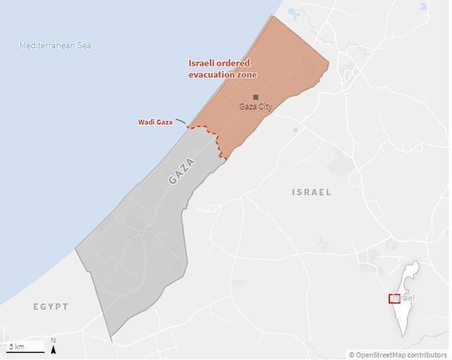
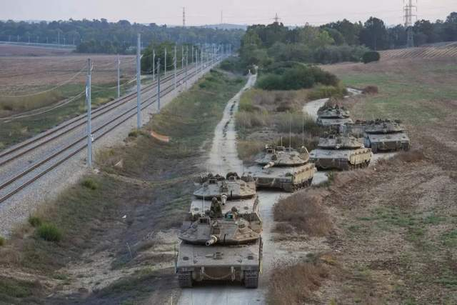
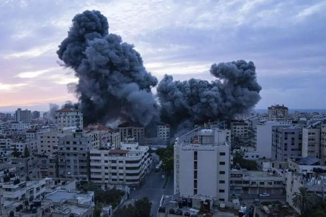
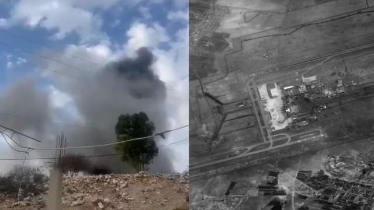

# 发出24小时撤离令，以色列将如何发起进攻

联合国发言人12日深夜表示，以方通知联合国，要求加沙地带北部约110万平民向加沙河南岸撤离，限期24小时。该发言人称，这种人口迁移行动“是不可能的”，并提醒将造成毁灭性人道主义后果。联合国强烈呼吁撤销此类命令，避免灾难性局面的出现。联合国秘书长古特雷斯至少给以色列常驻联合国代表吉拉德·埃尔丹（Gilad
Erdan）打了两通电话，要求以方作出澄清。

不过，联合国近东巴勒斯坦难民救济和工程处（UNRWA）13日在推特发文称，已将其机构和工作人员迁至加沙南部地区，以继续人道主义行动，该组织同时敦促以方保护平民。

当地时间13日清晨，以色列军队对外发布正式声明，要求加沙城的所有平民向南部撤离，并称以军将在“接下来的几天里”继续在加沙地带展开大规模行动。

另据路透社报道，以军在加沙地带附近集结了坦克，准备展开地面进攻。而多家巴勒斯坦媒体援引哈马斯媒体办公室的回应说，这是以色列方面的“虚假宣传”和“心理战”，呼吁巴勒斯坦人不要被误导。

逼平民离开 以色列拟采取“分区围剿”战术

加沙地带面积不过区区365平方公里，但是却有足足200多万人，这种建筑密度、人口密度在世界也是数一数二的，而大量的哈马斯成员就隐藏在其间。面对这种城市作战，一般有几种战法。

一种是重型火力开路，一片一片地区推平后，军队再打扫战场，比如此前俄乌的巴赫穆特之战。这样虽然对以色列来说，可让士兵伤亡减少，却将造成严重的巴勒斯坦平民伤亡。以色列将面临全球的谴责和巨大的国际压力。

第二种就是部队直接进入该地区发起巷战，但这种巷战对以色列是非常头疼的。以军机械化部队在这里备受限制，成为大量廉价火箭弹、单兵导弹的靶子，空军也难以发挥。而哈马斯熟悉地形，加上加沙四通八达的地道网，巷战不一定会吃亏。何况哈马斯在加沙有很好的群众基础，因为加沙几乎每一个平民，都跟以色列人有着血海深仇。

第三种就是，开放一个人道主义通道，让平民尽可能离开，然后军队再进攻，减轻道义上的压力，此前叙利亚军队进攻阿勒颇的时候就使用过这种战术，在乌克兰俄军攻打马里乌波尔等城市时也是如此。

问题是，叙利亚政府可以让阿勒颇的平民前往西北部反对派控制区，而加沙的民众并不愿意离开，他们担心离开了就回不来了。以色列曾试图让埃及同意接收加沙难民，但是埃及方面拒绝了。埃及总统塞西明确表示，加沙人民必须“坚定不移，留在自己的土地上”。埃及承诺确保“在这一困难时期提供医疗和人道主义援助”。

这种情况下，以色列发布“加沙北部驱离令”，其实就是一种变相的“分区围剿”通告，相当于第三种攻城法的变种。其作用是，一方面让国际机构撤离战区，以免战火烧到外国人员和机构，减轻自身面临的舆论压力。另一方面，以色列其实也清楚，110万人24小时撤离是不可能的，更多是做个样子，给联合国和西方点面子。

尽管联合国反对，但普遍认为，用不了多久以色列军队就将先大举进攻加沙北部，如果能站稳脚跟，接下来估计就要驱离“加沙中部的平民”，再一步步向南“围剿”。

加沙大战在即 胜负关键在哪？

目前，以色列已经在加沙周围集结了30万部队，而哈马斯兵力外界估计最多也就几万人，半岛电视台报道称，哈马斯下属武装派别卡桑旅发言人12日曾表示，该组织有能力击退以色列对加沙地带的地面进攻，“在防守方面已做好准备”。双方实力相差悬殊之下，胜负关键在哪？

以色列曾控制过一段时间加沙，最终因为不堪重负而主动撤出，如果有可能，以色列并不想打地面战，通过空袭和围困最大程度的打击哈马斯，才是最优解。但是哈马斯此次突袭，让以色列吃了大亏，军事神话也摇摇欲坠，这种情况下，不地面进攻加沙报仇找回场子，对于以色列现在的内塔利亚胡政府来说，等于政治自杀。

对以色列来说，最理想的情况就是，平民尽可能撤离后，以军首先对加沙北部地区进行猛烈炸弹轰炸和大范围炮击，尽量用远程武器杀伤之后，才会让装甲装备在步兵伴随下开进与哈马斯展开巷战，整个作战时间不能太长，以军伤亡有限，然后继续下一部分地区的“围剿”，
**最后以军即使无法消灭哈马斯，也能给予其重创。** 最后要么把加沙彻底占领，恢复统治，要么择机撤离加沙。

**以军的胜利关键也是巴方的关键点。对哈马斯来说，最重要的是要坚持足够长的时间，进行“持久战”。**

2007年哈马斯控制加沙地带之后，曾与以色列发生过四次冲突，最短的约10天，最长的一个多月。而这次，哈马斯如果要以拖待变，至少需要坚持两个月以上。

因为虽然以色列总动员后扩军36万，但对其经济和国力的损耗也是巨大的，作为一个小国，即使有美国支持，持久战能力也有限，承受不起长期消耗战。2006年以黎冲突，以色列打了两个月，最终不得不在没有取胜的前提下同意停战。

哈马斯要长期坚持下来，靠硬拼是没有希望的，扬长避短才有可能。不过从前面的突袭来看，哈马斯军事素养也有很大提升。西方军事分析师指出，哈马斯为城市作战储备了反坦克地雷和反坦克导弹，并且有效地将这些武器与迫击炮搭配使用。加上此前哈马斯似乎学习了俄乌冲突的经验，积极使用无人机等新战术，未必不能撑比较长的时间。

**另一个双方关键点在于伤亡，具体来说是巴方平民的伤亡和以军士兵的伤亡两类。**

相比2006年以黎冲突，平民伤亡有限，加沙之战巴勒斯坦平民伤亡绝对不是一个量级的，巴方平民伤亡到一定程度，造成人道灾难，世界舆论，美西方的态度可能会出现变化，其他阿拉伯国家更不可能坐视不理，哈马斯要等的就是这个变化。

一贯以来，巴以冲突双方伤亡悬殊，如果哈马斯打出比较好看的伤亡比，以色列也受不了，因为以军士兵虽然人数占优，但是其中真正能打城市战的精锐并不太多，很多是义务兵和动员的预备役，以军伤亡太大，甚至以色列政局也会出现变化。

**第三个关键点在于补给线。**

埃及外交部当地时间12日发表声明说，埃及和加沙地带之间的拉法口岸仍处于开放状态，口岸巴勒斯坦一侧的基础设施因以色列的多次轰炸被毁，无法正常工作。

参考俄乌冲突，马里乌波尔等重镇都是四面被围，外援断绝的情况下易手的。而加沙与埃及相邻的位置，使其不可能被切断补给。阿拉伯国家的各种人道主义物资将通过埃及源源不断进入。至于军火之类的物资自然不可能公开运输，但埃及和加沙地区之间大量的地道网，也使得军火补给不可能彻底切断。一个没有被切断补给的城市可能坚持很久的，大家最熟悉的例子就是二战时的斯大林格勒。对以色列来说，则可以通过钻地弹等各种方式，尽可能地破坏越境地道网。

**最后一个关键点在于外围，就是冲突是否会扩散，让以色列陷入两面作战。**

12日，以色列对叙利亚两个机场发动了空袭，叙利亚和俄罗斯外交部对以色列此举进行谴责，指其违反了国际法并加剧该地区的局势。这次空袭并没有造成人员伤亡，笔者分析，以色列此举更像是一种警告，警告叙利亚不要介入。但实际上，由于叙利亚还在内战中，介入可能性并不大。

相比之下，这段时间，黎巴嫩真主党与以军在黎以边境地带持续交火，虽然规模并不大，更多是是一种姿态。以色列及其盟友美国均警告真主党勿在巴以冲突之际开辟“第二战线”。但是据埃及方面的消息，真主党已经表态，如果以色列地面进攻加沙，真主党将不会坐视不理。

而美国派出两艘航母主要的目的也不在于哈马斯，而是帮以色列看住叙利亚和黎巴嫩方向，避免其陷入两面作战。

不管最终加沙之战打成怎么样，大量平民伤亡都难以避免。而巴以局势要缓解，需要各方采取克制态度，防止战火进一步扩大。

作者丨陈人欢，深圳卫视直新闻主笔

