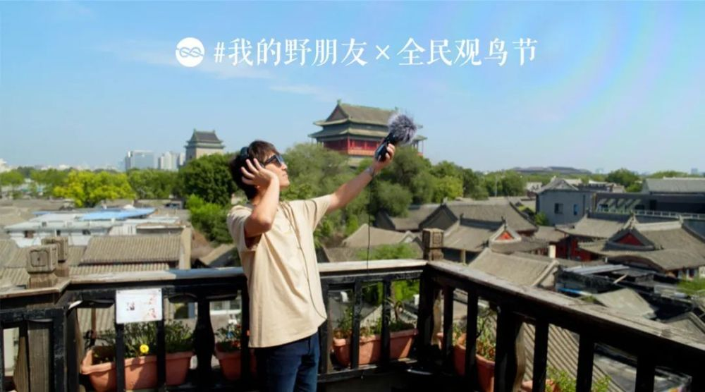
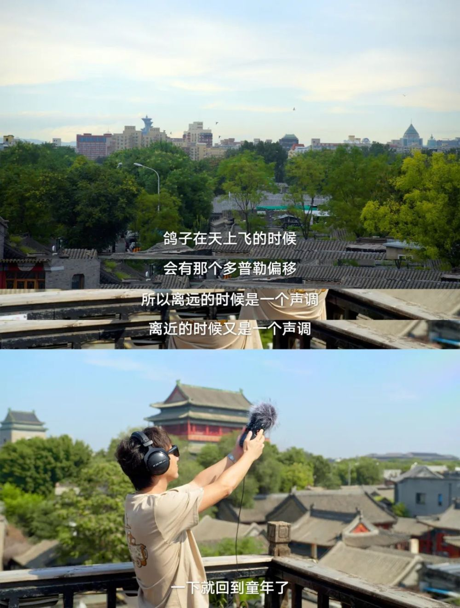
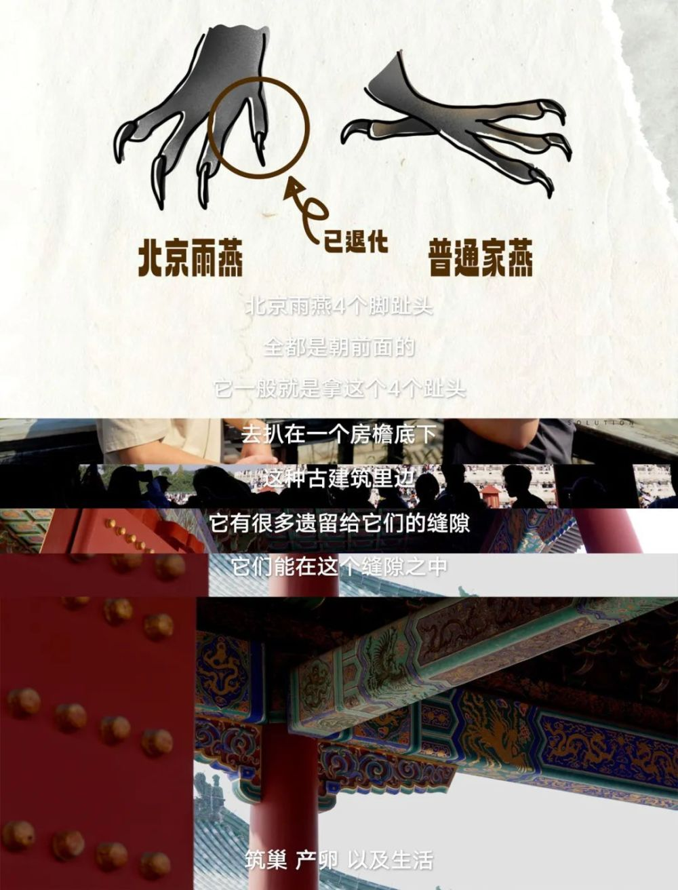
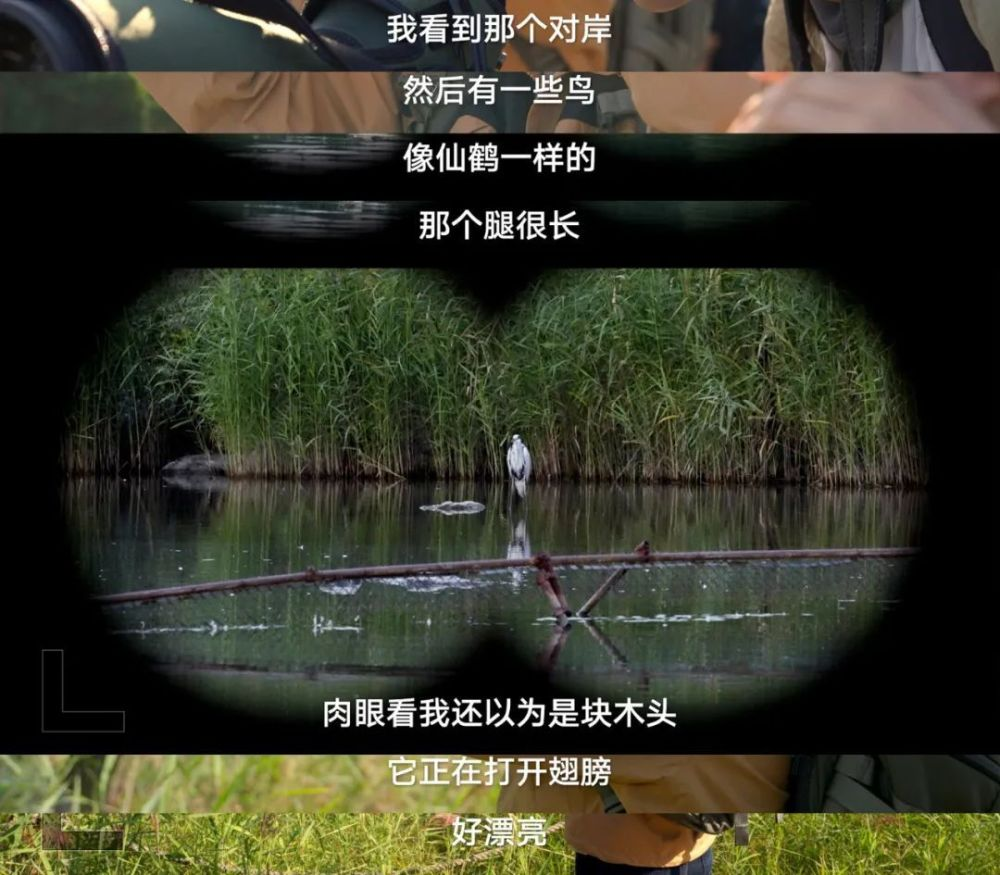
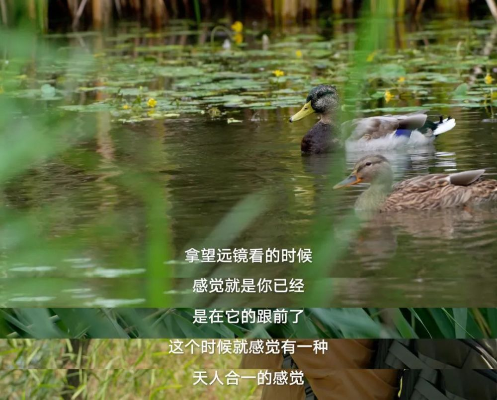
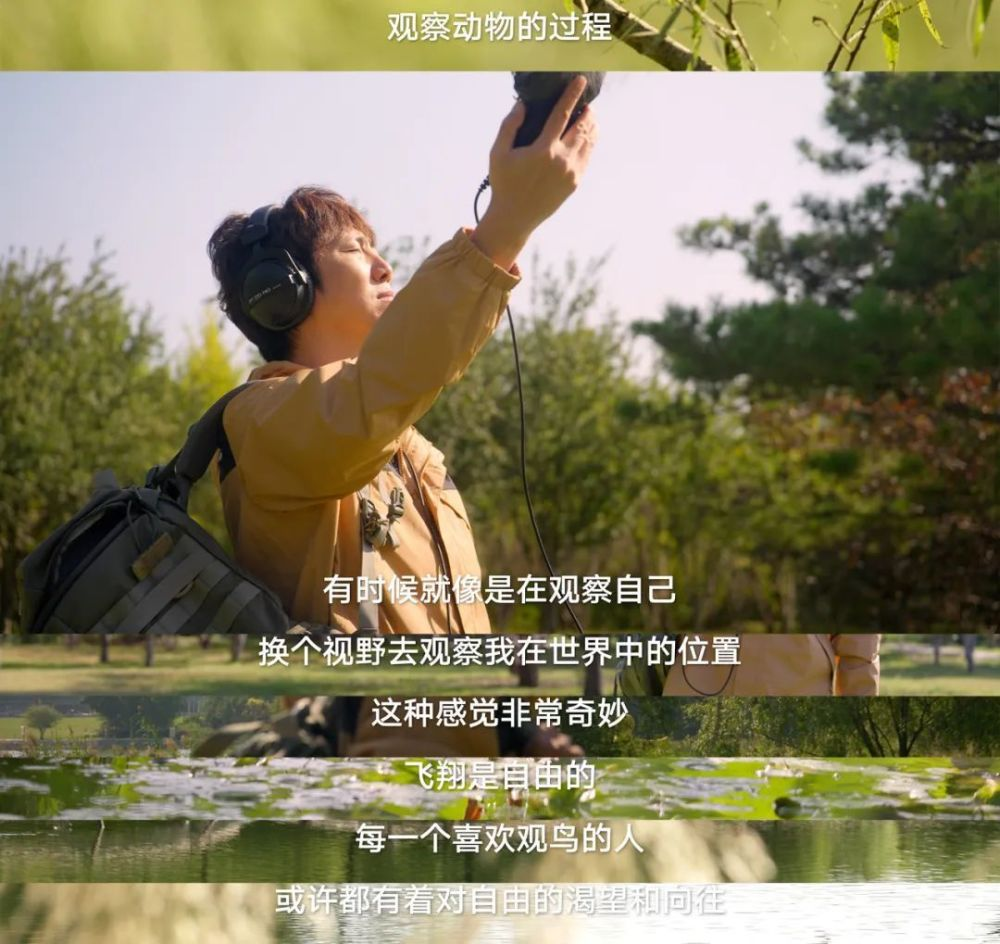

# 新裤子庞宽：观鸟就像是观察自己 ，人人都渴望自由

他一直有一个梦想，去非洲大草原看野生动物。后来他发现，其实在北京，生活着非常多的野生动物，只是以前没有机会了解。

他是庞宽，新裤子乐队主唱、键盘手、国货教父，搞机器人的宽博士。

他决定拿起录音机，记录城市里的自然鸟叫声，做一首属于北京的“鸟的声音”。

宽博士生活在一个爱鸟的城市里面，从小就跟鸟在一起：姥爷养鸟，耳濡目染；官园市场，整日蹲守。胡同里邻居的鸽子扑棱着翅膀飞向天空，在空旷的老城上空翱翔，鸽哨声伴随着奇妙的多普勒效应。在近处听是一个声音，离远了听又是一个声音，这个频率是他童年最深刻的记忆之一。在往后的日子里，只要鸽子飞过，闭眼呼吸聆听，他的童年就在了。

生活中常见的鸟如喜鹊、乌鸦、麻雀、鸽子的叫声，庞宽耳熟能详，而北京城极具代表性的北京雨燕——世界上唯一一种以北京命名的鸟，虽然见到过它们的身影，但是叫声？好像真没有留意过。想去录一录？这个季节北京雨燕已经出国了。每年7月它们开始迁徙，至南非越冬后，来年4月份再回来，111天的特种兵式飞行全程不落地。为什么北京雨燕当初会选择落户北京呢？特殊的脚趾结构令它们无法在平地活动，京城古建里的梁架房檐，正是合适的落脚点。

随着城市的发展，建筑物不断拔高，适合北京雨燕居住的古建数量有所减少。导致某一些年份，北京雨燕的种群数量有所下降。

但是鸟类的神奇之处就在于，它会主动拥抱人类社会的发展，适应城市的变化。截至2022年的数据显示，北京雨燕数量已经恢复到了11400只。其中生活在现代和仿古建筑里的数量占比达到了68%，许多雨燕开始在立交桥的缝隙中搭建新家。

抱着试试看的心态，庞宽去国贸CBD查探小鸟们的新生活圈。在高大的立交桥下，人类变得渺小。

城市给鸟带来的困扰还有致命的鸟撞：高速飞行的鸟撞玻璃后死亡。当我们建设建筑时，通常会考虑它能否满足人类的需求，但却很少想到它和动物们的关系。连成片的透明玻璃，对人来说是美观的问题，对鸟来说却是生死的问题。玻璃反光会让鸟类误以为自己径直飞向的是另一片天空，它们的悲惨结局是真的飞向了另一片天空，据统计，在美国平均每年有3亿只鸟死于鸟撞。

挽救它们的生命对我们来说是很简单的事情：在玻璃幕墙上贴贴纸，提示鸟类眼前的是实物。除此之外，保留城市中的杂草枯枝落叶，成为昆虫旅馆，也能给生态带来巨大的改变。

眼见的改变是，越来越多城市开始探索生态和城市发展的平衡，打造“鸟类友好型”城市。深圳的城市建设为候鸟预留迁徙通道，北京的古建筑修缮工程为北京雨燕延期。2008年，随着北京奥林匹克森林公园的落成，鸟类在城市里有了一个舒适的家。为了录到鸟叫，庞宽“史无前例”地起了个大早。录鸟要先找鸟，作为新手，拿起望远镜什么都看不到再正常不过了。他决定在水边找个长得比较大的。

望远镜帮庞宽打开了一个全新的世界：裸眼远观的“木头”被放大八倍之后，灵动多姿，十分美丽。平日里，这些鸟只是在生活中掠过的一抹黑影，看不清它们的模样，摸不到它们的踪迹。而当你看清它们的羽毛，看清它们的神态，看到它们之间的交流，看到它们日常憨态可掬的样子，就会被它们打动。因为它们不再是影子，而是一只只鲜活的生命。

带庞宽一起观鸟的鸟导张润超说，北京处于候鸟的南北迁飞路线上，北京的鸟类数量有500多种，其中大概三分之二都是迁徙的候鸟。

北京是G20国家首都里面，鸟类种类排第二的城市，鸟类数量比整个英国的还要多，是一个非常适合观鸟的城市。

在家门口的观鸟之旅中，庞宽录到了很多种鸟的叫声。他决定把高亢的声音做成solo，低沉的声音做成bass，一首属于北京的“鸟的声音”就有了。

回想起记忆中的鸟鸣，多年前在北京夜晚听到的猫头鹰叫声，让庞宽迷恋至今。这次观鸟，让他对于与自然相处这件事，有了更多体验。

我们不要忘记，我们自己也是像鸟一样自由、独立地活在这个世界上的生物。在大自然的乐器里面，我们可以做聆听者，也可以做弹奏者。无论是哪个角色，只要沉浸其中，就会得到自己的那份能量。

鸟类是距离人类最近的野生动物，也是我们朝夕相伴的动物邻居，观鸟是指在不影响鸟类的前提下，观察和记录鸟类的活动。

腾讯基金会与SEE基金会联合发起鸟类公民科学活动“全民观鸟节”，在每年秋冬候鸟迁徙季开展形式多样的鸟类科普活动和专业有趣的观鸟活动，让更多人认识鸟类、参与鸟类观察活动、提交鸟类记录数据，提升全社会鸟类保护意识，助力中国鸟类数据库建设，推动中国鸟类保护事业发展。2023年全民观鸟节小红花日的主题为“看见身边的鸟类邻居”，以“城市常见鸟类”为切入点，带动更多人从识鸟、听鸟到观鸟。

“全民观鸟节”在【观鸟君】小程序上开放了多场全国线下活动，如果你也想跟着观鸟大神一起看鸟儿，或者了解更多关于鸟类的知识， 欢迎搜索【观鸟君】小程序。

