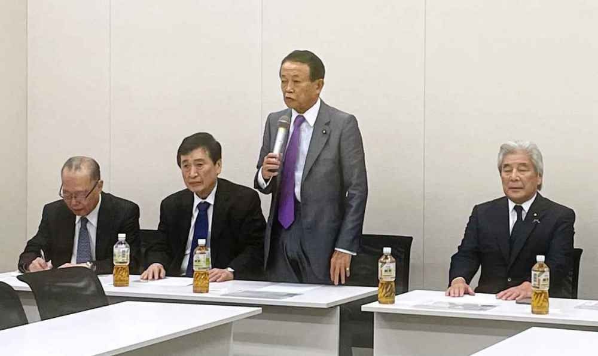
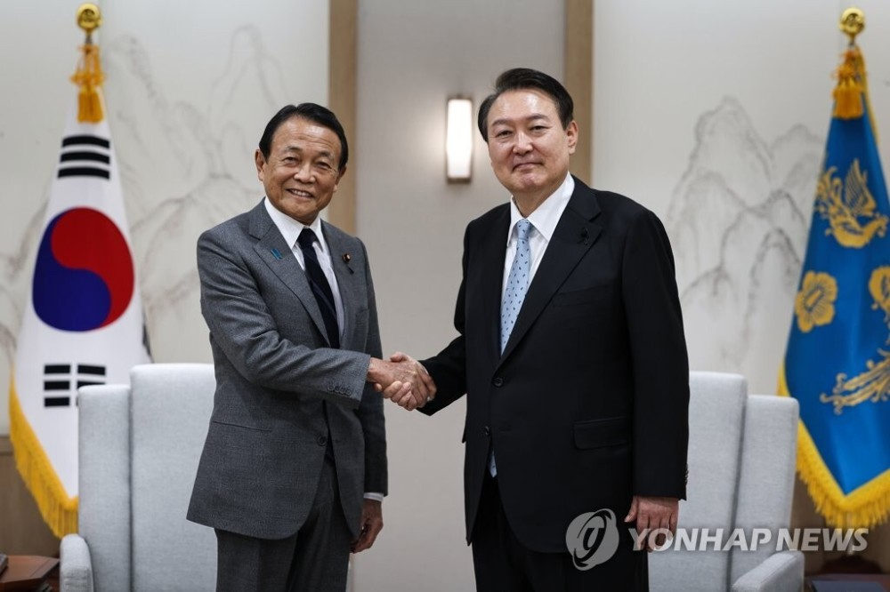

# 日本前首相自曝曾当面对尹锡悦说：韩总统卸任后“不是被杀就是被捕”

【文/观察者网
熊超然】据日本《产经新闻》10月12日报道，日本前首相、现任执政党自民党副总裁麻生太郎当天表示，他曾告诉韩国总统尹锡悦，不要让政权更迭成为动摇日韩关系的因素。麻生太郎自曝，他还直接对尹锡悦说，韩国历任总统在完成五年任期后“通常不是被杀就是被捕”，这成为了日韩交流上的难点，并直言：“作为邻国，我们（日韩）如何打交道？”

报道称，麻生太郎是在当天举行的“日韩合作委员会”国会议员恳谈会上发表的上述这番言论的，他曾于去年11月与今年5月先后两次访问韩国，并与尹锡悦进行了会谈。

_麻生太郎当天在活动上发言 图自《产经新闻》_

《产经新闻》还介绍，麻生太郎目前的另一个身份，是担任由政界和经济界人士等组成的“日韩合作委员会”会长一职。

自1945年韩国光复至今，韩国多位前总统均以'悲剧收场，以致于坊间有了“青瓦台魔咒”一说。

此前，韩国前总统全斗焕和卢泰愚因军事叛乱、巨额贪污遭检方传讯后，分别被判处无期徒刑和有期徒刑17年。卢武铉则因涉嫌受贿遭调查，后来跳崖自杀。李明博因贪污受贿被判入狱。朴槿惠因涉嫌受贿、滥用职权、泄露机密等十余项罪名指控，也被判入狱。

_去年11月，麻生太郎同尹锡悦会晤 图自韩联社_

麻生太郎此话一出，随即引起多家韩国媒体的关注。韩国《每日经济新闻》在报道标题中，将麻生太郎形容为“争议话题制造者”，称其过去多番言论都在日本乃至韩国引发争议。

报道举例称，例如今年9月麻生太郎曾声称，在去年修订日本防卫三文书的问题上，与自民党组成执政党联盟的公明党是“癌”，因为公明党当时以“违反专守防卫”为由反对修改文件。此言论一出，随即引发麻生太郎同公明党之间的摩擦。

此外，2017年年初，围绕日本驻韩国釜山总领事馆前新设的象征受害慰安妇的和平少女像，日韩政府间爆发矛盾，而麻生太郎当时也出言“火上浇油”。

当年1月10日，麻生太郎就韩日货币互换问题表示，“借（给韩国）的钱可能无法要回”。这一发言暗指2015年12月签署韩日政府慰安妇问题协议以及之后发生的少女像问题，话语中强烈地带有“韩国不可信”的口吻，当时也在韩国引发了巨大争议。

**本文系观察者网独家稿件，未经授权，不得转载。**

