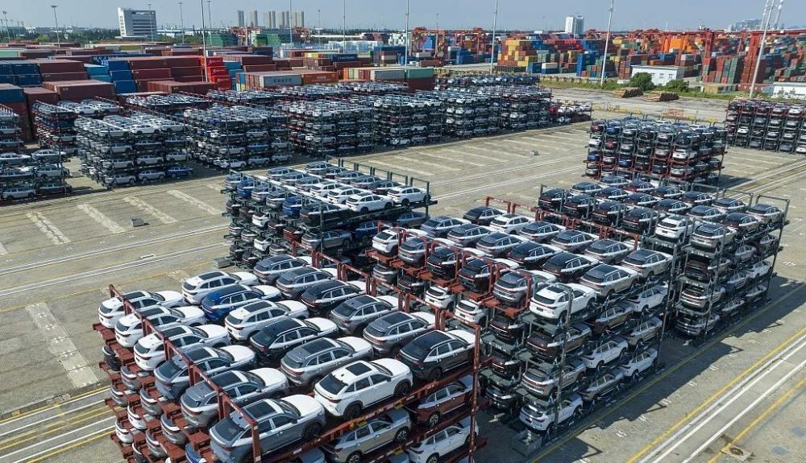

# 欧盟抡起“反补贴”大棒：上汽压力大，领头羊特斯拉不是重点

_图源：视觉中国_

特约作者 | 张云初

编辑 | 陈弗也

出品 | 棱镜·腾讯小满工作室

9月初，德国慕尼黑车展召开，在日韩主力车企缺席的情况下，中国汽车成为最大亮点。

据不完全统计，有近50家中国企业参展，约占所有企业的7.4%，中国乘用车品牌则占整体乘用车品牌1/3左右。比亚迪、小鹏、蔚来等中国汽车品牌举行发布会时，展台被围得水泄不通。

但很快，在欧洲车企家门口“大出风头”的中国汽车，就体会到“树大招风”的滋味。

9月13日，欧盟委员会主席乌尔苏拉·冯德莱恩宣布，计划对中国电动汽车开展反补贴调查。10月4日，欧盟发布公告，决定发起反补贴调查。

十多年前，欧盟曾对中国的光伏产业发起“双反”调查。冯德莱恩在欧盟国情咨文中也强调：“我们没有忘记中国不公平的贸易行为如何影响我们的太阳能产业，许多年轻的企业被获得巨额补贴的中国竞争对手挤出了市场，创业公司不得不申请破产。”

那一场声势浩大的“双反”调查，一度被视为中国光伏产业的“灭顶之灾”、“生死劫”，但最终，欧盟强硬的贸易保护手段没有达到目的：欧洲光伏产业的竞争力未能提升，反而使中国光伏企业越挫越勇。

如今，这根“双反”大棒又抡向了在欧洲刚刚冒头的中国电动车，其结果又将如何？

欧洲是一个千万辆级的大市场，2022年，欧洲新车销量超过1100万辆，其中欧盟销量926万辆，而中国汽车出口欧洲的总量（含燃油车）不过55万辆。对于此次双反调查，不少人认为是在“小题大做”。

**过去三年，中国电动车占比从1%升到8%**

在本土市场取得竞争优势的中国电动车，这几年，正加速走向全球。

2021年、2022年及2023年1-8月，中国汽车出口量分别为201万辆、311万辆与294.1万辆，短短两三年的时间，中国就超越韩国、德国和日本，成为全球第一大汽车出口大国。

这样的发展势头，引起了外界的警惕，尤其是那些被中国市场淘汰的老牌汽车强国。

法国是欧盟“双反”调查的重要推动者。从外媒报道来看，数月以来，法国政府及其工业界代表不仅公开在媒体上渲染“中国电动车威胁论、不能重蹈光伏产业的覆辙”，暗中也一直对欧盟施压，要求对中国电动汽车制造商展开“双反”调查。

当然，在欧盟内部也不乏担忧与反对声音，其中，德国政界与汽车行业的代表最为强烈。

德国联邦数字化和交通部部长福尔克·维辛曾尖锐批评，竞争胜出要靠产品，不能靠贸易壁垒。反补贴调查不仅会严重损害德国自身的汽车产业竞争力，还会导致一系列连锁反应，进一步影响中国和德国在其他领域的经济合作。

10月4日欧盟正式宣布反补贴调查后，德国大众汽车集团和保时捷集团首席执行官奥博穆（Oliver
Blume）呼吁欧洲政界人士在采取行动时要谨慎行事：“我们主张公平竞争，但保护主义不应该由此产生，因为这会导致更多的保护主义。”

在动机上，德国有自己的私心，他们担心损害德国汽车多年积累的在华利益，但德国政商领袖们也展示了“竞争应该促使我们前进，要合作不要对抗”的眼界胸襟。

比如奥博穆就表示，中国车企的强大市场地位是基于其自身实力优势，例如比亚迪的产业链垂直一体化程度很高，其90%的芯片和电池都是由自己生产的。

事实上，中国电动车在欧洲的市场占比并不大。

9月下旬，来北京参加第十次中欧经贸高层对话的欧盟委员会执行副主席瓦尔季斯·东布罗夫斯基斯在接受媒体采访时透露：欧盟启动调查并非一时兴起，已做了“许多技术工作”，有“确凿”证据证明中国的补贴正在“扭曲”正常贸易，对欧洲工业构成威胁。

但当媒体再三追问“确凿”证据时，东布罗夫斯基斯却没能给出有说服力的答案，仅强调：“过去两三年里，中国在欧盟电动汽车市场的份额已从不到1%上升到8%。”

汽车咨询公司Inovev的数据也显示，今年欧洲销售的电动车8%由中国品牌制造，高于去年和前年的6%与4%。毕马威则预测，2025年，中国电动车将占欧洲市场15%的份额。

**倒查5年，补贴、贷款、土地、税收都算**

从字面上看，欧盟的“反补贴”调查没什么威慑力，因为中国政府针对电动车的补贴仅限于本土消费者，而且在2022年底已结束。

但事情远没有这么简单，此次调查的范围要广得多，在一些熟悉国际贸易的人士看来，中国车企“很难逃脱”。

根据欧盟第2016/1037号《欧盟基本反补贴条例》，以及今年10月开始生效的《关于外国补贴扭曲欧盟内部市场条例》（又称《外国补贴条例》），欧盟有权对过去十年内的政府补贴行为进行调查，《外国补贴条例》实施前的补贴行为调查则被限制在五年期限。

这意味着，欧盟有权对2018年以来中国电动车制造商的补贴进行调查。

而在具体调查内容上，WTO框架下的“双反”调查主要聚焦于政府部门的行政补贴，《外国补贴条例》则将政府补贴的范围进一步扩大，涵盖企业所有从政府、银行、能源等公共部门获得的扶植与补贴。

《21世纪经济报道》称，德国墨卡托中国研究中心的调查显示，此次欧盟的反补贴调查并非针对所谓的国家直接补贴，重点则是：中国国有银行以低息贷款形式为车企进行扶持，地方政府以远低于市场水平的价格为企业提供土地，相关企业在中国产能过剩大背景下获得廉价原材料以及获得优惠政府招标等。

众所周知，汽车尤其是新能源项目，是各地政府招商引资的热门，地方给出的福利也从最初的税收、土地优惠到近年卷出花来的项目配套投资、低息贷款、招工建厂等。

这些补贴会给车企带来一定的成本优势，调研机构Jato
Dynamics数据显示，2022年上半年，中国电动汽车的平均成本不到3.2万欧元，而欧洲的平均成本约为5.6万欧元。

不过，值得注意的是，国内自主品牌电动车在欧洲卖得比国内更贵，比亚迪Atto 3在欧洲卖4.2万欧元，和特斯拉Model
3价格相当，蔚来ET5和ET7在德国售价为5.95万欧元和8.19万欧元，比奥迪Q6 e-tron的价格还高。

按照欧盟的规定，反补贴调查的最长时限是13个月，从以往的双反调查来看，时间往往更短。这意味着最多一年后，欧盟就会公布对中国电动车反补贴调查的结果。

目前，还没有中国企业接到调查的消息，10月6日，比亚迪执行副总裁李柯接受媒体采访时给了颇为乐观地回应，表示将继续坚持欧洲战略，推动公司在欧洲实现强劲增长，“不担心在欧洲的任何调查”。

**苦心设计问卷，预防误伤自己人**

欧盟此次反补贴调查，并不仅限于中国车企，特斯拉以及欧洲汽车制造商在中国生产向欧盟出口的电动车也在调查范围内。

从销量来看，特斯拉才是中国电动车出口欧盟的领头羊。得益于上海超级工厂的高效率，2022年，特斯拉中国出口汽车27.1万辆，大部分出口到欧洲，而2022年中国出口到欧洲的电动车总量才33万辆。今年1-7月，中国出口至欧洲的电动车销量为23万辆左右，其中特斯拉就占了11万辆。

但特斯拉有着强大的企业影响力、特立独行的做事风格以及美资企业背景，在外界看来，很有可能不是此次反补贴调查的重点。

此外，宝马等在中国生产电动车反向出口欧洲的欧洲汽车制造商，也是此次调查的对象。宝马在中国沈阳工厂生产的宝马iX3电动车已经出口欧洲，还计划从明年开始出口在中国生产的Mini电动车型。

但是，据外媒报道，欧盟已经向宝马、大众、戴姆勒、雷诺等欧洲汽车制造商发放电子问卷，调查其在中国的经营情况，除了公开的7页问卷调查，还包括一份替企业保密的43页问卷调查。

这份煞费苦心设计的调查，被外界认为是为了预防误伤“自己人”。

显而易见，欧盟此次调查的重点就是中国电动车企业。

中国汽车出口的龙头企业上汽，可能首当其冲。有数据显示，今年1-8月，上汽MG在欧洲市场累计销量为15万辆，同比增长1.5倍，成为当地增速最快的汽车品牌。但MG其实是被上汽收购的英国百年老字号，上汽MG在欧洲销售的电动车，也并非都从中国进口，有很大一部分是在英国工厂生产。

在国内名气不大的易捷特，也是电动车出口欧洲的“大户”。它是法国雷诺与东风的合资公司，2021年出口3.7万辆，2022年增长至6.35万辆，计划未来几年出口超10万辆。

吉利、比亚迪两大自主龙头在欧洲的电动车销量增势很好，但销量不大，去年和今年前7个月在欧洲的销量，吉利为2万辆左右，比亚迪只有5000辆左右。

蔚来、小鹏、爱驰等近年高调布局欧洲的新势力，但销量最好的也才不过千辆。

中国车企很难对欧洲市场产生太大影响，但中国电动车的崛起势头和成本竞争力，让长期掌握全球汽车“方向盘”的欧洲汽车制造商以及背后的政府部门感到不安。

多位汽车行业人士表示，反补贴调查只是欧盟针对中国电动车设下的

